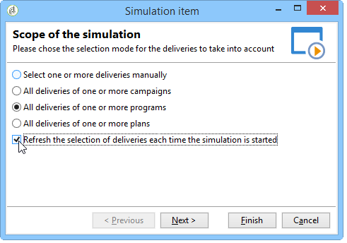

# Campagnesimulaties{#campaign-simulations}

Met Campagneoptimalisatie kunt u de efficiëntie van een campagneplan testen met behulp van simulaties. Hiermee kunt u het potentiële succes van een campagne meten: gegenereerde inkomsten, doelvolume op basis van de toegepaste typologische regels, enz.

Met simulatie kunt u het effect van leveringen controleren en vergelijken.

## Een simulatie instellen {#set-up-a-simulation}

### Waarschuwing

De leveringen die op **worden voorbereid test** wijze hebben geen invloed op elkaar, bijvoorbeeld wanneer het beoordelen van een campagne in verdeelde marketing, of zolang de leveringen niet in de voorlopige kalender worden gepland.

Dit betekent dat druk- en capaciteitsregels alleen worden toegepast op leveringen in **[!UICONTROL Target estimation and message personalization]** -modus. Er wordt geen rekening gehouden met leveringen in de modus **[!UICONTROL Estimation and approval of the provisional target]** en in de modus **[!UICONTROL Target evaluation]** .

De leveringsmodus wordt gekozen op het subtabblad **[!UICONTROL Typology]** van de leveringseigenschappen.

### Een simulatie maken {#create-a-simulation}

Voer de volgende stappen uit om een simulatie te maken:

1. Open het tabblad **[!UICONTROL Campaigns]** , klik op de koppeling **[!UICONTROL More]** in de sectie **[!UICONTROL Create]** en selecteer de optie **[!UICONTROL Simulation]** .

   

1. Voer de sjabloon en de naam van de simulatie in. Klik op **[!UICONTROL Save]** om de simulatie te maken.

   

1. Klik op het tabblad **[!UICONTROL Edit]** om het te configureren.

   

1. Geef op het tabblad **[!UICONTROL Scope]** de leveringen op die u voor deze simulatie wilt gebruiken. Klik hiertoe op de knop **[!UICONTROL Add]** en geef de selectiemodus op waarmee u rekening wilt houden.

   

   U kunt elke levering één voor één selecteren of ze sorteren op campagne, programma of plan.

   >[!NOTE]
   >
   >Als u leveringen selecteert via een plan, programma of campagne, kan Adobe Campaign de lijst met leveringen automatisch vernieuwen om hiermee rekening te houden wanneer een simulatie wordt gestart. Schakel de optie **[!UICONTROL Refresh the selection of deliveries each time the simulation is started]** in om dit te doen.
   >  
   >Als u dit niet doet, zullen om het even welke leveringen die niet beschikbaar in het plan, het programma, of de campagne zijn wanneer de simulatie wordt gecreeerd niet in aanmerking worden genomen: later toegevoegde leveringen zullen worden genegeerd.

   

1. Selecteer de elementen die u in het simulatiebereik wilt opnemen. Selecteer indien nodig meerdere elementen met de toetsen SHIFT en CTRL.

   

   Klik op **[!UICONTROL Finish]** om de selectie goed te keuren.

   U kunt geselecteerde leveringen en leveringen die bij plannen, programma&#39;s of campagnes horen, handmatig combineren.

   

   Indien nodig kunt u een dynamische voorwaarde gebruiken via de koppeling **[!UICONTROL Edit the dynamic condition...]** .

   Klik op **[!UICONTROL Save]** om deze configuratie goed te keuren.

   >[!NOTE]
   >
   >Slechts worden de leveringen het waarvan doel is berekend in aanmerking genomen wanneer het berekenen van simulaties (statussen: **klaar Doel** of **Klaar om** te leveren).

1. Selecteer op het tabblad **[!UICONTROL Calculations]** bijvoorbeeld een analysedimensie, zoals het ontvangende schema.

   

1. Vervolgens kunt u expressies toevoegen.

   

### Instellingen voor uitvoering {#execution-settings}

Op het tabblad **[!UICONTROL General]** van de simulatie kunt u uitvoeringsinstellingen invoeren:

* Met de optie **[!UICONTROL Schedule execution for down-time]** wordt de startperiode van de simulatie uitgesteld tot een minder drukke tijdsperiode, op basis van het gekozen prioriteitsniveau. De simulaties gebruiken significante gegevensbestandmiddelen, dat is waarom de niet-urgente simulaties zouden moeten worden gepland om bij nacht, bijvoorbeeld te lopen.
* De **[!UICONTROL Priority]** is het niveau dat op de simulatie wordt toegepast om de activering ervan uit te stellen.
* **[!UICONTROL Save SQL queries in the log]**. Met SQL-logboeken kunt u een simulatie diagnosticeren als deze eindigt met fouten. Ze kunnen u ook helpen te achterhalen waarom een simulatie te langzaam is. Deze berichten worden weergegeven na de simulatie op het subtabblad **[!UICONTROL SQL logs]** van het tabblad **[!UICONTROL Audit]** .

## Een simulatie uitvoeren {#execute-a-simulation}

### Een simulatie starten {#start-a-simulation}

Zodra het simulatiewerkingsgebied wordt bepaald, kunt u het uitvoeren.

Open hiertoe het dashboard voor de simulatie en klik op **[!UICONTROL Start simulation]** .

Wanneer de uitvoering is voltooid, opent u de simulatie en klikt u op het tabblad **[!UICONTROL Results]** om de doelen weer te geven die voor elke levering zijn berekend.

1. Het subtabblad **[!UICONTROL Deliveries]** bevat een lijst met alle leveringen waarmee rekening is gehouden in de simulatie. Het toont twee tellingen:

   * **[!UICONTROL Initial count]** is het doel zoals het tijdens zijn raming in de levering werd berekend.
   * **[!UICONTROL Final count]** is het aantal ontvangers dat na simulatie wordt geteld.

     Het verschil tussen aanvankelijke en definitieve tellingen wijst op de toepassing van de diverse regels of de filters die voorafgaand aan de simulatie worden gevormd.

     Bewerk de subtab **[!UICONTROL Exclusions]** voor meer informatie over deze berekening.

1. Met het subtabblad **[!UICONTROL Exclusions]** kunt u het uitsplitsen van uitsluitingen weergeven.

   

1. De subtab **[!UICONTROL Alerts]** groepeert alle waarschuwingsberichten die tijdens de simulatie worden gegenereerd. Waarschuwingsberichten kunnen worden verzonden in geval van capaciteitsoverbelasting (als het aantal beoogde ontvangers de ingestelde capaciteit overschrijdt, bijvoorbeeld).
1. Met het subtabblad **[!UICONTROL Exploration of the exclusions]** kunt u een tabel voor resultaatanalyse maken. De gebruiker moet variabelen in de abscis/ordinates-assen aangeven.

   Voor een voorbeeld van de verwezenlijking van de analystabel, verwijs naar het eind van [&#x200B; deze sectie &#x200B;](#explore-results).

### Resultaten weergeven {#view-results}

#### Audit {#audit}

Op het tabblad **[!UICONTROL Audit]** kunt u de uitvoering van de simulatie controleren. Het subtabblad **[!UICONTROL SQL Logs]** is handig voor ervaren gebruikers. Er worden uitvoerlogbestanden in SQL-indeling weergegeven. Deze logboeken worden alleen weergegeven als de optie **[!UICONTROL Save SQL queries in the log]** is geselecteerd op het tabblad **[!UICONTROL General]** voordat de simulatie wordt uitgevoerd.

#### Resultaten verkennen {#explore-results}

Met het subtabblad **[!UICONTROL Exploration of the exclusions]** kunt u de gegevens analyseren die het resultaat zijn van een simulatie.

<!--
Descriptive analysis is detailed in [this section](../../reporting/using/about-adobe-campaign-reporting-tools.md).
-->

## Resultaten van een simulatie {#results-of-a-simulation}

De indicatoren op de tabbladen **[!UICONTROL Log]** en **[!UICONTROL Results]** bieden een eerste overzicht van de simulatieresultaten. Open het tabblad **[!UICONTROL Reports]** voor een gedetailleerdere weergave van de resultaten.

### Rapporten {#reports}

Om het resultaat van een simulatie te analyseren, geef zijn rapporten uit: zij tonen uitsluitingen en oorzaken.

De volgende rapporten worden standaard geleverd:

* **[!UICONTROL Detail of simulation exclusions]** : dit rapport bevat een gedetailleerd overzicht van de oorzaken van uitsluiting voor alle betrokken leveringen.
* **[!UICONTROL Simulation summary]** : in dit rapport worden de populaties weergegeven die tijdens de verschillende leveringen van de simulatie zijn uitgesloten.
* **[!UICONTROL Summary of exclusions linked to the simulation]**: dit rapport bevat een grafiek met uitsluitingen die worden veroorzaakt door de simulatie, samen met de toegepaste typologieregel en een grafiek met de uitsluitingsverhouding per regel.

<!--
>[!NOTE]
>
>You can create new reports and add them to the ones offered. For more on this, refer to [this section](../../reporting/using/about-adobe-campaign-reporting-tools.md).
-->

Klik op de koppeling **[!UICONTROL Reports]** van de doelsimulatie via het dashboard voor toegang tot rapporten.

U kunt rapporten ook bewerken met de koppeling **[!UICONTROL Reports]** die toegankelijk is via het dashboard voor simulaties.

### Simulaties vergelijken {#compare-simulations-}

Telkens wanneer een simulatie wordt uitgevoerd, vervangt het resultaat om het even welke vorige resultaten: u kunt resultaten van één uitvoering aan een andere niet tonen en vergelijken.

Als u resultaten wilt vergelijken, moet u rapporten gebruiken. In Adobe Campaign kunt u zelfs een rapportgeschiedenis opslaan om deze later opnieuw te bekijken. Deze geschiedenis wordt gedurende de levenscyclus van de simulaties bewaard.

**Voorbeeld:**

1. Creeer een simulatie op een levering welke typologie **A** wordt toegepast op.
1. Bewerk op het tabblad **[!UICONTROL Reports]** een van de beschikbare rapporten, bijvoorbeeld **[!UICONTROL Detail of simulation exclusions]** .
1. Klik in de rechterbovensectie van het rapport op het pictogram om een nieuwe geschiedenis te maken.

   

1. Sluit de simulatie en verander de configuratie van typologie **A**.
1. Voer opnieuw de simulatie uit en vergelijk het resultaat met dat in het rapport wordt getoond waarvoor een geschiedenis werd gecreeerd.

   

   U kunt zo veel rapporthistorie opslaan als nodig is.

### Assen rapporteren {#reporting-axes}

Op het tabblad **[!UICONTROL Calculations]** kunt u rapportassen voor het doel definiëren. Deze assen zullen tijdens [&#x200B; resultaatanalyse &#x200B;](#explore-results) worden gebruikt.

>[!NOTE]
>
>Wij adviseren bepalende berekeningsassen in de simulatiesjablonen eerder dan individueel voor elke simulatie.\
>Simulatiesjablonen worden opgeslagen in de map **[!UICONTROL Resources > Templates > Simulation templates]** van de Campagneverkenner.

**Voorbeeld:**

In het onderstaande voorbeeld willen we een extra rapportas maken op basis van de status van de ontvangers (&quot;Klant&quot;, &quot;Vooruitziend&quot; of geen).

1. Als u een rapportas wilt definiëren, selecteert u de tabel met de gegevens die in het veld **[!UICONTROL Analysis dimension]** moeten worden verwerkt. Deze informatie is verplicht.
1. Hier, willen wij het gebied van het Segment van de ontvankelijke lijst selecteren.

   

1. De volgende opties zijn beschikbaar:

   * Met **[!UICONTROL Generate target overlap statistics]** kunt u alle overlappende statistieken in het simulatierapport herstellen. Overlappingen zijn ontvangers die zijn aangewezen in ten minste twee leveringen binnen één simulatie.

     >[!CAUTION]
     >
     >Als u deze optie selecteert, neemt de uitvoeringstijd van de simulatie aanzienlijk toe.

   * Met **[!UICONTROL Keep the simulation work table]** kunt u simulatietraces behouden.

     >[!CAUTION]
     >
     >Voor het automatisch opslaan van deze tabellen is een aanzienlijke opslagcapaciteit vereist. Zorg ervoor dat de database groot genoeg is.

Wanneer de simulatieresultaten worden weergegeven, wordt de informatie over de geselecteerde expressie weergegeven op het subtabblad **[!UICONTROL Overlaps]** .

De doeloverlappingen van de levering geven de beoogde ontvangers aan in ten minste twee leveringen van een simulatie.

>[!NOTE]
>
>Dit subtabblad wordt alleen weergegeven als de optie **[!UICONTROL Generate target recovery statistics]** is ingeschakeld.

De informatie over rapportassen kan worden verwerkt in uitsluitingsanalyserapporten die zijn gemaakt op het subtabblad **[!UICONTROL Exploring exclusions]** . [Meer informatie](#explore-results).
