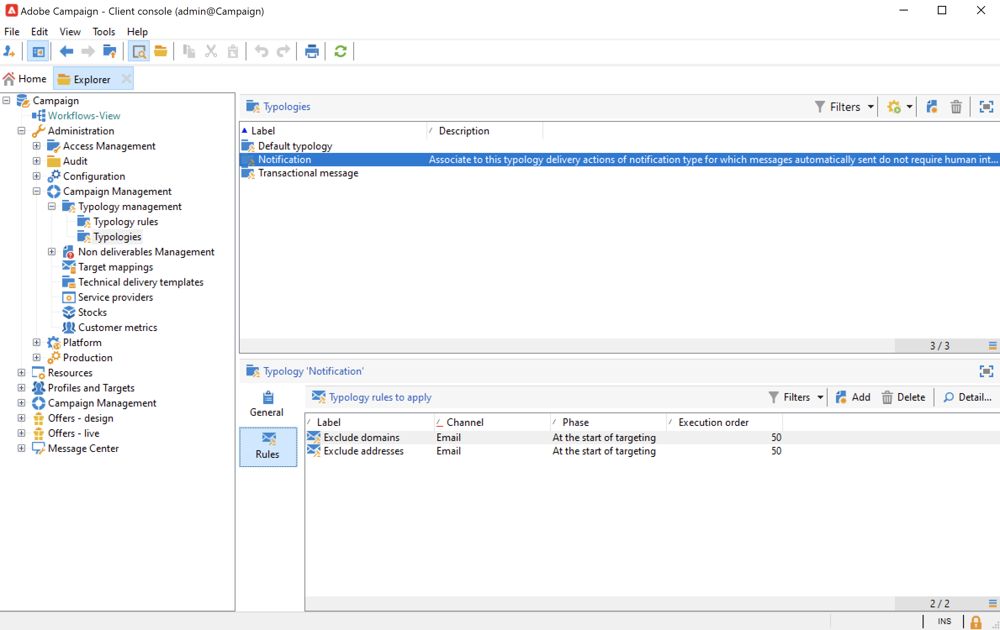

# Aan de slag met campagnetypen{#about-campaign-typologies}

De Optimalisering van de campagne is de module van Adobe Campaign die u de verzendende leveringen laat controleren, filtreren en controleren. Om conflicten tussen campagnes te vermijden kan Adobe Campaign diverse combinaties testen door specifieke beperkingsregels toe te passen. Dit garandeert dat de verzonden berichten voldoen aan de behoeften en verwachtingen van klanten en het communicatiebeleid van het bedrijf.

 [Ontdek deze functie in video](#typologies-video)

>[!NOTE]
>
>Afhankelijk van uw aanbieding kan de optimalisatie van de campagne worden opgenomen of een invoegtoepassing. Controleer hiervoor uw licentieovereenkomst.

## Typologische regels en typologieën {#typology-rules}

Met Adobe Campaign kunt u vier typen **typologieregels**:

* **Filteren** regels waarmee u een deel van het doel kunt uitsluiten op basis van criteria. [Meer informatie](filtering-rules.md).
* **Druk** regels die u in staat stellen om vermoeidheid bij het in de handel brengen te beheersen. [Meer informatie](pressure-rules.md).
* **Capaciteit** regels waarmee u de belasting kunt beperken om optimale verwerkingsomstandigheden te garanderen. [Meer informatie](consistency-rules.md#controlling-capacity).
* **Control** regels waarmee u de geldigheid van berichten kunt controleren voordat deze worden verzonden. [Meer informatie](control-rules.md).

Als ze eenmaal zijn gemaakt, worden de typologische regels gegroepeerd in campagne **typologieën** waarnaar in leveringen wordt verwezen. [Meer informatie](#apply-typologies).

Een campagneretypologie kan verschillende typologische regels bevatten, maar een levering kan slechts naar één typologie verwijzen.

De ingebouwde typologische regels en typologieën zijn beschikbaar in de **[!UICONTROL Administration > Campaign management > Typology management]** knooppunt van Campagneverkenner.

Voor elke typologie wordt **[!UICONTROL Rules]** kunt u de toe te passen typologische regels toevoegen, verwijderen of bekijken.

## Belangrijke stappen om typologieën toe te passen {#apply-typologies}

De belangrijkste stappen voor het maken en toepassen van een typologie voor uw leveringen worden hieronder weergegeven:

1. Maak typologische regels en maak een typologie om ernaar te verwijzen.
De gedetailleerde stappen worden vermeld in de volgende sectie:
   * [Drukregels](pressure-rules.md)
   * [Filterregels](filtering-rules.md)
   * [Capaciteitsregels](consistency-rules.md)
   * [Controleregels](control-rules.md)

1. Vorm uw levering om de typologie te gebruiken u creeerde. [Meer informatie](apply-rules.md#apply-a-typology-to-a-delivery).
1. Test en controleer het gedrag door campagnesimulaties. [Meer informatie](campaign-simulations.md).

Tijdens de voorbereiding van de levering worden ontvangers uitgesloten wanneer aan het criterium wordt voldaan. U kunt logboeken controleren om toezicht te houden op uitsluitingen.

Er zijn gevallen van monstergebruik voor de druktypologische regels beschikbaar in: [deze pagina](pressure-rules.md#use-cases-on-pressure-rules).

## Tutorialvideo’s {#typologies-video}

### Vermoeidheidsbeheer instellen met behulp van typologische regels

In deze video wordt uitgelegd hoe u vermoeidheidsbeheer in Adobe Campaign kunt implementeren door gebruik te maken van typologische regels.

>[!VIDEO](https://video.tv.adobe.com/v/25090?quality=12)

### Vermoeidheidsbeheer instellen met behulp van vooraf gedefinieerde filters

Moeheidsbeheer bepaalt de frequentie en de hoeveelheid van de berichten om de ontvangers niet te overspoelen. Als u niet de module van de campagneroptimalisering in uw campagneinstantie hebt, kunt u een vooraf bepaald filter vormen dat de doelbevolking door het aantal ontvangen berichten zal filtreren Deze video verklaart hoe te om vermoeidheidsbeheer in Adobe Campaign uit te voeren door filters te gebruiken.

>[!VIDEO](https://video.tv.adobe.com/v/25091?quality=12)
