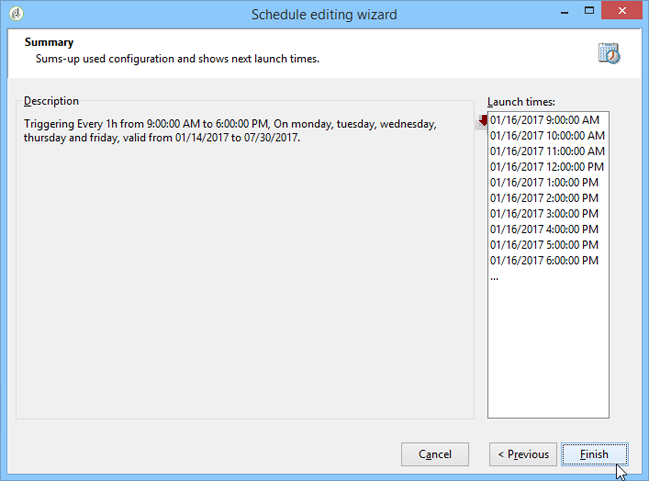

# Consistentieregels{#consistency-rules}

Adobe Campaign garandeert consistente communicatie dankzij een set regels die zijn opgenomen in campagnetypologieën. Zij hebben tot doel de leveringen die aan de ontvangers worden verzonden, te controleren, zoals volume, aard, relevantie, enz.

**Capaciteit** regels kunnen bijvoorbeeld voorkomen dat het platform waarop de levering van berichten betrekking heeft , wordt overbelast . Bijvoorbeeld, speciale aanbiedingen die een downloadverbinding bevatten mogen niet aan teveel mensen tegelijkertijd worden verzonden, om verzadiging van de server te vermijden; de telefooncampagnes mogen niet de verwerkingscapaciteit van callcenters, enz. overschrijden.

## Besturingscapaciteit {#control-capacity}

Alvorens berichten te leveren, moet u ervoor zorgen uw organisatie de capaciteit heeft om de levering (fysieke infrastructuur) te verwerken, de reacties die de levering (binnenkomende berichten) kan produceren, en het aantal vraag die aan contactabonnees (de verwerkingscapaciteit van het vraagcentrum) moet worden gemaakt, bijvoorbeeld.

Hiervoor moet u **[!UICONTROL Capacity]** typologische regels.

In het volgende voorbeeld, creëren wij een typologieregel voor een campagne van de telefoonloyaliteit. Wij beperken het aantal berichten tot 20 per dag, d.w.z. de dagelijkse verwerkingscapaciteit van een callcenter. Zodra de regel op twee leveringen van toepassing was, kunnen wij consumptie door logboeken controleren.

Volg onderstaande stappen om een nieuwe capaciteitsregel te ontwerpen:

1. Onder de **[!UICONTROL Administration > Campaign management > Typology management > Typology rules]** knooppunt, klikken **[!UICONTROL New]**.
1. Selecteer een **[!UICONTROL Capacity]** regeltype.

   

1. In de **[!UICONTROL Capacity]** , maakt u de beschikbaarheidsregels: in ons voorbeeld zijn dit tijdsperiodes waarin oproepen kunnen worden gedaan . Selecteer een periode van 24 uur en ga 150 in het aanvankelijke aantal in, wat betekent dat het vraagcentrum 150 vraag per dag kan behandelen.

   

   >[!NOTE]
   >
   >Beschikbaarheidsregels dienen alleen ter informatie. Als u berichten moet uitsluiten wanneer de capaciteitslimiet is bereikt, raadpleegt u [deze sectie](#exclude-messages-when-capacity-limit-reached).

1. Koppel deze regel aan een typologie en verwijs de typologie in uw levering om deze capaciteitsregel toe te passen. Raadpleeg [deze sectie](apply-rules.md#apply-a-typology-to-a-delivery) voor meer informatie.
1. U kunt de consumptie controleren op basis van de regel **[!UICONTROL Consumptions]** en **[!UICONTROL Capacity]** tabs.

   Wanneer een regel in een levering wordt gebruikt, **[!UICONTROL Consumed]** en **[!UICONTROL Remaining]** kolommen bevatten informatie over de lading, zoals hieronder wordt getoond:

   

   Raadpleeg [deze sectie](#monitor-consumption) voor meer informatie.

## De maximale belasting definiëren {#define-the-maximum-load}

Om de maximumlading te bepalen, moet u beschikbaarheidslijnen bepalen. Hiervoor zijn twee opties beschikbaar: u kunt handmatig [creeer één of meerdere beschikbaarheidslijnen](#add-availability-lines-one-by-one) of maak beschikbaarheidsbereiken. De frequentie van deze tijdsperiodes kan worden geautomatiseerd. [Meer informatie](#add-a-set-of-availability-lines).

### Beschikbaarheidsregels een voor een toevoegen {#add-availability-lines-one-by-one}

Om een beschikbaarheidslijn tot stand te brengen, klik **[!UICONTROL Add]** en selecteert u **[!UICONTROL Add an availability line]**. Voer de beschikbaarheidsperiode en de beschikbare laadtijd in.

Voeg zoveel regels toe als nodig zijn voor uw verwerkingscapaciteit.

### Een set beschikbaarheidsregels toevoegen {#add-a-set-of-availability-lines}

Als u beschikbaarheidsperioden voor een bepaalde tijd wilt definiëren, klikt u op de knop **[!UICONTROL Add]** en selecteert u de **[!UICONTROL Add a set of availability lines]** optie. Geef een duur voor elke tijdsperiode op en het aantal periodes dat u wilt maken.

Klik op de knop **[!UICONTROL Change]** en definieert tijdsperiode die gepland is.

Bijvoorbeeld, bepalen wij een programma om beschikbaarheidsperioden voor alle het werkdagen aan een tarief van 10 vraag per uur tussen 9AM en 5PM tot stand te brengen. Hiervoor voert u de volgende stappen uit:

1. Selecteer het type frequentie en de dagen en uren waarin deze geldig is:

   

1. Vermeld de geldigheidsdata:

   

1. Controleer het schema voordat u het goedkeurt:

   

De **[!UICONTROL Forecasting]** worden automatisch alle overeenkomende regels gemaakt.

>[!NOTE]
>
>We raden u aan beschikbaarheidsregels te maken via het importeren van bestanden. Op dit tabblad kunt u verbruikslijnen weergeven en controleren.

## Berichten uitsluiten wanneer capaciteitslimiet is bereikt {#exclude-messages-when-capacity-limit-reached}

Beschikbaarheidsregels dienen uitsluitend ter informatie. Om overtollige berichten uit te sluiten, controleer **[!UICONTROL Exclude from the target messages in excess of capacity]** optie. Dit voorkomt dat de capaciteit wordt overschreden. Voor dezelfde populatie als in het vorige voorbeeld mogen het verbruik en de resterende capaciteit de initiële hoeveelheid niet overschrijden:

Het aantal berichten dat moet worden verwerkt, wordt gelijkmatig verdeeld over het gedefinieerde beschikbaarheidsbereik. Dit is met name relevant voor callcenters, aangezien hun maximumaantal gesprekken per dag beperkt is. In het geval van e-mailbezorgingen, **[!UICONTROL Do not limit instantaneous delivery capacity]** kunt u dit beschikbaarheidsbereik negeren en tegelijkertijd uw e-mails verzenden.

>[!NOTE]
>
>In het geval van een overbelasting worden de opgeslagen berichten geselecteerd volgens de formule die is gedefinieerd in de leveringseigenschappen.

## Verbruik monitoren {#monitoring-consumption}

Capaciteitsregels zijn standaard alleen ter indicatie. Selecteer **[!UICONTROL Exclude messages in excess of capacity from the target]** om te voorkomen dat de gedefinieerde belasting wordt overschreden. In dit geval worden overtollige berichten automatisch uitgesloten van de leveringen die gebruikmaken van deze typologieregel.

Als u het verbruik wilt controleren, bekijkt u de waarden in het dialoogvenster **[!UICONTROL Consumed]** kolom van de **[!UICONTROL Capacity]** in de typologieregel.

Als u consumptielijnen wilt weergeven, klikt u op de knop **[!UICONTROL Consumptions]** in de regel.
