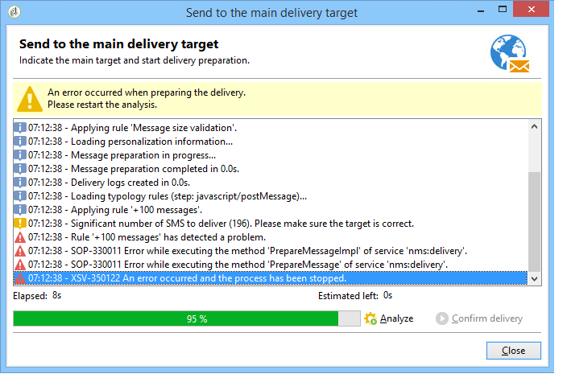

# Controleregels{#control-rules}

Met besturingsregels kunt u de geldigheid en kwaliteit van berichten vóór levering garanderen: weergave van tekens, grootte van SMS, adresindeling, enzovoort.

Met een set regels voor verduistering kunt u gebruikelijke controles uitvoeren. Deze controles (die in vette letters in de interface worden getoond) zijn:

* **[!UICONTROL Object approval]** (email): hiermee wordt gecontroleerd of het object en het adres van de afzender geen speciale tekens bevatten die problemen kunnen veroorzaken bij bepaalde e-mailagents.
* **[!UICONTROL URL label approval]** (e-mail): hiermee wordt gecontroleerd of elke URL die de gegevens bijhoudt een label heeft.
* **[!UICONTROL URL approval]** (e-mail): hiermee controleert u de URL&#39;s die worden bijgehouden (aanwezigheid van het teken &quot;&amp;&quot;).
* **[!UICONTROL Message size approval]** (mobiel): hiermee wordt de grootte van SMS-berichten gecontroleerd.
* **[!UICONTROL Validity period check]** (e-mail): controleert of de geldigheidsperiode van de levering lang genoeg is om alle berichten te verzenden.
* **[!UICONTROL Proof size check]** (alle kanalen): genereert een foutbericht als de proefdrukdoelpopulatie groter is dan 100 ontvangers.
* **[!UICONTROL Wave scheduling check]** (e-mail): hiermee wordt gecontroleerd of de laatste leveringsgolf moet beginnen vóór het einde van de geldigheidsperiode als de levering is opgesplitst in verschillende golven.
* **[!UICONTROL Unsubscription link approval]** (e-mail): hiermee wordt gecontroleerd of er ten minste één niet-abonnements- (opt-out) URL in elke inhoud (HTML en Text) aanwezig is.

## Een besturingsregel maken {#create-a-control-rule}

Het is mogelijk om nieuwe controleregels tot stand te brengen om uw behoeften aan te passen. Hiertoe maakt u een **[!UICONTROL Control]** typologieregel en voert u in SQL op het tabblad **[!UICONTROL Code]** de besturingselementformule in.

**Voorbeeld:**

In het volgende voorbeeld, gaan wij een regel tot stand brengen om een aanbieding van SMS te verhinderen worden verzonden naar meer dan 100 ontvangers. Deze regel zal worden gekoppeld aan een campagnetypologie en vervolgens aan de sms-leveringen waarvoor het betrokken aanbod beschikbaar is.

Voer de volgende stappen uit:

1. Maak een **[!UICONTROL Control]** typologieregel. Selecteer een waarschuwingsniveau voor **[!UICONTROL Warning]** .

   

1. Voer op het tabblad **[!UICONTROL Code]** het script in om de gewenste drempelwaarde toe te passen, zoals hieronder wordt weergegeven:

   

   Dit manuscript zal een waarschuwing teweegbrengen als het leveringsdoel 100 contacten overschrijdt:

   ```
   if( delivery.FCP == false && delivery.properties.toDeliver > 100 ) { logWarning("Significant number of SMS to deliver (" + delivery.properties.toDeliver + "). Please make sure the target is correct.") return false; } return true
   ```

1. Koppel deze regel aan een campagnetypologie en verwijs de typologie in de betrokken levering van SMS.

   

1. Tijdens leveringsanalyse, wordt de regel toegepast en een waarschuwing gecreeerd indien van toepassing.

   

   De levering is echter nog steeds klaar voor verzending.

   Als u het waarschuwingsniveau verhoogt, wordt de levering niet gestart.

   

   Aan het einde van de analyse is de knop **[!UICONTROL Confirm delivery]** niet beschikbaar.

   
