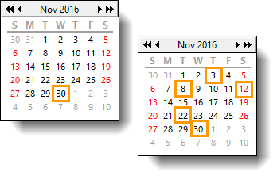
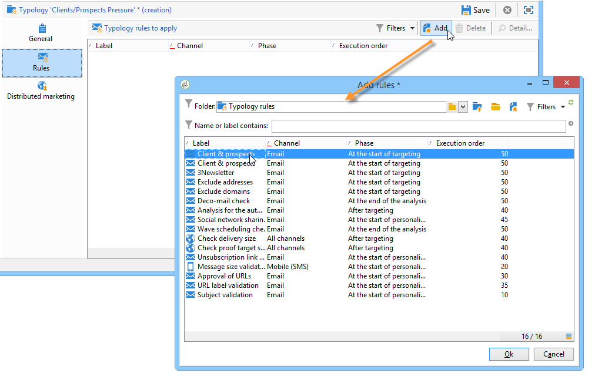
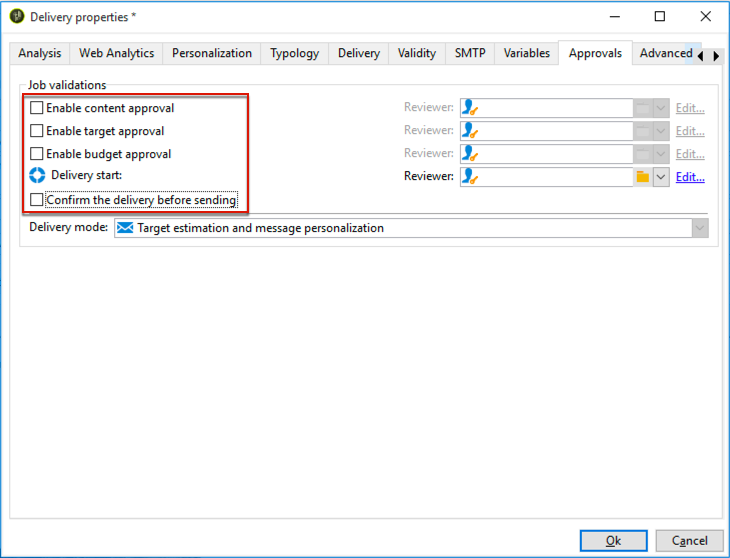

# Drukregels{#pressure-rules}

Door het beheer van de verkoopdruk te implementeren, kunt u voorkomen dat de populatie in de database te veel wordt gevraagd, ook wel &#39;marketingmoeheid&#39; genoemd. Om dit te doen, kunt u een maximumaantal berichten per ontvanger bepalen. Ook kunt u arbitrageregels tussen campagnes toepassen, zodat de beste boodschap naar het doelpubliek wordt gestuurd.

**Druk** voorschriften, om bijvoorbeeld de marktmoeheid te beheren, om het aantal te verzenden brieven aan een populatie te beperken tot twee, om de communicatie te selecteren die het best aansluit bij de belangen van een groep abonnees, om te voorkomen dat een sms naar een ontevreden klant wordt gestuurd, enz.

De campagnes worden geselecteerd gebaseerd op bepaalde drempels en berichtgewicht.

* Een drempel is het hoogste aantal leveringen dat binnen een bepaalde periode voor een bepaalde afnemer is toegestaan. De variabele kan ingesteld of variabel zijn. Deze wordt ingesteld of berekend in de instellingen voor de typologieregel. [Meer informatie](#maximum-number-of-messages).
* Met leveringsgewichten kunt u topprioriteit-leveringen identificeren in het kader van drukbeheer. Berichten met het hoogste gewicht hebben prioriteit. [Meer informatie](#message-weight).

Arbitrage bestaat erin ervoor te zorgen dat geplande campagnes met een groter gewicht dan de lopende campagne niet leiden tot excessieve profielopvraging: als dit het geval is, wordt het profiel uitgesloten van de levering.

Arbitragecriteria (gewicht en/of drempel) kunnen variëren op basis van twee soorten informatie:

* voorkeur van de ontvanger, die declaratieve informatie is: abonnementen op nieuwsbrief, status van de ontvanger (klant of vooruitzicht);
* gedrag van de ontvanger: aankopen, bezochte koppelingen, enz.

De arbitrageregel voor het definiëren van in aanmerking komende berichten wordt toegepast tijdens de analysefase. Voor elke ontvanger en voor de betrokken periode wordt het bericht verzonden als de volgende formule waar is: **(aantal verzonden berichten) + (aantal berichten met een groter gewicht) &lt; drempel**.

Anders wordt de ontvanger **[!UICONTROL Excluded by arbitration]**. [Meer informatie](#exclusion-after-arbitration).

## Een drukregel maken {#create-a-pressure-rule}

Als u arbitrage wilt instellen tussen campagnes die gebruikmaken van Adobe Campaign, moet u beginnen met het creëren van campagneretypologieën en het definiëren van gekoppelde typologieregels (**Druk** regels).

Voer de volgende stappen uit om een typologieregel **[!UICONTROL Pressure]** te maken en te configureren:

1. Selecteer in de lijst met typologische regels voor campagnes de optie **[!UICONTROL New]** pictogram boven de lijst.

   

1. In de **[!UICONTROL General]** selecteert u een **Druk** typt u de regel en voert u een naam en beschrijving in.

   

1. Wijzig zo nodig de uitvoeringsvolgorde. Wanneer meerdere typologische regels als een **[!UICONTROL Typology]** worden eerst de onderste geordende regels toegepast. [Meer informatie](apply-rules.md#execution-order).
1. In de **[!UICONTROL Calculation parameters]** , definieert u een frequentie als u het zoeken naar objecten wilt beperken tot na de volgende dagelijkse uitvoering van de arbitrage. [Meer informatie](apply-rules.md#adjust-calculation-frequency).
1. Klik op de knop **[!UICONTROL Pressure]** en kiest u de kalenderperiode waarin de typologische regel van toepassing is.

   

   De regel wordt toegepast op leveringen waarvan de contactdatum in de betrokken periode is opgenomen.

   >[!NOTE]
   >
   >In de context van een [Implementatie in het kader van Enterprise (FFDA)](../../v8/architecture/enterprise-deployment.md) van Campagne wordt geen rekening gehouden met geschilde leveringen.

1. Definieer de methode voor het berekenen van het hoogste aantal berichten.

   De drempel vertegenwoordigt het hoogste aantal berichten dat tijdens de betrokken periode naar een ontvanger kan worden verzonden.

   Standaard is de drempelwaarde een constante en u moet een maximumaantal berichten aangeven dat door de regel wordt toegestaan.

   

   Als u een drempelwaarde voor een variabele wilt definiëren, selecteert u de optie **[!UICONTROL Depends on the recipient]** waarde in de **[!UICONTROL Type of threshold]** en gebruik het pictogram aan de rechterkant om de expressie-editor te openen.

   

   Raadpleeg voor meer informatie hierover [Maximum aantal berichten](#maximum-number-of-messages).

1. Geef de methode op voor de berekening van het leveringsgewicht.

   Elke levering heeft een gewicht, d.w.z. een waarde die het prioriteitsniveau vertegenwoordigt: dit maakt arbitrage tussen campagnes mogelijk. Het gewicht wordt berekend aan de hand van de formule die is gedefinieerd in de typologieregel en/of in de eigenschappen ervan. [Meer informatie](#message-weight).

1. Standaard worden alle berichten in aanmerking genomen voor de berekening van de drempelwaarde. De **[!UICONTROL Restriction]** kunt u de berichten filteren waarop de typologieregel betrekking heeft:

   * In de bovenste sectie van dit tabblad kunt u de betreffende ontvangers beperken.
   * In de onderste sectie van dit tabblad kunt u de berichten filteren die moeten worden geteld.

     In het volgende voorbeeld worden alleen ontvangers opgeslagen in het dialoogvenster **NewContacts** er wordt rekening gehouden met de map en de leveringen beginnen met **Nieuwsbrief** zijn bezorgd.

   

1. De **[!UICONTROL Typologies]** laat u de campagnemetypologieën bekijken die deze regel toepassen of de regel verbinden met één of meerdere bestaande typologieën. [Meer informatie](campaign-typologies.md#apply-typologies).

## Drempels en gewichten definiëren {#define-thresholds-and-weights}

### Maximum aantal berichten {#maximum-number-of-messages}

Elke drukregel definieert een drempel, d.w.z. het maximumaantal berichten dat gedurende een bepaalde tijdsperiode naar een ontvanger kan worden verzonden. Zodra deze drempelwaarde is bereikt, kunnen tot het einde van de in aanmerking genomen periode geen leveringen meer plaatsvinden. Met dit proces kunt u automatisch een ontvanger uitsluiten van een levering als een bericht de ingestelde drempelwaarde overschrijdt. Op deze manier voorkomt u te veel vragen.

Drempelwaarden kunnen constant zijn of door een formule met variabelen worden berekend. Dit betekent dat de drempels voor een bepaalde periode van de ene ontvanger tot de andere kunnen variëren, of zelfs voor dezelfde ontvanger.

>[!CAUTION]
>
>Enter **0** als drempelwaarde alle leveringen aan de doelpopulatie in de beoordelingsperiode beletten.

**Voorbeeld:**

U kunt het aantal geoorloofde berichten volgens het segment indexeren waartot de ontvanger behoort. Dit betekent dat een ontvanger die tot het websegment behoort meer berichten kan ontvangen dan andere ontvangers. An **[!UICONTROL Iif (@origin='Web', 5, 3)]** de typeformule staat de levering van 5 berichten aan ontvangers en 3 voor andere segmenten toe. De configuratie is als volgt:

Als u de drempel wilt definiëren, kunt u een dimensie gebruiken die is gekoppeld aan de doeldimensie: bijvoorbeeld om berichten op te nemen die worden geleverd aan de ontvangende profielen die zijn opgeslagen in het dialoogvenster [bezoekerslijst](../../v8/audiences/target-mappings.md) of om te voorkomen dat meer dan één bericht per week naar hetzelfde huishouden wordt gezonden (dat naar meerdere e-mailadressen kan verwijzen) die zijn geïdentificeerd in een dimensie die gekoppeld is aan die van de ontvangers.

Selecteer hiertoe de optie **[!UICONTROL Count messages on a linked dimension]** selecteert u vervolgens de bezoeker of de tabel met contactpersonen.

### Berichtgewicht {#message-weight}

Elke levering heeft een gewicht dat overeenkomt met het prioriteitsniveau. Standaard is het gewicht van een levering ingesteld op 5. Aan de hand van drukregels kunt u het gewicht bepalen van de leveringen waarop deze worden toegepast.

U kunt het gewicht instellen of berekenen met behulp van een formule die geschikt is voor de ontvanger. U kunt bijvoorbeeld het gewicht van een levering bepalen op basis van de belangen van de ontvanger.

>[!CAUTION]
>
>Het gewicht dat in een typologieregel wordt gedefinieerd, kan voor elke levering afzonderlijk worden overbelast, in het gedeelte **[!UICONTROL Properties]** tab. Klik op de knop **[!UICONTROL Typology]** om de typologie van de campagne te selecteren en, indien nodig, het gewicht te specificeren dat moet worden toegepast.\
>Nochtans, zal het gewicht dat in een A typologieregel wordt verklaard niet voor de berekening van een B typologieregel worden gebruikt: dit gewicht zal slechts leveringen betreffen die de regel van A gebruiken.

**Voorbeeld:**

In het volgende voorbeeld willen we het gewicht van nieuwsbrieven op muziek koppelen aan de nevenscore van hun ontvangers. Dit doet u als volgt:

1. Maak een nieuw veld waarin u de geschiktheidsscores voor ontvangers kunt opslaan. het veld, **@Music** in dit geval zal de informatie worden verrijkt met antwoorden op enquêtes en online opiniepeilingen , verzamelde traceergegevens , enz .
1. Maak een typologieregel om het gewicht van het bericht te berekenen op basis van dit veld.

   

1. Pas deze regel op berichten met het volgende onderwerp toe: nieuwsbrieven, speciale aanbiedingen, enz. Het gewicht van deze leveringen, en dus het prioriteitsniveau ervan, zal afhangen van de geschiktheidsscore van elke ontvanger.

## De periode instellen {#setting-the-period}

De drukregels worden gedefinieerd in **n**-dag rolperiodes.

De periode wordt gevormd in **[!UICONTROL Pressure]** tabblad van de regel. U kunt het aantal dagen opgeven en, indien nodig, het type groepering selecteren dat u wilt toepassen (dag, week, maand, kwartaal, enz.).

Met het groeperingstype kunt u het dialoogvenster **[!UICONTROL Period considered]** veld tot de gehele dag, kalenderweek, kalendermaand of kalenderjaar voor data voor de periode.

Bijvoorbeeld, zal een drukregel die een drempel van 2 berichten per week bepaalt, met een groepering aan elke kalendermaand, de levering van meer dan 2 berichten binnen de zelfde week EN binnen de zelfde kalendermaand verhinderen. Waarschuwing: als de periode twee maanden overlapt, wordt bij de berekening rekening gehouden met de leveringen van deze twee kalendermaanden en kunnen derhalve alle nieuwe leveringen in de tweede maand worden voorkomen.

>[!CAUTION]
>
>Bij de berekening van de drempel wordt alleen rekening gehouden met reeds verzonden leveringen.

Om de in aanmerking genomen leveringen te beperken tot een periode van twee weken, **15 quinquies** in de **[!UICONTROL Concerned period]** veld: leveringen die tot twee weken vóór de datum van levering waarop de regel wordt toegepast, zijn verzonden, worden in aanmerking genomen bij de berekening

De begindatum van de periode is afhankelijk van de configuratie van de database.

Als u bijvoorbeeld een drukregel van 15 dagen toepast zonder te groeperen in een levering van 12/11, wordt rekening gehouden met leveringen tussen 11/27 en 12/12. Indien bij de drukregel rekening wordt gehouden met de leveringen in het voorlopige tijdschema, worden alle tussen 11.27 en 12.27 geplande leveringen in aanmerking genomen. Tot slot als u een groepering per kalendermaand in de regel vormt, zullen alle leveringen in November en December in aanmerking worden genomen voor het berekenen van de drempel (van 11/1 tot 12/31).

**Frequente gevallen**

Om ervoor te zorgen dat geen rekening wordt gehouden met leveringen voor de lopende kalenderweek en om geen risico&#39;s te lopen die ook rekening houden met die van de vorige week voor de berekeningsdrempel, geeft u de **[!UICONTROL Period considered]** bij &#39;0&#39; en selecteer &#39;Groepering per kalenderweek&#39; als de **[!UICONTROL Period type]**.

Wanneer een periode groter is dan 0 (bijvoorbeeld 1), kan bij de berekening de waarde van de leveringen van de voorgaande dag in aanmerking worden genomen. Indien de vorige dag overeenkomt met de vorige kalenderweek en de gekozen periode &quot;Groepering per kalenderweek&quot; is, wordt derhalve met alle voorafgaande weken rekening gehouden voor de berekeningsdrempel.

**Voorbeeld:**

We willen een drukregel maken die het aanvragen beperkt tot 3 berichten per periode van twee weken, met een groepering tot de kalendermaand.

Laten we zes nieuwsbrieven nemen met hetzelfde gewicht, gepland voor 05/30, 06/3, 06/8, 06/12, 06/22 en 06/30.

De voor 12 en 30 juni geplande leveringen zullen niet worden verzonden: de levering 06/12 zou de drempel van 3 berichten per periode van twee weken overschrijden en de 30e levering zou de drempel van toegestane communicatie per kalendermaand overschrijden.

Alle ontvangers voor deze leveringen worden tijdens de analysefase door arbitrage uitgesloten:

Voor dezelfde regel geldt dat als u leveringen per kwartaal groepeert, de ontvangers van **nieuwsbrief nr . 5** worden eveneens uitgesloten en niet verzonden.

Tot slot als geen groepering wordt geselecteerd, slechts **nieuwsbrief nr . 4** niet worden verzonden, aangezien het was gepland voor dezelfde periode van twee weken als de eerste drie nieuwsbrieven.

>[!NOTE]
>
>Wanneer u de definitie van een typologieregel wijzigt, kunt u een **Simulatie** om het effect ervan op de leveringen waarop het wordt toegepast, te controleren en de invloed van de leveringen op elkaar te controleren. [Meer informatie](campaign-simulations.md).

## Uitsluiting na arbitrage {#exclusion-after-arbitration}

Arbitrage wordt elke nacht opnieuw aangebracht via de **[!UICONTROL Forecasting]** de technische werkstroom en **[!UICONTROL Campaign jobs]** workflow.

De **[!UICONTROL Forecasting]** De werkstroom berekent vooraf de gegevens voor de lopende periode (van zijn begindatum tot de huidige datum), waardoor typologische regels tijdens de analyse kunnen worden toegepast. Ook worden de uitsluitingstellers elke nacht opnieuw berekend voor arbitrage.

Adobe Campaign controleert dus voor elke ontvanger of het aantal te verzenden berichten de drempel niet overschrijdt, rekening houdend met het aantal reeds verzonden berichten voor de betrokken periode. Deze informatie is een **indicator**, aangezien alle berekeningen op het tijdstip van levering worden bijgewerkt.

Als dit aantal de drempel overschrijdt, worden de arbitrageregels toegepast die in de campagnetypologie zijn gedefinieerd en worden de ontvangers uitgesloten van campagnes met een lager gewicht.

>[!NOTE]
>
>Als meerdere leveringen dezelfde scores hebben, wordt de campagne die voor de vroegste datum is gepland, verzonden.

## Gevallen gebruiken voor drukregels {#use-cases-on-pressure-rules}

### Aanpassing van de drempel op basis van criterium {#adapt-the-threshold-based-on-criterion}

Wij willen een typologieregel tot stand brengen om de levering van meer dan 4 berichten per week aan klanten en 2 berichten per week aan vooruitzichten te verhinderen.

Om klanten en vooruitzichten te identificeren, gebruik **[!UICONTROL Status]** veld, dat 0 voor vooruitzichten en 1 voor klanten bevat.

Pas de volgende stappen toe om de regel te maken:

1. Een nieuwe **Druk** typologische typeregel.
1. Bewerk de **[!UICONTROL Pressure]** tab: in de **[!UICONTROL Maximum number of messages]** in de sectie, willen wij een formule tot stand brengen om de drempel afhankelijk van elke ontvanger te berekenen. Selecteer de **[!UICONTROL Depends on the recipient]** waarde in de **[!UICONTROL Threshold type]** veld, klik vervolgens op **[!UICONTROL Edit expression]** aan de rechterzijde **[!UICONTROL Formula]** veld.

   Klik op de knop **[!UICONTROL Advanced parameters]** om de berekeningsformule te definiëren.

   

1. Selecteer de **[!UICONTROL Edit the formula using an expression]** en klik op **[!UICONTROL Next]**.

   

1. Dubbelklik in de lijst met functies op de knop **Iif** in de **[!UICONTROL Others]** knooppunt.

   Selecteer vervolgens de ontvangers **Status** in de **[!UICONTROL Available fields]** sectie.

   

   Voer de volgende formule in: **Iif(@status=0,2,4)**

   

   Met deze formule kunt u de waarde 2 toewijzen als de status gelijk is aan 0 en de waarde 4 voor alle andere statussen.

   Klik op **[!UICONTROL Finish]** om de formule goed te keuren.

1. Vermeld de periode waarin de regel van toepassing is: 7 dagen in dit geval om het aantal berichten per week te tellen.

   

1. Sla de regel op om het maken van de regel goed te keuren.

Koppel nu de regel die u zojuist hebt gemaakt aan een typologie om deze toe te passen op leveringen. Dit doet u als volgt:

1. Maak een campagnetypologie.
1. Ga naar de **[!UICONTROL Rules]** klikt u op de knop **[!UICONTROL Add]** en selecteert u de regel die u zojuist hebt gemaakt.

   

1. Sla de typologie op: wordt deze toegevoegd aan de lijst met bestaande typologieën.

Als u deze typologie in uw leveringen wilt gebruiken, selecteert u deze in de leveringseigenschappen, in het dialoogvenster **[!UICONTROL Typology]** tabblad zoals hieronder weergegeven:

>[!NOTE]
>
>De typologie kan in de leveringssjabloon worden gedefinieerd, en wordt dan automatisch toegepast op alle leveringen die met deze sjabloon zijn gemaakt.

Tijdens de leveringsanalyse worden de ontvangers van de levering, indien van toepassing, uitgesloten van de levering, afhankelijk van het aantal reeds aan hen verzonden leveringen. Als u deze gegevens wilt weergeven, kunt u:

* Bekijk het analyseresultaat:

  

* Bewerk de levering en klik op **[!UICONTROL Delivery]** en de **[!UICONTROL Exclusions]** subtabblad:

  

* Klik op de knop **[!UICONTROL Audit]** en vervolgens de **[!UICONTROL Causes of exclusions]** subtab om het aantal uitsluitingen en de toegepaste typologische regels weer te geven:

  

### Het leveringsgewicht berekenen op basis van het gedrag {#calculate-the-delivery-weight-based-on-behavior}

U kunt drukregels definiëren op basis van het gedrag van de ontvanger. Zo kan het gewicht van een levering worden aangepast aan criteria die per ontvanger verschillen. U kunt bijvoorbeeld een bericht verzenden, afhankelijk van de vraag of een ontvanger uw website heeft bezocht, in een bepaald gedeelte van de laatste nieuwsbrief heeft geklikt, zich op een informatieservice heeft geabonneerd of zelfs op basis van antwoorden op een enquête, een online game, enz.

In het volgende voorbeeld willen we een levering maken met een gewicht van 5. Dit gewicht wordt verrijkt met nevenscores op basis van het gedrag van de ontvanger: klanten die al vanaf deze site hebben besteld, hebben een score van 5, terwijl klanten die nog nooit online hebben besteld, een score van 4 hebben.

Om dit type van configuratie uit te voeren, moet u een formule gebruiken om berichtgewicht te bepalen. In het gegevensmodel moet informatie over de populatiescore en enquêteantwoorden beschikbaar zijn. In ons voorbeeld **Propensiteit** is toegevoegd.

Pas de volgende configuratiestappen toe:

1. Een nieuwe **Druk** typologische typeregel.
1. Bewerk de **[!UICONTROL Pressure]** tab. Wij willen een drempelformule creëren die op elke individuele ontvanger zal worden gebaseerd: klik **[!UICONTROL Edit expression]** pictogram rechts van **[!UICONTROL Weight formula]** veld.

   

1. Standaard, waarde **5** wordt getoond in de hogere sectie van de uitdrukkingsredacteur. Wij willen de volheidsscore van elke ontvanger aan dit gewicht toevoegen: plaats uw curseur rechts van 5, ga in **+** en selecteert u de **Propensiteit** veld.

   

1. Voeg vervolgens een hogere waarde toe aan ontvangers die al een aankoop hebben gedaan. Voor hen moet het gewicht van de levering met 5 worden verhoogd, voor andere met slechts 4.

   

1. Klikken **[!UICONTROL Finish]** deze regel opslaan.
1. Koppel de regel aan een campagnetypologie en verwijs deze typologie in een levering om het goed te keuren.

### Alleen de hoogst gewogen berichten verzenden {#send-only-the-highest-weighted-messages}

U wilt niet meer dan 2 berichten binnen de zelfde week, met een grens van 2 berichten per dag, naar elk van uw ontvangers verzenden, en u wilt slechts de berichten met hogere gewichten om worden geleverd.

Hiervoor moet u verschillende leveringen met verschillende gewichten voor dezelfde ontvanger plannen en een drukregel toepassen om de leveringen met een lager gewicht uit te sluiten.

Eerst, vorm de drukregel.

1. Maak een drukregel. [Meer informatie](#create-a-pressure-rule).
1. In de **[!UICONTROL General]** selecteert u de **[!UICONTROL Re-apply the rule at the start of personalization]** -optie.

   

   Met deze optie overschrijft u de waarde die is gedefinieerd in het dialoogvenster **[!UICONTROL Frequency]** en past automatisch de regel tijdens de verpersoonlijkingsfase toe. [Meer informatie](apply-rules.md#adjust-calculation-frequency).

1. In de **[!UICONTROL Pressure]** tab, selecteert u **[!UICONTROL 7d]** als de **[!UICONTROL Period considered]** en **[!UICONTROL Grouping per day]** als de **[!UICONTROL Period type]**.
1. In de **[!UICONTROL Typologies]** tabblad, koppelt u de regel aan een campagnetypologie.
1. Sla uw wijzigingen op.

Maak en configureer nu een workflow voor elke levering waarop u de drukregel wilt toepassen.

1. Een campagne maken. [Meer informatie](../campaigns/marketing-campaign-create.md#create-a-campaign).
1. In de **[!UICONTROL Targeting and workflows]** tabblad van uw campagne, voegt u een **Query** activiteit aan uw werkschema. Raadpleeg voor meer informatie over het gebruik van deze activiteit [deze sectie](../workflow/query.md).
1. Een **[!UICONTROL Email delivery]** aan de werkstroom en open het. Raadpleeg voor meer informatie over het gebruik van deze activiteit [deze sectie](../workflow/delivery.md).
1. Ga naar de **[!UICONTROL Approvals]** tabblad van het **[!UICONTROL Delivery properties]** en alle goedkeuringen uitschakelen.

   

1. In de **[!UICONTROL Typology]** tabblad van het **[!UICONTROL Delivery properties]**, verwijst u naar de typologie van de campagne om de regel toe te passen. Definieer een gewicht voor de levering.

   

1. Klik in de levering op **[!UICONTROL Scheduling]** en selecteert u **[!UICONTROL Schedule delivery (automatic execution when the scheduled date is reached)]**. Selecteer in dit voorbeeld de optie **[!UICONTROL Use a calculation formula]** -optie.
1. Stel de extractiedatum in op 10 minuten (huidige datum + 10 minuten).
1. Stel de contactdatum in op de volgende dag (huidige datum + 1 dag).

   

   Voor de drukregeluitsluitingen die met succes moeten worden geïmplementeerd, moet u de extractiedatum en -tijd vóór de contactdatum en -tijd instellen, evenals voordat de nachtelijke arbitrage opnieuw wordt toegepast. [Meer informatie](#exclusion-after-arbitration).

1. De selectie van **[!UICONTROL Confirm the delivery before sending]** en sla uw wijzigingen op.
1. Ga op dezelfde manier te werk voor elke levering die u wilt verzenden. Zorg ervoor dat u het gewenste gewicht voor elke levering instelt.
1. Voer de relevante workflows uit om de leveringen voor te bereiden en te verzenden.

Wanneer de nachtelijke arbitrage wordt toegepast, worden de leveringen met de laagste gewichten voor dezelfde afnemer uitgesloten. Alleen leveringen met het hoogste gewicht worden in aanmerking genomen voor verzending. [Meer informatie](#message-weight).

Aangezien er al eerder in de week een e-mailbericht naar de betrokken ontvangers is verzonden, wordt in de onderstaande tabel een voorbeeld weergegeven van de configuraties die kunnen worden toegepast voor nog twee leveringen.

<table> 
 <thead> 
  <tr> 
   <th> Levering  </th> 
   <th> Goedkeuringen  </th> 
   <th> Dikte  </th> 
   <th> Extractiedatum/-tijd  </th> 
   <th> Contactdatum  </th> 
   <th> Begindatum/-tijd van levering  </th> 
   <th> Uitvoeringsdatum/tijd van de arbitrageworkflow  </th> 
   <th> Leveringsstatus  </th> 
   <th> Verzonden levering (datum/tijd)  </th> 
  </tr> 
 </thead> 
 <tbody> 
  <tr> 
   <td> Aflevering 1  </td> 
   <td> Uitgeschakeld  </td> 
   <td> 5  </td> 
   <td> 3pm  </td> 
   <td> 8 uur (volgende dag)  </td> 
   <td> 2pm  </td> 
   <td> Night  </td> 
   <td> Uitgesloten  </td> 
   <td> Uitgesloten  </td> 
  </tr> 
  <tr> 
   <td> Aflevering 2  </td> 
   <td> Uitgeschakeld  </td> 
   <td> 10  </td> 
   <td> 4pm  </td> 
   <td> 9u (volgende dag)  </td> 
   <td> 2pm  </td> 
   <td> Night  </td> 
   <td> Verzonden  </td> 
   <td> 9u (volgende dag)  </td> 
  </tr> 
 </tbody> 
</table>

Nadat de extractiedatum voor de twee leveringen is verstreken, wordt de nachtelijke arbitrage opnieuw toegepast vóór de contactdata van beide leveringen. Op deze manier kunnen alle reeds verzonden leveringen (ontvangers voor wie een levering wordt verwerkt, geregistreerd via de grote logboeken) of geplande leveringen (ontvangers die in aanmerking komen voor een levering, geregistreerd via de voorspelde logboeken) worden gevonden.

Zodra alle verzonden en potentiële leveringen zijn vermeld voor de periode die in de drukregel is bepaald, sorteert Adobe Campaign ze op basis van gewicht, met de hoogste gewogen eerst. Wanneer de in de drukregel vastgestelde drempelwaarde wordt bereikt (hier niet meer dan twee e-mails in dezelfde week), worden de ontvangers uitgesloten van de levering.
