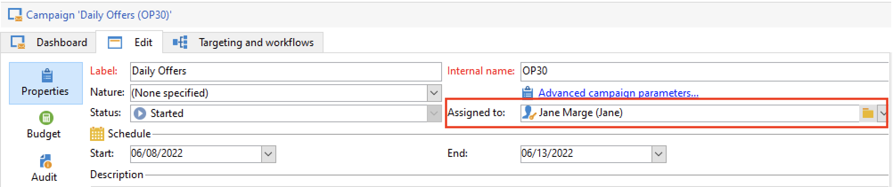

# Het goedkeuringsproces instellen en beheren {#approval-marketing-campaigns}

Methoden en personen die betrokken zijn bij het maken en goedkeuren van marketingcampagnes zijn specifiek voor elke organisatie. Bij het goedkeuringsproces van de campagne moeten meerdere belanghebbenden worden gecoördineerd: digitale marketers, leveringsmanagers, contentmanagers en externe eigenaars zoals partners of leveranciers.

Met Adobe Campaign kunt u een goedkeuringsstroom voor uw campagnes instellen en operatoren waarschuwen wanneer een actie vereist is. U kunt goedkeuringen definiëren voor elke stap van een levering: gericht verzenden, inhoud, budget, extractie en het verzenden van bewijzen. Terwijl uw campagneleveringen de diverse validatiestappen doorlopen, worden in Adobe Campagnes een historie van wijzigingen en aftekeningen gecompileerd, zoals feedback, opmerkingen, wijzigingsverzoeken en opmerkingen.

De berichten van het bericht worden verzonden naar de exploitanten van Adobe Campaign die als recensenten worden aangewezen om hen van een goedkeuringsverzoek op de hoogte te brengen.

Operatoren kunnen op verschillende manieren goedkeuring verlenen:

* Uit het meldingsbericht. Met de koppeling in de e-mail kan de operator campagne voeren via een webbrowser. Nadat de controleur verbinding heeft gemaakt, kan hij of zij de inhoud goedkeuren.
  

* Van het campagnedashboard.
  

* Van het leveringsdashboard.
  

De exploitanten kunnen tot de campagne en de levering van het goedkeuringsvenster toegang hebben. Ze kunnen ook een opmerking invoeren.

Zodra een exploitant bevestigt, wordt de informatie getoond in de campagne en leveringsdashboards, en in de logboeken.

De informatie is ook beschikbaar in de goedkeuringslogboeken van de levering en in het goedkeuringsblad van de campagne. Deze logbestanden zijn toegankelijk via de tabbladen van **[!UICONTROL Edit > Audit > Approvals]** .

## Goedkeuring inschakelen{#enable-approvals}

Goedkeuringsmeldingen worden verzonden naar de betrokken marktdeelnemers voor elk proces waarvoor goedkeuring is ingeschakeld.

Zij kunnen voor het campagnemalplaatje, voor elke campagne individueel, of voor een levering worden toegelaten.

Alle taken waarvoor goedkeuring is vereist, worden in de campagnemalplaatje geselecteerd via het tabblad **[!UICONTROL Properties]** > **[!UICONTROL Advanced campaign parameters...]** > **[!UICONTROL Approvals]** . Revisoren of groepen revisoren zijn op dit tabblad geselecteerd. Ze ontvangen meldingen, tenzij deze optie niet is ingeschakeld. [Meer informatie](#approving-processes).

Deze montages kunnen voor elke campagne worden met voeten getreden die gebruikend dit malplaatje, en individueel voor elke levering wordt gecreeerd. Blader door de knop **[!UICONTROL Properties]** van de levering en vervolgens door de tab **[!UICONTROL Approvals]** .

In het volgende voorbeeld is voor de leveringsinhoud geen goedkeuring vereist:

>[!CAUTION]
>
>Controleer dat de recensenten de **aangewezen toestemmingen** voor het goedkeuren hebben, en dat hun veiligheidsstreek correct wordt bepaald. [Meer informatie](#selecting-reviewers).

Het goedkeuringsproces voor leveringen wordt gedetailleerd in [ deze sectie ](#review-and-approve-deliveries).

## Revisoren selecteren {#select-reviewers}

Voor elk type goedkeuring worden de voor de goedkeuring verantwoordelijke exploitanten of groepen van marktdeelnemers geselecteerd uit de vervolgkeuzelijst in de levering. Met de koppeling **[!UICONTROL Edit...]** kunt u meer operatoren toevoegen. In dit venster kunt u ook de deadline van de goedkeuring bewerken. Standaard hebben revisoren drie dagen vanaf de verzenddatum om een proces goed te keuren. Gebruik de koppeling **[!UICONTROL Add a reminder]** om een automatische herinnering toe te voegen.

Als er geen controleur is opgegeven, is de eigenaar van de campagne verantwoordelijk voor de goedkeuringen en ontvangt deze de meldingen. De eigenaar van de campagne wordt opgegeven op het tabblad **[!UICONTROL Edit > Properties]** van de campagne:

Alle andere Adobe Campaign-operatoren met **[!UICONTROL Administrator]** -rechten kunnen ook taken goedkeuren, maar ontvangen geen berichten.

>[!NOTE]
>
>Standaard kan de eigenaar van de campagne de goedkeuring niet uitvoeren of de leveringen starten als de goedkeuringsoperatoren zijn gedefinieerd. Als beheerder van Adobe Campaign, kunt u dit gedrag wijzigen en de campagneeigenaars toestaan om leveringen goed te keuren/te beginnen door **NmsCampaign_Activate_OwnerConfirmation** te creëren optie, die aan **1** wordt geplaatst.

Als een lijst met revisoren is gedefinieerd, wordt een taak goedgekeurd wanneer één revisor deze heeft goedgekeurd. De goedkeuringskoppeling is dan niet meer beschikbaar in de campagne- en leveringsdashboards. Wanneer het verzenden van meldingen is ingeschakeld en een andere controleur op de goedkeuringskoppeling in het meldingsbericht klikt, wordt hem meegedeeld dat een andere operator de taak al heeft goedgekeurd.

## Leveringen controleren en goedkeuren {#review-and-approve-deliveries}

Voor elke campagne kunt u het leveringsdoel, [ leveringsinhoud ](#approving-content) en kosten goedkeuren. Adobe Campaign-operatoren die met de goedkeuring zijn belast, kunnen via e-mail op de hoogte worden gesteld en kunnen goedkeuring van de clientconsole of via een webverbinding accepteren of afwijzen. [Meer informatie](#approving-processes).

Voor directe postleveringen, kunnen de exploitanten van Adobe Campaign het extractiedossier bekijken alvorens het naar de router wordt verzonden, en indien nodig kunnen zij het formaat veranderen en extractie opnieuw lanceren. [Meer informatie](#approve-an-extraction-file).

Wanneer deze validatiefasen zijn voltooid, kan de levering worden gestart. [Meer informatie](marketing-campaign-deliveries.md#starting-a-delivery).

>[!NOTE]
>
>Processen waarvoor goedkeuring is vereist, worden geselecteerd in het campagnemalplaatje. [Meer informatie](marketing-campaign-templates.md).
>

### Stappen om een levering goed te keuren {#approving-processes}

De stadia die goedkeuring vereisen verschijnen op het campagnemashboard (via de Console van de Cliënt of de Webinterface). Zij verschijnen ook in de levering volgende lijst en op het leveringsdashboard.

Voor elke levering in de campagne, kunt u de volgende processen goedkeuren:

* **het richten, inhoud en begroting**

  Wanneer de opties **[!UICONTROL Enable target approval]** , **[!UICONTROL Enable content approval]** of **[!UICONTROL Enable budget approval]** zijn geselecteerd in het venster met goedkeuringsinstellingen, worden de verwante koppelingen weergegeven in de dashboards voor de campagne en de levering.

  

  >[!NOTE]
  >
  >Begrotingsgoedkeuring is alleen beschikbaar als goedkeuring als doel is ingeschakeld in het venster met goedkeuringsinstellingen. De koppeling voor goedkeuring van de begroting wordt pas weergegeven nadat het doel is geanalyseerd.

  Als de opties **[!UICONTROL Assign content editing]** of **[!UICONTROL External content approval]** zijn geselecteerd in het venster met goedkeuringsinstellingen, worden op het dashboard de koppelingen **[!UICONTROL Available content]** en **[!UICONTROL External content approval]** weergegeven.

  Met Goedkeuring van inhoud hebt u toegang tot de verzonden proefdrukken.

* **de goedkeuring van de Uitwinning (directe postlevering)**

  Wanneer **[!UICONTROL Enable extraction approval]** in het venster van goedkeuringsmontages wordt geselecteerd, moet het gehaalde dossier worden goedgekeurd alvorens de router kan worden meegedeeld.

  De optie **[!UICONTROL Approve file]** is beschikbaar in de campagne- en leveringsdashboards.

  

  U kunt een voorvertoning van het uitvoerbestand weergeven voordat u de validatie uitvoert. In de voorvertoning van het extractiebestand wordt alleen een gegevensvoorbeeld weergegeven. Het hele bestand is niet geladen.

* **goedkeurend bijbehorende leveringen**

  De optie **[!UICONTROL Enable individual approval of each associated delivery]** wordt gebruikt voor één primaire levering die aan secundaire leveringen is gekoppeld. Deze optie is standaard niet geselecteerd, zodat een algemene goedkeuring van de hoofdlevering kan worden uitgevoerd. Als deze optie is geselecteerd, moet elke levering afzonderlijk worden goedgekeurd.

  

>[!NOTE]
>
>Als tijdens de voorbereiding van berichten een fout optreedt die is gekoppeld aan een configuratieprobleem, wordt in een doelworkflow de koppeling **[!UICONTROL Restart message preparation]** weergegeven op het dashboard. Los de fout op en gebruik deze verbinding om berichtvoorbereiding opnieuw te beginnen terwijl het mijden van het richten stadium.

### Inhoud goedkeuren {#approve-content}

>[!CAUTION]
>
>Voor het goedkeuren van een inhoud is een proefcyclus verplicht. Met proefdrukken kunt u de weergave van gegevens, aanpassingsgegevens en de werking van koppelingen goedkeuren.
>
>De hieronder beschreven functies voor inhoudsgoedkeuring hebben betrekking op de levering van het bewijs.

Het is mogelijk om een cyclus van de inhoudsgoedkeuring te vormen. Selecteer hiertoe de optie **[!UICONTROL Enable content approval]** in het venster met goedkeuringsinstellingen. De belangrijkste stappen van de cyclus voor inhoudsgoedkeuring zijn:

1. Na het maken van een nieuwe levering klikt de campagnemanager op de koppeling **[!UICONTROL Submit content]** op het campagnedashboard om de goedkeuringcyclus voor de inhoud te starten.

   >[!NOTE]
   >
   >Als de optie **[!UICONTROL Enable the sending of proofs]** (voor e-mailleveringen) of **[!UICONTROL Enable the sending and approval of proofs]** (voor directe mailleveringen) is geselecteerd in het venster met goedkeuringsinstellingen, worden automatisch proefdrukken verzonden.

1. Er wordt een meldingsbericht verzonden naar de persoon die verantwoordelijk is voor de inhoud, die kan kiezen of u de inhoud wilt goedkeuren of niet:

   * via het bericht e-mail: bevat het bericht e-mail een verbinding aan de reeds verzonden proeven, en misschien aan een teruggeven van het bericht voor de diverse webmails als **toe:voegen-op van de Leverbaarheid** voor deze instantie wordt toegelaten.

   * via de clientconsole of webinterface, het bijhouden van de levering, het bezorgdashboard of het campagnemdashboard. In dit campagnemdashboard kunt u de lijst met proefdrukken weergeven die zijn verzonden door op de koppeling **[!UICONTROL Inbox rendering...]** te klikken. Als u hun inhoud wilt weergeven, klikt u op het pictogram **[!UICONTROL Detail]** rechts van de lijst.

1. Aan de voor de campagne verantwoordelijke persoon wordt een meldingsbericht gezonden waarin deze wordt meegedeeld of de inhoud al dan niet is goedgekeurd. De persoon die verantwoordelijk is voor de campagne kan de cyclus voor het goedkeuren van inhoud op elk gewenst moment opnieuw starten. Klik hiertoe op de koppeling op de regel **[!UICONTROL Content status]** van het campagnemdashboard (op leveringsniveau) en klik vervolgens op **[!UICONTROL Reset content approval to submit it again]** .

#### Inhoud bewerken toewijzen {#assign-content-editing}

Met deze optie kunt u iemand definiëren die verantwoordelijk is voor het bewerken van inhoud, zoals een webstramien. Als de optie **[!UICONTROL Assign content editing]** is geselecteerd in het venster met goedkeuringsinstellingen, worden verschillende goedkeuringsstappen toegevoegd tussen het maken van de verzending en het verzenden van het e-mailbericht aan de persoon die de inhoud beheert:

1. Na het maken van een nieuwe levering klikt de persoon die verantwoordelijk is voor de campagne op de koppeling **[!UICONTROL Submit content editing]** in het campagnedashboard om de bewerkingscyclus van de inhoud te starten.

1. De persoon die verantwoordelijk is voor het bewerken van inhoud ontvangt een e-mail met de mededeling dat de inhoud beschikbaar is.

1. Vervolgens kunnen zij zich aanmelden bij de clientconsole, de levering openen en deze bewerken met een vereenvoudigde wizard om het onderwerp, de HTML en de tekstinhoud te wijzigen en proefdrukken te verzenden.

   >[!NOTE]
   >
   >Als de optie **[!UICONTROL Enable the sending of proofs]** (voor e-mailleveringen) of **[!UICONTROL Enable the sending and approval of proofs]** (voor directe mailleveringen) is geselecteerd in het venster met goedkeuringsinstellingen, worden automatisch proefdrukken verzonden.

1. Nadat de persoon die verantwoordelijk is voor het bewerken van inhoud alle wijzigingen in de inhoud van de levering heeft aangebracht, kan hij of zij de inhoud beschikbaar stellen.

   Hiervoor kunnen ze het volgende gebruiken:

   * de koppeling **[!UICONTROL Available content]** in de Adobe Campaign-clientconsole.
   * de koppeling in het kennisgevingsbericht.
De exploitant kan een commentaar toevoegen alvorens de inhoud aan de persoon voor te leggen die de campagne leidt.
Met het meldingsbericht kan de revisor de inhoud goedkeuren of afwijzen.

#### Goedkeuring van externe inhoud {#external-content-approval}

Met deze optie kunt u een externe operator definiëren die verantwoordelijk is voor het goedkeuren van rendering van leveringen, zoals consistentie in de communicatie van het merk, snelheden, enzovoort. Wanneer de optie **[!UICONTROL External content approval]** is geselecteerd in het venster met goedkeuringsinstellingen, worden verschillende goedkeuringsstappen toegevoegd tussen de goedkeuring van inhoud en de verzending van het bericht aan de persoon die verantwoordelijk is voor de campagne:

1. De externe contentmanager ontvangt een bericht via e-mail waarin wordt gemeld dat de inhoud is goedgekeurd en waarmee externe goedkeuring wordt aangevraagd.
1. Het e-mailbericht bevat koppelingen naar de verzonden proefdrukken, waarmee u rendering van de levering kunt weergeven en een knop voor het goedkeuren of afwijzen van de leveringsinhoud.

Deze koppelingen zijn alleen beschikbaar als een of meer proefdrukken zijn verzonden. Anders is rendering van levering alleen beschikbaar via de clientconsole of de webinterface.

### Een extractiebestand goedkeuren {#approve-an-extraction-file}

Voor off-line leveringen, produceert Adobe Campaign een extractiedossier dat, afhankelijk van hoe het opstelling is, naar de router wordt verzonden. De inhoud ervan is afhankelijk van de gebruikte exportsjabloon.

Wanneer de inhoud, de bestemming en het budget zijn goedgekeurd, verandert de levering in **[!UICONTROL Extraction pending]** totdat de extractieworkflow voor de campagnes wordt gestart.

Op de datum van het extractieverzoek wordt het extractiebestand gemaakt en verandert de leveringsstatus in **[!UICONTROL File to approve]** .

U kunt de inhoud van het geëxtraheerde bestand weergeven (door op de naam ervan te klikken), goedkeuren of, indien nodig, de indeling wijzigen en de extractie opnieuw starten met de koppelingen op het dashboard.

Zodra het dossier is goedgekeurd, kunt u het bericht e-mail naar de router verzenden. [Meer informatie](marketing-campaign-deliveries.md#start-an-offline-delivery).

## Goedkeuringsmodi {#approval-modes}

Taken kunnen worden goedgekeurd op het campagnemdashboard, op het tabblad voor het bijhouden van de levering, op het dashboard voor de levering of in het e-mailbericht dat aan de controleurs wordt verzonden.

### Goedkeuren in het dashboard {#approval-via-the-dashboard}

Als u een taak wilt goedkeuren via de clientconsole of de webinterface, klikt u op de desbetreffende koppeling op het campagnemdashboard.

Als bijvoorbeeld de afleveringsanalyse is uitgevoerd:

1. Selecteer **[!UICONTROL Approve targeting]**.

1. Controleer in het pop-upvenster de gegevens die u wilt goedkeuren.
1. Selecteer **[!UICONTROL Accept]** of **[!UICONTROL Reject]** en voer indien nodig een opmerking in. Deze opmerking wordt weergegeven in de validatielogboeken.
1. Bevestig uw keuze met de knop **[!UICONTROL Target approval]** .

Als een proces reeds door een andere exploitant is goedgekeurd, is de goedkeuringsverbinding niet beschikbaar.

Als een proces is geweigerd, wordt de informatie als volgt getoond in het leveringsdashboard:

### Goedkeuren via de kennisgevingsberichten {#approval-via-notification-messages}

Om een baan van het [ bericht ](#notifications) goed te keuren:

1. Klik op de koppeling in het bericht.
1. Meld u aan bij Adobe Campaign.
1. Controleer de te keuren gegevens
1. Selecteer **[!UICONTROL Accept]** of **[!UICONTROL Reject]** en voer indien nodig een opmerking in.
1. Valideren. Uw keuze en opmerking worden weergegeven in de validatielogboeken.

>[!NOTE]
>
>Als tijdens het proces waarschuwingen zijn weergegeven, wordt een waarschuwing weergegeven in het bericht.

### Goedkeuring bijhouden{#approval-tracking}

Goedkeuringslogboeken zijn beschikbaar in de gebruikersinterface:

* In het logboek voor campagnegoedkeuring, **[!UICONTROL Approvals]** subtab van het tabblad **[!UICONTROL Edit > Audit]** :

  

* In het leveringslogboek van de campagne, **[!UICONTROL Deliveries]** subtab van **[!UICONTROL Edit > Audit]** tabel:

  

* De goedkeuringsstatus voor elke levering kan worden weergegeven door op de optie **[!UICONTROL Hide/display logs]** van het tabblad **[!UICONTROL Summary]** te klikken.

  

* Deze informatie is ook toegankelijk via het tabblad **[!UICONTROL Audit > Approvals]** van elke levering:

  

>[!NOTE]
>
>Nadat een exploitant een taak heeft goedgekeurd of geweigerd, kunnen de andere revisoren deze niet meer wijzigen.

### Automatische/handmatige goedkeuringen {#automatic-and-manual-approval}

Als Adobe Campaign bij het maken van een doelworkflow automatisch goedkeurt (de standaardmodus), wordt de goedkeuringskoppeling weergegeven of wordt een melding verzonden zodra goedkeuring is vereist.

Als u de goedkeuringsmodus wilt kiezen (handmatig of automatisch), klikt u op het tabblad **[!UICONTROL Edit > Properties]** van de campagne- of campagnemalplaatje en vervolgens op **[!UICONTROL Advanced campaign parameters...]** en ten slotte op het tabblad **[!UICONTROL Approvals]** .
par

>[!NOTE]
>
>De goedkeuringsmodus is van toepassing op alle leveringen van de campagne.

Wanneer een doelworkflow wordt gemaakt, kunt u met handmatige goedkeuring voorkomen dat er goedkeuringskoppelingen worden gemaakt of dat meldingen automatisch worden verzonden. Het campagnemdashboard bevat vervolgens een **[!UICONTROL Submit targeting for approval]** -koppeling waarmee het goedkeuringsproces handmatig kan worden gestart.

Met een bevestigingsbericht kunt u goedkeuringen autoriseren voor de taken die voor deze levering zijn geselecteerd.

De goedkeuringsknoppen worden vervolgens weergegeven op het campagnemdashboard (voor deze levering), op het leveringsdashboard en in het bijhouden van de levering. Als meldingen zijn ingeschakeld, worden ze parallel verzonden.

Met deze methode voor het inschakelen van goedkeuringen kunt u doelgericht werken zonder dat u onjuiste meldingen naar revisoren verzendt.

## Meldingen {#notifications}

Meldingen zijn specifieke e-mailberichten die naar revisoren worden verzonden om hen te laten weten dat een proces in afwachting is van goedkeuring. Wanneer de exploitant de verbinding in het bericht klikt, verschijnt een authentificatiepagina en, na het programma openen, kan de exploitant de informatie bekijken en de baan goedkeuren of verwerpen. U kunt ook een opmerking invoeren in het goedkeuringsvenster.

De inhoud van e-mailberichten voor meldingen kan worden aangepast. Zie [ inhoud van het Bericht ](#notification-content).

### Melding in-/uitschakelen {#enabling-disabling-notification}

Door gebrek, worden de berichtberichten verzonden als de goedkeuring van de verwante baan in het campagnemalplaatje, de campagne, of de levering wordt toegelaten. Meldingen kunnen echter alleen worden uitgeschakeld als u goedkeuringen van de clientconsole wilt autoriseren.

Hiervoor bewerkt u het goedkeuringsvenster van de sjabloon voor de campagne of de campagne ( **[!UICONTROL Edit > Properties]** > **[!UICONTROL Advanced campaign parameters...]** > **[!UICONTROL Approvals]** ) en selecteert u **[!UICONTROL Do not enable notification sending]** .

### Inhoud voor meldingen {#notification-content}

De inhoud van berichten wordt gedefinieerd in een specifieke sjabloon: **[!UICONTROL Notification of validations for the marketing campaign]** . Deze sjabloon wordt opgeslagen in de map **[!UICONTROL Administration > Campaign management > Technical delivery templates]** van de Adobe Campaign-structuur.
