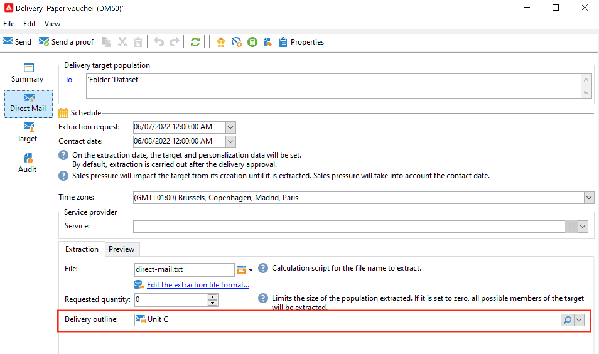

# Elementen en documenten beheren {#manage-assets-documents}

U kunt verschillende documenten aan een campagne koppelen: rapporten, foto&#39;s, webpagina&#39;s, diagrammen, enz. Deze documenten kunnen elke gewenste indeling hebben.

In een campagne kunt u ook andere objecten bekijken, zoals promotiecoupons, speciale aanbiedingen voor een bepaald merk of een bepaalde winkel, enzovoort. Wanneer deze elementen in een overzicht worden opgenomen, kunnen zij met een directe postlevering worden geassocieerd. [Meer informatie](#associating-and-structuring-resources-linked-via-a-delivery-outline).

>[!CAUTION]
>
>Deze functie is ontworpen voor kleine elementen en documenten.

<!--
>[!NOTE]
>
>If you are using Campaign Marketing Resource Management module, you can also manage a library of marketing resources that are available for several users for collaborative work. [Learn more](../../mrm/using/managing-marketing-resources.md).
-->

## Documenten toevoegen {#add-documents}

Documenten kunnen worden gekoppeld op campagneniveau (contextuele documenten) of op programmaniveau (algemene documenten).

Voor een campagne bevat het tabblad **[!UICONTROL Documents]** :

* De lijst met alle documenten die vereist zijn voor de inhoud (sjabloon, afbeeldingen, enz.) die lokaal kunnen worden gedownload door Adobe Campaign-operatoren met de juiste rechten,
* Documenten die informatie voor de router bevatten, als om het even welk.

De documenten zijn gekoppeld aan het programma of de campagne via het tabblad **[!UICONTROL Edit > Documents]** .

U kunt ook een document aan een campagne toevoegen vanuit de toegewezen koppeling in het dashboard.

Klik op het pictogram **[!UICONTROL Detail...]** om de inhoud van een bestand weer te geven en informatie toe te voegen:

In het dashboard worden documenten die bij de campagne horen gegroepeerd in de sectie **[!UICONTROL Document(s)]** , zoals in het volgende voorbeeld:

U kunt ze ook vanuit deze weergave bewerken en wijzigen.

## Leveringscontouren gebruiken {#delivery-outlines}

Een overzicht van de levering is een gestructureerde reeks elementen (documenten, winkels, reclamebonnen, enz.) die door het bedrijf en voor een bepaalde campagne zijn gemaakt. Het wordt gebruikt in de context van direct-mailleveringen.

Deze elementen worden gegroepeerd in leveringsoverzichten, en elk leveringsoverzicht zal met een levering worden geassocieerd; het zal in het winningsdossier worden van verwijzingen voorzien dat naar de **wordt verzonden dienstverlener** om aan de levering in bijlage te zijn. U kunt bijvoorbeeld een leveringsoverzicht maken dat verwijst naar een eenheid en de marketingbrochures die worden gebruikt.

Voor een campagne kunt u met de leveringscontouren externe elementen structureren die aan de levering moeten worden gekoppeld volgens bepaalde criteria: verwante eenheid, promotieaanbieding, uitnodiging voor een lokale gebeurtenis, enz.

>[!CAUTION]
>
>De contouren van de levering zijn beperkt tot direct-mailcampagnes.

### Een leveringsoverzicht maken {#create-an-outline}

Als u een overzicht van de levering wilt maken, klikt u op het subtabblad **[!UICONTROL Delivery outlines]** op het tabblad **[!UICONTROL Edit > Documents]** van de desbetreffende campagne.

>[!NOTE]
>
>Als dit tabblad niet wordt weergegeven, is deze functie niet beschikbaar voor deze campagne of is de directe verzending niet ingeschakeld in uw exemplaar. Verwijs naar de [ configuratie van het campagnemalplaatje ](marketing-campaign-templates.md#campaign-templates) of naar uw vergunningsovereenkomst.

Klik vervolgens op **[!UICONTROL Add a delivery outline]** en maak een hiërarchie van contouren voor de campagne:

1. Klik met de rechtermuisknop op de basis van de structuur en selecteer **[!UICONTROL New > Delivery outlines]** .
1. Klik met de rechtermuisknop op de omtrek die u zojuist hebt gemaakt en selecteer **[!UICONTROL New > Item]** of **[!UICONTROL New > Personalization fields]** .

Een overzicht kan punten, verpersoonlijkingsgebieden, en aanbiedingen bevatten:

* Items kunnen bijvoorbeeld fysieke documenten zijn waarnaar hier wordt verwezen en die hier worden beschreven en die aan de levering worden gekoppeld.
* Met velden voor personalisatie kunt u personalisatie-elementen maken die te maken hebben met leveringen in plaats van met ontvangers. Het is dus mogelijk waarden te creëren die in leveringen voor een specifiek doel moeten worden gebruikt (welkomstaanbod, korting, enz.) Ze worden gemaakt in Adobe Campaign en geïmporteerd in de omtrek via de koppeling **[!UICONTROL Import personalization fields...]** .

  

  U kunt ze ook rechtstreeks in de omtrek maken door op het pictogram **[!UICONTROL Add]** rechts van de lijstzone te klikken.

  

### Een omtrek selecteren {#select-an-outline}

Voor elke levering, kunt u het overzicht selecteren om van de sectie te associëren die voor het extractieoverzicht wordt gereserveerd, zoals in het volgende voorbeeld:

De geselecteerde omtrek wordt vervolgens weergegeven in de onderste sectie van het venster. U kunt de afbeelding bewerken met het pictogram rechts van het veld of wijzigen met de vervolgkeuzelijst:

Het tabblad **[!UICONTROL Summary]** van de levering geeft ook deze informatie weer:

### Extractie-resultaat {#extraction-result}

In het uitgepakt en aan de dienstverlener verzonden dossier worden de naam van het overzicht en, in voorkomend geval, zijn kenmerken (kosten, beschrijving, enz.) toegevoegd aan de inhoud volgens de informatie in het uitvoermalplaatje verbonden aan de dienstverlener.

In het volgende voorbeeld worden het label, de geschatte kosten en de beschrijving van de omtrek die aan de levering is gekoppeld, toegevoegd aan het extractiebestand.

Het exportmodel moet worden gekoppeld aan de dienstverlener die voor de betrokken levering is geselecteerd. Zie [ deze sectie ](providers-stocks-and-budgets.md#creating-service-providers-and-their-cost-structures).
