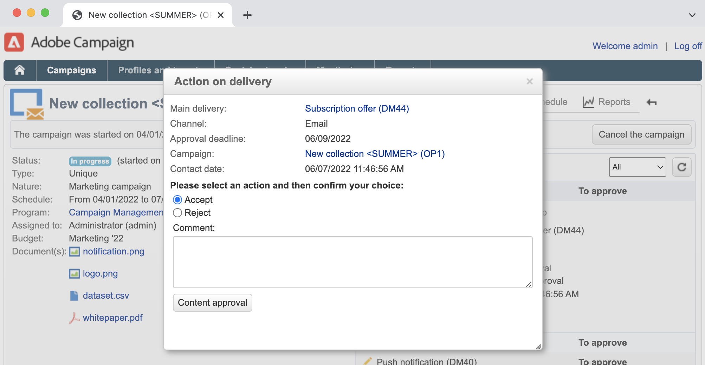

# Programma&#39;s en campagnes maken{#create-programs-and-campaigns}

De componenten van de organisatiestructuur van de campagne worden gevonden in het **[!UICONTROL Campaigns]** lusje: hier kunt u een overzicht van de marketingprogramma&#39;s en campagnes, en hun bijbehorende elementen zien.

Een marketingprogramma bestaat uit campagnes die bestaan uit leveringen, middelen, enz. Alle informatie over leveringen, begrotingen, revisoren en bijbehorende documenten wordt in de campagne gegroepeerd.

 [&#x200B; ontdekt programma&#39;s en campagnes in video &#x200B;](#video)

## Werken met programma&#39;s en plannen{#work-with-plan-and-program}

### De hiërarchie van plannen en programma&#39;s maken {#create-plan-and-program}

Elke campagne behoort tot een programma dat deel uitmaakt van een plan. Alle plannen, programma&#39;s en campagnes zijn beschikbaar via het **[!UICONTROL Campaign calendar]** menu in **Campagnes** tabel.

Voordat u begint met het maken van uw campagnes en leveringen, configureert u de maphiërarchie voor marketingplannen en -programma&#39;s.

1. Klik het **pictogram van de Ontdekkingsreiziger** op de homepage.
1. Klik met de rechtermuisknop op de map waarin u het abonnement wilt maken.
1. Selecteer **toevoegen nieuwe omslag > het Beheer van de Campagne > Plan**.

   

1. Wijzig de naam van het abonnement.
1. Klik met de rechtermuisknop op het zojuist gemaakte plan en selecteer **Eigenschappen...**.
1. In het **Algemene** lusje, wijzig de **Interne naam** om duplicaten tijdens pakketuitvoer te vermijden.

   

1. Klik **sparen**.
1. Klik met de rechtermuisknop op het zojuist gemaakte plan en selecteer **Een nieuwe map &#39;Program&#39; maken** .

   

1. Herhaal bovenstaande stappen om de naam van de nieuwe programmamap en de interne naam ervan te wijzigen.

### Een programma configureren {#edit-a-program}

Wanneer u een programma bewerkt, gebruikt u de onderstaande tabbladen om door het programma te bladeren en het te configureren.

* Het **lusje van het Programma** toont de kalender van programma&#39;s voor een maand, een week of een dag afhankelijk van welk lusje u in de kalenderkopbal klikt. U kunt een campagne, programma of een taak van deze pagina tot stand brengen. [Meer informatie](#campaign-calendar)

* Het **geeft** lusje uit laat u het programma personaliseren: naam, begin en einddata, begroting, verbonden documenten, enz.

  

## Werken met campagnes{#work-with-campaigns}

### Een campagne maken {#create-a-campaign}

U kunt een campagne maken via de lijst met campagnes. Selecteer het menu **[!UICONTROL Campaigns]** in het **[!UICONTROL Campaigns]** dashboard en klik op **[!UICONTROL Create]** om deze weergave weer te geven.

In het veld **[!UICONTROL Program]** kunt u het programma selecteren waaraan de campagne wordt gekoppeld. Deze informatie is verplicht.

Campagnes kunnen ook worden gemaakt via de campagne- of programmalender. [Meer informatie](#campaign-calendar)

Selecteer in het venster Campagne maken de sjabloon voor de campagne en voeg een naam en een beschrijving van de campagne toe. U kunt ook de begin- en einddatum van de campagne opgeven.

Klik op **[!UICONTROL OK]** om de campagne te maken. Het wordt toegevoegd aan het programma, en aan de lijst van campagnes.

U kunt dan de campagne uitgeven u enkel hebt gecreeerd en zijn parameters bepalen. Om deze campagne te openen en te vormen, kunt u:

1. Blader door de campagnecalender en selecteer de campagne die u wilt weergeven, en klik vervolgens op de koppeling **[!UICONTROL Open]** .
1. Blader door het tabblad **[!UICONTROL Schedule]** van het programma, selecteer de campagne en open deze.
1. Blader in de lijst met campagnes en klik op de naam van de campagne die u wilt bewerken.

Al deze acties brengen u naar het campagnedashboard.

Heb toegang tot de volgende secties leren hoe te om uw campagne te vormen:

* [Leveringen toevoegen](marketing-campaign-deliveries.md)
* [Elementen en documenten beheren](marketing-campaign-assets.md)
* [Het doelpubliek samenstellen](marketing-campaign-target.md)
* [Goedkeuringsprocedure instellen](marketing-campaign-approval.md)
* [Bestanden en budgetten beheren](providers-stocks-and-budgets.md)

### Campagne-instellingen bewerken {#campaign-settings}

Campagnes worden gemaakt via campagnemalplaatjes. U kunt herbruikbare sjablonen configureren waarvoor sommige opties zijn geselecteerd en andere instellingen al zijn opgeslagen.

Voor elke campagne zijn de volgende mogelijkheden beschikbaar:

* Referentiedocumenten en -bronnen: u kunt documenten aan de campagne koppelen (korte beschrijving, rapport, afbeeldingen, enz.). Alle documentindelingen worden ondersteund. [Meer informatie](marketing-campaign-deliveries.md#manage-associated-documents).
* Definieer de kosten: voor elke campagne kunt u met Adobe Campaign de kosten en kostenberekeningsstructuren definiëren die u kunt gebruiken bij het maken van de marketingcampagne. Bijvoorbeeld: afdrukkosten, gebruik van een extern bureau, huur van ruimten enz. [Meer informatie](providers-stocks-and-budgets.md#defining-cost-categories).
* Definieer doelstellingen: u kunt kwantificeerbare doelstellingen voor een campagne definiëren, zoals het aantal abonnees, het bedrijfsvolume, enz. Deze informatie wordt later gebruikt in campagnerapporten.
* Beheer zaadadressen en controlegroepen. [Meer informatie](marketing-campaign-deliveries.md#defining-a-control-group).
* Goedkeuringen beheren: u kunt de behandelingen selecteren die u wilt goedkeuren en, indien nodig, de revisieoperatoren of groepen operatoren selecteren. [Meer informatie](marketing-campaign-approval.md#checking-and-approving-deliveries).

>[!NOTE]
>
>Als u de instellingen van de campagne wilt openen en bijwerken, bladert u naar de koppeling **[!UICONTROL Advanced campaign parameters...]** op het tabblad **[!UICONTROL Edit]** .

### Een campagne bewaken {#monitor-a-campaign}

Voor elke campagne worden banen, middelen en leveringen gecentraliseerd in een dashboard. Met deze interface kunt u marketingacties beheren en ordenen.

Met Adobe Campaign kunt u samenwerkingsprocessen opzetten voor het maken en goedkeuren van de verschillende stappen van uw campagnes: goedkeuring van het budget, het doel, de inhoud, enzovoort. Dit orkest wordt gedetailleerd in [&#x200B; deze sectie &#x200B;](marketing-campaign-approval.md).

>[!NOTE]
>
>De componenten beschikbaar in een campagne hangen van zijn malplaatje af. De het malplaatjeconfiguratie van de campagne wordt voorgesteld in [&#x200B; deze sectie &#x200B;](marketing-campaign-templates.md#campaign-templates).

Zodra de campagne is voltooid, gebruikt u de koppeling **[!UICONTROL Reports]** om de campagnerapporten te openen.

## Campagnekalender {#campaign-calendar}

De campagnemalender bevat alle programma&#39;s, plannen, campagnes en leveringen.

Als u een abonnement, programma, campagne of levering wilt bewerken, bladert u naar de naam ervan in de kalender en gebruikt u de koppeling **[!UICONTROL Open]** . Het wordt dan getoond in een nieuw lusje, zoals hieronder getoond:

U kunt de informatie filteren die in de campagnemalender wordt weergegeven. Klik hiertoe op de koppeling **[!UICONTROL Filter]** en selecteer de filtercriteria.

>[!NOTE]
>
>Wanneer u filtert op een datum, worden alle campagnes met een begindatum die later is dan de opgegeven datum en/of met een einddatum die ouder is dan de opgegeven datum, weergegeven. Datums worden geselecteerd met de kalenders rechts van elk veld.

U kunt het veld **[!UICONTROL Search]** ook gebruiken om de weergegeven items te filteren.

Met de pictogrammen die aan elk item zijn gekoppeld, kunt u de status van het item weergeven: voltooid, bezig, bewerkt, enzovoort.

Als u de weer te geven campagnes wilt filteren, klikt u op de koppeling **[!UICONTROL Filter]** en selecteert u de status van de campagnes die u wilt weergeven.

Tijdens het bladeren door de kalender kunt u ook een programma of een campagne maken.

Wanneer u een campagne maakt via het tabblad **[!UICONTROL Schedule]** van een programma, wordt de campagne automatisch gekoppeld aan het betreffende programma. Het veld **[!UICONTROL Program]** is in dit geval verborgen.

## De webinterface gebruiken {#use-the-web-interface-}

U kunt de Adobe Campaign Client Console-schermen openen via een internetbrowser om alle campagnes en leveringen, alsmede rapporten en informatie over de profielen in uw database weer te geven. Met deze toegang kunt u geen records maken. Afhankelijk van de rechten van de operator kunt u de gegevens in de database bekijken en/of bewerken. U kunt bijvoorbeeld de inhoud van de campagne goedkeuren, een levering opnieuw starten of stoppen, enzovoort.

1. Meld u op de gebruikelijke manier aan via https://`<your instance>:<port>/view/home` .
1. Via de menu&#39;s hebt u toegang tot de overzichten.

   

Naast het navigeren over campagnes en het bekijken van hen, kunt u deze soorten taken uitvoeren:

* De activiteit van de monitor op een geval
* Deelnemen aan validatieprocessen, bijvoorbeeld een leveringsinhoud goedkeuren of afwijzen
* Andere snelle handelingen uitvoeren, bijvoorbeeld een werkstroom pauzeren
* Alle rapportfuncties openen
* Deelnemen aan forumdiscussies

In deze tabel worden de acties samengevat die u kunt uitvoeren op campagnes vanuit een browser:

| Pagina  | Actie |
| --- | --- |
| Lijst met campagnes, leveringen, aanbiedingen, enz. | Een lijstitem verwijderen |
| Campaign | Een campagne annuleren |
| Levering | Goedkeuren de leveringsinhoud en doel   voorleggen de leveringsinhoud   een levering   pauzeren en een levering tegenhouden |
| Webtoepassing | Creeer een Webtoepassing   geeft de toepassingsinhoud en eigenschappen   uit sparen de toepassingsinhoud als malplaatje   publiceren de toepassing |
| Voorstel | Goedkeur de aanbiedingsinhoud en de geschiktheid   onbruikbaar maken een online aanbieding |
| Taak | Voltooi een taak   annuleert een taak |
| Marketingbronnen | Goedkeur een middel   Slot en ontgrendel een middel |
| Campagne | Verzend een pakket voor goedkeuring   goedkeuren of verwerpen een pakket   annuleert een pakket |
| Campagnevolgorde | Creeer een orde   goedkeuren of verwerpen een orde |
| Voorraad | Een voorraadlijn verwijderen |
| Aanbiedingssimulatie | Een simulatie starten en stoppen |
| Doelworkflow | Een workflow starten, pauzeren en stoppen |
| Rapport | De huidige gegevens opslaan in de rapportgeschiedenis |
| Forum | Voeg een bespreking   Antwoord aan een bericht in een bespreking   toe volgt een bespreking en unsubscript van het |

### Goedkeuringen beheren

Goedkeuringen van een doel of leveringsinhoud kunnen via webtoegang worden uitgevoerd.

U kunt ook de koppeling gebruiken die zich in de meldingen bevindt. Raadpleeg [deze sectie](marketing-campaign-approval.md#checking-and-approving-deliveries) voor meer informatie.

## Video over zelfstudie {#video}

In deze video ziet u hoe u een marketingplan, programma&#39;s en campagnes kunt maken.

>[!VIDEO](https://video.tv.adobe.com/v/3449907?quality=12&captions=dut)
