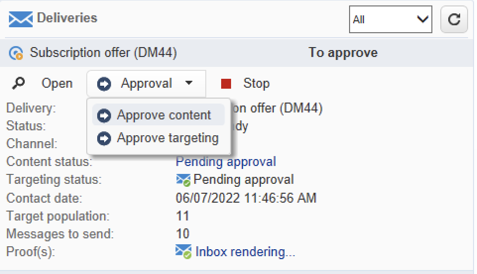

# Programma&#39;s en campagnes maken{#create-programs-and-campaigns}

De componenten van de campagne orkest worden gevonden in **[!UICONTROL Campaigns]** tab: hier ziet u een overzicht van de marketingprogramma &#39; s en - campagnes en de bijbehorende elementen .

Een marketingprogramma bestaat uit campagnes die bestaan uit leveringen, middelen, enz. Alle informatie over leveringen, begrotingen, revisoren en bijbehorende documenten wordt in de campagne gegroepeerd.

 [Ontdek programma&#39;s en campagnes in video](#video)

## Werken met programma&#39;s en plannen{#work-with-plan-and-program}

### De hiërarchie van plannen en programma&#39;s maken {#create-plan-and-program}

Elke campagne behoort tot een programma dat deel uitmaakt van een plan. Alle plannen, programma&#39;s en campagnes zijn beschikbaar via de **[!UICONTROL Campaign calendar]** in het menu **Campagnes** tab.

Voordat u begint met het maken van uw campagnes en leveringen, configureert u de maphiërarchie voor marketingplannen en -programma&#39;s.

1. Klik op de knop **Verkenner** op de startpagina.
1. Klik met de rechtermuisknop op de map waarin u het abonnement wilt maken.
1. Selecteren **Nieuwe map toevoegen > Campaign Management > Plan**.

   

1. Wijzig de naam van het abonnement.
1. Klik met de rechtermuisknop op het nieuwe abonnement en selecteer **Eigenschappen...**.
1. In de **Algemeen** tabblad, wijzigt u de **Interne naam** om duplicaten tijdens de pakketexport te voorkomen.

   

1. Klikken **Opslaan**.
1. Klik met de rechtermuisknop op het nieuwe abonnement en selecteer **Een nieuwe map &#39;Program&#39; maken**.

   

1. Herhaal bovenstaande stappen om de naam van de nieuwe programmamap en de interne naam ervan te wijzigen.

### Een programma configureren {#edit-a-program}

Wanneer u een programma bewerkt, gebruikt u de onderstaande tabbladen om door het programma te bladeren en het te configureren.

* De **Schema** wordt de agenda van de programma&#39;s weergegeven voor een maand, week of dag, afhankelijk van het tabblad waarop u in de kalenderkoptekst klikt. U kunt een campagne, programma of een taak van deze pagina tot stand brengen. [Meer informatie](#campaign-calendar)

* De **Bewerken** kunt u het programma aanpassen: naam, begin- en einddatum, begroting, bijbehorende documenten, enz.

   

## Werken met campagnes{#work-with-campaigns}

### Een campagne maken {#create-a-campaign}

U kunt een campagne maken via de lijst met campagnes. Selecteer de optie **[!UICONTROL Campaigns]** in het menu **[!UICONTROL Campaigns]** dashboard, en klik **[!UICONTROL Create]**.

De **[!UICONTROL Program]** in dit veld kunt u het programma selecteren waaraan de campagne wordt gekoppeld. Deze informatie is verplicht.

Campagnes kunnen ook worden gemaakt via de campagne- of programmalender. [Meer informatie](#campaign-calendar)

Selecteer in het venster Campagne maken de sjabloon voor de campagne en voeg een naam en een beschrijving van de campagne toe. U kunt ook de begin- en einddatum van de campagne opgeven.

Klikken **[!UICONTROL OK]** om de campagne te maken. Het wordt toegevoegd aan het programma, en aan de lijst van campagnes.

U kunt dan de campagne uitgeven u enkel hebt gecreeerd en zijn parameters bepalen. Om deze campagne te openen en te vormen, kan ypu:

1. Blader door de campagnecalender en selecteer de campagne die u wilt weergeven, en klik vervolgens op de knop **[!UICONTROL Open]** koppeling.
1. Bladeren in het dialoogvenster **[!UICONTROL Schedule]** selecteert u de campagne en opent u deze.
1. Blader in de lijst met campagnes en klik op de naam van de campagne die u wilt bewerken.

Al deze acties brengen u naar het campagnedashboard.

Heb toegang tot de volgende secties leren hoe te om uw campagne te vormen:

* [Leveringen toevoegen](marketing-campaign-deliveries.md)
* [Elementen en documenten beheren](marketing-campaign-assets.md)
* [Het doelpubliek samenstellen](marketing-campaign-target.md)
* [Goedkeuringsprocedure instellen](marketing-campaign-approval.md)
* [Bestanden en budgetten beheren](providers--stocks-and-budgets.md)

### Campagne-instellingen bewerken {#campaign-settings}

Campagnes worden gemaakt via campagnemalplaatjes. U kunt herbruikbare sjablonen configureren waarvoor sommige opties zijn geselecteerd en andere instellingen al zijn opgeslagen.

Voor elke campagne zijn de volgende mogelijkheden beschikbaar:

* Referentiedocumenten en -bronnen: u kunt documenten aan de campagne associëren (kort, rapport, beelden, enz.). Alle documentindelingen worden ondersteund. [Meer informatie](marketing-campaign-deliveries.md#manage-associated-documents).
* Definieer kosten: voor elke campagne kunt u in Adobe Campaign de kostenposten en kostenberekeningsstructuren definiëren die kunnen worden gebruikt bij het maken van de marketingcampagne. Bijvoorbeeld: afdrukkosten, gebruik van een extern bureau, huur van ruimten enz. [Meer informatie](providers--stocks-and-budgets.md#defining-cost-categories).
* Doelstellingen definiëren: u kunt kwantificeerbare doelstellingen voor een campagne bepalen, bijvoorbeeld aantal abonnees, bedrijfsvolume, enz. Deze informatie wordt later gebruikt in campagnerapporten.
* Beheer zaadadressen en controlegroepen. [Meer informatie](marketing-campaign-deliveries.md#defining-a-control-group)).
* Goedkeuringen beheren: u kunt kiezen welke behandelingen moeten worden goedgekeurd en, indien nodig, de revisieoperatoren of groepen operatoren selecteren. [Meer informatie](marketing-campaign-approval.md#checking-and-approving-deliveries).

>[!NOTE]
>
>Blader naar de **[!UICONTROL Advanced campaign parameters...]** in de **[!UICONTROL Edit]** tab.

### Een campagne bewaken {#monitor-a-campaign}

Voor elke campagne worden banen, middelen en leveringen gecentraliseerd in een dashboard. Met deze interface kunt u marketingacties beheren en ordenen.

Met Adobe Campaign kunt u samenwerkingsprocessen instellen voor het maken en goedkeuren van de verschillende stappen van uw campagnes: goedkeuring van de begroting, het doel, de inhoud, enz. Deze orkest wordt in detail beschreven in [deze sectie](marketing-campaign-approval.md).

>[!NOTE]
>
>De componenten beschikbaar in een campagne hangen van zijn malplaatje af. De sjabloonconfiguratie van de campagne wordt weergegeven in [deze sectie](marketing-campaign-templates.md#campaign-templates).

Wanneer de campagne is voltooid, kunt u de knop **[!UICONTROL Reports]** link naar de campagnerapporten .

## Campagnekalender {#campaign-calendar}

De campagnemalender bevat alle programma&#39;s, plannen, campagnes en leveringen.

Als u een abonnement, programma, campagne of levering wilt bewerken, bladert u naar de naam van het abonnement in de kalender en gebruikt u de opdracht **[!UICONTROL Open]** koppeling. Het wordt dan getoond in een nieuw lusje, zoals hieronder getoond:

U kunt de informatie filteren die in de campagnemalender wordt weergegeven. Om dit te doen, klik **[!UICONTROL Filter]** en selecteer de filtercriteria.

>[!NOTE]
>
>Wanneer u filtert op een datum, worden alle campagnes met een begindatum die later is dan de opgegeven datum en/of met een einddatum die ouder is dan de opgegeven datum, weergegeven. Datums worden geselecteerd met de kalenders rechts van elk veld.

U kunt ook de opdracht **[!UICONTROL Search]** veld om de weergegeven items te filteren.

Met de pictogrammen die aan elk item zijn gekoppeld, kunt u de status ervan bekijken: voltooid, bezig, bewerkt, enz.

Als u de weer te geven campagnes wilt filteren, klikt u op de knop **[!UICONTROL Filter]** en selecteer de status van de campagnes die u wilt weergeven.

Tijdens het bladeren door de kalender kunt u ook een programma of een campagne maken.

Wanneer u een campagne maakt via de **[!UICONTROL Schedule]** van een programma wordt de campagne automatisch aan het betrokken programma gekoppeld. De **[!UICONTROL Program]** veld is in dit geval verborgen.

## De webinterface gebruiken {#use-the-web-interface-}

U kunt de Adobe Campaign-consoleschermen openen via een internetbrowser om alle campagnes en leveringen, alsmede rapporten en informatie over de profielen in uw database weer te geven. Met deze toegang kunt u geen records maken. Afhankelijk van de rechten van de operator kunt u de gegevens in de database bekijken en/of bewerken. U kunt bijvoorbeeld de inhoud van de campagne goedkeuren, een levering opnieuw starten of stoppen, enzovoort.

1. Meld u op de gebruikelijke manier aan via https://`<your instance>:<port>/view/home`.
1. Via de menu&#39;s hebt u toegang tot de overzichten.

   

Naast het navigeren over campagnes en het bekijken van hen, kunt u deze soorten taken uitvoeren:

* De activiteit van de monitor op een geval
* Deelnemen aan validatieprocessen, bijvoorbeeld een leveringsinhoud goedkeuren of afwijzen
* Andere snelle handelingen uitvoeren, bijvoorbeeld een werkstroom onderbreken
* Alle rapportfuncties openen
* Deelnemen aan forumdiscussies

In deze tabel worden de acties samengevat die u kunt uitvoeren op campagnes vanuit een browser:

| Pagina  | Actie |
| --- | --- |
| Lijst met campagnes, leveringen, aanbiedingen, enz. | Een lijstitem verwijderen |
| Campaign | Een campagne annuleren |
| Levering | Inhoud en doel van levering goedkeuren De leveringsinhoud verzenden Levering bevestigen Een levering onderbreken en stoppen |
| Webtoepassing | Een webtoepassing maken De inhoud en eigenschappen van de toepassing bewerken De toepassingsinhoud opslaan als een sjabloon De toepassing publiceren |
| Voorstel | Inhoud en geschiktheid van aanbieding goedkeuren Een online aanbieding uitschakelen |
| Taak | Een taak voltooien Een taak annuleren |
| Marketingbronnen | Een resource goedkeuren Een bron vergrendelen en ontgrendelen |
| Campagne | Een pakket ter goedkeuring indienen Een pakket goedkeuren of afwijzen Een pakket annuleren |
| Campagnevolgorde | Een bestelling maken Een bestelling accepteren of afwijzen |
| Voorraad | Een voorraadlijn verwijderen |
| Aanbiedingssimulatie | Een simulatie starten en stoppen |
| Doelworkflow | Een workflow starten, pauzeren en stoppen |
| Rapporteren | De huidige gegevens opslaan in de rapportgeschiedenis |
| Forum | Een discussie toevoegen Reageren op een boodschap in een gesprek Een discussie volgen en het abonnement opzeggen |

### Goedkeuringen beheren

Goedkeuringen van een doel of leveringsinhoud kunnen via webtoegang worden uitgevoerd.

U kunt ook de koppeling gebruiken die zich in de meldingen bevindt. Raadpleeg [deze sectie](marketing-campaign-approval.md#checking-and-approving-deliveries) voor meer informatie.

## Video over zelfstudie {#video}

In deze video ziet u hoe u een marketingplan, programma&#39;s en campagnes kunt maken.

>[!VIDEO](https://video.tv.adobe.com/v/333810?quality=12)
