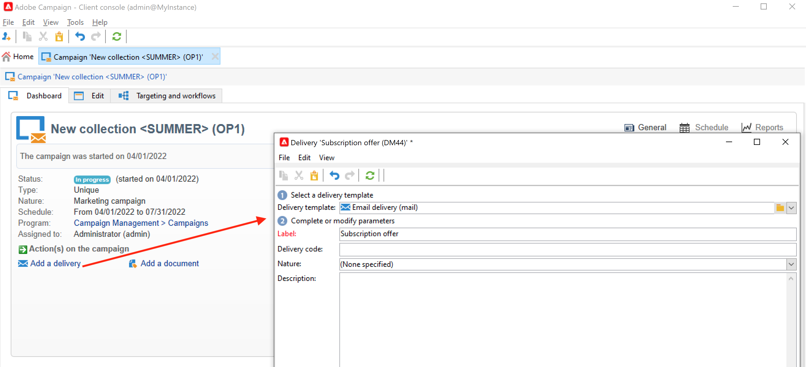
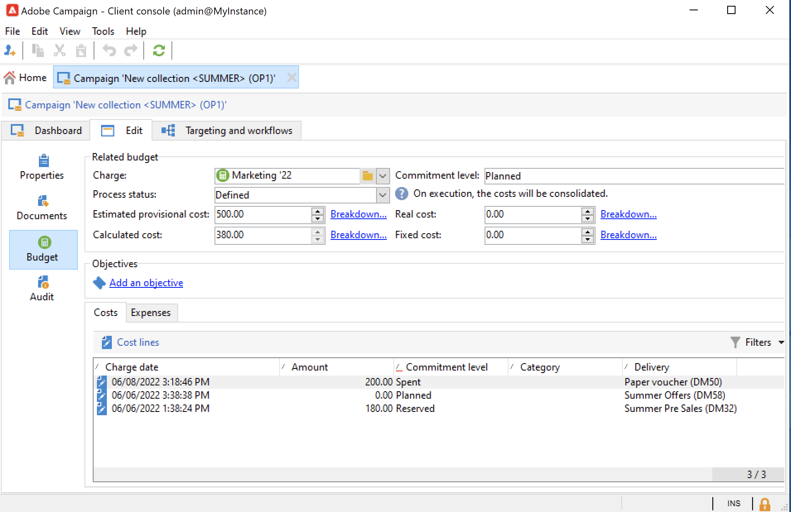

# Leveringen voor marketingcampagnes {#marketing-campaign-deliveries}

Orchestreer uw interkanaalleveringen in uw campagnes: stroomlijn uw communicatie met Adobe Campaign via persoonlijke e-mails, SMS, pushberichten en in-app berichten. U kunt rijke media zoals video&#39;s, emojis of GIFs gebruiken, en hen direct integreren.

Leveringen kunnen worden gemaakt via het campagnedashboard, een campagneworkflow of rechtstreeks via het overzicht van leveringen. Wanneer de leveringen worden gemaakt op basis van een campagne, worden ze gekoppeld aan deze campagne en geconsolideerd op campagnereniveau.

## Leveringen maken {#create-deliveries}

U kunt leveringen op twee manieren toevoegen aan uw marketingcampagnes:

* Via de koppeling **[!UICONTROL Add a delivery]** in het campagnedashboard.

  

  Nadat de levering is opgeslagen, wordt deze toegevoegd aan het campagnemdashboard.

* Via een campagneworkflow op het tabblad **[!UICONTROL Targeting and workflows]** door de levering toe te voegen.

  

  Nadat de workflow is gestart, wordt de levering toegevoegd aan het campagnemdashboard.

Leer hoe te opstelling en de stroom van de leveringsgoedkeuring [ in deze pagina ](marketing-campaign-approval.md) uit te voeren.

## Levering starten {#start-a-delivery}

Een levering kan worden verzonden zodra alle goedkeuringen zijn verleend. Het uitvoeringsproces van de levering is afhankelijk van het kanaal.

* Voor e-mail of mobiele kanaalleveringen, verwijs naar [ deze sectie ](#start-an-online-delivery)

* Voor directe postleveringen, verwijs naar [ deze sectie ](#start-an-offline-delivery)

### Een e-mail of mobiele levering starten {#start-an-online-delivery}

Zodra alle goedkeuringsaanvragen zijn ingewilligd, verandert de leveringsstatus in **[!UICONTROL Pending confirmation]** en kan deze worden gestart. Revisoren die de levering kunnen starten, krijgen een melding dat een levering klaar is om te worden gestart.

De informatie verschijnt ook op het campagnedashboard. Met de koppeling **[!UICONTROL Confirm delivery]** kunt u de levering starten.

Bevestiging van de levering is beperkt tot Beheerders, en tot de exploitant of groep van exploitanten uitdrukkelijk vermeld in de levering of campagneeigenschappen. Als geen exploitant wordt ontworpen, kunnen de Beheerders en de campagneeigenaar goedkeuren.

Nochtans, kunt u de campagneeigenaar ook toestaan om te bevestigen verzendt, zelfs als specifieke recensenten in de levering of campagneeigenschappen werden bepaald. Om dit, als Beheerder te doen, creeer **NmsCampaign_Activate_OwnerConfirmation** optie en plaats het aan **1**. De opties worden beheerd vanuit de map **[!UICONTROL Administration]** > **[!UICONTROL Platform]** > **[!UICONTROL Options]** van de Campagneverkenner.

### Een directe postbezorging starten {#start-an-offline-delivery}

Zodra alle goedkeuringen zijn verleend, verandert de leveringsstatus in **[!UICONTROL Pending extraction]**. De extractiedossiers worden gecreeerd via een specifiek [ technisch werkschema ](../workflow/technical-workflows.md) dat, in een standaardconfiguratie, automatisch begint wanneer een directe postlevering extractie in afwachting is. Wanneer een proces bezig is, wordt het getoond in het dashboard en kan via zijn verbinding worden uitgegeven.

Nadat de extractieworkflow is voltooid, moet het extractiebestand worden goedgekeurd (mits de goedkeuring van het extractiebestand is geselecteerd in de leveringsinstellingen). [Meer informatie](marketing-campaign-approval.md#approving-an-extraction-file).

Voer de onderstaande stappen uit om de inhoud te valideren en het bestand naar de provider te verzenden:

1. Zodra het extractiedossier wordt goedgekeurd, kunt u het bewijs van de e-mail van het routerbericht produceren. Dit e-mailbericht wordt samengesteld op basis van een leveringssjabloon. Het moet worden goedgekeurd.

   Deze stap is alleen beschikbaar als de optie **[!UICONTROL Enable the sending and validation of proofs (Direct mail)]** is ingeschakeld op het tabblad **[!UICONTROL Approvals]** van de geavanceerde campagneparameters.

   

1. Klik op de knop **[!UICONTROL Send a proof]** om de proefdrukken te maken.

   Het proefdrukdoel moet vooraf worden gedefinieerd.

   U kunt zo veel proefdrukken maken als nodig is. Deze zijn toegankelijk via de **[!UICONTROL Direct mail...]** -koppeling van de leveringsdetails.

1. De leveringsstatus verandert in **[!UICONTROL To submit]** . Klik op de knop **[!UICONTROL Submit proofs]** om het goedkeuringsproces te starten.

1. De leveringsstatus verandert in **[!UICONTROL Proof to validate]** en een knoop laat u goedkeuring goedkeuren of verwerpen.

   U kunt deze goedkeuring accepteren of afwijzen of terugkeren naar de extractiestap.

1. Zodra het bewijs wordt goedgekeurd, wordt het extractiedossier verzonden naar de router en de levering wordt gebeëindigd.

### Begroting en kostenberekening {#compute-costs-and-stocks}

De bestandsuitwinning start twee processen: budgetberekening en voorraadberekening. De begrotingsonderdelen worden bijgewerkt.

* Op het tabblad **[!UICONTROL Budget]** kunt u de budgetten voor de campagne beheren. Het totaal van de kostenvermeldingen wordt weergegeven in het veld **[!UICONTROL Calculated cost]** van het hoofdtabblad van de campagne en in het programma waartoe deze behoort. De bedragen zijn ook terug te vinden in de campagnebegroting.

  

  De echte kosten zullen uiteindelijk van informatie worden berekend die door de router wordt verstrekt. Alleen daadwerkelijk verzonden berichten worden gefactureerd.

* De voorraden worden gedefinieerd in het knooppunt **[!UICONTROL Administration > Campaign management > Stocks]** van de structuur.

  

  Kostenstructuren in het knooppunt **[!UICONTROL Administration > Campaign management > Service providers]** .

  

  De voorraadlijnen zijn zichtbaar in de voorraadsectie. Als u de oorspronkelijke voorraad wilt definiëren, opent u een voorraadlijn. De voorraad wordt telkens verlaagd wanneer een levering plaatsvindt. U kunt een waarschuwingsniveau en meldingen definiëren.

  >[!NOTE]
  >
  >Leer meer over begrotingen [ in deze sectie ](providers-stocks-and-budgets.md).
