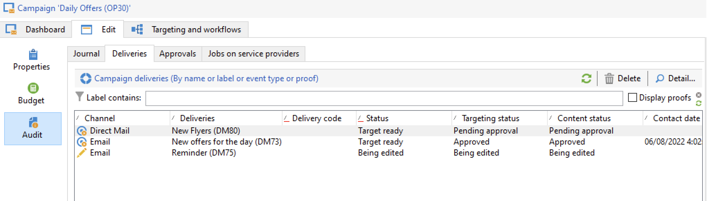

# Marketingscampagnes volgen {#monitor-marketing-campaigns}

## Een campagne bijhouden {#tracking-a-campaign}

Voor elke campagne **[!UICONTROL Tracking]** kunt u alle taken en de status ervan weergeven.

De volgende informatie is toegankelijk via dit subtabblad:

* De **[!UICONTROL Audit]** op het subtabblad wordt het activiteitenjournaal weergegeven. Het bevat de taken die op de campagne zijn uitgevoerd: het creëren of starten van een workflow, goedkeuring, extractie, voorraadbeheer, enz.

  

* De **[!UICONTROL Deliveries]** subtabblad bevat alle items van de campagne. U kunt ze vanuit deze weergave bewerken. Selecteer de levering en klik op de knop **[!UICONTROL Detail]** pictogram.

  

* De **[!UICONTROL Approvals]** subtab bevat alle goedkeuringsprocedure voor de campagne. U kunt details en opmerkingen controleren

* De workflows die worden gemaakt om berichten voor serviceproviders te genereren, worden weergegeven in het dialoogvenster **[!UICONTROL Jobs on service providers]** subtab. Klik op de knop **[!UICONTROL Detail]** om de geselecteerde workflow weer te geven.

## Leveringen bijhouden {#delivery-tracking}

De lijst met leveringen is beschikbaar via de **[!UICONTROL Deliveries]** koppeling van het knooppunt Campagne.

Voor elke levering hebt u toegang tot de belangrijkste indicatoren: status, aantal beoogde ontvangers, gekoppelde campagnes, enzovoort.

Als u de status van een levering wilt controleren, bewerkt u deze en bekijkt u het dashboard en de tabbladen.

<!--
>[!NOTE]
>
>Information concerning delivery details is available in [this section](../../delivery/using/about-message-tracking.md) section.
-->

## De uitvoering volgen {#execution-tracking}

U kunt de status van de leveringen controleren door op de knop **[!UICONTROL Deliveries]**, die toegankelijk is via de homepage van Adobe Campaign.

Details over processen die in een campagne worden uitgevoerd, worden verzameld in de **[!UICONTROL Edit > Audit]** tabblad van de campagne. U kunt de lijst met leveringen weergeven in de campagne. [Meer informatie](#tracking-a-campaign).
