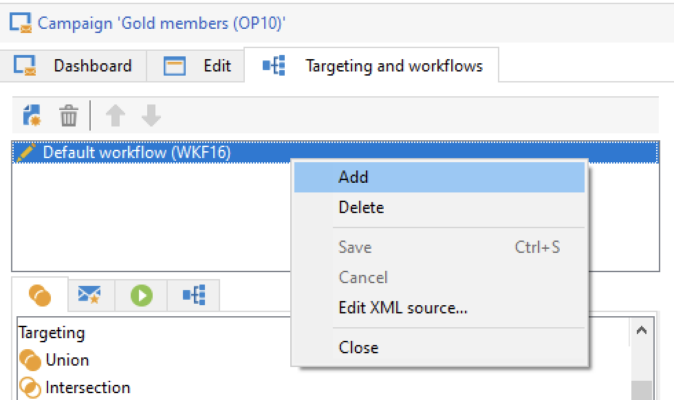

# De doelgroep van uw campagnes selecteren {#marketing-campaign-deliveries}

In een marketingcampagne kunt u voor elke levering het volgende definiëren:

* Het doelpubliek. U kunt berichten verzenden naar een [lijst van begunstigden](#send-to-a-group) of een [publiek in een workflow](#build-the-main-target-in-a-workflow)
* Een controlegroep. U kunt [een controlegroep toevoegen](#add-a-control-group) om ontvangersgedrag na berichtlevering te controleren
* Zaadadressen - Meer informatie in [deze sectie](../../v8/audiences/test-profiles.md).—>

Sommige van deze gegevens kunnen worden overgeërfd van de [campagnemalsjabloon](marketing-campaign-templates.md#campaign-templates).

<!--
To build the delivery target, you can define filtering criteria for the recipients in the database. This recipient selection mode is presented in [this section](../../delivery/using/steps-defining-the-target-population.md).
-->

## Naar een groep verzenden{#send-to-a-group}

U kunt een populatie in een lijst importeren en deze lijst vervolgens als doel instellen in leveringen. Volg de onderstaande stappen om dit te doen:

1. Bewerk de levering en klik op de knop **[!UICONTROL To]** koppeling om de doelgroep te veranderen.
1. In de **[!UICONTROL Main target]** selecteert u de **[!UICONTROL Defined via the database]** en klik op **[!UICONTROL Add]** om ontvangers te selecteren.

   

1. Kies **[!UICONTROL A list of recipients]**.

   

1. Klikken **[!UICONTROL Next]** om de lijst te selecteren.

   

   U kunt het doel verfijnen door nieuwe filtercriteria toe te voegen.

1. Klikken **[!UICONTROL Finish]** wanneer alle criteria zijn gedefinieerd , en slaat u het hoofddoel op .

## Het publiek samenstellen in een campagneworkflow {#build-the-main-target-in-a-workflow}

Het hoofddoel van een levering kan ook in de campagnewerkstroom worden bepaald: in deze grafische omgeving kunt u een doel maken met behulp van query&#39;s, tests en operatoren: verenigen, dedupliceren, delen, enz.

>[!IMPORTANT]
>
>U mag niet meer dan 28 workflows toevoegen aan een campagne. Buiten deze limiet zijn extra workflows niet zichtbaar in de interface en kunnen fouten genereren.

### De workflow maken {#create-a-targeting-workflow}

Het richten kan door een combinatie filtervoorwaarden in een grafische opeenvolging in een werkschema worden tot stand gebracht. U kunt populaties en subpopulaties maken die op basis van uw vereisten worden aangepast. Klik op de knop **[!UICONTROL Targeting and workflows]** in het campagnedashboard.

De doelpopulatie wordt geëxtraheerd uit de Adobe Campaign-database via een of meer query&#39;s die in een workflow zijn geplaatst. Leer hoe u een query maakt in [deze sectie](../workflow/query.md).

U kunt query&#39;s starten en populaties delen via vakken zoals Union, Intersection, Sharing, Exclusion enzovoort.

Selecteer de objecten in de lijsten links van de werkruimte en koppel ze om het doel samen te stellen.

In het diagram, verbind omhoog het richten en het plannen van vragen die voor doelbouw in het diagram worden vereist. U kunt het richten uitvoeren terwijl de bouw bezig is om de bevolking te controleren die uit het gegevensbestand wordt gehaald.

>[!NOTE]
>
>De voorbeelden en de procedure voor het bepalen van vragen worden gedetailleerd in [deze sectie](../workflow/query.md).

Het linkergedeelte van de editor bevat een bibliotheek met grafische objecten die activiteiten vertegenwoordigen. Het eerste lusje bevat de het richten activiteiten, en het tweede lusje bevat de stroom-controle activiteiten, die af en toe worden gebruikt om het richten activiteiten te coördineren.

De functies voor het uitvoeren en opmaken van werkstromen voor het opgeven van doelen zijn toegankelijk via de werkbalk van de diagrameditor.

>[!NOTE]
>
>De activiteiten die beschikbaar zijn om het diagram te bouwen en alle weergave- en lay-outfuncties zijn in detail beschreven in [deze sectie](../workflow/about-workflows.md).

U kunt verschillende doelworkflows voor één campagne maken. Een workflow toevoegen:

1. Ga naar het gedeelte linksboven van de zone waar de workflow wordt gemaakt, klik met de rechtermuisknop en selecteer **[!UICONTROL Add]**. U kunt ook de opdracht **[!UICONTROL New]** boven deze zone.

   

1. Selecteer **[!UICONTROL New workflow]** sjabloon en noem deze workflow.
1. Klikken **[!UICONTROL OK]** om de creatie van het werkschema te bevestigen, en dan het diagram voor deze werkschema tot stand te brengen.

### De workflow uitvoeren {#execute-a-workflow}

Doelworkflows kunnen handmatig worden gestart via de **[!UICONTROL Start]** op de werkbalk, op voorwaarde dat u de juiste rechten hebt.

Het richten kan voor automatische uitvoering volgens een programma (planner) of een gebeurtenis (extern signaal, dossierinvoer, enz.) worden geprogrammeerd.

De acties met betrekking tot het uitvoeren van de doelworkflow (starten, stoppen, pauzeren, enz.) zijn **asynchroon** processen: de opdracht wordt opgeslagen en wordt van kracht zodra de server beschikbaar is om deze toe te passen.

Met de werkbalkpictogrammen kunt u actie ondernemen met betrekking tot de uitvoering van de doelworkflow.

* Starten of opnieuw starten

   * De **[!UICONTROL Start]** kunt u de doelworkflow starten. Wanneer u op dit pictogram klikt, worden alle activiteiten zonder een invoerovergang geactiveerd (behalve sprongen met eindpunten).

     

     De server houdt rekening met het verzoek, zoals aangetoond door zijn status: **[!UICONTROL Start as soon as possible]**.

   * U kunt de doelworkflow opnieuw starten via het juiste werkbalkpictogram. Deze opdracht is handig als de opdracht **[!UICONTROL Start]** pictogram is niet beschikbaar, bijvoorbeeld wanneer het activeren van werkstroom wordt uitgevoerd. Klik in dit geval op de knop **[!UICONTROL Restart]** om te anticiperen op het opnieuw opstarten. De server houdt rekening met het verzoek, aangezien zijn status toont: **[!UICONTROL Restart requested]**.

* Stoppen of pauzeren

   * Met de werkbalkpictogrammen kunt u een actieve doelworkflow stoppen of pauzeren.

     Wanneer u op **[!UICONTROL Pause]**, lopende bewerkingen **[!UICONTROL are not]** gepauzeerd, maar er wordt geen andere activiteit gestart tot de volgende herstart.

     

     De server houdt rekening met het bevel, aangezien zijn status toont: **[!UICONTROL Pause requested]**.

     U kunt een doelworkflow ook automatisch pauzeren wanneer de uitvoering een bepaalde activiteit bereikt. Om dit te doen, klik de activiteit met de rechtermuisknop aan waarvan het richten werkschema moet worden gepauzeerd, en selecteer **[!UICONTROL Enable but do not execute]**.

     

     Deze configuratie wordt getoond door een speciaal pictogram.

     

     >[!NOTE]
     >
     >Deze optie is handig tijdens het ontwerpen en testen van campagnes die u op geavanceerde wijze wilt richten.

     Klikken **[!UICONTROL Start]** om de uitvoering te hervatten.

   * Klik op de knop **[!UICONTROL Stop]** pictogram om de uitvoering in uitvoering te stoppen.

     

     De server houdt rekening met het bevel, aangezien zijn status toont: **[!UICONTROL Stop requested]**.

  U kunt een doelworkflow ook automatisch stoppen wanneer de uitvoering een activiteit bereikt. Om dit te doen, klik de activiteit met de rechtermuisknop aan waarvan het richten werkschema zal worden tegengehouden, en selecteer **[!UICONTROL Do not activate]**.

  

  Deze configuratie wordt getoond door een speciaal pictogram.

  

  >[!NOTE]
  >
  >Deze optie is handig tijdens het ontwerpen en testen van campagnes die u op geavanceerde wijze wilt richten.

* Onvoorwaardelijke stop

  Selecteer in de Verkenner de optie **[!UICONTROL Administration > Production > Object created automatically > Campaign workflows]** om toegang te krijgen tot en op elke campagneworkflows te handelen.

  U kunt de workflow onvoorwaardelijk stoppen door op de knop **[!UICONTROL Actions]** pictogram en selecteren **[!UICONTROL Unconditional]** stoppen. Deze actie beëindigt uw campagnewerkschema.

  

## Een controlegroep toevoegen {#add-a-control-group}

Een controlegroep is een populatie die de levering niet zal ontvangen; het wordt gebruikt om het gedrag en de impact van de campagne na de levering te volgen door een vergelijking te maken met het gedrag van de doelpopulatie, die de levering heeft ontvangen.

De controlegroep kan uit het belangrijkste doel worden gehaald en/of uit een specifieke groep of een vraag komen.

### De controlegroep voor een campagne activeren {#activate-the-control-group-for-a-campaign}

U kunt een controlegroep op campagneniveau bepalen, waarbij de controlegroep op elke levering van de betrokken campagne zal worden toegepast.

1. Bewerk de desbetreffende campagne en klik op de knop **[!UICONTROL Edit]** tab.
1. Klik op **[!UICONTROL Advanced campaign parameters...]**.

   

1. Selecteer **[!UICONTROL Enable and edit control group configuration]** optie.
1. Klikken **[!UICONTROL Edit...]** om de controlegroep te vormen.

   

De volledige procedure wordt nader beschreven in [deze sectie](#extract-the-control-group-from-the-main-target). Meer informatie over controlegroepen in [deze sectie](#add-a-population).

### De controlegroep voor een levering activeren {#activate-the-control-group-for-a-delivery}

U kunt een controlegroep op leveringsniveau bepalen, in welk geval de controlegroep op elke levering van de betrokken campagne zal worden toegepast.

Door gebrek, is de configuratie van de controlegroep die op het campagneniveau wordt bepaald op elke levering van die campagne van toepassing. U kunt, echter, de controlegroep voor een individuele levering aanpassen.

>[!NOTE]
>
>Als u een controlegroep voor een campagne hebt bepaald, en u het voor een levering ook vormt verbonden aan deze campagne, slechts zal de controlegroep die voor de levering wordt bepaald worden toegepast.

1. Bewerk de desbetreffende levering en klik op de knop **[!UICONTROL To]** koppeling.
1. Klik op de knop **[!UICONTROL Control group]** en selecteert u vervolgens **[!UICONTROL Enable and edit control group configuration]**.

   

1. Klikken **[!UICONTROL Edit...]** om de controlegroep te vormen.

De volledige procedure wordt nader beschreven in [deze sectie](#extract-the-control-group-from-the-main-target).

### Een nieuwe populatie gebruiken als een controlegroep {#add-a-population}

U kunt een specifieke populatie voor de controlegroep gebruiken. Selecteer in dat geval de lijst die u als controlegroep wilt gebruiken in het verwante veld.

Deze populatie kan uit een lijst van ontvangers komen of u kunt het door een specifieke vraag bepalen.

>[!NOTE]
>
>Adobe Campaign-query-editor wordt weergegeven in [deze sectie](../workflow/query.md).

### Extraheer de controlegroep uit het hoofddoel {#extract-the-control-group-from-the-main-target}

U kunt ook ontvangers extraheren van het hoofddoel van de levering. In dit geval, zullen de ontvangers van het doel van leveringsacties worden genomen die door deze configuratie worden beïnvloed. Deze extractie kan willekeurig zijn of het resultaat zijn van het sorteren van de ontvangers.

Als u een controlegroep wilt extraheren, schakelt u de controlegroep voor de campagne of levering in en selecteert u een van de volgende opties: **[!UICONTROL Activate random sampling]** of **[!UICONTROL Keep only the first records after sorting]**.

* Gebruik de **[!UICONTROL Activate random sampling]** optie om willekeurige bemonstering toe te passen op de ontvangers in de hoofdpopulatie. Als u vervolgens de drempel instelt op 100, bestaat de controlegroep uit 100 ontvangers die willekeurig uit de doelpopulatie zijn geselecteerd. De willekeurige bemonstering is afhankelijk van de database-engine.
* Gebruik de **[!UICONTROL Keep only the first records after sorting]** een beperking definiëren op basis van een of meer sorteeropdrachten. Als u **[!UICONTROL Age]** de controlegroep zal bestaan uit de 100 jongste ontvangers . Het zou bijvoorbeeld interessant kunnen zijn om een controlegroep te definiëren die ontvangers bevat die weinig aankopen doen, of ontvangers die vaak aankopen doen, en om hun gedrag te vergelijken met dat van de gecontacteerde ontvangers.

Klikken **[!UICONTROL Next]** om de sorteervolgorde te definiëren (indien nodig) en de beperkingsmodus voor de ontvanger te selecteren.

Deze configuratie is gelijk aan een **[!UICONTROL Split]** activiteit in het werkschema, dat u het doel in ondergroepen laat verdelen. De controlegroep is één van deze subsets.

### Video over zelfstudie {#create-email-video}

In deze video wordt uitgelegd hoe u een controlegroep aan een campagne kunt toevoegen.

>[!VIDEO](https://video.tv.adobe.com/v/335606?quality=12)

Er zijn aanvullende instructievideo&#39;s beschikbaar voor campagnes [hier](https://experienceleague.adobe.com/docs/campaign-learn/tutorials/getting-started/introduction-to-adobe-campaign.html){target="_blank"}.
