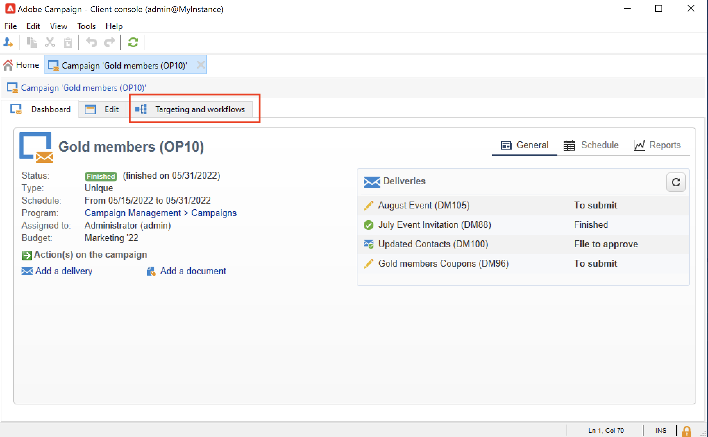
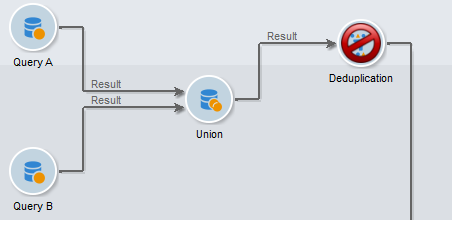

# De doelgroep van uw campagnes selecteren {#marketing-campaign-deliveries}

In een marketingcampagne kunt u voor elke levering het volgende definiëren:

* Het doelpubliek. U kunt berichten naar a [ lijst van ontvanger ](#send-to-a-group) verzenden of een [ publiek in een werkschema bouwen ](#build-the-main-target-in-a-workflow)
* Een controlegroep. U kunt [ een controlegroep ](#add-a-control-group) toevoegen om ontvangers te controleren gedrag na berichtlevering
* De adressen van het zaad - leren meer in [ deze sectie ](../../v8/audiences/test-profiles.md).—>

Sommige van deze informatie kan van het [ campagnemalplaatje ](marketing-campaign-templates.md#campaign-templates) worden geërft.

<!--
To build the delivery target, you can define filtering criteria for the recipients in the database. This recipient selection mode is presented in [this section](../../delivery/using/steps-defining-the-target-population.md).
-->

## Naar een groep verzenden{#send-to-a-group}

U kunt een populatie in een lijst importeren en deze lijst vervolgens als doel instellen in leveringen. Hiervoor voert u de volgende stappen uit:

1. Bewerk de levering en klik op de koppeling **[!UICONTROL To]** om de doelpopulatie te wijzigen.
1. Selecteer op het tabblad **[!UICONTROL Main target]** de optie **[!UICONTROL Defined via the database]** en klik **[!UICONTROL Add]** om ontvangers te selecteren.

   

1. Kies **[!UICONTROL A list of recipients]** .

   

1. Klik op **[!UICONTROL Next]** om de lijst te selecteren.

   

   U kunt het doel verfijnen door nieuwe filtercriteria toe te voegen.

1. Klik op **[!UICONTROL Finish]** als alle criteria zijn gedefinieerd en sla het hoofddoel op.

## Het publiek samenstellen in een campagneworkflow {#build-the-main-target-in-a-workflow}

Het hoofddoel van een levering kan ook worden gedefinieerd in de campagneworkflow: met deze grafische omgeving kunt u een doel maken aan de hand van query&#39;s, tests en operatoren: union, deduplicatie, sharing, enzovoort.

>[!IMPORTANT]
>
>U mag niet meer dan 28 workflows toevoegen aan een campagne. Buiten deze limiet zijn extra workflows niet zichtbaar in de interface en kunnen fouten genereren.

### De workflow maken {#create-a-targeting-workflow}

Het richten kan door een combinatie filtervoorwaarden in een grafische opeenvolging in een werkschema worden tot stand gebracht. U kunt populaties en subpopulaties maken die op basis van uw vereisten worden aangepast. Als u de werkstroomeditor wilt weergeven, klikt u op het tabblad **[!UICONTROL Targeting and workflows]** in het campagnedashboard.

De doelpopulatie wordt geëxtraheerd uit de Adobe Campaign-database via een of meer query&#39;s die in een workflow zijn geplaatst. Leer hoe te om een vraag in [ te bouwen deze sectie ](../workflow/query.md).

U kunt query&#39;s starten en populaties delen via vakken zoals Union, Intersection, Sharing, Exclusion enzovoort.

Selecteer de objecten in de lijsten links van de werkruimte en koppel ze om het doel samen te stellen.

In het diagram, verbind omhoog het richten en het plannen van vragen die voor doelbouw in het diagram worden vereist. U kunt het richten uitvoeren terwijl de bouw bezig is om de bevolking te controleren die uit het gegevensbestand wordt gehaald.

>[!NOTE]
>
>De voorbeelden en de procedure om vragen te bepalen zijn gedetailleerd in [ deze sectie ](../workflow/query.md).

Het linkergedeelte van de editor bevat een bibliotheek met grafische objecten die activiteiten vertegenwoordigen. Het eerste lusje bevat de het richten activiteiten, en het tweede lusje bevat de stroom-controle activiteiten, die af en toe worden gebruikt om het richten activiteiten te coördineren.

De functies voor het uitvoeren en opmaken van werkstromen voor het opgeven van doelen zijn toegankelijk via de werkbalk van de diagrameditor.

>[!NOTE]
>
>De activiteiten beschikbaar om het diagram te bouwen evenals alle vertoning en lay-outeigenschappen zijn gedetailleerd in [ deze sectie ](../workflow/about-workflows.md).

U kunt verschillende doelworkflows voor één campagne maken. Een workflow toevoegen:

1. Ga naar de linkerbovensectie van de zone van de werkschemaverwezenlijking, klik met de rechtermuisknop aan, en selecteer **[!UICONTROL Add]**. U kunt ook de knop **[!UICONTROL New]** boven deze zone gebruiken.

   

1. Selecteer de sjabloon **[!UICONTROL New workflow]** en geef deze workflow een naam.
1. Klik op **[!UICONTROL OK]** om het maken van de workflow te bevestigen en maak vervolgens het diagram voor deze workflow.

### De workflow uitvoeren {#execute-a-workflow}

Doelworkflows kunnen handmatig worden gestart via de knop **[!UICONTROL Start]** op de werkbalk, op voorwaarde dat u de juiste rechten hebt.

Het richten kan voor automatische uitvoering volgens een programma (planner) of een gebeurtenis (extern signaal, dossierinvoer, enz.) worden geprogrammeerd.

De acties met betrekking tot het uitvoeren van de doelworkflow (starten, stoppen, pauzeren, enz.) zijn **asynchrone** processen: het bevel wordt bewaard en zal van kracht worden zodra de server beschikbaar is om het toe te passen.

Met de werkbalkpictogrammen kunt u actie ondernemen met betrekking tot de uitvoering van de doelworkflow.

* Starten of opnieuw starten

   * Met het pictogram **[!UICONTROL Start]** kunt u de doelworkflow starten. Wanneer u op dit pictogram klikt, worden alle activiteiten zonder een invoerovergang geactiveerd (behalve sprongen met eindpunten).

     

     De server houdt rekening met de aanvraag, zoals wordt getoond door zijn status: **[!UICONTROL Start as soon as possible]**.

   * U kunt de doelworkflow opnieuw starten via het juiste werkbalkpictogram. Deze opdracht kan handig zijn als het pictogram **[!UICONTROL Start]** niet beschikbaar is, bijvoorbeeld wanneer het opgeven van een workflow wordt gestopt. Klik in dit geval op het pictogram **[!UICONTROL Restart]** om te anticiperen op het opnieuw opstarten. De server houdt rekening met het verzoek, zoals de status ervan aangeeft: **[!UICONTROL Restart requested]** .

* Stoppen of pauzeren

   * Met de werkbalkpictogrammen kunt u een actieve doelworkflow stoppen of pauzeren.

     Wanneer u op **[!UICONTROL Pause]** klikt, worden bewerkingen in uitvoering **[!UICONTROL are not]** gepauzeerd, maar worden geen andere activiteiten gestart tot de volgende keer dat u de computer opnieuw opstart.

     

     De server houdt rekening met de opdracht, zoals uit de status blijkt: **[!UICONTROL Pause requested]** .

     U kunt een doelworkflow ook automatisch pauzeren wanneer de uitvoering een bepaalde activiteit bereikt. Klik hiertoe met de rechtermuisknop op de activiteit vanwaar de doelworkflow moet worden gepauzeerd en selecteer **[!UICONTROL Enable but do not execute]** .

     

     Deze configuratie wordt getoond door een speciaal pictogram.

     

     >[!NOTE]
     >
     >Deze optie is handig tijdens het ontwerpen en testen van campagnes die u op geavanceerde wijze wilt richten.

     Klik op **[!UICONTROL Start]** om de uitvoering te hervatten.

   * Klik op het pictogram **[!UICONTROL Stop]** om de uitvoering te stoppen.

     

     De server houdt rekening met de opdracht, zoals uit de status blijkt: **[!UICONTROL Stop requested]** .

  U kunt een doelworkflow ook automatisch stoppen wanneer de uitvoering een activiteit bereikt. Klik hiertoe met de rechtermuisknop op de activiteit vanwaar de doelworkflow wordt gestopt en selecteer **[!UICONTROL Do not activate]** .

  

  Deze configuratie wordt getoond door een speciaal pictogram.

  

  >[!NOTE]
  >
  >Deze optie is handig tijdens het ontwerpen en testen van campagnes die u op geavanceerde wijze wilt richten.

* Onvoorwaardelijke stop

  Selecteer in de Verkenner **[!UICONTROL Administration > Production > Object created automatically > Campaign workflows]** om toegang te krijgen tot en op te treden bij elke campagneworkflows.

  U kunt de workflow onvoorwaardelijk stoppen door op het pictogram **[!UICONTROL Actions]** te klikken en **[!UICONTROL Unconditional]** stop te selecteren. Deze actie beëindigt uw campagnewerkschema.

  

  >[!CAUTION]
  >
  >De onvoorwaardelijke stop is beperkt tot Admin gebruikers.

## Een controlegroep toevoegen {#add-a-control-group}

Een controlegroep is een populatie die de levering niet zal ontvangen; het wordt gebruikt om het gedrag na de levering en het effect van de campagne te volgen door een vergelijking te maken met het gedrag van de doelpopulatie, die de levering heeft ontvangen.

De controlegroep kan uit het belangrijkste doel worden gehaald en/of uit een specifieke groep of een vraag komen.

### De controlegroep voor een campagne activeren {#activate-the-control-group-for-a-campaign}

U kunt een controlegroep op campagneniveau bepalen, waarbij de controlegroep op elke levering van de betrokken campagne zal worden toegepast.

1. Bewerk de desbetreffende campagne en klik op de tab **[!UICONTROL Edit]** .
1. Klik op **[!UICONTROL Advanced campaign parameters...]**.

   

1. Selecteer de optie **[!UICONTROL Enable and edit control group configuration]** .
1. Klik **[!UICONTROL Edit...]** om de controlegroep te vormen.

   

De volledige procedure wordt gedetailleerd in [ deze sectie ](#extract-the-control-group-from-the-main-target). Leer meer over controlegroepen in [ deze sectie ](#add-a-population).

### De controlegroep voor een levering activeren {#activate-the-control-group-for-a-delivery}

U kunt een controlegroep op leveringsniveau bepalen, in welk geval de controlegroep op elke levering van de betrokken campagne zal worden toegepast.

Door gebrek, is de configuratie van de controlegroep die op het campagneniveau wordt bepaald op elke levering van die campagne van toepassing. U kunt, echter, de controlegroep voor een individuele levering aanpassen.

>[!NOTE]
>
>Als u een controlegroep voor een campagne hebt bepaald, en u het voor een levering ook vormt verbonden aan deze campagne, slechts zal de controlegroep die voor de levering wordt bepaald worden toegepast.

1. Bewerk de desbetreffende levering en klik op de koppeling **[!UICONTROL To]** .
1. Klik op de tab **[!UICONTROL Control group]** en selecteer vervolgens **[!UICONTROL Enable and edit control group configuration]** .

   

1. Klik **[!UICONTROL Edit...]** om de controlegroep te vormen.

De volledige procedure wordt gedetailleerd in [ deze sectie ](#extract-the-control-group-from-the-main-target).

### Een nieuwe populatie gebruiken als een controlegroep {#add-a-population}

U kunt een specifieke populatie voor de controlegroep gebruiken. Selecteer in dat geval de lijst die u als controlegroep wilt gebruiken in het verwante veld.

Deze populatie kan uit een lijst van ontvangers komen of u kunt het door een specifieke vraag bepalen.

>[!NOTE]
>
>De vraagredacteur van Adobe Campaign wordt voorgesteld in [ deze sectie ](../workflow/query.md).

### Extraheer de controlegroep uit het hoofddoel {#extract-the-control-group-from-the-main-target}

U kunt ook ontvangers extraheren van het hoofddoel van de levering. In dit geval, zullen de ontvangers van het doel van leveringsacties worden genomen die door deze configuratie worden beïnvloed. Deze extractie kan willekeurig zijn of het resultaat zijn van het sorteren van de ontvangers.

Als u een controlegroep wilt extraheren, schakelt u de controlegroep voor de campagne of levering in en selecteert u een van de volgende opties: **[!UICONTROL Activate random sampling]** of **[!UICONTROL Keep only the first records after sorting]** .

* Gebruik de optie **[!UICONTROL Activate random sampling]** om willekeurige bemonstering toe te passen op de ontvangers in de hoofdpopulatie. Als u vervolgens de drempel instelt op 100, bestaat de controlegroep uit 100 ontvangers die willekeurig uit de doelpopulatie zijn geselecteerd. De willekeurige bemonstering is afhankelijk van de database-engine.
* Gebruik de optie **[!UICONTROL Keep only the first records after sorting]** om een beperking te definiëren op basis van een of meer sorteeropdrachten. Als u het veld **[!UICONTROL Age]** selecteert als sorteercriterium en vervolgens 100 definieert als een drempel, bestaat de controlegroep uit de 100 jongste ontvangers. Het zou bijvoorbeeld interessant kunnen zijn om een controlegroep te definiëren die ontvangers bevat die weinig aankopen doen, of ontvangers die vaak aankopen doen, en om hun gedrag te vergelijken met dat van de gecontacteerde ontvangers.

Klik op **[!UICONTROL Next]** om de sorteervolgorde te definiëren (indien nodig) en selecteer de modus voor de beperking van ontvangers.

Deze configuratie is gelijk aan een **[!UICONTROL Split]** -activiteit in de workflow, waardoor u het doel kunt onderverdelen in subsets. De controlegroep is één van deze subsets.

### Video over zelfstudie {#create-email-video}

Deze video verklaart hoe te om een controlegroep aan een campagne toe te voegen.

>[!VIDEO](https://video.tv.adobe.com/v/335606?quality=12)

De extra Campagne hoe-aan video&#39;s is beschikbaar [ hier ](https://experienceleague.adobe.com/docs/campaign-learn/tutorials/getting-started/introduction-to-adobe-campaign.html) {target="_blank"}.
