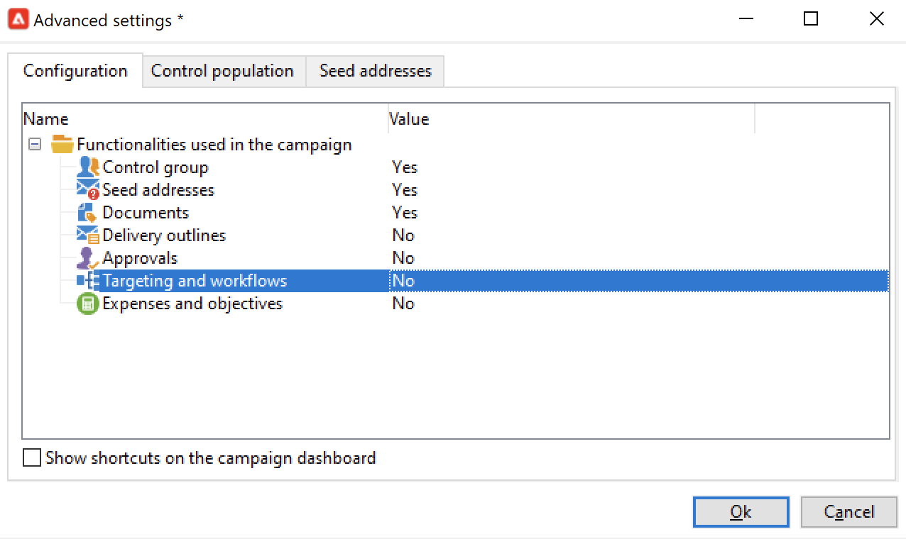
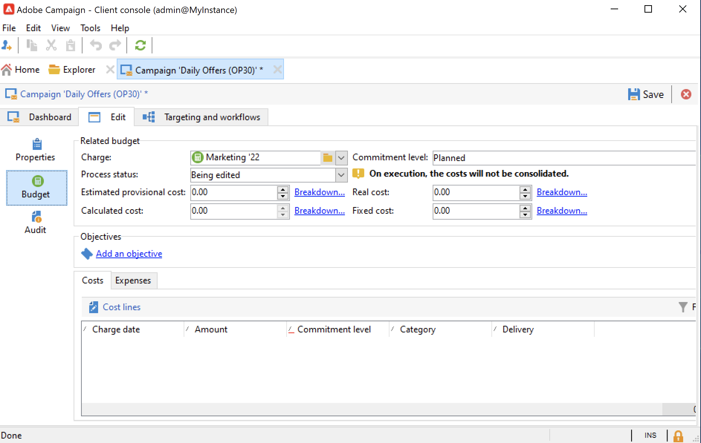

# Campagnesjablonen maken en configureren {#campaign-templates}

Alle marketing campagnes zijn gebaseerd op een malplaatje, dat belangrijkste kenmerken en mogelijkheden opslaat. Campagne wordt geleverd met een ingebouwde sjabloon voor het maken van campagnes. Deze sjabloon heeft alle functies ingeschakeld: Documenten, zaadadressen, goedkeuringen, leveringscontouren, enz.

Beschikbare functies zijn afhankelijk van uw machtigingen, invoegtoepassingen en de configuratie van uw Adobe Campaign-platform.

>[!NOTE]
>
>De structuur wordt weergegeven wanneer u op de knop **[!UICONTROL Explorer]** op de startpagina.

Een ingebouwde sjabloon wordt geleverd om een campagne te maken waarvoor geen specifieke configuratie is gedefinieerd. U kunt uw campagnemalplaatjes tot stand brengen en vormen en dan campagnes van deze malplaatjes tot stand brengen.

## Een campagnemalplaatje maken {#create-a-campaign-template}

Volg onderstaande stappen om een campagnemalplaatje te maken:

1. Campagne openen **Verkenner** en blader naar **Bronnen > Sjablonen > Campagnersjablonen**.
1. Klikken **Nieuw** in de werkbalk boven de lijst met sjablonen.

U kunt ook **dupliceren** de ingebouwde sjabloon voor hergebruik en aanpassing van de configuratie. Klik hiertoe met de rechtermuisknop op de sjabloon en selecteer **Dupliceren**.

1. Voer het label van uw nieuwe campagnemalplaatje in.
1. Klikken **Opslaan** en open de sjabloon opnieuw.
1. In de **Bewerken** , definieert u de sjablooneigenschappen.
1. Selecteren **Geavanceerde campagneparameters...** koppeling om een workflow toe te voegen aan uw campagnemalplaatje.

   

1. Wijzig de **Doelstellingen en workflows** waarde aan **Ja**. en bevestig. Leer hoe u functies kunt toevoegen in [deze sectie](#typology-of-enabled-modules).
1. De **Doelstellingen en workflows** wordt toegevoegd aan de sjabloon. Klikken **Een workflow toevoegen...**, voert u een **Label** en klik op **OK**.
1. Maak uw workflow naar wens.

   

1. Klikken **Opslaan**. Uw sjabloon kan nu worden gebruikt om een nieuwe campagne te maken.

Met de verschillende tabbladen en subtabbladen van de campagnemalplaatje hebt u toegang tot de instellingen die worden beschreven in [Algemene configuratie](#general-configuration).

## Modules selecteren {#select-modules}

De **[!UICONTROL Advanced campaign parameters...]** Met de koppeling kunt u taken voor de campagnes op basis van deze sjabloon in- en uitschakelen. Selecteer de mogelijkheden die u wilt inschakelen in de campagnes die op deze sjabloon zijn gebaseerd.

Als een functionaliteit niet is geselecteerd, worden de elementen betreffende het proces (menu&#39;s, pictogrammen, opties, tabs, subtabs, enz.) niet in de interface van het malplaatje of in campagnes verschijnen die op dit malplaatje worden gebaseerd. De tabbladen links van de details van de campagne en de beschikbare tabbladen komen overeen met de functies die in de sjabloon zijn geselecteerd. De **Uitgaven en doelstellingen** functionaliteit is niet ingeschakeld, de corresponderende **[!UICONTROL Budget]** worden niet weergegeven in campagnes die op deze sjabloon zijn gebaseerd.

Bovendien worden de kortere weg aan de configuratievensters toegevoegd aan het campagnesdashboard. Wanneer een functionaliteit wordt toegelaten, geeft een directe verbinding toegang tot het van het campagnesdashboard.

### Configuratiemonsters

* Bijvoorbeeld met de volgende instellingen:

   

   Het campagnemashboard laat zien:

   

   De **[!UICONTROL Targeting and workflows]** ontbreekt.

   De volgende functies zijn beschikbaar:

   

   De **[!UICONTROL Budget]** ontbreekt.

   Deze configuratie wordt ook weerspiegeld in de geavanceerde instellingen voor de campagne.

   

   De **[!UICONTROL Approvals]** is niet beschikbaar.

* Met deze configuratie:
   

   Het campagnemashboard laat zien:

   

   De **[!UICONTROL Targeting and workflows]** tab is beschikbaar, maar de **Een document toevoegen** koppeling ontbreekt.

   De volgende functies zijn beschikbaar:

   

   De **[!UICONTROL Budget]** is beschikbaar.

   Deze configuratie wordt ook weerspiegeld in de geavanceerde instellingen voor de campagne.

   

   De **[!UICONTROL Approvals]** tab is beschikbaar, maar de **[!UICONTROL Control population]** en **[!UICONTROL Seed addresses]** tabs zijn niet ingeschakeld.

## Typologie van modules {#typology-of-enabled-modules}

* **Controlegroep**

   Wanneer deze module wordt geselecteerd, wordt een extra lusje toegevoegd aan de geavanceerde montages van het malplaatje en de campagnes die op dit malplaatje worden gebaseerd. De configuratie kan via het malplaatje of individueel voor elke campagne worden bepaald. Meer informatie over controlegroepen in [deze sectie](marketing-campaign-deliveries.md#defining-a-control-group).

   

* **Seed-adressen**

   Wanneer deze module wordt geselecteerd, wordt een extra lusje toegevoegd aan de geavanceerde montages van het malplaatje en de campagnes die op dit malplaatje worden gebaseerd. De configuratie kan via het malplaatje of individueel voor elke campagne worden bepaald.

   

* **Documenten**

   Als deze module is geselecteerd, wordt een extra tabblad toegevoegd aan het dialoogvenster **[!UICONTROL Edit]** van de sjabloon en de campagnes die op deze sjabloon zijn gebaseerd. Bijgevoegde documenten kunnen worden toegevoegd vanuit de sjabloon of afzonderlijk voor elke campagne. Meer informatie over documenten in [deze sectie](marketing-campaign-deliveries.md#manage-associated-documents).

   

* **Overzicht van levering**

   Als deze module is geselecteerd, wordt een **[!UICONTROL Delivery outlines]** subtab wordt toegevoegd aan de **[!UICONTROL Documents]** om de leveringsoverzichten voor de campagne te bepalen. Meer informatie over leveringscontouren vindt u in [deze sectie](marketing-campaign-assets.md#delivery-outlines).

   

* **Doelstellingen en workflows**

   Wanneer u **[!UICONTROL Targeting and workflows]** wordt een tabblad toegevoegd, zodat u een of meer workflows kunt maken voor campagnes die op deze sjabloon zijn gebaseerd. Workflows kunnen ook afzonderlijk worden geconfigureerd voor elke campagne op basis van deze sjabloon.Meer informatie over workflows voor campagnes in [deze sectie](marketing-campaign-deliveries.md#build-the-main-target-in-a-workflow).

   

   Als deze module is ingeschakeld, wordt een **[!UICONTROL Jobs]** wordt toegevoegd aan de geavanceerde instellingen van de campagne om de procesuitvoeringsvolgorde te definiëren.

* **Goedkeuringen**

   Als u de optie **[!UICONTROL Approvals]**, kunt u selecteren welke processen u wilt goedkeuren en welke operatoren verantwoordelijk zijn voor de goedkeuring. Meer informatie over goedkeuringen in [deze sectie](marketing-campaign-approval.md#select-reviewers).

   

   U kunt kiezen of u procesgoedkeuring wilt inschakelen via het dialoogvenster **[!UICONTROL Approvals]** tabblad van het gedeelte Geavanceerde instellingen voor sjablonen.

* **Uitgaven en doelstellingen**

   Als deze module is geselecteerd, wordt een **[!UICONTROL Budget]** wordt toegevoegd aan de details van het sjabloon en de campagnes op basis van dit sjabloon, zodat het bijbehorende budget kan worden geselecteerd.

   

## Sjablooneigenschappen {#template-properties}

Wanneer u een campagnemalplaatje creeert, moet u de volgende informatie ingaan:

* Voer de **label** van de template: het etiket is verplicht en is het standaardetiket voor alle campagnes die op dit malplaatje worden gebaseerd.
* Selecteer de campagne **aard** in de vervolgkeuzelijst. De waarden in deze lijst zijn opgeslagen in **[!UICONTROL natureOp]** opsomming.
   <!--
  >[!NOTE]
  >
  >For more information on enumerations, refer to the [Getting Started](../../platform/using/managing-enumerations.md) section.-->

* Selecteer **type campagne**: uniek, terugkerend of periodiek. Standaard worden campagnemasjablonen toegepast op unieke campagnes. Recursieve en periodieke campagnes worden beschreven in [deze sectie](recurring-periodic-campaigns.md).
* Geef de duur van de campagne op, d.w.z. het aantal dagen waarop de campagne zal plaatsvinden. Wanneer u een campagne maakt op basis van deze sjabloon, worden de begin- en einddatums van de campagne automatisch ingevuld.

   Als de campagne terugkerend is, moet u de begin en einddata van de campagne direct in het malplaatje specificeren.

* Geef de **verwant programma** van de template: campagnes op basis van deze sjabloon zijn gekoppeld aan het geselecteerde programma.

<!--
## Track campaign execution{#campaign-reverse-scheduling}

You can create a schedule for a campaign and track accomplishments, for instance to prepare an event schedule for a specific date. Campaign templates now let you calculate the start date of a task based on the end date of a campaign.

In the task configuration box, go to the **[!UICONTROL Implementation schedule]** area and check the **[!UICONTROL The start date is calculated based on the campaign end date]** box. (Here, "start date" is the task start date). Go to the **[!UICONTROL Start]** field and enter an interval: the task will start this long before the campaign end date. If you enter a period which is longer than the campaign is set to last, the task will begin before the campaign.

When you create a campaign using this template, the task start date will be calculated automatically. However, you can always change it later.-->
