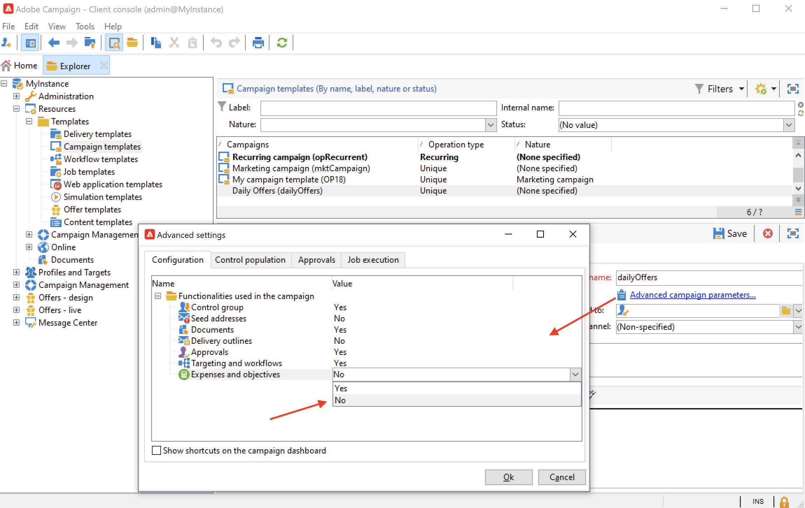

# Campagnesjablonen maken en configureren {#campaign-templates}

Alle marketing campagnes zijn gebaseerd op een malplaatje, dat belangrijkste kenmerken en mogelijkheden opslaat. Campagne wordt geleverd met een ingebouwde sjabloon voor het maken van campagnes. Deze sjabloon heeft alle functies ingeschakeld: Documenten, zaadadressen, Goedkeuringen, Leveringscontouren, enz.

Beschikbare functies zijn afhankelijk van uw machtigingen, invoegtoepassingen en de configuratie van uw Adobe Campaign-platform.

>[!NOTE]
>
>De structuur wordt weergegeven wanneer u op het pictogram **[!UICONTROL Explorer]** op de startpagina klikt.

Een ingebouwde sjabloon wordt geleverd om een campagne te maken waarvoor geen specifieke configuratie is gedefinieerd. U kunt uw campagnemalplaatjes tot stand brengen en vormen en dan campagnes van deze malplaatjes tot stand brengen.

## Een campagnemalplaatje maken {#create-a-campaign-template}

Volg onderstaande stappen om een campagnemalplaatje te maken:

1. Open de Ontdekkingsreiziger van de Campagne **&#x200B;**, en doorblader aan **Middelen > Malplaatjes > de malplaatjes van de Campagne**.
1. Klik **Nieuw** in de toolbar boven de lijst van malplaatjes.

U kunt **&#x200B;**&#x200B;het ingebouwde malplaatje ook dupliceren om zijn configuratie opnieuw te gebruiken en aan te passen. Om dit te doen, klik op het malplaatje met de rechtermuisknop aan en selecteer **Dupliceer**.

1. Voer het label van uw nieuwe campagnemalplaatje in.
1. Klik **sparen** en open uw malplaatje opnieuw.
1. In **geef** lusje uit, bepaal de malplaatjeeigenschappen.
1. Selecteer **Geavanceerde campagneparameters...** verbinding om een werkschema aan uw campagnemalplaatje toe te voegen.

   

1. Verander **het richten en de werkschema&#39;s** waarde in **ja**., en bevestig. Leer hoe te om functionaliteit in [ toe te voegen deze sectie ](#typology-of-enabled-modules).
1. Het **richten en werkschema&#39;s** lusje wordt toegevoegd aan het malplaatje. Klik **toevoegen een werkschema..**, ga a **Etiket** in en klik **O.K.**.
1. Maak uw workflow naar wens.

   

1. Klik **sparen**. Uw sjabloon kan nu worden gebruikt om een nieuwe campagne te maken.

De diverse lusjes en sub-tabs van het campagnemalplaatje staan u toe om tot zijn montages toegang te hebben, die in [ Algemene configuratie ](#general-configuration) worden beschreven.

## Modules selecteren {#select-modules}

Met de koppeling **[!UICONTROL Advanced campaign parameters...]** kunt u taken voor de campagnes op basis van deze sjabloon in- en uitschakelen. Selecteer de mogelijkheden die u wilt inschakelen in de campagnes die op deze sjabloon zijn gebaseerd.

Als een functionaliteit niet is geselecteerd, worden de elementen betreffende het proces (menu&#39;s, pictogrammen, opties, tabs, subtabs, enz.) niet weergegeven in de interface van de sjabloon of in campagnes op basis van deze sjabloon. De tabbladen links van de details van de campagne en de beschikbare tabbladen komen overeen met de functies die in de sjabloon zijn geselecteerd. Bijvoorbeeld, wordt de **Uitgaven en doelstellingen** functionaliteit niet toegelaten, het overeenkomstige **[!UICONTROL Budget]** lusje toont niet in campagnes die op dit malplaatje worden gebaseerd.

Bovendien worden de kortere weg aan de configuratievensters toegevoegd aan het campagnesdashboard. Wanneer een functionaliteit wordt toegelaten, geeft een directe verbinding toegang tot het van het campagnesdashboard.

### Configuratiemonsters

* Bijvoorbeeld met de volgende instellingen:

  

  Het campagnemashboard laat zien:

  

  De tab **[!UICONTROL Targeting and workflows]** ontbreekt.

  De volgende functies zijn beschikbaar:

  

  De tab **[!UICONTROL Budget]** ontbreekt.

  Deze configuratie wordt ook weerspiegeld in de geavanceerde instellingen voor de campagne.

  

  De tab **[!UICONTROL Approvals]** is niet beschikbaar.

* Met deze configuratie:
  

  Het campagnemashboard laat zien:

  

  Merk op dat het **[!UICONTROL Targeting and workflows]** lusje beschikbaar is maar **voeg een document** verbinding toe mist.

  De volgende functies zijn beschikbaar:

  

  De tab **[!UICONTROL Budget]** is beschikbaar.

  Deze configuratie wordt ook weerspiegeld in de geavanceerde instellingen voor de campagne.

  

  De tab **[!UICONTROL Approvals]** is beschikbaar, maar de tabbladen **[!UICONTROL Control population]** en **[!UICONTROL Seed addresses]** zijn niet ingeschakeld.

## Typologie van modules {#typology-of-enabled-modules}

* **de groep van de Controle**

  Wanneer deze module wordt geselecteerd, wordt een extra lusje toegevoegd aan de geavanceerde montages van het malplaatje en de campagnes die op dit malplaatje worden gebaseerd. De configuratie kan via het malplaatje of individueel voor elke campagne worden bepaald. Leer meer over controlegroepen in [ deze sectie ](marketing-campaign-deliveries.md#defining-a-control-group).

  

* **Seed-adressen**

  Wanneer deze module wordt geselecteerd, wordt een extra lusje toegevoegd aan de geavanceerde montages van het malplaatje en de campagnes die op dit malplaatje worden gebaseerd. De configuratie kan via het malplaatje of individueel voor elke campagne worden bepaald.

  

* **Documenten**

  Als deze module is geselecteerd, wordt een extra tabblad toegevoegd aan het tabblad **[!UICONTROL Edit]** van de sjabloon en aan de campagnes op basis van deze sjabloon. Bijgevoegde documenten kunnen worden toegevoegd vanuit de sjabloon of afzonderlijk voor elke campagne. Leer meer over documenten in [ deze sectie ](marketing-campaign-deliveries.md#manage-associated-documents).

  

* **Overzicht van levering**

  Wanneer deze module is geselecteerd, wordt een subtab **[!UICONTROL Delivery outlines]** toegevoegd aan het tabblad **[!UICONTROL Documents]** om de leveringscontouren voor de campagne te definiëren. Leer meer over leveringsoverzichten in [ deze sectie ](marketing-campaign-assets.md#delivery-outlines).

  

* **het richten en werkschema&#39;s**

  Wanneer u de module **[!UICONTROL Targeting and workflows]** selecteert, wordt een tabblad toegevoegd waarop u een of meer workflows kunt maken voor campagnes die op deze sjabloon zijn gebaseerd. De werkschema&#39;s kunnen ook individueel voor elke campagne worden gevormd die op dit malplaatje wordt gebaseerd.Leer meer over campagnewerkschema&#39;s in [ deze sectie ](marketing-campaign-deliveries.md#build-the-main-target-in-a-workflow).

  

  Wanneer deze module is ingeschakeld, wordt een tabblad **[!UICONTROL Jobs]** toegevoegd aan de geavanceerde instellingen van de campagne om de procesuitvoeringsvolgorde te definiëren.

* **Goedkeuringen**

  Als u **[!UICONTROL Approvals]** inschakelt, kunt u de processen selecteren die u wilt goedkeuren en de operatoren die verantwoordelijk zijn voor goedkeuringen. Leer meer over goedkeuringen in [ deze sectie ](marketing-campaign-approval.md#select-reviewers).

  

  U kunt kiezen of u procesgoedkeuring al dan niet wilt inschakelen via het tabblad **[!UICONTROL Approvals]** van de sectie Geavanceerde instellingen voor sjablonen.

* **Uitgaven en doelstellingen**

  Als deze module is geselecteerd, wordt een tabblad **[!UICONTROL Budget]** toegevoegd aan de details van de sjabloon en worden campagnes gebaseerd op deze sjabloon, zodat het bijbehorende budget kan worden geselecteerd.

  

## Sjablooneigenschappen {#template-properties}

Wanneer u een campagnemalplaatje creeert, moet u de volgende informatie ingaan:

* Ga het **etiket** van het malplaatje in: het etiket is verplicht en is het standaardetiket voor alle campagnes die op dit malplaatje worden gebaseerd.
* Selecteer de campagne **aard** van de drop-down lijst. De waarden in deze lijst zijn die welke zijn opgeslagen in de opsomming **[!UICONTROL natureOp]** .

Leer om tot uw opsommingen in [ toegang te hebben en te vormen deze pagina ](../../v8/config/ui-settings.md#enumerations).

* Selecteer het **type van campagne**: uniek, terugkerend, of periodiek. Standaard worden campagnemasjablonen toegepast op unieke campagnes. Het terugkomen en periodieke campagnes worden gedetailleerd in [ deze sectie ](recurring-periodic-campaigns.md).
* Geef de duur van de campagne op, d.w.z. het aantal dagen waarop de campagne zal plaatsvinden. Wanneer u een campagne maakt op basis van deze sjabloon, worden de begin- en einddatums van de campagne automatisch ingevuld.

  Als de campagne terugkerend is, moet u de begin en einddata van de campagne direct in het malplaatje specificeren.

* Specificeer het **verwante programma** van het malplaatje: de campagnes die op dit malplaatje worden gebaseerd zijn verbonden met het geselecteerde programma.

<!--
## Track campaign execution{#campaign-reverse-scheduling}

You can create a schedule for a campaign and track accomplishments, for instance to prepare an event schedule for a specific date. Campaign templates now let you calculate the start date of a task based on the end date of a campaign.

In the task configuration box, go to the **[!UICONTROL Implementation schedule]** area and check the **[!UICONTROL The start date is calculated based on the campaign end date]** box. (Here, "start date" is the task start date). Go to the **[!UICONTROL Start]** field and enter an interval: the task will start this long before the campaign end date. If you enter a period which is longer than the campaign is set to last, the task will begin before the campaign.

When you create a campaign using this template, the task start date will be calculated automatically. However, you can always change it later.-->
