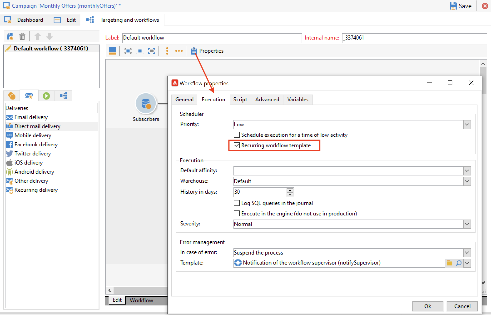

# Herhalings- en periodieke campagnes {#recurring-and-periodic-campaigns}

A **terugkomende campagne** is een campagne die op een specifiek malplaatje wordt gebaseerd, de waarvan werkschema&#39;s worden gevormd om volgens een bijbehorend programma te worden uitgevoerd. Het richten wordt gedupliceerd op elke uitvoering en de diverse processen en doelpopulaties worden gevolgd.  Wanneer gevormd, leidt het terugkomen campagnes automatisch tot een nieuw werkschema (door het werkschemamalplaatje te dupliceren) en stelt het in werking. Bijvoorbeeld, als u maandelijkse herinnering aan een publiekssegment moet verzenden, vorm een terugkomende campagne zodat aan het begin van elk jaar, het 12 werkschema&#39;s, voor elke maand creeert. [Meer informatie](#create-a-recurring-campaign)

A **periodieke campagne** is een campagne die op een specifiek malplaatje wordt gebaseerd dat u campagneinstanties laat tot stand brengen die op een uitvoeringsprogramma worden gebaseerd. Campagneinstanties worden automatisch gemaakt op basis van een periodiek campagnemalplaatje, afhankelijk van de frequentie die in het sjabloonprogramma is gedefinieerd. [Meer informatie](#create-a-periodic-campaign)

## Een terugkerende campagne maken {#create-a-recurring-campaign}

Herhalende campagnes worden gecreeerd van een specifiek malplaatje dat het werkschemamalplaatje bepaalt dat en het uitvoeringsplan moet worden uitgevoerd.

### Een sjabloon maken voor terugkerende campagnes {#create-the-campaign-template}

Volg onderstaande stappen om een sjabloon voor terugkerende campagnes te maken:

1. Open Campagneverkenner en blader naar **[!UICONTROL Resources > Templates > Campaign templates]** .
1. Dupliceer de ingebouwde **[!UICONTROL Recurring campaign]** sjabloon.
   
1. Voer de naam van de sjabloon en de duur van de campagne in.
1. Voor dit type campagne wordt een tabblad **[!UICONTROL Schedule]** toegevoegd om het schema voor de uitvoering van de sjabloon te maken. Op dit tabblad kunt u de uitvoeringsdatums definiëren van de campagnes die op deze sjabloon zijn gebaseerd.
   

   De configuratiewijze van het uitvoeringsprogramma valt samen met het **[!UICONTROL Scheduler]** -object van de Workflow. [Meer informatie](../workflow/scheduler.md).

   >[!CAUTION]
   >
   >De configuratie van het uitvoeringsschema moet zorgvuldig worden uitgevoerd. Met terugkerende campagnes worden de workflow(en) van de sjabloon gedupliceerd, afhankelijk van het opgegeven schema. Deze bewerking kan uw database overladen.

1. Geef een waarde op in het veld **[!UICONTROL Create in advance for]** om de corresponderende workflows voor de aangegeven periode te maken.
1. Ontwerp op het tabblad **[!UICONTROL Targeting and workflows]** de werkstroomsjabloon die moet worden gebruikt in campagnes op basis van deze sjabloon. Deze workflow bevat doorgaans de doelparameters en een of meer leveringen.

   >[!NOTE]
   >
   >Deze workflow moet worden opgeslagen als een terugkerende werkstroomsjabloon. Hiervoor bewerkt u de workfloweigenschappen en selecteert u de optie **[!UICONTROL Recurring workflow template]** op het tabblad **[!UICONTROL Execution]** .

   

### De terugkerende campagne maken {#create-the-recurring-campaign}

Als u de terugkerende campagne wilt maken en de workflows wilt uitvoeren volgens het schema dat in de sjabloon is gedefinieerd, moet u:

1. Maak een nieuwe campagne op basis van uw terugkerende campagnemalplaatje.
1. Vul het schema voor workflowuitvoering in op het tabblad **[!UICONTROL Schedule]** . In het campagnereschema kunt u voor elke regel een automatische begindatum voor het maken of uitvoeren van de workflow invoeren.

   Voor elke regel kunt u de volgende aanvullende opties toevoegen:

   * Schakel de optie **[!UICONTROL To be approved]** in om de goedkeuringsaanvragen voor levering in de workflow af te dwingen.
   * Schakel de optie **[!UICONTROL To be started]** in om de workflow te starten wanneer de begindatum is bereikt.

   In het veld **[!UICONTROL Create in advance for]** kunt u alle workflows maken die de ingevoerde periode beslaan.

   Na uitvoering van de **[!UICONTROL Jobs on campaigns]** -workflow worden de toegewezen workflows gemaakt op basis van de gebeurtenissen die in het campagnereschema zijn gedefinieerd. Op deze manier wordt voor elke uitvoeringsdatum een workflow gemaakt.

1. De terugkomende werkschema&#39;s worden gecreeerd automatisch van het werkschemamalplaatje huidig in de campagne. Ze zijn zichtbaar vanaf het tabblad **[!UICONTROL Targeting and workflows]** van de campagne.

   

   Het label van een terugkerende werkstroominstantie bestaat uit zijn malplaatjelabel en het werkschemanummer, met # karakter binnen tussen.

   Workflows die worden gemaakt op basis van het schema, worden automatisch hieraan gekoppeld in de kolom **[!UICONTROL Workflow]** van het tabblad **[!UICONTROL Schedule]** .

   

   Elke workflow kan op dit tabblad worden bewerkt.

   >[!NOTE]
   >
   >De begindatum van de aan de workflow gekoppelde planningsregel is beschikbaar in een variabele van de workflow met de volgende syntaxis:\
   >`$date(instance/vars/@startPlanningDate)`

## Een periodieke campagne maken {#create-a-periodic-campaign}

Een periodieke campagne is een campagne die op een specifiek malplaatje wordt gebaseerd dat u campagneinstanties laat tot stand brengen die op een uitvoeringsprogramma worden gebaseerd. Campagneinstanties worden automatisch gemaakt op basis van een periodiek campagnemalplaatje, afhankelijk van de frequentie die in het sjabloonprogramma is gedefinieerd.

### De campagnemalplaatje maken {#create-the-campaign-template-1}

1. Open Campagneverkenner en blader naar **[!UICONTROL Resources > Templates > Campaign templates]** .
1. Dupliceer de ingebouwde **[!UICONTROL Periodic campaign]** sjabloon.
1. Voer de eigenschappen van de sjabloon in.

   >[!NOTE]
   >
   >De exploitant wie het malplaatje wordt toegewezen moet de aangewezen toestemmingen hebben om campagnes in het geselecteerde programma tot stand te brengen.

1. Maak de workflow die aan deze sjabloon is gekoppeld. Deze worflow wordt gedupliceerd in elke periodieke campagne die door het malplaatje wordt gecreeerd.

   >[!NOTE]
   >
   >Deze workflow is een werkstroomsjabloon. Deze kan niet worden uitgevoerd vanuit de campagnemalplaatje.

1. Voltooi zijn uitvoeringsprogramma zoals voor een terugkerende campagnemalplaatje: klik de **[!UICONTROL Add]** knoop en bepaal de begin en einddata, of vul het uitvoeringsprogramma via de verbinding in.

   >[!CAUTION]
   >
   >De periodieke campagnemalplaatjes creëren nieuwe campagnes volgens het hierboven bepaalde programma. Het moet daarom zorgvuldig worden afgerond om overbelasting van de Adobe Campaign-databank te voorkomen.

1. Wanneer de begindatum van de uitvoering is bereikt, wordt de overeenkomende campagne automatisch gemaakt. Het neemt alle kenmerken van zijn malplaatje over.

   Elke campagne kan via het sjabloonprogramma worden bewerkt.

   Elke periodieke campagne bevat dezelfde elementen. Zodra gecreeerd, wordt het beheerd als standaardcampagne.
