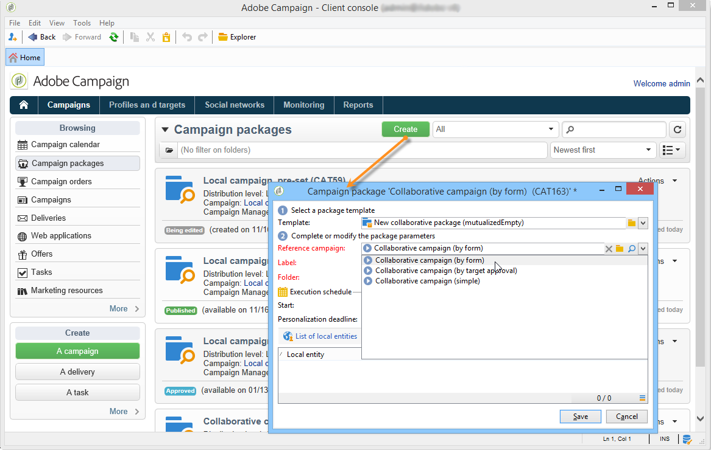

# Een collaboratieve campagne maken{#creating-a-collaborative-campaign-intro}

De centrale entiteit maakt samenwerkingscampagnes op basis van **Distributed Marketing** campagnesjablonen. Zie [deze pagina](about-distributed-marketing.md#collaborative-campaign).

## Een collaboratieve campagne maken {#creating-a-collaborative-campaign}

Als u een samenwerkingscampagne wilt configureren, klikt u op de knop **[!UICONTROL Campaign management > Campaigns]** en vervolgens de **[!UICONTROL New]** pictogram.

>[!NOTE]
>
>Afzonderlijk van **[!UICONTROL collaborative campaigns (by campaign)]**, kunnen deze campagnes via een Webinterface worden gevormd en worden uitgevoerd.

Het configuratieproces voor een samenwerkingscampagnecadatabase is gelijkaardig aan dat van een lokaal campagnemalplaatje. De specificaties van de verschillende soorten samenwerkingscampagnes worden hieronder beschreven.

### Op formulier {#by-form}

Als u een samenwerkingscampagne wilt maken (op formulier), **[!UICONTROL Collaborative campaign (by form)]** sjabloon moet zijn geselecteerd.

In de **[!UICONTROL Edit]** klikt u op de knop **[!UICONTROL Advanced campaign parameters...]** koppeling om toegang te krijgen tot **Distributed Marketing** tab.

Selecteer **Op formulier** webinterface. Met dit type interface kunt u verpersoonlijkingsvelden maken die door lokale entiteiten worden gebruikt wanneer ze een campagne bestellen. Zie [Een lokale campagne maken (op formulier)](examples.md#creating-a-local-campaign--by-form-).

Sla uw campagne op. U kunt het nu gebruiken vanuit het dialoogvenster **Campagnepakketten** in de **Campagne** door op de knop **[!UICONTROL Create]** knop.

De **[!UICONTROL Campaign Package]** kunt u lokale campagnemalplaatjes (out-of-the-box of duplicated) gebruiken, evenals verwijzingscampagnes voor samenwerkingscampagnes, met als doel het creëren van campagnes voor uw verschillende organisatorische entiteiten.

### Op campagne {#by-campaign}

Als u een samenwerkingscampagne wilt maken (per campagne), kunt u de **[!UICONTROL Collaborative campaign (by campaign) (opCollaborativeByCampaign)]** sjabloon moet zijn geselecteerd.

Wanneer het opdracht geven tot de campagne, kan de lokale entiteit de criteria voltooien die door de centrale entiteit vooraf worden bepaald, en de campagne evalueren alvorens het tot opdracht te geven.

Eenmaal een order voor een **Gezamenlijke campagne (per campagne)** wordt goedgekeurd door de centrale entiteit, wordt een kindcampagne voor de lokale entiteit gecreeerd. Zodra zij beschikbaar zijn, kan de lokale entiteit dan wijzigen:

* de campagneworkflow;
* typologieregels;
* en personalisatievelden.

De lokale entiteit voert de onderliggende campagne uit. De centrale entiteit voert de bovenliggende campagne uit.

De centrale entiteit kan alle onderliggende campagnes bekijken die met een **Gezamenlijke campagne (per campagne)** van dit dashboard (via de **[!UICONTROL List of associated campaigns]** koppeling).

### Op doelgoedkeuring {#by-target-approval}

Als u een samenwerkingscampagne wilt maken (door goedkeuring als doel in te stellen), **[!UICONTROL Collaborative campaign (by target approval)]** sjabloon moet zijn geselecteerd.

>[!NOTE]
>
>In deze modus hoeft de centrale entiteit de lokale entiteiten niet op te geven.

De campagneworkflow moet **Lokale goedkeuring** type activiteit. De activiteitsparameters zijn als volgt:

* **[!UICONTROL Action to perform]** : Doelgoedkeuringsmelding.
* **[!UICONTROL Distribution context]** : Expliciet.
* **[!UICONTROL Data distribution]** : Distributie van lokale entiteiten.

**Distributie lokale entiteit** de verdeling van tekstgegevens moet worden gemaakt. Met de sjabloon voor gegevensdistributie kunt u het aantal records uit een lijst met groeperingswaarden beperken. In **[!UICONTROL Resources > Campaign management > Data distribution]** klikt u op de knop **[!UICONTROL New]** pictogram om een nieuwe **[!UICONTROL Data distribution]**. Voor meer informatie over gegevensdistributie,

Selecteer **Doeldimensie** en de **[!UICONTROL Distribution field]**. Voor de **[!UICONTROL Assignment type]**, selecteert u **Lokale entiteit**.

In de **[!UICONTROL Distribution]** , voegt u een veld toe voor elke lokale entiteit en geeft u de waarde op.

U kunt een seconde toevoegen **Doelgoedkeuring** na de **Aflevering** type activiteit om een rapport over het te vormen.

In het bericht van de campagneverwezenlijking, ontvangt de lokale entiteit een contactlijst die door de centrale entiteitparameters vooraf is bepaald.

De lokale entiteit kan bepaalde contacten schrappen die op de campagneinhoud worden gebaseerd.

### Eenvoudig {#simple}

Als u een eenvoudige samenwerkingscampagne wilt maken, **[!UICONTROL Collaborative campaign (simple)]** sjabloon moet zijn geselecteerd.

## Een gezamenlijk campagnemakket maken {#creating-a-collaborative-campaign-package}

Om een campagne ter beschikking te stellen van lokale entiteiten moet de centrale entiteit een campagnepakket maken.

Voer de volgende stappen uit:

1. In de **[!UICONTROL Navigation]** de **Campagnes** pagina, klikt u op de knop **[!UICONTROL Campaign packages]** koppeling.
1. Klik op de knop **[!UICONTROL Create]**.
1. In de sectie boven in het venster kunt u de optie **[!UICONTROL New collaborative package (mutualizedEmpty)]** sjabloon.
1. Selecteer de referentiecampagne.
1. Geef het label, de map en het uitvoeringsschema voor het campagnemakket op.

### Datums {#dates}

De begin- en einddatum bepalen de zichtbaarheidsperiode van de campagne in de lijst met campagnepakketten.

Voor **samenwerkingscampagnes** moet de centrale entiteit de uiterste datum voor registratie en personalisatie specificeren.

>[!NOTE]
>
>De **[!UICONTROL Personalization deadline]** staat de centrale entiteit toe om een termijn te kiezen waarbinnen de lokale entiteiten de documenten (spreadsheets, beelden) moeten hebben geleverd om de campagne te vormen. Dit is geen verplichte optie. Zijdelingse datums hebben geen invloed op de uitvoering van de campagne.

### Doelgroep {#audience}

De centrale entiteit moet de betrokken lokale entiteiten per campagne specificeren zodra de samenwerkingscampagne is opgezet.

>[!CAUTION]
>
>**[!UICONTROL Simple, by form and by campaign collaborative campaign kits]** niet kan worden goedgekeurd tenzij de betrokken lokale entiteiten zijn gespecificeerd.

### Goedkeuringsmodi {#approval-modes}

Voor **samenwerkingscampagnes** kunt u de goedkeuringsmodus voor bestellingen opgeven.

In de handmatige modus moet de lokale entiteit zich abonneren op de campagne om deel te kunnen nemen.

In de automatische modus wordt de lokale entiteit vooraf geabonneerd op de campagne. Het kan het campagneabonnement annuleren of zijn parameters wijzigen zonder goedkeuring van de centrale entiteit te vereisen.

### Meldingen {#notifications}

Configuratie voor meldingen is identiek aan meldingen voor een lokale entiteit. Zie [deze sectie](creating-a-local-campaign.md#notifications).

## Een campagne bestellen {#ordering-a-campaign}

Wanneer een samenwerkingscampagne wordt toegevoegd aan de lijst van campagnepakketten, worden de lokale entiteiten die tot het publiek behoren dat door de centrale entiteit wordt bepaald op de hoogte gebracht (het **samenwerkingscampagnes ( door goedkeuring van het doel )** geen vooraf gedefinieerd publiek hebben). Het verzonden bericht bevat een koppeling waarmee u zich voor de campagne kunt registreren, zoals hieronder wordt getoond:

Met dit bericht kunnen lokale entiteiten ook de beschrijving bekijken die is ingevoerd door de centrale operator die het pakket heeft gemaakt, en documenten die aan de campagne zijn gekoppeld. Deze horen niet bij de campagne zelf, hoewel ze aanvullende informatie hierover verschaffen.

Zodra lokale operatoren zich via een webinterface hebben aangemeld, kunnen ze gepersonaliseerde informatie invoeren voor de samenwerkingscampagne die ze willen bestellen:

Nadat een lokale entiteit de registratie heeft voltooid, worden centrale entiteiten via e-mail op de hoogte gebracht om hun bestelling goed te keuren.

Raadpleeg voor meer informatie de [Goedkeuringsproces](creating-a-local-campaign.md#approval-process) sectie.

## Een bestelling goedkeuren {#approving-an-order}

Het proces voor het goedkeuren van een collectieve campagnepakketorde is het zelfde als wanneer het doen van dit voor een lokale campagne. Zie [deze sectie](creating-a-local-campaign.md#approving-an-order).
