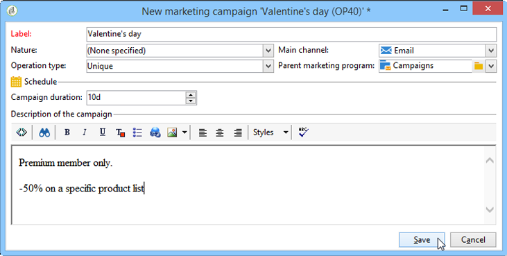
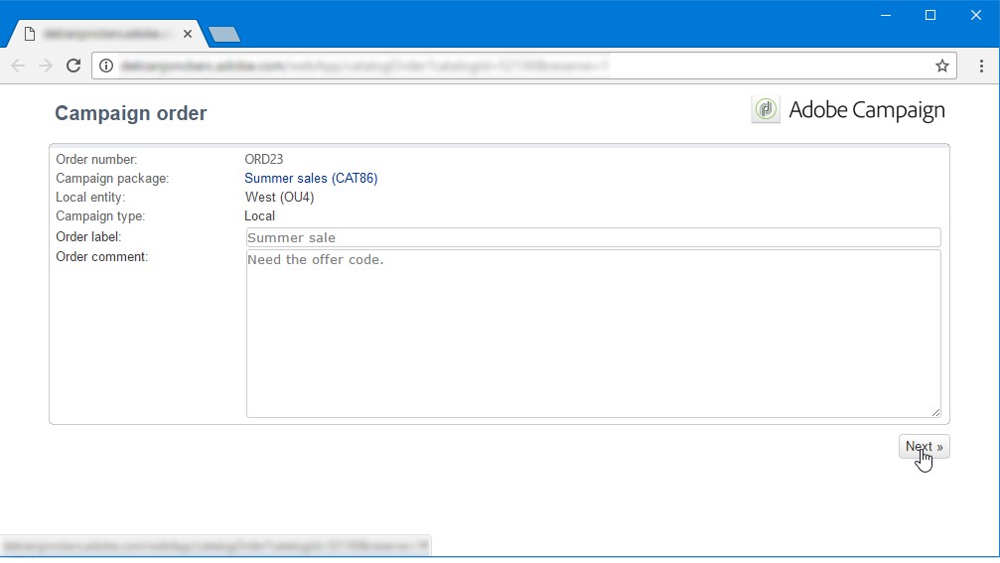
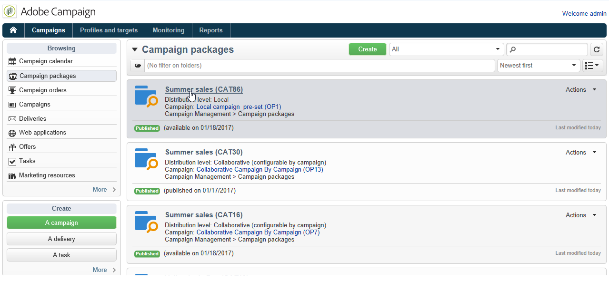

# Een lokale campagne maken{#creating-a-local-campaign}

Een lokale campagne is een instantie die is gemaakt van een sjabloon waarnaar wordt verwezen in de lijst met **[!UICONTROL campaign packages]** met een **specifieke uitvoeringsschema**. Zijn doel is om aan een lokale communicatie behoefte te voldoen gebruikend een campagnemalplaatje dat opstelling en gevormd door de centrale entiteit was. De belangrijkste fasen voor de uitvoering van een lokale actie zijn:

**Voor de centrale entiteit**

1. Een lokale campagnemplate maken.
1. Campagnepakket maken op basis van een sjabloon.
1. Een campagnepakket publiceren.
1. Bevestigingsopdrachten.

**Voor de lokale entiteit**

1. De campagne bestellen.
1. Campagnes uitvoeren.

## Een lokale campagnemalplaatje maken {#creating-a-local-campaign-template}

Als u een campagnepakket wilt maken, moet u eerst het **campagnemalsjabloon** via de **[!UICONTROL Resources > Templates]** knooppunt.

Als u een nieuwe lokale sjabloon wilt maken, dupliceert u de standaardinstelling **[!UICONTROL Local campaign (opLocal)]** sjabloon.

Geef uw campagnemalplaatje een naam en vul de beschikbare velden in.

Klik in het campagnevenster op de knop **[!UICONTROL Edit]** en klikt u op de knop **[!UICONTROL Advanced campaign parameters...]** koppeling.

### Type interface {#web-interface}

In de **Distributed Marketing** kunt u het type interface kiezen en de standaardwaarden en -parameters opgeven die moeten worden ingevoerd wanneer een lokale entiteit een volgorde plaatst.

De interface komt overeen met een formulier dat door de lokale entiteit moet worden ingevuld bij het bestellen van de campagne.

Selecteer het type interface dat op de campagnes moet worden toegepast die van het malplaatje worden gecreeerd:

Er zijn vier typen interfaces beschikbaar:

* **[!UICONTROL By brief]** : de lokale entiteit moet een beschrijving geven waarmee de campagneconfiguraties worden beschreven. Zodra de orde is goedgekeurd, vormt de centrale entiteit en voert de campagne als geheel uit.

  

* **[!UICONTROL By form]** : lokale entiteit heeft toegang tot een webformulier waarin ze, afhankelijk van de gebruikte sjabloon, de inhoud, het doel, de maximale grootte en de datum waarop ze zijn gemaakt en opgehaald, kunnen bewerken met verpersoonlijkingsvelden. Lokale entiteit kan het doel evalueren en de inhoud van dit webformulier voorvertonen.

  

  Het aangeboden formulier wordt opgegeven in een webtoepassing die moet worden geselecteerd in een vervolgkeuzelijst in het menu **[!UICONTROL web Interface]** veld in de sjabloon **[!UICONTROL Advanced campaign parameters...]** koppeling. Zie [Een lokale campagne maken (op formulier)](examples.md#creating-a-local-campaign--by-form-).

  >[!NOTE]
  >
  >De webtoepassing die in dit voorbeeld wordt gebruikt, is een voorbeeld. U moet een specifieke web-app maken om een formulier te kunnen gebruiken.

  

* **[!UICONTROL By external form]** : de lokale entiteit heeft toegang tot campagneparameters in zijn Extranet (niet Adobe Campaign). Deze parameters zijn identiek aan die van a **lokale campagne (per formulier)**.
* **[!UICONTROL Pre-set]** : lokale entiteit bestelt campagne met het standaardformulier zonder het te lokaliseren.

  

### Standaardwaarden {#default-values}

Selecteer de **[!UICONTROL Default values]** in te vullen door lokale entiteiten. Bijvoorbeeld:

* de datum van contact en extractie;
* doelkenmerken (leeftijdssegment, enz.).

Voltooi de **[!UICONTROL Parent marketing program]** en **[!UICONTROL Charge]** velden.

### Goedkeuringen {#approvals}

Van de **[!UICONTROL Advanced parameters for campaign entry]** kunt u het maximumaantal controleurs opgeven.

Revisoren worden door de lokale entiteit ingevoerd bij het bestellen van de campagne.

Als u geen controleurs voor een campagne wilt noemen, ga 0 in.

### Documenten {#documents}

U kunt operatoren van lokale entiteiten toestaan om documenten (tekstbestanden, spreadsheets, afbeeldingen, campagnebeschrijvingen enzovoort) te koppelen. aan de lokale campagne wanneer het creëren van de orde. De **[!UICONTROL Advanced parameters for campaign entry...]** Met de koppeling kunt u het aantal documenten beperken. Om dit te doen, ga eenvoudig het maximumaantal in toegestaan in **[!UICONTROL Number of documents]** veld.

Als u een campagnepakket bestelt, wordt in het formulier voorgesteld om zoveel documenten te koppelen als in het desbetreffende veld in de sjabloon worden aangegeven.

Als u geen veld voor het uploaden van documenten wilt weergeven, voert u **[!UICONTROL 0]** in de **[!UICONTROL Number of documents]** veld.

>[!NOTE]
>
>De **[!UICONTROL Advanced parameters for campaign entry]** kan worden gedeactiveerd door **[!UICONTROL Do not display the page used to enter the campaign parameters]**.

### Workflow {#workflow}

In de **[!UICONTROL Targeting and workflows]** tabblad, maakt u de campagneworkflow die de **[!UICONTROL Default values]** in de **[!UICONTROL Advanced campaign parameters...]** en maakt de leveringen.

Dubbelklik op de knop **[!UICONTROL Query]** activiteit om het volgens gespecificeerde te vormen **[!UICONTROL Default values]**.

### Levering {#delivery}

In de **[!UICONTROL Audit]** klikt u op de knop **[!UICONTROL Detail...]** pictogram om het **[!UICONTROL Scheduling]** voor de geselecteerde levering.

De **[!UICONTROL Scheduling]** Met dit pictogram kunt u de contactpersoon en uitvoeringsdatum van de levering configureren.

Indien nodig, vorm de maximumgrootte van de levering:

Zoek de HTML van uw levering. Bijvoorbeeld in **[!UICONTROL Delivery > Current order > Additional fields]**, gebruikt u de **[!UICONTROL Age segment]** veld om de levering te vinden op basis van de leeftijd van het doel.

Sla uw campagnemalplaatje op. U kunt het nu gebruiken vanuit het dialoogvenster **[!UICONTROL Campaign packages]** in de **[!UICONTROL Campaigns]** door op de knop **[!UICONTROL Create]** knop.

>[!NOTE]
>
>De sjablonen voor campagnes en hun algemene configuratie worden beschreven in [deze pagina](../campaigns/marketing-campaign-templates.md).

## Het campagnepakket maken {#creating-the-campaign-package}

Het campagnemalplaatje kan alleen beschikbaar worden voor lokale entiteiten als het aan de lijst wordt toegevoegd. Daartoe moet het centrale agentschap een nieuw pakket opstellen.

Voer de volgende stappen uit:

1. In de **[!UICONTROL Navigation]** de **Campagnes** pagina, klikt u op de **[!UICONTROL Campaign packages]** koppeling.
1. Klik op de knop **[!UICONTROL Create]**.

   

1. In de sectie boven het venster kunt u de optie [voorheen](#creating-a-local-campaign-template) de gespecificeerde malplaatje van het campagnepakket.

   Standaard worden de **[!UICONTROL New local campaign package (localEmpty)]** sjabloon wordt gebruikt voor lokale campagnes.

1. Geef het label, de map en het uitvoeringsschema voor het campagnemakket op.

### Datums {#dates}

De begin- en einddatum bepalen de zichtbaarheidsperiode van de campagne in de lijst met campagnepakketten.

De beschikbaarheidsdatum is de datum waarop de campagne voor lokale entiteiten (aan orde) beschikbaar zal worden.

>[!CAUTION]
>
>Als een lokale entiteit de campagne niet vóór de deadline reserveert, zal zij deze niet kunnen gebruiken.

Deze informatie is te vinden in het aan lokale agentschappen verzonden kennisgevingsbericht, zoals hieronder wordt getoond:

### Doelgroep {#audience}

Voor een lokale campagne kan de centrale entiteit de betrokken lokale entiteiten specificeren door de **[!UICONTROL Limit the package to a set of local entities]**.

### Aanvullende instellingen {#additional-settings}

Als het pakket eenmaal is opgeslagen, kan de centrale entiteit het vanuit de **[!UICONTROL Edit]** tab.

Van de **[!UICONTROL General]** tab, kan de centrale entiteit:

* de beoordelaar(s) voor het campagnepakket configureren vanuit de **[!UICONTROL Approval parameters...]** koppeling,
* het uitvoeringsschema te herzien;
* lokale entiteiten toevoegen of verwijderen.

>[!NOTE]
>
>Elke entiteit kan standaard een **lokale campagne** slechts eenmaal.
>   
>Controleer de **[!UICONTROL Enable multiple creation]** optie om meerdere lokale campagnes op basis van het campagnepakket mogelijk te maken.

### Meldingen {#notifications}

Wanneer een campagne beschikbaar wordt of wanneer de registratietermijn wordt bereikt, wordt een bericht verzonden naar de exploitanten van de lokale berichtgroep. Raadpleeg voor meer informatie hierover [Organisatorische entiteiten](about-distributed-marketing.md#organizational-entities).

## Een campagne bestellen {#ordering-a-campaign}

Campagnepakketten worden toegankelijk voor lokale entiteiten zodra ze zijn goedgekeurd en de uitvoeringsperiode ervan is begonnen. Lokale entiteiten ontvangen een e-mail met de mededeling dat er een nieuw campagnepakket beschikbaar is (zodra de beschikbaarheidsdatum is bereikt).

>[!NOTE]
>
>Als sommige lokale entiteiten bij het creëren van het campagnepakket werden gespecificeerd, zullen zij de enige zijn om een bericht te ontvangen. Als er geen lokale entiteit is opgegeven, ontvangen alle lokale entiteiten een kennisgeving.

Om een campagne van de centrale entiteit te gebruiken, moet de lokale entiteit het bevel geven.

Een campagne bestellen:

1. Klikken **[!UICONTROL Order campaign]** in het meldingsbericht of de bijbehorende knop in Adobe Campaign.

   Voer uw id en wachtwoord in om de campagne te bestellen. De interface bestaat uit een set pagina&#39;s die zijn gedefinieerd in een webtoepassing.

1. Voer de benodigde gegevens op de eerste pagina in (orderlabel en opmerking) en klik op **[!UICONTROL Next]**.

   

1. Voltooi de beschikbare parameters en keur de volgorde goed.

1. Er wordt een kennisgeving verzonden aan de beheerder van de organisatorische entiteit waartoe de lokale entiteit behoort, om deze bestelling goed te keuren.

   

1. De informatie wordt geretourneerd aan de lokale en centrale entiteiten. Hoewel lokale entiteiten alleen hun eigen orders kunnen bekijken, kan de centrale entiteit alle orders van elke lokale entiteit bekijken, zoals hieronder wordt getoond:

   

   Operatoren kunnen ordergegevens weergeven:

   

   De **[!UICONTROL Edit]** bevat informatie die de lokale entiteit heeft ingevoerd tijdens het bestellen van de campagne.

   

1. De order moet door de centrale entiteit worden goedgekeurd.

   

   Raadpleeg voor meer informatie de [Goedkeuringsproces](#approval-process) sectie.

1. De lokale exploitant wordt dan op de hoogte gesteld dat de campagne beschikbaar is: de beschikbaarheid van de campagne is te vinden in de lijst met campagnepakketten in het **Campagnes** tab. De campagne kan dan worden gebruikt. Raadpleeg voor meer informatie hierover [Toegang tot campagnes](accessing-campaigns.md).

   De **[!UICONTROL Start targeting with order approval]** met deze optie kan de lokale entiteit de campagne uitvoeren zodra de bestelling is goedgekeurd.

   

## Een bestelling goedkeuren {#approving-an-order}

Om een campagneorder te bevestigen, moet de centrale entiteit het goedkeuren.

De **[!UICONTROL Campaign orders]** overzicht, toegankelijk via **Campagnes** kunt u de status van campagnebestellingen weergeven en deze goedkeuren.

>[!NOTE]
>
>Lokale entiteiten kunnen wijzigingen in de bestelling aanbrengen totdat deze is goedgekeurd.

### Goedkeuringsproces {#approval-process}

#### E-mailmelding {#email-notification}

Wanneer een campagne wordt besteld door een lokale entiteit, worden de revisoren hiervan via e-mail op de hoogte gebracht, zoals hieronder wordt getoond:

>[!NOTE]
>
>Het selecteren van revisoren wordt weergegeven in het dialoogvenster [Revisoren](#reviewers) sectie. Ze kunnen de bestelling accepteren of afwijzen.

#### Goedkeuren via de clientconsole {#approving-via-the-adobe-campaign-console}

De bestelling kan ook worden goedgekeurd via de clientconsole, in het overzicht van de campagnevolgorde. Als u een bestelling wilt goedkeuren, selecteert u deze en klikt u op **[!UICONTROL Approve the order]**.

>[!NOTE]
>
>De campagne kan nog worden uitgegeven en worden aangepast tot de datum van de campagnebeschikbaarheid. Lokale entiteiten kunnen de campagne ook afwijzen door op de knop **[!UICONTROL Cancel]** knop.

#### Een campagne maken {#creating-a-campaign}

Zodra een campagneorde wordt goedgekeurd, kan het door de lokale entiteit worden gevormd en worden uitgevoerd.

Raadpleeg voor meer informatie hierover [Toegang tot campagnes](accessing-campaigns.md).

### Afwijzing van een goedkeuring {#rejecting-an-approval}

De met de goedkeuring belaste exploitant kan een bestelling of een campagnepakket afwijzen.

Indien de controleur een bestelling afwijst, wordt de desbetreffende kennisgeving automatisch naar de betrokken lokale entiteiten verzonden: daarin wordt de opmerking weergegeven die is ingevoerd door de exploitant die de goedkeuring heeft geweigerd.

De informatie wordt getoond op de lijst van campagnepakketpagina of op de pagina van de campagneorde. Als ze toegang hebben tot de Adobe Campaign-clientconsole, worden lokale entiteiten op de hoogte gesteld van deze afwijzing.

Ze kunnen de verwante opmerking bekijken in de **[!UICONTROL Edit]** tab.

### Revisoren {#reviewers}

Elke keer dat goedkeuring wordt vereist, worden revisoren via e-mail op de hoogte gesteld.

Voor elke lokale entiteit worden revisoren geselecteerd voor goedkeuring van de campagneorder en goedkeuring van de campagne. Voor meer informatie over het selecteren van lokale revisoren raadpleegt u [Organisatorische entiteiten](about-distributed-marketing.md#organizational-entities).

>[!NOTE]
>
>Om deze selectie mogelijk te maken, moet de goedkeuring van de bestelling nog niet effectief zijn.

### Een bestelling annuleren {#canceling-an-order}

Het centrale agentschap kan een bestelling annuleren met behulp van **[!UICONTROL Delete]** op het orderdashboard.

Hiermee annuleert u de campagne in de **[!UICONTROL Campaign orders]** weergeven.
