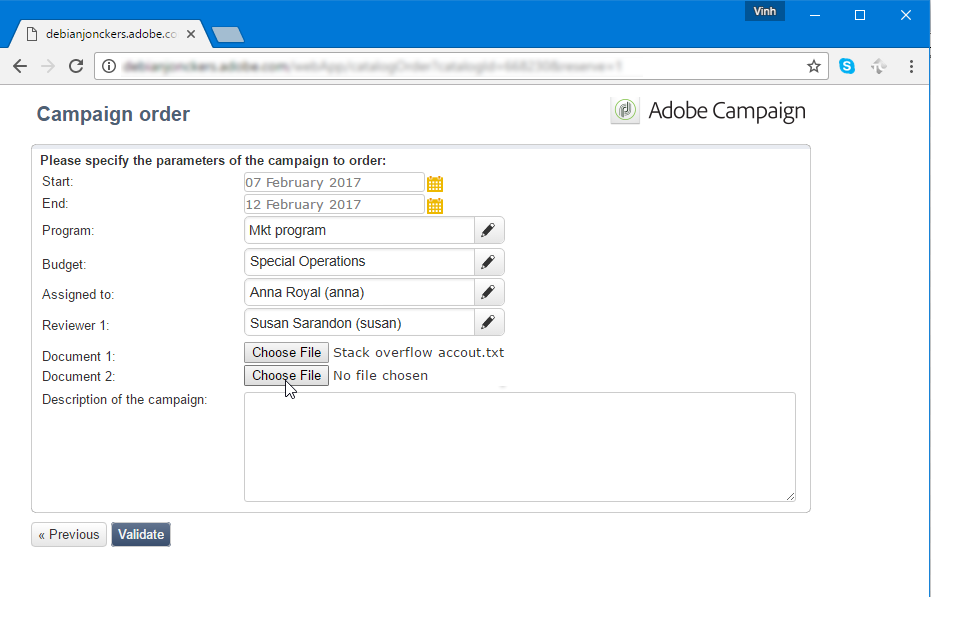
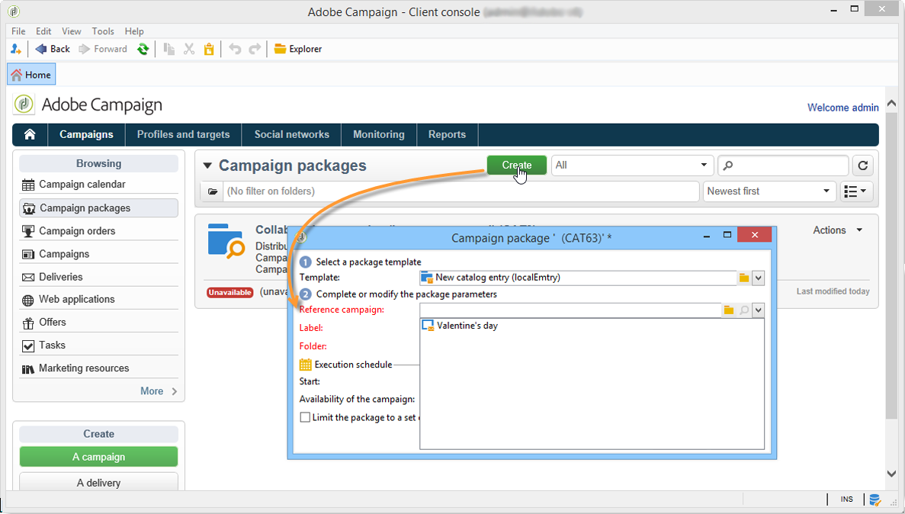
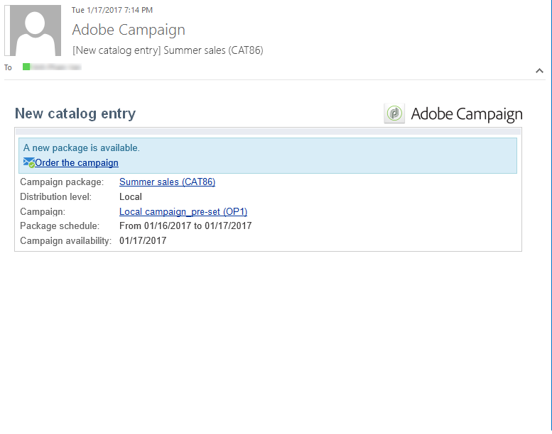
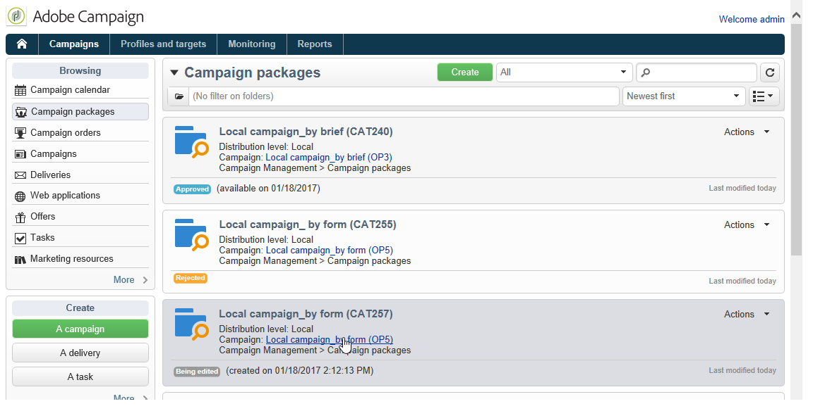

# Een lokale campagne maken{#creating-a-local-campaign}

Een lokale campagne is een geval dat van een malplaatje wordt gecreeerd dat in de lijst van **[!UICONTROL campaign packages]** met a **wordt van verwijzingen wordt voorzien specifiek uitvoeringsprogramma**. Zijn doel is om aan een lokale communicatie behoefte te voldoen gebruikend een campagnemalplaatje dat opstelling en gevormd door de centrale entiteit was. De belangrijkste fasen voor de uitvoering van een lokale actie zijn:

**voor de centrale entiteit**

1. Een lokale campagnemplate maken.
1. Campagnepakket maken op basis van een sjabloon.
1. Een campagnepakket publiceren.
1. Bevestigingsopdrachten.

**voor de lokale entiteit**

1. De campagne bestellen.
1. Campagnes uitvoeren.

## Een lokale campagnemalplaatje maken {#creating-a-local-campaign-template}

Om een campagnepakket tot stand te brengen, moet u eerst het **campagnemalplaatje** via de **[!UICONTROL Resources > Templates]** knoop creëren.

Als u een nieuwe lokale sjabloon wilt maken, dupliceert u de standaardsjabloon **[!UICONTROL Local campaign (opLocal)]** .

Geef uw campagnemalplaatje een naam en vul de beschikbare velden in.

Klik in het campagnevenster op de tab **[!UICONTROL Edit]** en klik vervolgens op de koppeling **[!UICONTROL Advanced campaign parameters...]** .

### Webinterface {#web-interface}

In het **Verdeelde marketing** lusje, kunt u het type van de interface van het Web kiezen en de standaardwaarden en parameters specificeren die moeten worden ingegaan wanneer een lokale entiteit een orde plaatst.

De webinterface komt overeen met een formulier dat door de lokale entiteit moet worden ingevuld bij het bestellen van de campagne.

Selecteer het type webinterface dat moet worden toegepast op de campagnes die op basis van de sjabloon worden gemaakt:

Er zijn vier typen webinterfaces beschikbaar:

* **[!UICONTROL By brief]** : lokale entiteit moet een beschrijving geven waarmee de campagneconfiguraties worden beschreven. Zodra de orde is goedgekeurd, vormt de centrale entiteit en voert de campagne als geheel uit.

  

* **[!UICONTROL By form]**: lokale entiteit heeft toegang tot een webformulier waarin ze, afhankelijk van de gebruikte sjabloon, de inhoud, het doel, de maximale grootte en de datum waarop het formulier wordt gemaakt en opgehaald, kunnen bewerken met verpersoonlijkingsvelden. Lokale entiteit kan het doel evalueren en de inhoud van dit webformulier voorvertonen.

  

  Het aangeboden formulier wordt opgegeven in een webtoepassing die moet worden geselecteerd in een vervolgkeuzelijst in het veld **[!UICONTROL web Interface]** in de koppeling **[!UICONTROL Advanced campaign parameters...]** van de sjabloon. Verwijs naar [ Creërend een lokale campagne (door vorm) ](examples.md#creating-a-local-campaign--by-form-).

  >[!NOTE]
  >
  >De webtoepassing die in dit voorbeeld wordt gebruikt, is een voorbeeld. U moet een specifieke web-app maken om een formulier te kunnen gebruiken.

  

* **[!UICONTROL By external form]**: lokale entiteit heeft toegang tot campagneparameters in zijn Extranet (niet Adobe Campaign). Deze parameters zijn identiek aan die van a **lokale campagne (door vorm)**.
* **[!UICONTROL Pre-set]**: lokale entiteit bestelt campagne met het standaardformulier, zonder het te lokaliseren.

  

### Standaardwaarden {#default-values}

Selecteer de **[!UICONTROL Default values]** die lokale entiteiten moeten invullen. Bijvoorbeeld:

* de datum van contact en extractie;
* doelkenmerken (leeftijdssegment, enz.).

Vul de velden **[!UICONTROL Parent marketing program]** en **[!UICONTROL Charge]** in.

### Goedkeuringen {#approvals}

Via de koppeling **[!UICONTROL Advanced parameters for campaign entry]** kunt u het maximumaantal revisoren opgeven.

Revisoren worden door de lokale entiteit ingevoerd bij het bestellen van de campagne.

Als u geen controleurs voor een campagne wilt noemen, ga 0 in.

### Documenten {#documents}

U kunt lokale entiteitsexploitanten toestaan om documenten (tekstdossiers, spreadsheets, beelden, campagnebeschrijvingen, enz.) aan de lokale campagne te verbinden wanneer het creëren van de orde. Met de koppeling **[!UICONTROL Advanced parameters for campaign entry...]** kunt u het aantal documenten beperken. U doet dit door het maximum toegestane aantal in te voeren in het veld **[!UICONTROL Number of documents]** .

Als u een campagnepakket bestelt, wordt in het formulier voorgesteld om zoveel documenten te koppelen als in het desbetreffende veld in de sjabloon worden aangegeven.

Als u geen veld voor het uploaden van documenten wilt weergeven, typt u **[!UICONTROL 0]** in het veld **[!UICONTROL Number of documents]** .

>[!NOTE]
>
>**[!UICONTROL Advanced parameters for campaign entry]** kan worden gedeactiveerd door **[!UICONTROL Do not display the page used to enter the campaign parameters]** te controleren.

### Workflow {#workflow}

Maak op het tabblad **[!UICONTROL Targeting and workflows]** de campagneworkflow die de **[!UICONTROL Default values]** opgeeft in **[!UICONTROL Advanced campaign parameters...]** en de leveringen maakt.

Dubbelklik op de **[!UICONTROL Query]** -activiteit om deze te configureren volgens de opgegeven **[!UICONTROL Default values]** .

### Levering {#delivery}

Klik op het tabblad **[!UICONTROL Audit]** op het pictogram **[!UICONTROL Detail...]** om de **[!UICONTROL Scheduling]** voor de geselecteerde levering weer te geven.

Met het pictogram **[!UICONTROL Scheduling]** kunt u de contactpersoon en uitvoeringsdatum van de levering configureren.

Indien nodig, vorm de maximumgrootte van de levering:

Zoek de HTML van je levering. Gebruik in **[!UICONTROL Delivery > Current order > Additional fields]** bijvoorbeeld het veld **[!UICONTROL Age segment]** om de levering te zoeken op basis van de leeftijd van het doel.

Sla uw campagnemalplaatje op. U kunt deze nu gebruiken vanuit de **[!UICONTROL Campaign packages]** -weergave op het tabblad **[!UICONTROL Campaigns]** door op de knop **[!UICONTROL Create]** te klikken.

>[!NOTE]
>
>De malplaatjes van de campagne en hun algemene configuratie worden gedetailleerd in [ deze pagina ](../campaigns/marketing-campaign-templates.md).

## Het campagnepakket maken {#creating-the-campaign-package}

Het campagnemalplaatje kan alleen beschikbaar worden voor lokale entiteiten als het aan de lijst wordt toegevoegd. Daartoe moet het centrale agentschap een nieuw pakket opstellen.

Voer de volgende stappen uit:

1. In de **[!UICONTROL Navigation]** sectie op de **2} pagina van Campagnes {, klik de **[!UICONTROL Campaign packages]**verbinding.**
1. Klik op de knop **[!UICONTROL Create]**.

   

1. De sectie boven het venster laat u het  eerder gespecificeerde malplaatje van het campagnepakket selecteren.

   Standaard wordt de sjabloon **[!UICONTROL New local campaign package (localEmpty)]** gebruikt voor lokale campagnes.

1. Geef het label, de map en het uitvoeringsschema voor het campagnemakket op.

### Datums {#dates}

De begin- en einddatum bepalen de zichtbaarheidsperiode van de campagne in de lijst met campagnepakketten.

De beschikbaarheidsdatum is de datum waarop de campagne voor lokale entiteiten (aan orde) beschikbaar zal worden.

>[!CAUTION]
>
>Als een lokale entiteit de campagne niet vóór de deadline reserveert, zal zij deze niet kunnen gebruiken.

Deze informatie is te vinden in het aan lokale agentschappen verzonden kennisgevingsbericht, zoals hieronder wordt getoond:

### Doelgroep {#audience}

Voor een lokale campagne kan de centrale entiteit de betrokken lokale entiteiten specificeren door **[!UICONTROL Limit the package to a set of local entities]** te controleren.

### Aanvullende instellingen {#additional-settings}

Nadat het pakket is opgeslagen, kan de centrale entiteit het bewerken via het tabblad **[!UICONTROL Edit]** .

Vanaf het tabblad **[!UICONTROL General]** kan de centrale entiteit:

* de beoordelaar(s) voor het campagnepakket configureren via de koppeling **[!UICONTROL Approval parameters...]** ,
* het uitvoeringsschema te herzien;
* lokale entiteiten toevoegen of verwijderen.

>[!NOTE]
>
>Door gebrek, kan elke entiteit tot a **lokale campagne** slechts eenmaal opdracht geven.
>   
>Schakel de optie **[!UICONTROL Enable multiple creation]** in als u meerdere lokale campagnes wilt maken op basis van het campagnepakket.

### Meldingen {#notifications}

Wanneer een campagne beschikbaar wordt of wanneer de registratietermijn wordt bereikt, wordt een bericht verzonden naar de exploitanten van de lokale berichtgroep. Voor meer op dit, verwijs naar [ Organisatorische entiteiten ](about-distributed-marketing.md#organizational-entities).

## Een campagne bestellen {#ordering-a-campaign}

Campagnepakketten worden toegankelijk voor lokale entiteiten zodra ze zijn goedgekeurd en de uitvoeringsperiode ervan is begonnen. Lokale entiteiten ontvangen een e-mail met de mededeling dat er een nieuw campagnepakket beschikbaar is (zodra de beschikbaarheidsdatum is bereikt).

>[!NOTE]
>
>Als sommige lokale entiteiten bij het creëren van het campagnepakket werden gespecificeerd, zullen zij de enige zijn om een bericht te ontvangen. Als er geen lokale entiteit is opgegeven, ontvangen alle lokale entiteiten een kennisgeving.

Om een campagne van de centrale entiteit te gebruiken, moet de lokale entiteit het bevel geven.

Een campagne bestellen:

1. Klik op **[!UICONTROL Order campaign]** in het meldingsbericht of op de bijbehorende knop in Adobe Campaign.

   Voer uw id en wachtwoord in om de campagne te bestellen. De interface bestaat uit een set pagina&#39;s die zijn gedefinieerd in een webtoepassing.

1. Voer de benodigde gegevens in op de eerste pagina (orderlabel en opmerking) en klik op **[!UICONTROL Next]** .

   

1. Voltooi de beschikbare parameters en keur de volgorde goed.

1. Er wordt een kennisgeving verzonden aan de beheerder van de organisatorische entiteit waartoe de lokale entiteit behoort, om deze bestelling goed te keuren.

   

1. De informatie wordt geretourneerd aan de lokale en centrale entiteiten. Hoewel lokale entiteiten alleen hun eigen orders kunnen bekijken, kan de centrale entiteit alle orders van elke lokale entiteit bekijken, zoals hieronder wordt getoond:

   

   Operatoren kunnen ordergegevens weergeven:

   

   Het tabblad **[!UICONTROL Edit]** bevat informatie die door de lokale entiteit is ingevoerd tijdens het bestellen van de campagne.

   

1. De order moet door de centrale entiteit worden goedgekeurd.

   

   Voor meer op dit, verwijs naar het [ proces van de Goedkeuring ](#approval-process) sectie.

1. De lokale exploitant wordt dan meegedeeld dat de campagne beschikbaar is: campagnebeschikbaarheid kan in de lijst van campagnepakketten binnen de **Campagnes** tabel worden gevonden. De campagne kan dan worden gebruikt. Voor meer op dit, verwijs naar [ Toegang hebbend tot campagnes ](accessing-campaigns.md).

   Met de optie **[!UICONTROL Start targeting with order approval]** kan de lokale entiteit de campagne uitvoeren zodra de bestelling is goedgekeurd.

   

## Een bestelling goedkeuren {#approving-an-order}

Om een campagneorder te bevestigen, moet de centrale entiteit het goedkeuren.

Het **[!UICONTROL Campaign orders]** overzicht, dat via het **wordt betreden Campagnes** lusje laat u de status van campagneorden bekijken en hen goedkeuren.

>[!NOTE]
>
>Lokale entiteiten kunnen wijzigingen in de bestelling aanbrengen totdat deze is goedgekeurd.

### Goedkeuringsproces {#approval-process}

#### E-mailmelding {#email-notification}

Wanneer een campagne wordt besteld door een lokale entiteit, worden de revisoren hiervan via e-mail op de hoogte gebracht, zoals hieronder wordt getoond:

>[!NOTE]
>
>Het selecteren van recensenten wordt voorgesteld in de [ sectie van recensenten ](#reviewers). Ze kunnen de bestelling accepteren of afwijzen.

#### Goedkeuren via de clientconsole {#approving-via-the-adobe-campaign-console}

De bestelling kan ook worden goedgekeurd via de Client Console, in het overzicht van de campagnevolgorde. Als u een volgorde wilt goedkeuren, selecteert u deze en klikt u op **[!UICONTROL Approve the order]** .

>[!NOTE]
>
>De campagne kan nog worden uitgegeven en worden aangepast tot de datum van de campagnebeschikbaarheid. Lokale entiteiten kunnen de campagne ook afwijzen door op de knop **[!UICONTROL Cancel]** te klikken.

#### Een campagne maken {#creating-a-campaign}

Zodra een campagneorde wordt goedgekeurd, kan het door de lokale entiteit worden gevormd en worden uitgevoerd.

Voor meer op dit, verwijs naar [ Toegang hebbend tot campagnes ](accessing-campaigns.md).

### Afwijzing van een goedkeuring {#rejecting-an-approval}

De met de goedkeuring belaste exploitant kan een bestelling of een campagnepakket afwijzen.

Indien de controleur een bestelling afwijst, wordt de desbetreffende kennisgeving automatisch naar de betrokken lokale entiteiten verzonden: daarin wordt de opmerking weergegeven die is ingevoerd door de exploitant die de goedkeuring heeft geweigerd.

De informatie wordt getoond op de lijst van campagnepakketpagina of op de pagina van de campagneorde. Als ze toegang hebben tot de Adobe Campaign Client Console, worden lokale entiteiten op de hoogte gesteld van deze afwijzing.

Ze kunnen de verwante opmerking weergeven op het tabblad **[!UICONTROL Edit]** van het campagnepakket.

### Revisoren {#reviewers}

Elke keer dat goedkeuring wordt vereist, worden revisoren via e-mail op de hoogte gesteld.

Voor elke lokale entiteit worden revisoren geselecteerd voor goedkeuring van de campagneorder en goedkeuring van de campagne. Voor meer informatie bij het selecteren van lokale recensenten, verwijs naar [ Organisatorische entiteiten ](about-distributed-marketing.md#organizational-entities).

>[!NOTE]
>
>Om deze selectie mogelijk te maken, moet de goedkeuring van de bestelling nog niet effectief zijn.

### Een bestelling annuleren {#canceling-an-order}

De centrale instantie kan een bestelling annuleren met de knop **[!UICONTROL Delete]** op het orderdashboard.

Hiermee annuleert u de campagne in de weergave **[!UICONTROL Campaign orders]** .
