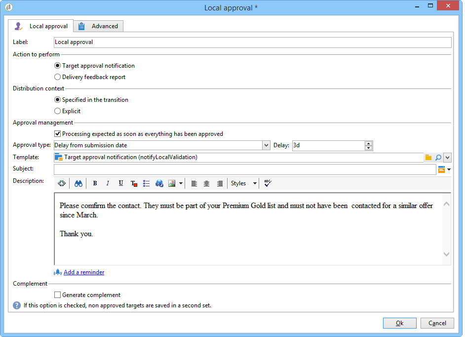
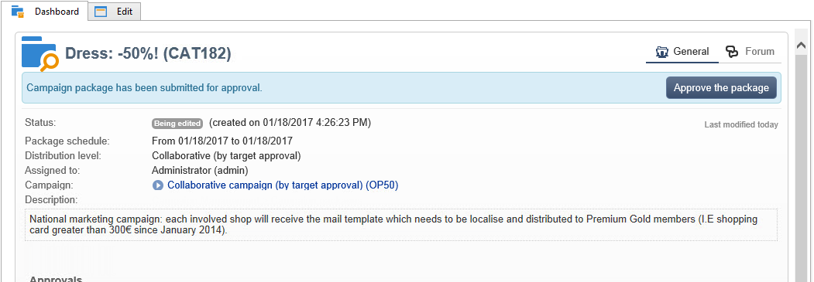
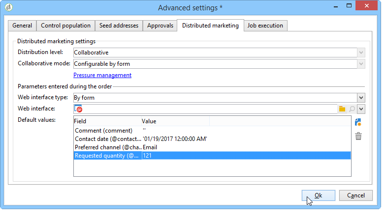

# Distributed Marketing samples{#distributed-marketing-samples}


## Een lokale campagne maken (op formulier) {#creating-a-local-campaign--by-form-}

**door vorm** typeWebinterface impliceert het gebruiken van a **Webtoepassing**. Afhankelijk van zijn configuratie, kan deze Webtoepassing om het even welk type van bepaalde gepersonaliseerde elementen bevatten. U kunt bijvoorbeeld koppelingen voorstellen om het doel, het budget, de inhoud, enzovoort te evalueren. via specifieke API&#39;s.

>[!NOTE]
>
>De toepassing van het Web die in dit voorbeeld wordt gebruikt is geen app van het Web die uit-van-de-doos met Adobe Campaign komt. Als u een formulier in een campagne wilt gebruiken, moet u de toegewijde webtoepassing maken.

Wanneer u de campagnemalplaatje maakt, klikt u op het pictogram **[!UICONTROL Zoom]** in de optie **[!UICONTROL Web interface]** van de koppeling **[!UICONTROL Advanced campaign parameters...]** om toegang te krijgen tot details van de webtoepassing.


>[!NOTE]
>
>De toepassingsparameters van het Web zijn slechts beschikbaar in het campagnemalplaatje.

In het **[!UICONTROL Edit]** lusje, selecteer de **orde van de Campagne** activiteit en open het om tot zijn inhoud toegang te hebben.


In dit voorbeeld, omvat de **orde van de Campagne** activiteit:

* velden die de lokale entiteit tijdens de bestelling moet invoeren;

  

* koppelingen die de lokale entiteit in staat stellen de campagne te evalueren (bijvoorbeeld het doel, het budget, de inhoud, enz.);

  

* scripts waarmee u het resultaat van deze evaluaties kunt berekenen en weergeven.

  

In dit voorbeeld worden de volgende API&#39;s gebruikt:

* Voor de doelevaluatie:

  ```
  var res = nms.localOrder.EvaluateTarget(ctx.localOrder);
  ```

* Voor de begrotingsevaluatie

  ```
  var res = nms.localOrder.EvaluateDeliveryBudget(ctx.@deliveryId, NL.XTK.parseNumber(ctx.@compt));
  ```

* Voor de evaluatie van de inhoud

  ```
  var res = nms.localOrder.EvaluateContent(ctx.localOrder, ctx.@deliveryId, "html", resSeed.@id);
  ```

## Een samenwerkingscampagne maken (door goedkeuring als doel) {#creating-a-collaborative-campaign--by-target-approval-}

### Inleiding {#introduction}

U bent de marketingmanager voor een groot kledingmerk dat een online winkel en verschillende boutiques in de hele VS heeft. Nu de lente is aangekomen, besluit u om een speciale aanbieding te maken die uw beste klanten 50% korting op alle jurken in uw catalogus zal geven.

Dit aanbod is gericht op de beste klanten van je Amerikaanse winkels, dat wil zeggen die meer dan $300 hebben uitgegeven sinds het begin van het jaar.

Daarom besluit u Distributed Marketing te gebruiken om een samenwerkingscampagne (door doelgoedkeuring) te maken waarmee u de beste klanten van uw winkels (gegroepeerd per regio) kunt selecteren, die de e-maillevering met de speciale aanbieding zullen ontvangen.

Het eerste deel van dit voorbeeld illustreert uw lokale entiteiten die het bericht van de campagneverwezenlijking ontvangen, en hoe zij het kunnen gebruiken om de campagne te evalueren en het te bestellen.

In het tweede deel van dit voorbeeld wordt uitgelegd hoe u uw campagne kunt maken.

De stappen zijn als volgt:

**voor de lokale entiteit**

1. Gebruik het bericht van de campagneverwezenlijking om tot de lijst van contacten toegang te hebben die door de centrale entiteit wordt geselecteerd.
1. Selecteer de contacten en keur participatie goed.

**voor de centrale entiteit:**

1. Maak een **[!UICONTROL Data distribution]** -activiteit.
1. Maak de samenwerkingscampagne.
1. Publiceer de campagne.

### Lokale entiteit {#local-entity-side}

1. De lokale entiteiten die zijn gekozen om deel te nemen aan de campagne ontvangen een e-mailkennisgeving.

   

1. Door op de koppeling **[!UICONTROL Access your contact list and approve targeting]** te klikken krijgt de lokale entiteit toegang (via webbrowser) tot de lijst met clients die voor de campagne zijn geselecteerd.

   

1. De lokale entiteit maakt de controle van bepaalde contacten uit de lijst ongedaan omdat er al sinds het begin van het jaar contact met hen is opgenomen voor een soortgelijk aanbod.

   

Zodra de controles zijn goedgekeurd, kan de campagne automatisch beginnen.

### Centrale entiteitzijde {#central-entity-side}

#### Een activiteit voor gegevensdistributie maken {#creating-a-data-distribution-activity}

1. Als u een samenwerkingscampagne wilt instellen (door goedkeuring als doel), moet u eerst een **[!UICONTROL Data distribution activity]** maken. Klik op het pictogram **[!UICONTROL New]** in de map **[!UICONTROL Resources > Campaign management > Data distribution]** van de Campagneverkenner.

   

1. Op het tabblad **[!UICONTROL General]** moet u het volgende opgeven:

   * de **[!UICONTROL Targeting dimension]** . Hier wordt de **distributie van Gegevens** uitgevoerd op de **Ontvangers**.
   * de **[!UICONTROL Distribution type]** . U kunt a **Vaste grootte** of a **Grootte als percentage** kiezen.
   * de **[!UICONTROL Assignment type]** . Selecteer de **Lokale entiteit** optie.
   * de **[!UICONTROL Distribution type]** . Hier is het **[!UICONTROL Origin (@origin)]** veld in de tabel Ontvanger waarmee u de relatie tussen de contactpersoon en de lokale entiteit kunt identificeren.
   * Het veld **[!UICONTROL Approval storage]** . Selecteer de **Lokale goedkeuring van ontvanger** optie.

1. Geef op het tabblad **[!UICONTROL Breakdown]** het volgende op:

   * de **[!UICONTROL Distribution field value]** , die overeenkomt met de lokale entiteiten die betrokken zijn bij de komende campagne.
   * de lokale entiteit **[!UICONTROL label]** .
   * de **[!UICONTROL Size]** (vast of als een percentage). **0 standaardwaarde** impliceert het selecteren van alle ontvangers verbonden aan de lokale entiteit.

   

1. Sla de nieuwe gegevensdistributie op.

#### Een collaboratieve campagne maken {#creating-a-collaborative-campaign}

1. Maak een nieuwe **[!UICONTROL collaborative campaign (by target approval)]** in de map **[!UICONTROL Campaign management > Campaign]** van de Campagneverkenner.
1. Maak op het tabblad **[!UICONTROL Targeting and workflows]** een workflow voor uw campagne. Dit moet a **Gesplitste** activiteit bevatten waarin **[!UICONTROL Record count limitation]** door de **[!UICONTROL Data distribution]** activiteit wordt bepaald.

   

1. Voeg een handeling **[!UICONTROL Local approval]** toe waar u kunt opgeven:

   * de inhoud van het bericht die naar de lokale entiteiten in de kennisgeving zal worden verzonden;
   * de goedkeuringsherinnering;
   * de verwachte verwerking van de campagne.

   

1. Sla uw record op.

#### De campagne publiceren {#publishing-the-campaign}

U kunt het pakket van de a **campagne** van het **[!UICONTROL Campaigns]** lusje nu toevoegen.

1. Kies uw **[!UICONTROL Reference campaign]** . Op het tabblad **[!UICONTROL Edit]** van het pakket kunt u de **[!UICONTROL Approval mode]** selecteren die u voor uw campagne wilt gebruiken:

   * in **Hand** wijze, nemen de lokale entiteiten aan de campagne deel als zij de uitnodiging van de centrale entiteit goedkeuren. Zij kunnen vooraf geselecteerde contacten schrappen als zij willen en goedkeuring van de manager noodzakelijk is om hun deelname aan de campagne te bevestigen.
   * op **Automatische** wijze, moeten de lokale entiteiten aan de campagne deelnemen, tenzij zij zich van het verwijderen. Ze kunnen contacten verwijderen zonder goedkeuring.

   

1. Op het tabblad **[!UICONTROL Description]** kunt u zowel een beschrijving voor uw campagne als alle documenten toevoegen die naar de lokale entiteiten moeten worden verzonden.

   

1. Goedkeuren, vervolgens start u de workflow om het pakket te publiceren en beschikbaar te maken voor alle lokale entiteiten in een lijst met pakketten.

   

## Een samenwerkingscampagne maken (op formulier) {#creating-a-collaborative-campaign--by-form-}

### Inleiding {#introduction-1}

U bent de marketingmanager voor een groot make-upmerk met een online winkel en verschillende boutiques in de hele VS. Om je wintervoorraad te ontladen en ruimte te maken voor je nieuwe voorraad, besluit je een speciale aanbieding te maken die gericht is op twee categorieën klanten: de ouder dan 30, aan wie je leeftijdsgevoelige huidverzorgingsproducten aanbiedt, en de jonger dan 30, aan wie je de meest elementaire huidverzorgingsproducten aanbiedt.

Daarom besluit u om Distributed Marketing te gebruiken om een samenwerkingscampagne (per formulier) te maken waarmee u clients van uw verschillende winkels kunt selecteren op basis van het leeftijdsbereik. Deze klanten ontvangen een e-maillevering met een speciaal voorstel dat op basis van hun leeftijdsbereik is aangepast.

Het eerste deel van dit voorbeeld illustreert uw lokale entiteiten die het bericht van de campagneverwezenlijking ontvangen, en hoe zij het kunnen gebruiken om de campagne te evalueren en het te bestellen.

In het tweede deel van dit voorbeeld wordt uitgelegd hoe u uw campagne kunt maken.

De stappen zijn als volgt:

**voor de lokale entiteit**

1. Gebruik het bericht voor het maken van de campagne om het onlineformulier te openen.
1. Pas de campagne aan (doel, inhoud, leveringsvolume).
1. Controleer deze velden en wijzig deze indien nodig.
1. Uw deelname goedkeuren.
1. De manager van de lokale entiteit (of de centrale entiteit) keurt uw configuratie en participatie goed.

**voor de centrale entiteit:**

1. Maak de samenwerkingscampagne.
1. Configureer de **[!UICONTROL Advanced campaign parameters...]** zoals u dat zou doen voor een lokale campagne.
1. Configureer de campagneworkflow en de levering op dezelfde manier als voor een lokale campagne.
1. Het webformulier bijwerken.
1. Maak het campagnepakket en publiceer het.

### Lokale entiteit {#local-entity-side-1}

1. De lokale entiteiten die voor deelname aan de campagne zijn geselecteerd, ontvangen een e-mailbericht waarin ze op de hoogte worden gesteld van hun deelname aan de campagne.

   

1. De lokale entiteiten vullen het gepersonaliseerde formulier in en daarna:

   * het streefcijfer en de begroting te evalueren;
   * een voorvertoning van de inhoud van de levering;
   * hun deelname goedkeuren.

     

1. De exploitant die belast is met het valideren van orders, keurt hun deelname goed.

   

### Centrale entiteitzijde {#central-entity-side-1}

1. Om een samenwerkingscampagne (door vorm) uit te voeren, moet u een campagne creëren gebruikend de **Samenwerken campagne (door vorm)** malplaatje.

   

1. Klik op de tab **[!UICONTROL Edit]** van de campagne op de koppeling **[!UICONTROL Advanced campaign parameters...]** om de campagne als een lokale campagne te configureren. Verwijs naar [ Creërend een lokale campagne (door vorm) ](#creating-a-local-campaign--by-form-).

   

1. Configureer de campagneworkflow en het webformulier. Verwijs naar [ Creërend een lokale campagne (door vorm) ](#creating-a-local-campaign--by-form-).
1. Maak uw campagnepakket door het uitvoeringsschema en de betrokken lokale entiteiten op te geven.

   

1. Voltooi de pakketconfiguratie door de goedkeuringsmodus te selecteren op het tabblad **[!UICONTROL Edit]** .

   

1. Via het tabblad **[!UICONTROL Description]** kunt u een beschrijving van het campagnepakket invoeren, een meldingsbericht dat naar lokale entiteiten moet worden verzonden wanneer het pakket wordt gepubliceerd en informatieve documenten aan uw campagnepakket toevoegen.

   

1. Het pakket goedkeuren om het te publiceren.

   
