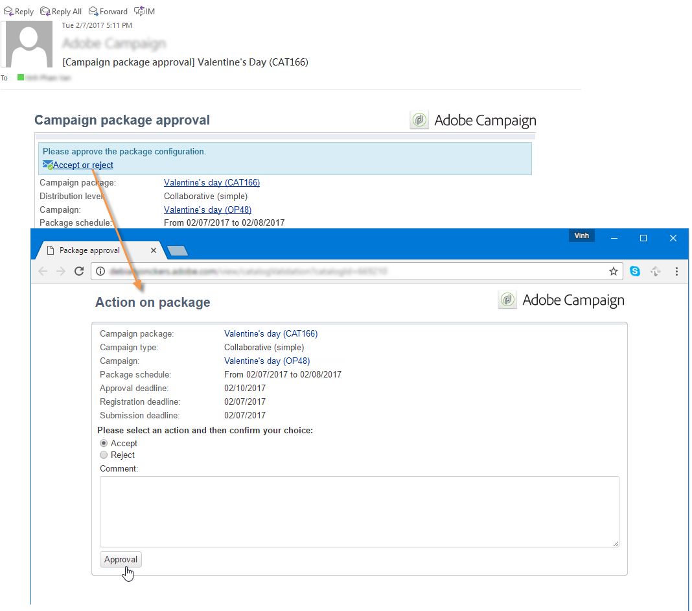

# Het campagnepakket publiceren{#publishing-the-campaign-package}

Operatoren van centrale entiteiten publiceren campagnes die zij aan lokale entiteiten in de **[!UICONTROL list of campaign packages]**.

Voordat ze in de lijst met campagnepakketten kunnen worden gepubliceerd, moeten ze door de centrale entiteit worden goedgekeurd. Hiertoe kunt u een revisor of groep revisoren opgeven via de **[!UICONTROL Approval parameters]** koppeling in het campagnepakket .

## Een revisor toewijzen {#assigning-a-reviewer}

Klik op de knop **[!UICONTROL Approval parameters]** in het campagnepakket en kiest u de relevante revisor in de vervolgkeuzelijst.

Vervolgens kunt u het goedkeuringsproces starten door op **[!UICONTROL Submit for approval]**.

Vervolgens wordt een meldingsbericht naar de controleur verzonden om de beschikbaarheid van dit campagnepakket te bevestigen. Het bericht bevat een koppeling waarmee u de goedkeuring via webtoegang kunt accepteren of afwijzen.

>[!NOTE]
>
>Op het niveau van de organisatie kunt u ook revisoren opgeven om orders goed te keuren. Raadpleeg voor meer informatie hierover [Organisatorische entiteiten](about-distributed-marketing.md#organizational-entities).

## Andere revisoren toevoegen {#adding-other-reviewers}

U kunt andere revisoren toevoegen van de **[!UICONTROL Edit...]** link in het campagnepakket **[!UICONTROL Approval parameters...]** tab.

## Goedkeuringstijdlijn {#approval-periods}

Standaard krijgen revisoren drie dagen vanaf de verzenddatum de tijd om de goedkeuring te verwerken.

In het venster Revisoren bewerken kunt u ook herinneringen instellen voor het verzenden van een of meerdere berichten als er geen campagnepakket is goedgekeurd. Om dit te doen, klik **[!UICONTROL Add reminder]** koppeling, dan de **[!UICONTROL Add]** knop.

Herinneringen kunnen op een bepaalde datum worden verzonden en/of **x** dagen na de verzenddatum. Het type herinnering kan in de eerste kolom van de lijst van herinneringen worden gevormd. In het onderstaande voorbeeld ontvangen de controleurs een herinneringsbericht op de website op 11-01-2023, d.w.z. twee dagen voor de datum die is geselecteerd in het **[!UICONTROL Date]** kolom en een tweede herinnering één dag vóór het einde van de goedkeuringsperiode, d.w.z. twee dagen na de datum van indiening voor goedkeuring.

Als het pakket eenmaal is gedefinieerd en ter goedkeuring is ingediend, wordt het uitvoeringsschema weergegeven in het dialoogvenster **[!UICONTROL Audit]** tab. Het toont de verwerkingstijd die op vorige configuratie wordt berekend, evenals de data van alle gevormde herinneringen wordt berekend.

## Goedkeuren via de clientconsole {#approving-via-the-adobe-campaign-console}

Als er geen controleur is opgegeven of als geen van de aangemelde exploitanten het pakket heeft goedgekeurd, **[!UICONTROL Approve the package]** de knoop laat u rechtstreeks aan goedkeuring van het campagnepakket verdergaan **[!UICONTROL Dashboard]** of uit het overzicht van de pakketten.

Na goedkeuring wordt de campagne gepubliceerd, toegevoegd aan de lijst en kunnen lokale entiteiten deze gebruiken zodra de beschikbaarheidsdatum is bereikt. Als de lokale entiteiten tijdens het maken van de campagne zijn opgegeven, wordt een bericht verzonden naar de operatoren in de kennisgevingsgroep om hen te laten weten dat de campagne beschikbaar is. Als er vooraf geen entiteit is opgegeven, is de campagne standaard beschikbaar voor alle lokale entiteiten. Raadpleeg voor meer informatie hierover [Organisatorische entiteiten](about-distributed-marketing.md#organizational-entities).
