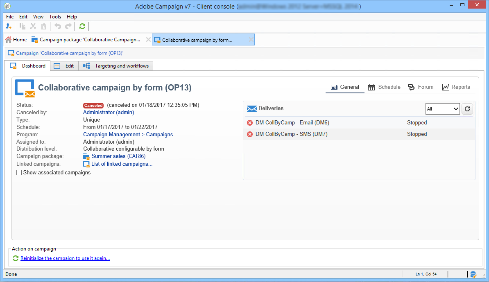

# Een campagne bijhouden{#tracking-a-campaign}

De centrale entiteitexploitanten kunnen campagneorden in de lijst van campagnepakketten volgen.

Hierdoor kunnen ze:

* [ de pakketten van de Filter ](#filter-packages),
* [ geef pakketten ](#edit-packages) uit,
* [ annuleert een pakket ](#cancel-a-package),
* [ herinitialiseer een pakket ](#reinitializing-a-package).

## Filterpakketten {#filter-packages}

Vanuit het tabblad **[!UICONTROL Campaigns]** kunt u de lijst weergeven van **[!UICONTROL Campaign packages]** die alle bestaande campagnes voor gedistribueerde marketing groepeert. U kunt deze lijst zo filteren dat alleen campagnes worden weergegeven die worden gepubliceerd, laat, in afwachting van goedkeuring, enzovoort. Klik hiertoe op de koppelingen in de bovenste sectie van deze weergave of gebruik de koppeling **[!UICONTROL Filter list]** en selecteer de status van het campagnepakket die u wilt weergeven.

## Pakketten bewerken {#edit-packages}

Op de pagina **[!UICONTROL Campaign packages]** kunt u de samenvatting van elk pakket weergeven.

Deze samenvatting bevat de volgende informatie: label, type campagne en de naam van de campagne waaruit deze is gemaakt, en de map.

Klik op de pakketnaam om deze te bewerken. U kunt ook bestellingen bekijken door de lokale entiteiten en door hun status.

Deze informatie wordt ook aangeboden in de **[!UICONTROL Campaign orders]** -weergave waarin alle bestellingen worden vermeld.

De centrale operator kan de volgorde bewerken. Er zijn twee manieren om dit te doen:

1. De exploitant kan de ordenaam klikken om het uit te geven: dit toont de orddetails.

   

   Op het tabblad **[!UICONTROL Edit > General]** kunt u informatie weergeven die door de lokale entiteit is ingevoerd toen deze de campagne heeft besteld.

   

1. De exploitant kan het campagnepakketetiket klikken om het uit te geven en bepaalde montages te veranderen.

   

## Een pakket annuleren {#cancel-a-package}

De centrale entiteit kan een campagnepakket op elk ogenblik annuleren.

Klik op **[!UICONTROL Cancel]** in het campagnepakket **[!UICONTROL Dashboard]** .

In het veld **[!UICONTROL Comment]** kunt u de annulering uitvullen.

Voor **lokale campagnes**, verwijdert het annuleren van een pakket het uit de lijst van beschikbare marketing campagnes.

Voor **samenwerkings campagnes**, die een pakket annuleert brengt talrijke acties teweeg:

1. Alle bestellingen met betrekking tot dit pakket worden geannuleerd.

   

1. De referentiecampagne wordt geannuleerd en alle actieve processen (workflows, leveringen) worden gestopt,

   

1. Alle betrokken lokale entiteiten ontvangen een kennisgeving.

   

Geannuleerde pakketten kunnen desgewenst nog steeds door de centrale entiteit worden benaderd en opnieuw worden geïnitialiseerd (zie hieronder). Ze zullen pas weer aan lokale entiteiten worden aangeboden nadat ze zijn goedgekeurd en van start zijn gegaan. Het herinitialisatieproces van het pakket wordt hieronder weergegeven.

## Een pakket opnieuw initialiseren {#reinitializing-a-package}

Campagnepakketten die al zijn gepubliceerd, kunnen opnieuw worden geïnitialiseerd, gewijzigd en ter beschikking van lokale entiteiten worden gesteld.

1. Selecteer het betreffende pakket.
1. Klik op de koppeling **[!UICONTROL Reinitialize the package to reuse it]** en klik op **[!UICONTROL OK]** .

   

1. Klik op de knop **[!UICONTROL Save]** om pakketherinitialisatie goed te keuren.

   

1. De pakketstatus verandert in **[!UICONTROL Being edited]** . Wijzig, keur en publiceer het opnieuw om het in de lijst van campagnepakket te herstellen goed te keuren.

>[!NOTE]
>
>U kunt geannuleerde campagnepakketten ook opnieuw initialiseren.
