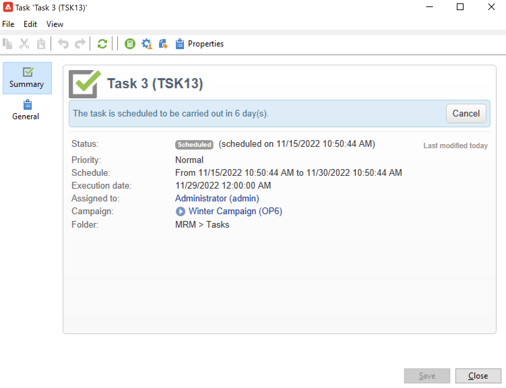
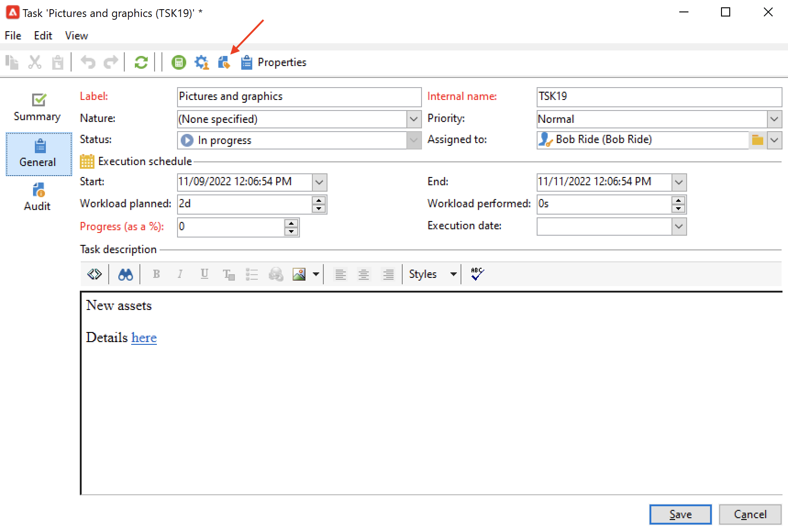
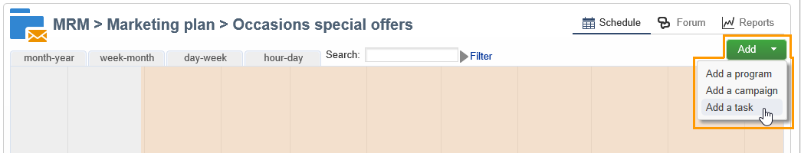
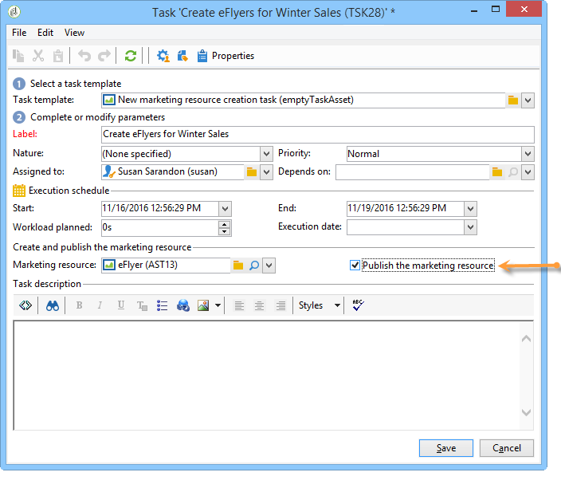
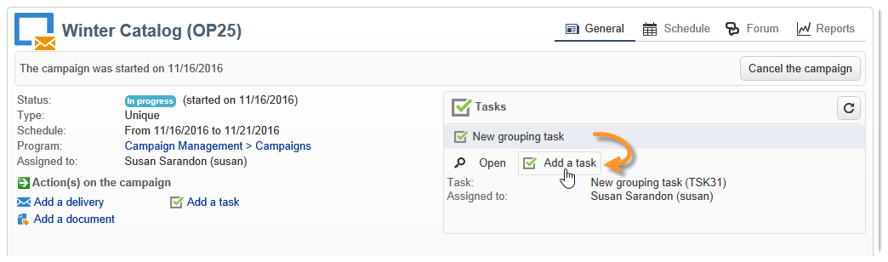

# Taken maken en beheren{#creating-and-managing-tasks}

Met Adobe Campaign kunt u taken maken en de volledige levenscyclus ervan rechtstreeks binnen de toepassing beheren. De uitvoering van programma&#39;s en campagnes kan worden onderverdeeld in taken die worden toegewezen aan Adobe Campaign-exploitanten of externe dienstverleners. In deze modus kunt u een open samenwerkingsomgeving maken waarin alle deelnemers aan het programma en externe deelnemers zijn opgenomen.

Taken kunnen worden gemaakt, weergegeven en gecontroleerd vanuit de takenlijst of het campagnemdashboard. Zij kunnen ook worden bekeken en bijgehouden in de schema&#39;s van het marketingplan, de programma&#39;s en de campagnes.

Taken worden aan de campagne gekoppeld en kunnen afhankelijkheden, d.w.z. bijbehorende taken, hebben. Elke taak heeft een status, prioriteit, geschatte belasting en bijbehorende kosten.

Alle taken worden gegroepeerd in een lijst die via **Campagnes** tab. Raadpleeg voor meer informatie hierover [Toegangstaken](#accessing-tasks).

Ze kunnen worden weergegeven in het programma waartoe ze behoren.

## Toegangstaken {#accessing-tasks}

### Taken weergeven {#displaying-tasks}

De taken worden weergegeven in de takenlijst die toegankelijk is via de **[!UICONTROL Campaigns]** tab.

U kunt alle taken van de huidige operator weergeven.

Raadpleeg voor meer informatie hierover [Uitvoerstatus van een taak](#execution-status-of-a-task) en [Voortgangsstatus van een taak](#progress-status-of-a-task).

### Filtertaken {#filtering-tasks}

Wanneer u deze weergave weergeeft, wordt deze automatisch gefilterd om alleen de **huidige operatortaken**. U kunt de taken ook filteren met de velden in de bovenste sectie van het venster.

### Taken bewerken {#editing-tasks}

Klik op een taak om deze te bewerken.

## Nieuwe taak maken {#creating-a-new-task}

Voer de volgende stappen uit om een taak te maken:

1. Bladeren naar de **[!UICONTROL Tasks]** in de **[!UICONTROL Campaigns]** en klik op **[!UICONTROL Create]**.

   

1. Voer de naam van de taak in en selecteer de campagne waaraan de taak is gekoppeld.
1. Stel de begin- en einddatum in.
1. Klikken **[!UICONTROL Save]** om de taak te maken.

   

U kunt ook een taak maken via het dashboard van een campagne: in dit geval wordt de taak automatisch gekoppeld aan de campagne waarvan deze is gemaakt.

Nadat een taak wordt gecreeerd, wordt het toegevoegd aan het campagneprogramma, het campagnesdashboard, en de lijst van taken. Als u een taak wilt bewerken, klikt u op de naam van de taak in de lijst met taken of selecteert u de taak in het programma of het campagnemdashboard en klikt u op **[!UICONTROL Open]**.

Zodra gecreeerd, kunt u de taak vormen door te bepalen:

* De manager en de deelnemers. [Meer informatie](#manager-and-participants)
* Het aanmaakschema. [Meer informatie](#execution-schedule)
* De vastgelegde kosten. [Meer informatie](#expenses-and-revenues)

U kunt ook toevoegen [revisoren](#reviewers) en [referentiedocumenten](#documents-referenced).

De levenscyclus van taken wordt weergegeven in [deze sectie](#life-cycle).

### Manager en deelnemers {#manager-and-participants}

Door gebrek, wordt de taak toegewezen aan de exploitant die het creeerde. Deze exploitant wordt op de hoogte gebracht wanneer een actie voor die taak wordt vereist.

U kunt een andere operator selecteren in het menu **[!UICONTROL Assigned to]** vervolgkeuzelijst.

>[!NOTE]
>
>Het beheer van de exploitant wordt gedetailleerd in [deze sectie](../../v8/start/gs-permissions.md).
>
>Alleen de beheerder die verantwoordelijk is voor een taak mag deze sluiten.

U kunt meer operatoren opgeven die bij de uitvoering van de taak zijn betrokken. Deze operatoren mogen de taak niet sluiten: zij mogen alleen de hun toegewezen taak goedkeuren.

Voer de volgende stappen uit om taakoperatoren toe te voegen:

1. Klik op de knop **[!UICONTROL Resources]** in de taakwerkbalk.

   

1. Klikken **[!UICONTROL Add]** en selecteert u de betrokken marktdeelnemers.
1. Voer de gebruikstarief in: dit vertegenwoordigt de werkbelasting die aan de exploitant voor de duur van taakuitvoering wordt toegewezen. Dit percentage is slechts een indicatie en wordt uitgedrukt als een percentage.

   

   Voor een taak waarvan het uitvoeringsschema bijvoorbeeld op 10 dagen is vastgesteld, zal een exploitant met een gebruiksfrequentie van 50% op deze taak voor de helft van zijn werktijd voor de tien dagen worden gemobiliseerd.

   Voor elke operator kunt u een geplande werkbelasting en een werkelijke werkbelasting invoeren. Deze tijdsduur is ook uitsluitend ter informatie.

1. U kunt een herinnering configureren via de **[!UICONTROL Add a reminder...]** koppeling. Een e-mailbericht wordt vóór de einddatum naar alle bij de taak betrokken exploitanten verzonden.

   

1. U kunt ook een melding verzenden voordat de taak wordt gestart. Selecteer de datum in het dialoogvenster **[!UICONTROL Initial notification]** veld.
1. Wanneer de einddatum is bereikt en de taak niet is afgesloten, kan een kennisgeving worden verzonden naar de in het **[!UICONTROL Assignee]** vervolgkeuzelijst.

Met het operatordashboard kunt u de werkbelasting controleren (andere lopende taken).

### Taakgoedkeuring {#reviewers}

Naast de deelnemers kunt u ook operatoren definiëren die de taak evalueren wanneer deze is gesloten.

Om dit te doen, klik **[!UICONTROL Enable task approval]** in de onderste sectie van het dialoogvenster **[!UICONTROL Resources]** venster. Dit kan een individuele exploitant, een groep exploitanten of een lijst van exploitanten zijn.

Als u een lijst met operatoren wilt opgeven, klikt u op de knop **[!UICONTROL Edit...]** rechts van de eerste controleur een koppeling maken en zoveel operatoren toevoegen als nodig is, zoals hieronder wordt getoond:

U kunt een goedkeuringsprogramma voor de taak in de lagere sectie van het configuratievenster bepalen. Standaard hebben revisoren drie dagen vanaf de verzenddatum om de taak goed te keuren. U kunt ook een herinnering toevoegen die automatisch vóór de deadline van de goedkeuring naar de betrokken operatoren wordt verzonden.

De persoon die met de taak is belast, kan zichzelf de taak toevertrouwen om de taak goed te keuren, ook al zijn hiervoor al andere exploitanten aangewezen. Als er geen controleur is gedefinieerd, worden de meldingen verzonden naar de persoon die verantwoordelijk is voor de taak. Alle andere Adobe Campaign-operatoren met **[!UICONTROL Administrator]** rechten kunnen deze taak ook goedkeuren . Ze ontvangen echter geen meldingen.

### Documenten waarnaar wordt verwezen {#documents-referenced}

U kunt [documenten en marketingmiddelen](managing-marketing-resources.md) naar een taak.

Dit doet u als volgt:

1. Open de taak en klik op de knop **[!UICONTROL Documents]** in de taakwerkbalk.

   

1. Klikken **[!UICONTROL Add]** en selecteert u het document dat u aan de taak wilt toevoegen. Hetzelfde proces toepassen voor marketingbronnen.

Documenten waarnaar wordt verwezen, worden toegevoegd aan de meldingen die worden verzonden naar de bij de taak betrokken exploitanten. Ze worden ook toegevoegd aan het taakdashboard.

### Uitvoeringsschema {#execution-schedule}

De geldigheidsperiode van een taak wordt aangegeven in de **[!UICONTROL Start]** en **[!UICONTROL End]** velden. De geplande belasting geeft de werklast weer die gedurende de periode moet worden uitgevoerd. Het wordt uitgedrukt in dagen of uren.

>[!NOTE]
>
>De levenscyclus van een taak wordt weergegeven in [Levenscyclus](#life-cycle).

De **[!UICONTROL Workload performed]** kunt u de voortgang van de taak met betrekking tot de geplande werkbelasting handmatig bijwerken.

De **[!UICONTROL Progress status]** van de taak, uitgedrukt als een percentage, automatisch wordt bijgewerkt op basis van de door de betrokken marktdeelnemers uitgevoerde taken. U kunt de gegevens handmatig invoeren.

Deze informatie kan in het taakdashboard worden bekeken.

Het is ook zichtbaar in het campagnelusje.

Als de einddatum van het schema voor het uitvoeren van de taak is bereikt maar de taak niet is voltooid, wordt de taak **[!UICONTROL Late]**. Er wordt ook een waarschuwingsbericht weergegeven voor waarschuwingsoperatoren.

Raadpleeg voor meer informatie hierover [Voortgangsstatus van een taak](#progress-status-of-a-task).

### Uitgaven en ontvangsten {#expenses-and-revenues}

U kunt gerelateerde uitgaven en verwachte inkomsten voor elke taak definiëren. Deze worden berekend en vervolgens geconsolideerd voor de campagne waaraan de taak is gekoppeld.

Klik op de knop **[!UICONTROL Expenses and revenue]** in de taakwerkbalk.

De begroting die standaard in rekening wordt gebracht, is de begroting van de campagne waaraan de taak is gekoppeld. Deze wordt weergegeven in de taakdetails.

>[!NOTE]
>
>Raadpleeg voor meer informatie over uitgaven en budgetten de [deze sectie](../campaigns/providers--stocks-and-budgets.md#cost-commitment--calculation-and-charging).

In dit venster kunt u ook de te bereiken doelstellingen definiëren. De doelstellingen worden uitgedrukt in de geraamde ontvangsten voor de taak.

### Serviceproviders {#service-providers}

Een externe dienstverlener kan bij het beheer van een taak worden betrokken.

Hiervoor bewerkt u de taakeigenschappen en selecteert u de betreffende serviceprovider. De kostencategorieën verbonden aan de dienstverlener worden automatisch vermeld in de centrale sectie van het venster.

Selecteer de kostencategorieën met betrekking tot de uitvoering van de taak. Hiervoor selecteert u het type kosten en voegt u, indien nodig, een toeslag toe.

>[!NOTE]
>
>De methode voor het beheer van budgetten en kosten is opgenomen in [Controlekosten](controlling-costs.md).

Wanneer een dienstverlener wordt geselecteerd, wordt het getoond in het taakdashboard:

### Te late taken {#late-tasks}

Een taak is te laat als de einddatum is bereikt zonder dat de status verandert in **[!UICONTROL Finished]**. Door gebrek, wordt geen exploitant gewaarschuwd wanneer een taak te laat is. U kunt de levering van een bericht-e-mail configureren: alle operatoren kunnen op de hoogte worden gesteld, zelfs als ze niet bij de taak zijn betrokken.

Ga naar de **[!UICONTROL Resources]** en voegt de operator toe aan de **[!UICONTROL Assignation]** veld. Selecteer een groep operatoren om meerdere personen op de hoogte te stellen.

### Eerste meldingen {#initial-notifications}

Wanneer u een taak maakt of wijzigt met een begindatum in de toekomst, biedt Adobe Campaign aan een e-mail te sturen naar de persoon die verantwoordelijk is voor de taak om hem te laten weten wanneer deze wordt gestart.

Nochtans, als de taak u creeert ver weg is, kan het verkieslijk zijn om het bericht te plannen dat moet worden verzonden alvorens de taak begint. Als de taak bijvoorbeeld binnen een maand begint, kunt u de verantwoordelijke persoon één week voordat deze begint op de hoogte stellen.

Als u een melding wilt plannen, gaat u naar **[!UICONTROL Resources]** en de **[!UICONTROL Initial notification]** veld.

* Voor taken binnen campagnes, selecteer een specifieke datum en een tijd.
* Voor taken binnen campagnemalplaatjes, wordt de berichttijd uitgedrukt als resterende tijd alvorens de taak begint (bijvoorbeeld als u 2d in **[!UICONTROL Initial notification]** (de e-mail wordt twee dagen voor de startdatum van de taak verzonden).

Als u een melding hebt gepland, biedt Adobe Campaign tijdens het opslaan van de taak nog steeds aan om onmiddellijk een melding te verzenden. U kunt besluiten om het te verzenden en dit zal niet het geplande bericht vervangen.

### Aan een programma gekoppelde taak {#task-linked-to-a-program}

U kunt taken rechtstreeks in een programma maken om acties te beheren die betrekking hebben op de algehele organisatie en niet op een specifieke campagne (bijvoorbeeld een vergadering om het thema van komende campagnes binnen het programma te bespreken). De taak wordt weergegeven in het programma.

Een taak maken die rechtstreeks aan een programma is gekoppeld:

1. Open het programma schema: ga op de homepage naar **[!UICONTROL Campaigns > Browse > Other choices > Programs]**. Het algemene programma wordt geopend in het rechtergedeelte van het venster.
1. Klik in het programma op het gewenste programma: er verschijnt een venster met het programma.
1. Klik in dit venster op **[!UICONTROL Open]**. Het programma wordt geopend.
1. Klik op de knop **[!UICONTROL Add]** klikt u rechts boven het schema en vervolgens op **[!UICONTROL Add a task]**.

### Beschikbaarheid van bedieners {#operator-availability}

In het taakdashboard, wijst een pictogram naast de naam van de exploitant erop dat zij reeds aan een andere taak of een gebeurtenis tijdens de periode werken die door de taak wordt behandeld. De taak die de exploitant belast of betrokken bij is, verschijnt in **[!UICONTROL Assigned to]** veld of in de taak **[!UICONTROL Resources]** doos.

### Taak in een werkstroom {#task-in-a-workflow}

Een **[!UICONTROL Task]** het element in een campagnewerkschema laat u toe om twee scenario&#39;s te bepalen afhankelijk van al dan niet de taak wordt goedgekeurd.

In de campagneworkflows worden de **[!UICONTROL Task]** activiteit wordt gevonden in de **[!UICONTROL Flow control]** tab.

## Typen taken {#types-of-task}

Wanneer u taken maakt via een campagne, kunt u specifieke taken maken. Het taaktype wordt gedefinieerd in de geselecteerde sjabloon.

De volgende taken kunnen worden gepland:

* [Taken beheren](#control-tasks),
* [Groeperingstaak](#grouping-task),
* [Groeperingstaak](#grouping-task),
* [Meldingstaak](#notification-task).

>[!NOTE]
>
>**[!UICONTROL Control task]** en **[!UICONTROL Grouping]** taken kunnen worden gemaakt **alleen** via het campagnedashboard .\
>Zij worden getoond in de taakkaart van de exploitant waaraan zij worden toegewezen. Zie [Toegangstaken](#accessing-tasks).

### Taken beheren {#control-tasks}

A **[!UICONTROL Control task]** is gekoppeld aan de goedkeuring van de levering: goedkeuring van doelwit, inhoud, extractiebestand, budget of bewijs.

Zodra het wordt gecreeerd, wordt de taak toegevoegd aan het campagnesdashboard.

U kunt het vervolgens bewerken en de parameters ervan opgeven.

### Taak voor het maken van marketingmiddelen {#marketing-resource-creation-task}

Een marketing middelaanmaaktaak kan worden gebruikt om de verwezenlijking en de publicatie van een marketing middel te beheren. Als u een bron beheert via een taak en niet via de bron zelf, kunt u:

* Beheer het proces voor het maken van bronnen via een campagne.
* Bekijk het proces van de middelverwezenlijking in een programma.
* Het maken van bronnen beheren (herinneringen, meldingen).
* Berekenen en controleren van de kosten in verband met het creëren van bronnen.
* De bron goedkeuren en publiceren via de taak (als de relevante optie is ingeschakeld).

#### Interactie tussen de taak en de daaraan gekoppelde bron {#interaction-between-the-task-and-its-linked-resource}

De het creëren van marketingmiddelen taak staat in wisselwerking met het middel verbonden aan het. Dit betekent:

* Het programma voor het aanmaken van bronnen en de bijbehorende kosten worden via de taak beheerd.
* Operatoren kunnen aan de bron werken zoals normaal (downloaden of uploaden, vergrendelen en ontgrendelen): dit heeft geen invloed op de taak.
* Goedkeuring en publicatie van bronnen kunnen worden uitgevoerd via de taak: als de **[!UICONTROL Publish the marketing resource]** wordt toegelaten, wordt het middel goedgekeurd en gepubliceerd automatisch zodra de taak wordt gebeëindigd. Als de optie niet wordt toegelaten, zullen de taak en het middel niet in wisselwerking staan: handelend op één zal niet andere beïnvloeden.

  U kunt een reeks gekoppelde taken gebruiken om een volledige goedkeuringscyclus te definiëren. Controleer de **[!UICONTROL Publish the marketing resource]** alleen voor de laatste taak: alle taken moeten zijn voltooid voordat de bron kan worden gepubliceerd. Bovendien wanneer u een kind marketing middeltaak creeert, zal het middel automatisch in de kindtaak worden geselecteerd.

   * **Via de bron**: als u de bron ter goedkeuring indient of goedkeurt, hebben deze acties geen invloed op de taak.
   * **Via de taak**: als de **[!UICONTROL Publish the marketing resource]** Deze optie wordt in de taak gecontroleerd, wordt de bron goedgekeurd en automatisch gepubliceerd zodra de taak is voltooid (zie hierboven). Als de optie niet wordt gecontroleerd, zullen de taak en het middel niet in wisselwerking staan: handelend op één zal niet andere beïnvloeden.

#### Een taak voor het maken van marketingbronnen configureren {#configuring-a-marketing-resource-creation-task}

De persoon die de taak controleert is niet noodzakelijk de zelfde persoon die de inhoud controleert die in het middel wordt bepaald. Als de **[!UICONTROL Publish the marketing resource]** wordt gecontroleerd (zie hieronder), wordt de taakrecensent gemachtigd om de middelinhoud goed te keuren, aangezien het voltooien van de taak automatisch het middel goedkeurt (of, als geen recensent wordt bepaald, de taakmanager).

In de **[!UICONTROL Marketing resource]** veld, definieert u de bron die u via deze taak wilt beheren. U kunt:

* Selecteer een bestaande bron: de vervolgkeuzelijst biedt alle bronnen de status **[!UICONTROL Being edited]**.
* Een bron maken: klik op de knop **[!UICONTROL Select the link]** klikt u vervolgens op het pictogram **[!UICONTROL Create]** pictogram.

De **[!UICONTROL Publish the marketing resource]** met deze optie kunt u het publiceren van bronnen automatiseren: zodra de taak is uitgevoerd **[!UICONTROL Finished]**, schakelt de status van de bron automatisch over op **[!UICONTROL Published]**, zelfs als deze niet ter goedkeuring of goedkeuring is ingediend, ook als de controleur die de taak voltooit, niet de inhoudrevisor is die in de bron is gedefinieerd.

De **[!UICONTROL Publish the resource]** de knop wordt beschikbaar gesteld en de revisor van de publicatie-resource ontvangt een e-mailbericht waarin hij of zij weet dat het klaar is om te worden gepubliceerd. In de **[!UICONTROL Edit > Tracking]** tabblad wordt het reviseren en publiceren door de taakcontroleur zichtbaar. Als er een workflow voor de naverwerking van bronnen is gedefinieerd, wordt deze nu uitgevoerd.

### Groepstaken {#grouping-task}

De **[!UICONTROL Grouping task]** met typetaak kunt u verschillende taken groeperen en het beheer van de voortgang en de goedkeuring ervan synchroniseren.

Groeperingstaken hebben geen gekoppelde uitgaven of middelen.

Alle taken die aan een groeperingstaak worden gegroepeerd, kunnen op zijn eigen dashboard worden gezien. Hiermee kunt u de lijst met taken filteren en alleen de taken weergeven die u interesseren.

Groeperingstaken hebben een koppeling waarmee u eenvoudig een gegroepeerde taak kunt maken.

Als u een gegroepeerde taak wilt maken op basis van een groeperingstaak, gaat u naar het campagnemashboard en klikt u op de naam van de groeperingstaak om de beschrijving weer te geven. Klik vervolgens op **[!UICONTROL Add a task]**.

Als u echter al een taak hebt gemaakt die u wilt koppelen aan een groeperingstaak, kunt u deze taak uitvoeren via het dialoogvenster **[!UICONTROL Linked to]** van het **[!UICONTROL Properties]** doos.

### Meldingstaak {#notification-task}

Met behulp van meldingstaken kunt u e-mailleveringen plannen (aan een operator, een groep operatoren, een serviceprovider, enzovoort). Hiermee kunt u herinneringen plannen, bijvoorbeeld om iemand te laten weten dat een campagne binnenkort wordt voltooid, of om documenten te verzenden voordat een campagne wordt gestart, zodat exploitanten deze kunnen voorbereiden. Dit betekent dat u uw communicatie binnen uw campagne of programma kunt bijhouden en de uitgevoerde acties beter in het oog kunt houden.

#### Levenscyclus {#life-cycle}

De taken van het bericht vereisen geen goedkeuring. Dit betekent dat hun levenscyclus eenvoudiger is dan die van een standaardtaak:

Een meldingstaak kan de volgende statussen hebben:

* **[!UICONTROL Scheduled]** totdat het e-mailbericht is verzonden
* **[!UICONTROL In progress]** zodra het e-mailbericht is verzonden en tot de einddatum is bereikt
* **[!UICONTROL Finished]** wanneer de einddatum is bereikt.

#### Configuratie {#configuration}

Tijdens het creëren, moeten de volgende elementen in de taak zijn ingegaan:

* **[!UICONTROL Assigned to]** : de exploitant of de groep van exploitanten die de e-mail zullen ontvangen. Als u de taak opnieuw toewijst nadat de e-mail is verzonden, wordt de e-mail niet verzonden naar de nieuwe operator (hiervoor moet u de taak opnieuw initialiseren en de begindatum wijzigen).
* **Begindatum van taak**: datum waarop de e-mail met de melding wordt verzonden. Deze datum moet in de toekomst plaatsvinden op het moment van de registratie van de taak.
* **Einddatum taak**: datum waarop de taakstatus verandert in **[!UICONTROL Finished]**. Standaard is de einddatum gelijk aan de begindatum. Nochtans, laat het toewijzen van een duur aan de taak u de hoeveelheid tijd symboliseren die de exploitant in het programma moet handelen, indien nodig.
* **[!UICONTROL Description]** : de hier ingevoerde tekst wordt weergegeven in de tekst van de e-mail met kennisgeving.

  

U kunt een bijlage aan de taak en aan het bericht e-mail toevoegen. Om dit te doen, klik **[!UICONTROL Documents]** in de werkbalk in de rechterbovenhoek.

## Levenscyclus {#life-cycle-1}

### Koppelingen tussen taken {#links-between-tasks}

De **[!UICONTROL Properties]** de knoop in elke taak laat u toe om de verbindingen tussen taken in een campagne te bepalen. U kunt taken in subtaken verdelen gebruikend een groeperingstaak (zie [Gekoppelde taken](#linked-tasks)), of definieert afhankelijkheden tussen de taken (zie [Groeperingstaken](#grouping-tasks)).

#### Gekoppelde taken {#linked-tasks}

Gebruik de **[!UICONTROL Linked task]** veld om taken te koppelen aan een groeperingstaak. Zie [Typen taken](#types-of-task).

In het volgende voorbeeld wordt de goedkeuring van het richten opgesplitst in vier subtaken.

Elke subtaak is een standaardtaak die is gekoppeld aan de hoofdtaak.

#### Groepstaken {#grouping-tasks}

Gebruik de **[!UICONTROL Grouped to]** veld voor het uitvoeren van een taak is afhankelijk van de uitvoering van een andere taak.

De afhankelijkheid tussen taken wordt vertegenwoordigd door pijlen in het campagnedashboard.

In het geval van gegroepeerde taken, wijst Adobe Campaign automatisch de einddatum van de oudertaak aan de kindtaak als begindatum toe. Bijvoorbeeld als een **Uitnodiging maken** De taak eindigt op 15 oktober om 15.30 uur, de **Uitnodiging-e-mail verzenden** De kindertaak begint op 15 oktober om 15.30 uur.

Bovendien, als u het eind van een oudertaak uitstelt, kunnen sommige van zijn kindtaken worden beïnvloed: dit zijn de kindtaken de waarvan status is **[!UICONTROL Scheduled]** en waarvan de begindatum eerder is dan de nieuwe einddatum van de bovenliggende taak. De duur van de taak blijft ongewijzigd. Als de begindatum van een kindtaak later dan de nieuwe einddatum van de oudertaak is, wordt de kindtaak niet beïnvloed.

**Voorbeeld**

Een oudertaak die op 9 Oktober om 5 PM wordt gepland te beëindigen heeft twee kindtaken, taak A en taak B. Taak A is gepland om op 10 Oktober te beginnen om 2 PM en taak B is gepland om op 12 oktober om 8.00 te beginnen.

Laten we de bovenliggende taak uitstellen: deze loopt nu af op 11 oktober om 13.00 uur. Alleen taak A wordt uitgesteld en begint op 11 oktober om 13.00 uur.

### Uitvoerstatus van een taak {#execution-status-of-a-task}

De status van de taak kan in de taakkaart worden bekeken. De uitvoeringsstatus van een taak wordt automatisch bijgewerkt op basis van de acties van de operator.

Een taak kan zijn: **[!UICONTROL Scheduled]**, **[!UICONTROL In progress]**, **[!UICONTROL Finished]**, **[!UICONTROL Canceled]**, **[!UICONTROL Pending approval]** of **[!UICONTROL Rejected]**.

* Wanneer een taak wordt gemaakt, wordt deze **[!UICONTROL Scheduled]** als de begindatum in de toekomst ligt. Deze status blijft behouden totdat de begindatum is bereikt.
* Zodra het is begonnen, is de taak **[!UICONTROL In progress]**. Wanneer de verantwoordelijke persoon de taak sluit, verandert het in **[!UICONTROL Finished]**.
* Als er een controleur is gedefinieerd, wordt de taak **[!UICONTROL Pending approval]** zodra de verantwoordelijke persoon het sluit en totdat de controleur het goedkeurt. Als de controleur het afwijst, wordt de taak **[!UICONTROL Rejected]**.
* Een taak kan worden geannuleerd door de verantwoordelijke persoon via het dashboard of het **[!UICONTROL Task map]** door op de knop **[!UICONTROL Cancel]** knop.
* Als u een taak wilt plannen, voert u in de toekomst een begindatum in. Vervolgens kunt u een eerste melding verzenden aan de Adobe Campaign-operatoren die bij de uitvoering van de taak zijn betrokken. Zie [Volledige levenscyclus van taken](#complete-task-life-cycle).

>[!NOTE]
>
>* De taakstatus wordt automatisch bijgewerkt.
>* Zelfs als de geldigheidsperiode is voltooid, worden taken die niet zijn afgesloten, nog steeds opgenomen in de lijst met actieve taken. Een waarschuwing waarschuwt exploitanten dat de taak laat is.
>

### Voortgangsstatus van een taak {#progress-status-of-a-task}

Naast de uitvoeringsstatus kan een taak worden gekoppeld aan een vorderingsstatus: **[!UICONTROL Late]**, **[!UICONTROL To approve]**, **[!UICONTROL To do today]** of **[!UICONTROL To do this week]**. Deze informatie wordt automatisch ingevoerd volgens het taakprogramma.

U kunt de lijst met taken filteren op processtatus of voortgangsstatus.

Raadpleeg voor meer informatie hierover [Toegang tot taken](#accessing-tasks).

### Volledige levenscyclus van taken {#complete-task-life-cycle}

Hieronder staan de fasen van een volledige taaklevenscyclus waarvoor de verantwoordelijke persoon deelnemers en revisoren heeft gedefinieerd.

1. De verantwoordelijke persoon creëert de taak en voert de verschillende velden in. Raadpleeg voor meer informatie hierover [Nieuwe taak maken](#creating-a-new-task).

   Bij het maken en bewerken van een taak **in de toekomst gepland** (zolang de datum van de taakaanvang niet wordt bereikt), is het mogelijk om een bericht naar deelnemers en managers te verzenden om hen te laten weten dat een nieuwe taak is gepland.

   

   Als u deze eerste melding wilt verzenden, klikt u op **[!UICONTROL Yes]**. Deze melding geeft uitleg over de volgende taak en bevat informatie over de inhoud en het aantal dagen dat resteert tot de deadline.

   Wanneer een taak wordt gecreeerd en voor de toekomst gepland, is zijn status **[!UICONTROL Scheduled]**.

1. Op de datum van de taakaanvang, ontvangen de verantwoordelijke persoon en de deelnemers een bericht om hen te vertellen dat de taak is begonnen. Zijn status verandert in **[!UICONTROL In progress]**.
1. Na de voltooiing van de sectie die aan hen wordt toegewezen, kunnen de deelnemers de taak goedkeuren, of:

   * via het e-mailbericht.
   * via de clientconsole of de webtoegang, in het taakdashboard.

     

1. Telkens wanneer een deelnemer een taak goedkeurt, wordt de voortgangsstatus van de taak bijgewerkt.

   

1. De controleur ontvangt een e-mailbericht met de kennisgeving dat de operator de aan hem toegewezen sectie heeft voltooid.

   Zij kunnen de vooruitgang op het taakdashboard volgen.

   

1. Zodra de persoon die verantwoordelijk is voor de taak besluit dat het wordt gebeëindigd, kunnen zij het sluiten, gebruikend of de verbinding in het bericht e-mail die werd verzonden toen de taak werd begonnen, de cliëntconsole, of de interface.

   

   >[!NOTE]
   >
   >De persoon die verantwoordelijk is voor een taak kan deze op elk moment sluiten, zelfs als er geen goedkeuringen zijn. De vorderingsstatus wordt automatisch gewijzigd in 100%.

1. De taakstatus verandert in **[!UICONTROL To approve]** en er wordt een melding naar de controleur verzonden.

   Ze keuren de taak goed via de e-mail met meldingen, de clientconsole of met een webbrowser.

   Ze kunnen actie ondernemen via het campagnedashboard:

   

   Zij kunnen de knoop van de taakgoedkeuring ook gebruiken:

   

   >[!NOTE]
   >
   >De taakstatus verandert alleen in **[!UICONTROL To approve]** als u de **[!UICONTROL Enable task validation]** in de **[!UICONTROL Resources]** venster van de taak.\
   >Als de controleur de taak afwijst, verandert de status in **[!UICONTROL Rejected]** en de levenscyclus van de taak wordt automatisch opnieuw gestart.

1. De taakstatus verandert in **[!UICONTROL Finished]**. Aan alle betrokkenen wordt een kennisgeving gezonden.

   >[!NOTE]
   >
   >Als een taak is voltooid, kan de levenscyclus ervan opnieuw worden geïnitialiseerd door de verantwoordelijke persoon. Om dit te doen, open de taak en klik **[!UICONTROL Reset task to execute it again...]** koppeling onder aan het dashboard.
