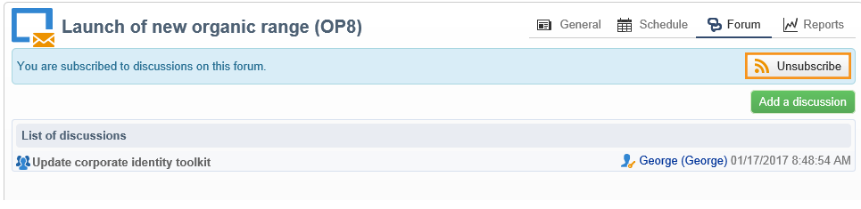

# Discussieforums{#discussion-forums}

Adobe Campaign-operatoren kunnen discussieforums gebruiken om informatie te delen. De volgende elementen hebben elk hun eigen forum: plannen, programma&#39;s, campagnes, middelen, simulaties, bestanden. Elke exploitant heeft ook een persoonlijk forum. Alle discussies zijn openbaar, zelfs op persoonlijke forums.

Operatoren kunnen zich op een forum abonneren om elke keer dat een bericht wordt gepost, een e-mailbericht te ontvangen.

## Toegang tot een forum {#accessing-a-forum}

Als u het forum van een campagne wilt bezoeken, gaat u naar het dashboard en klikt u op de knop **[!UICONTROL Forum]** in de rechterbovenhoek. Deze verbinding geeft u ook het totale aantal berichten in het forum.

## Een forum gebruiken {#using-a-forum}

Berichten en de reacties worden in chronologische volgorde weergegeven (van Nieuwst naar Oudst).

Als u de inhoud van een bericht wilt weergeven, klikt u op de koptekst van het bericht.

**Een nieuwe discussie starten**

Als u een nieuwe discussie wilt starten, klikt u op de knop **[!UICONTROL Add a discussion]** in de rechterbovenhoek. De **[!UICONTROL Discussion forum]** wordt weergegeven (zie hieronder).

**Een bericht sturen naar een bestaande discussie**

Als u een bericht wilt plaatsen naar een bestaande discussie, opent u het bericht dat u wilt beantwoorden en klikt u op de knop **[!UICONTROL Reply]** in de linkerbovenhoek. De **[!UICONTROL Discussion forum]** wordt weergegeven (zie hieronder).

Wanneer u op een bericht antwoordt, zal de persoon die het originele bericht plaatste een bericht ontvangen.

**Een bericht schrijven**

In de **[!UICONTROL Discussion forum]** vak:

1. Voer de tekst in het dialoogvenster **[!UICONTROL Message]** en een titel van het debat in het **[!UICONTROL Subject]** veld.

   

1. Indien nodig:

   * Als u wilt dat iemand aan de discussie deelneemt die niet op het forum is geabonneerd, gebruikt u de opdracht **[!UICONTROL Operator to notify]** veld. De exploitant zal een kennisgevingsmail voor dit specifieke bericht ontvangen (zij zullen niet op het forum worden geabonneerd). Selecteer een groep operatoren als u meerdere operatoren wilt melden.
   * Als u een bijlage aan het bericht wilt toevoegen, klikt u op **[!UICONTROL Browse]**. De bijlage wordt ook opgenomen in de e-mail met het bericht. Bijlagen mogen alleen afzonderlijk worden verzonden: als u meerdere bestanden wilt verzenden, moet u deze zip geven.

1. Klikken **[!UICONTROL Create the message]** het aan het forum te plaatsen .

>[!NOTE]
>
>Zodra een bericht aan het forum is gepost, kan het niet meer worden veranderd of worden geschrapt.

## Plaatsen op het persoonlijke forum van een exploitant {#posting-to-the-personal-forum-of-an-operator}

U kunt een bericht aan het forum van een exploitant posten als, bijvoorbeeld, uw bericht geen specifieke campagne aangaat maar u wilt het gesprek in Adobe Campaign nog volgen. Persoonlijke forums zijn openbaar en alle operatoren zien uw bericht. De exploitant ontvangt telkens een bericht wanneer iemand aan zijn persoonlijk forum post.

Toegang tot het forum van een exploitant:

* Als u over de nodige rechten beschikt om toegang te krijgen tot **[!UICONTROL Administration > Access management > Operators]** van de verkenner, open het dashboard van de gewenste exploitant en klik **[!UICONTROL Forum]** in de rechterbovenhoek.
* Zo niet, zoek dan de naam van de exploitant in Adobe Campaign (via een bericht dat door deze operator aan het forum is gepost, een taak die aan hen wordt toegewezen) en klik erop om hun dashboard te openen. U kunt de beheerder ook vragen om een weergave van de map met operatoren te maken.

## Abonneren op een forum {#subscribing-to-a-forum}

Als u zich abonneert op een forum, kunt u discussies volgen. Elke keer dat een bericht naar het forum wordt gepost, ontvangt u een e-mailbericht. Deze e-mail bevat de berichttekst en eventuele bijlagen. Als u een bericht wilt beantwoorden, klikt u in de hoofdtekst van de e-mail en meldt u zich vervolgens aan bij de Adobe Campaign-webinterface. Wanneer u zich abonneert op een forum, is deze informatie zichtbaar voor iedereen.

* Als u zich wilt abonneren op een forum, klikt u op de knop **[!UICONTROL Follow discussions]** in de rechterbovensectie boven de lijst met berichten.

   

   De sectie gaat blauw en toont aan dat u aan het forum wordt geabonneerd.

* Als u uw abonnement op een forum wilt opzeggen, klikt u op de knop **[!UICONTROL Unsubscribe]** knop.

   

* Het persoonlijke dashboard bevat de forums waarop u zich hebt geabonneerd. Klik op de knop **[!UICONTROL Subscription to discussion forums]** Klik vervolgens op het gewenste item om het forum te openen.

   

* Als u wilt zien wie op een forum is geabonneerd, klikt u op de knop **[!UICONTROL List of subscribers to this discussion forum]** koppeling boven de lijst met berichten.

   

## Melding verzenden {#checking-notification-delivery}

Als operatoren die zijn geabonneerd op een forum geen meldingen ontvangen zoals u had verwacht:

* Controleer of de e-mailadressen zijn ingevoerd in de profielen van de operator.
* Ga naar de **[!UICONTROL Administration > Production > Technical workflows > Campaign processes]** en controleer of de **[!UICONTROL Jobs in discussion forums]** de workflow is gestart en foutloos.
* De leveringslogboeken weergeven:

   * Ga op de homepage van Adobe Campaign naar **[!UICONTROL Campaigns > Navigation > Deliveries]** en open vervolgens de **[!UICONTROL Discussion forum notification]** levering.
   * Ga in de verkenner naar **[!UICONTROL Administration > Production > Objects created automatically > Technical deliveries > Workflow notifications]** en klik vervolgens op **[!UICONTROL Discussion forum notifications]**.
   In de **[!UICONTROL Discussion forum notifications]** de leveringslogboeken vindt u in het dialoogvenster **[!UICONTROL Edit > Delivery]** tab. U kunt ook de **[!UICONTROL Tracking > Log]** en de **[!UICONTROL Exclusion causes]** tabs.
