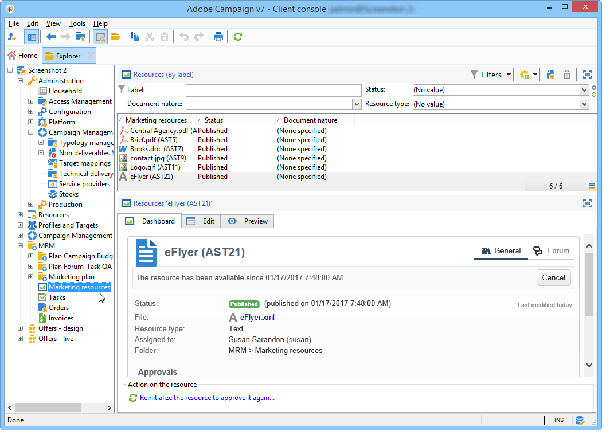

# Marketingbronnen beheren{#managing-marketing-resources}

Met Adobe Campaign kunt u de marketingbronnen beheren en bijhouden die zijn betrokken bij de levenscyclus van de campagne. Deze marketingmiddelen kunnen een brochure, een visuele ondersteuning of een ander communicatiemiddel zijn waarbij verschillende marktdeelnemers zijn betrokken.

Voor elke marketingbron die via Adobe Campaign wordt beheerd, kunt u de status en geschiedenis van de bron op elk gewenst moment bijhouden en de huidige versie bekijken.

## Een marketingbron toevoegen {#adding-a-marketing-resource}

Marketingbronnen zijn toegankelijk via de **[!UICONTROL Campaigns]** tab.

Als u een bron wilt toevoegen, klikt u op de knop **[!UICONTROL Create]** knop.

Als u een resource beschikbaar wilt maken op de Adobe Campaign-server, moet u de gewenste resource toevoegen door deze in het midden van de editor te slepen. U kunt ook op de knop **[!UICONTROL Upload file to server...]** koppeling.

Met een bevestigingsbericht kunt u het uploaden starten.

Wanneer het uploaden is voltooid, wordt de bron toegevoegd aan de lijst met beschikbare bronnen. Het is toegankelijk voor Adobe Campaign-operatoren. Zij kunnen het bekijken (via **[!UICONTROL Preview]** ), een kopie maken om het te wijzigen of het bestand op de server bijwerken (met de opdracht **[!UICONTROL Edit]** ).

Klik op de knop **[!UICONTROL General]** om de operatoren of groepen operatoren te selecteren die verantwoordelijk zijn voor het controleren, bijhouden en goedkeuren van deze resource. De revisor selecteren wordt uitgevoerd via het dialoogvenster **[!UICONTROL Advanced parameters]** koppeling.

* De exploitant aan wie de bron wordt toegewezen is verantwoordelijk voor het volgen van het.
* De goedkeuringsexploitant is verantwoordelijk voor de goedkeuring van de marketingbron. Ze worden op de hoogte gesteld wanneer het validatieproces van de bron wordt gestart.

   Als er geen controleur is geselecteerd, wordt de bron **[!UICONTROL cannot be]** onder voorbehoud van goedkeuring.

* Indien nodig kunt u ook een proxy opgeven.

U kunt een (indicatieve) beschikbaarheidsdatum voor het middel specificeren. Na deze datum wordt het weergegeven met **[!UICONTROL Late]** status.

## Samenwerken aan bronnen {#collaborative-work-on-resources}

U kunt een marketingbron wijzigen en bijwerken en, indien nodig, andere Adobe Campaign-operatoren hiervan op de hoogte stellen. U kunt:

* Download de bron lokaal om deze te wijzigen.
* Werk het bestand op de server bij en maak het toegankelijk voor andere operatoren.
* Vergrendel een bron om de wijziging ervan door andere operatoren te verbieden.

>[!NOTE]
>
>De **[!UICONTROL History]** bevat het download- en updatelogboek voor de bron. De **[!UICONTROL Details]** Hiermee kunt u de geselecteerde versie weergeven.

### Een bron vergrendelen/ontgrendelen {#locking-unlocking-a-resource}

Zodra gecreeerd, zijn de middelen beschikbaar in het marketing middeldashboard, en de exploitanten kunnen hen uitgeven en wijzigen.

Wanneer een exploitant aan een middel wil werken, is het verkieslijk om het te sluiten alvorens met het werk te beginnen, om andere exploitanten te verhinderen het tezelfdertijd te wijzigen. De bron wordt dan gereserveerd; het blijft toegankelijk, maar kan niet op de server door een andere exploitant worden gepubliceerd of worden bijgewerkt.

Een speciaal bericht geeft een melding aan alle operatoren die toegang proberen te krijgen tot het bericht:

De **[!UICONTROL Tracking]** tab geeft de naam aan van de operator die de resource heeft vergrendeld en de geplande updatedatum.

Als u een bron wilt vergrendelen, moet u op de bron klikken die wordt gevolgd door de **[!UICONTROL Lock]** in het brondashboard.

U kunt de geplande retourdatum aangeven in het dialoogvenster **[!UICONTROL Tracking]** tabblad van de bron.

Met deze informatie kunt u andere Adobe Campaign-operatoren op de hoogte stellen van de datum waarop de resource wordt ontgrendeld.

Wanneer de bron is bijgewerkt, wordt deze automatisch ontgrendeld en opnieuw beschikbaar gesteld aan alle operatoren.

Indien nodig, kunt u het van het dashboard ook manueel ontgrendelen.

>[!NOTE]
>
>Alleen de operator die de resource heeft vergrendeld en de operators met beheerdersrechten zijn gemachtigd om een resource te ontgrendelen.

### Discussieforums {#discussion-forums}

Voor elke bron wordt de **[!UICONTROL Forum]** op dit tabblad kunnen deelnemers informatie uitwisselen.

[Discussieforums](discussion-forums.md) legt uit hoe discussieforums werken in Adobe Campaign.

## Levenscyclus van een marketingmiddel {#life-cycle-of-a-marketing-resource}

Wanneer de bron wordt gemaakt, worden Adobe Campaign-operatoren aangesteld om de bron te ontwerpen, te controleren, goed te keuren en te publiceren. Voor deze campagnes kan een duur worden bepaald.

De **[!UICONTROL Tracking]** kunt u elke actie controleren die op de bron wordt uitgevoerd: goedkeuringen, weigeringen van goedkeuring, hiermee verband houdende opmerkingen of publicaties.

De **[!UICONTROL History]** tabblad geeft de bestandsoverdrachten weer die zijn uitgevoerd voor deze bron.

### Goedkeuringsproces {#approval-process}

De verwachte beschikbaarheidsdatum wordt getoond in de middeldetails, als het in **[!UICONTROL Tracking]** tab. Als deze datum is bereikt, kunt u het goedkeuringsproces uitvoeren met de opdracht **[!UICONTROL Submit for approval]** in het brondashboard. De middelstatus verandert dan in **[!UICONTROL Approval in progress]**.

Een bron kan worden goedgekeurd via de **[!UICONTROL Approve resource]** op het dashboard.

Geautoriseerde marktdeelnemers kunnen vervolgens de goedkeuring accepteren of afwijzen. Deze actie is mogelijk: via het verzonden e-mailbericht (door op de koppeling in het meldingsbericht te klikken) of via de console (door op de knop **[!UICONTROL Approve]** ).

In het goedkeuringsvenster kunt u een opmerking invoeren.

De **[!UICONTROL Tracking]** met tabbladen kunnen alle operatoren de verschillende fasen van het goedkeuringsproces volgen.

>[!NOTE]
>
>Naast de recensent die voor elke marketing middel wordt gespecificeerd, zijn de exploitanten met beheerderrechten en middelmanager gemachtigd om een marketing middel goed te keuren.

### Een bron publiceren {#publishing-a-resource}

Wanneer deze is goedgekeurd, moet de marketingbron worden gepubliceerd. Het publicatieproces moet afhankelijk worden gesteld van een specifieke tenuitvoerlegging overeenkomstig de eisen van de onderneming. Dit betekent dat de middelen op een Extranet of een andere server kunnen worden gepubliceerd, kan de specifieke informatie naar een externe dienstverlener, enz. worden verzonden.

Als u een bron wilt publiceren, klikt u op de knop **[!UICONTROL Publish]** in de bewerkingszone van het dashboard voor marketingbronnen.

U kunt het publiceren van een bron ook automatiseren via een workflow.

Het publiceren van een middel betekent het ter beschikking stellen voor gebruik (door een andere taak, bijvoorbeeld). Publicatie als zodanig is afhankelijk van de aard van de bron: voor een flyer kan publiceren betekenen dat het bestand naar een printer wordt gestuurd , voor een webbureau , dat het naar een website wordt gepubliceerd , enzovoort .

Adobe Campaign kan alleen publiceren als u een geschikte workflow maakt en deze aan de bron koppelt. Om dit te doen, open **[!UICONTROL Advanced settings]** van de bron en selecteer vervolgens de gewenste workflow in het dialoogvenster **[!UICONTROL Post-processing]** veld.

De workflow wordt uitgevoerd:

* Wanneer de controleur op de knop **[!UICONTROL Publish resource]** koppeling (of, als er geen controleur is gedefinieerd, de persoon die verantwoordelijk is voor de bron).
* Als het middel via een marketing middelaanmaaktaak wordt beheerd, zal het worden uitgevoerd wanneer de taak wordt geplaatst aan **[!UICONTROL Finished]**, zolang de **[!UICONTROL Publish the marketing resource]** is ingeschakeld in de taak (Zie [Taak voor het maken van marketingmiddelen](creating-and-managing-tasks.md#marketing-resource-creation-task))

Als een werkstroom niet onmiddellijk wordt gestart (als de werkstroom bijvoorbeeld wordt gestopt), verandert de status van de bron in **[!UICONTROL Pending publication]**. Zodra de werkstroom is gestart, verandert de status van de bron in **[!UICONTROL Published]**. Deze status houdt geen rekening met mogelijke fouten in het publicatieproces. Controleer de status van uw workflow om er zeker van te zijn dat deze correct is uitgevoerd.

## Een bron koppelen aan een campagne {#linking-a-resource-to-a-campaign}

### Verwijzen naar een marketingbron {#referencing-a-marketing-resource}

Marketingbronnen kunnen aan campagnes worden gekoppeld, op voorwaarde dat deze functie in de campagnemalplaatje is geselecteerd.

>[!NOTE]
>
>Voor details op om campagnemalplaatjes tot stand te brengen en te vormen, verwijs naar [Campagnersjablonen](../campaigns/marketing-campaign-templates.md)

Klik op de knop **[!UICONTROL Documents > Resources]** tabblad in het campagnecdashboard en klik vervolgens op **[!UICONTROL Add]** om de betrokken bron te selecteren.

U kunt bronnen filteren op status, aard of type of een gepersonaliseerd filter toepassen.

Klikken **[!UICONTROL OK]** om de bron toe te voegen aan de lijst met marketingbronnen waarnaar voor deze campagne wordt verwezen.

De **[!UICONTROL Details]** kunt u deze bewerken en weergeven.

De toegevoegde bronnen worden weergegeven in het dashboard. Ze kunnen daar ook worden bewerkt.

### Een marketingbron toevoegen aan een leveringsoverzicht {#adding-a-marketing-resource-to-a-delivery-outline}

Marketingbronnen kunnen worden gekoppeld aan leveringen via leveringscontouren.

>[!NOTE]
>
>Raadpleeg voor meer informatie over leveringscontouren [Middelen koppelen en structureren via een leveringsoverzicht](../campaigns/marketing-campaign-deliveries.md).

## Voorraadbeheer {#stock-management}

U kunt een marketingbron koppelen aan een of meer voorraden om uw voorraad te beheren en een waarschuwing op het dashboard weer te geven als er onvoldoende voorraad is.

>[!NOTE]
>
>Voor meer informatie over voorraadbeheer in Adobe Campaign raadpleegt u [Voorraadbeheer](../campaigns/providers--stocks-and-budgets.md#stock-management).

Als u een marketingbron aan een voorraad wilt koppelen, bewerkt u de aandelenkaart en bewerkt of maakt u een voorraad. Voeg een voorraadlijn toe en selecteer de overeenkomstige marketing middel.

Indien nodig kunt u de geselecteerde bron bewerken via de **[!UICONTROL Edit the link]** pictogram (vergrootglas) rechts van de bron als deze is geselecteerd.

Geef de eerste voorraad en het waarschuwingsbestand op en sla deze op.

Het bestand wordt aangegeven in de brongegevens.

Wanneer het bestand ontoereikend is, wordt een waarschuwing aan de betrokken marktdeelnemers gezonden.

## Geavanceerde functies {#advanced-functions}

Met het dashboard met marketingbronnen kunt u de gebruikelijke typen bewerkingen uitvoeren: toevoegen, bewerken, vergrendelen/ontgrendelen, goedkeuren, publiceren. Via de Adobe Campaign-structuur kunt u andere typen marketingbronnen maken en toegang krijgen tot geavanceerde functionaliteit. Klik op **[!UICONTROL Explorer]** op de startpagina van Adobe Campaign.

Door gebrek, worden de marketing middelen opgeslagen in **[!UICONTROL MRM > Marketing resources]** knooppunt van de structuur.

U kunt de volgende bronnen vanuit deze weergave toevoegen:

* Bestand
* HTML
* Tekst
* URL
