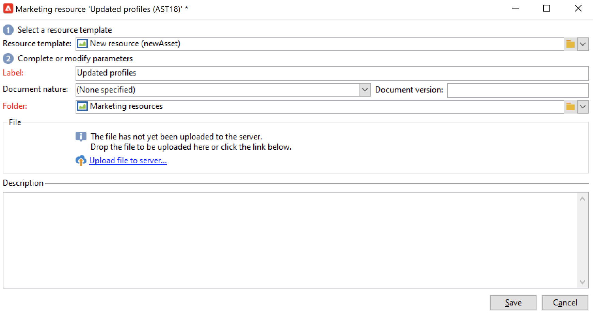
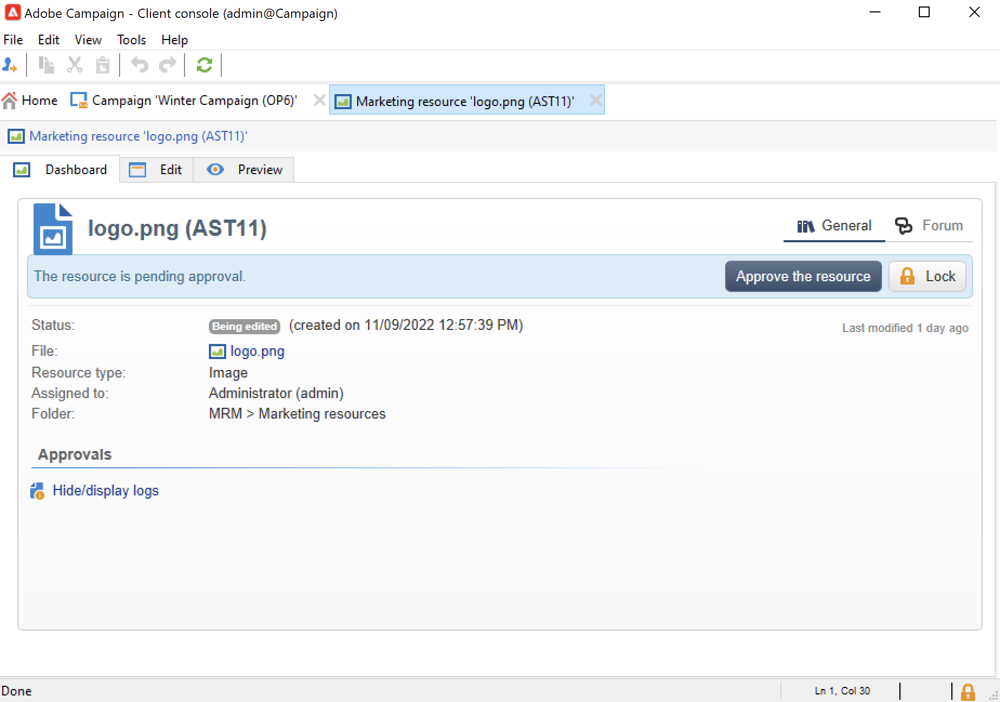

# Marketingbronnen beheren{#managing-marketing-resources}

Gebruik Adobe Campaign om de marketingbronnen die betrokken zijn bij de levenscyclus van de campagne te beheren en bij te houden. Deze marketingbronnen kunnen een whitepaper, een gegevensbestand, een logo of een ander middel zijn dat verband houdt met een campagne.

Voor elke marketingbron die via Adobe Campaign wordt beheerd, kunt u op elk gewenst moment de status en geschiedenis van de resource bijhouden en de huidige versie bekijken.

Marketingbronnen worden standaard opgeslagen in de map **[!UICONTROL MRM > Marketing resources]** van de Campagneverkenner.

## Een marketingbron toevoegen {#adding-a-marketing-resource}

Volg onderstaande stappen om een marketingbron toe te voegen:

1. Blader naar de tab **[!UICONTROL Campaigns]** en selecteer **[!UICONTROL Marketing resouces]** .

1. Klik op de knop **[!UICONTROL Create]**.
   
1. Sleep het bestand naar de Campagneserver en zet het neer in het resourcevenster Marketing om het te uploaden. U kunt ook de koppeling **[!UICONTROL Upload file to server...]** gebruiken.
   

Wanneer het uploaden is voltooid, wordt de bron toegevoegd aan de lijst met beschikbare bronnen.

## Marketingbronnen beheren {#manage-marketing-resources}

Nadat de marketingbron is geüpload, is deze beschikbaar voor alle Adobe Campaign-operatoren. Zij kunnen het bekijken, een exemplaar maken om het te wijzigen, of het dossier op de server bijwerken.

Gebruik de vervolgkeuzelijst **[!UICONTROL Assigned to]** op het tabblad **[!UICONTROL Edit]** om de operator te selecteren die verantwoordelijk is voor de bron.

U kunt ook de operatoren of groepen operatoren selecteren die verantwoordelijk zijn voor de validatie van bronnen en de publicatie van bronnen. Klik op de koppeling **[!UICONTROL Advanced parameters]** om deze opties te openen.

Deze operatoren worden via e-mail op de hoogte gesteld wanneer het validatieproces van de bron wordt gestart.

Als er geen controleur is geselecteerd, moet de resource **[!UICONTROL cannot be]** worden goedgekeurd.

Gebruik het tabblad **[!UICONTROL Audit]** om een proeflezer toe te voegen en een beschikbaarheidsdatum voor de bron te definiëren. Na deze datum wordt deze weergegeven met de status **[!UICONTROL Late]** .

>[!NOTE]
>
>Het tabblad **[!UICONTROL History]** bevat het download- en updatelogbestand voor de bron. Met de knop **[!UICONTROL Details]** kunt u de geselecteerde versie weergeven.
>
>Op het tabblad **[!UICONTROL Audit]** kunt u alle acties controleren die op de bron worden uitgevoerd: goedkeuringen, weigeringen van goedkeuring, verwante opmerkingen of publicaties.

### Een bron vergrendelen/ontgrendelen {#locking-unlocking-a-resource}

Zodra gecreeerd, zijn de middelen beschikbaar in het marketing middeldashboard, en de exploitanten kunnen hen uitgeven en wijzigen.

Wanneer een exploitant aan een middel begint te werken, is de beste praktijken het te sluiten, om andere exploitanten te verhinderen het tezelfdertijd te wijzigen. De bron is vervolgens gereserveerd: deze blijft toegankelijk, maar kan niet op de server worden gepubliceerd of bijgewerkt door een andere operator.

Een marketingbron kan alleen worden vergrendeld als deze niet is goedgekeurd.

Als u een bron wilt vergrendelen, klikt u op de knop **[!UICONTROL Lock]** in het brondashboard.

Wanneer de bron is bijgewerkt, klikt u op de knop **[!UICONTROL Lock]** in het resourcerdashboard om deze weer beschikbaar te maken voor alle operatoren.

Een speciaal bericht geeft een melding aan alle operatoren die toegang proberen te krijgen tot het bericht:

Het tabblad **[!UICONTROL Tracking]** geeft de naam aan van de operator die de bron heeft vergrendeld.

>[!NOTE]
>
>Alleen de operator die de resource heeft vergrendeld en de operators met beheerdersrechten zijn gemachtigd om een resource te ontgrendelen.

### Discussieforums {#discussion-forums}

Voor elke bron, laat het **[!UICONTROL Forum]** lusje deelnemers informatie delen.

Leer meer in de [ forums van de Bespreking ](discussion-forums.md) sectie.

### Goedkeuringsproces {#approval-process}

De verwachte beschikbaarheidsdatum wordt getoond in de middeldetails, als het in **[!UICONTROL Tracking]** tabel werd gespecificeerd. Zodra deze datum is bereikt, kunt u het goedkeuringsproces uitvoeren gebruikend de knoop **[!UICONTROL Submit for approval]** in het middeldashboard. De status van de bron verandert vervolgens in **[!UICONTROL Approval in progress]** .

Als u een bron wilt goedkeuren, klikt u op de knop **[!UICONTROL Approve the resource]** op het dashboard.

Geautoriseerde marktdeelnemers kunnen vervolgens de goedkeuring accepteren of afwijzen. Deze actie is mogelijk: via het verzonden e-mailbericht (door op de koppeling in het meldingsbericht te klikken) of via de clientconsole (door op de knop **[!UICONTROL Approve]** te klikken).

In het goedkeuringsvenster kunt u een opmerking invoeren.

Blader naar het tabblad **[!UICONTROL Tracking]** om goedkeuringen te controleren.

>[!NOTE]
>
>Naast de recensent die voor elke marketing middel wordt gespecificeerd, zijn de exploitanten met beheerderrechten en middelmanager gemachtigd om een marketing middel goed te keuren.

### Een bron publiceren {#publishing-a-resource}

Wanneer deze is goedgekeurd, moet de marketingbron worden gepubliceerd. Het publicatieproces moet afhankelijk worden gesteld van een specifieke tenuitvoerlegging overeenkomstig de eisen van de onderneming. Dit betekent dat de middelen op een Extranet of een andere server kunnen worden gepubliceerd, kan de specifieke informatie naar een externe dienstverlener, enz. worden verzonden.

Als u een resource wilt publiceren, klikt u op de knop **[!UICONTROL Publish]** in de bewerkingszone van het dashboard voor marketingbronnen.

U kunt het publiceren van een bron ook automatiseren via een workflow.

Het publiceren van een middel betekent het ter beschikking stellen voor gebruik (door een andere taak, bijvoorbeeld). Publicatie als zodanig varieert afhankelijk van de aard van uw bron: voor een flyer kan publiceren betekenen dat het bestand naar een printer wordt gestuurd, voor een webagentschap kan het betekenen dat het naar een website wordt gepubliceerd, enzovoort.

Adobe Campaign kan alleen publiceren als u een geschikte workflow maakt en deze aan de bron koppelt. Hiertoe opent u het vak **[!UICONTROL Advanced settings...]** van de bron en selecteert u de gewenste workflow in het veld **[!UICONTROL Post-processing]** .

De workflow wordt uitgevoerd:

* Wanneer de controleur op de koppeling **[!UICONTROL Publish resource]** klikt (of, als er geen controleur is gedefinieerd, op de persoon die de bron beheert).
* Als de bron wordt beheerd via een marketingtaak voor het maken van resources, wordt deze uitgevoerd wanneer de taak is ingesteld op **[!UICONTROL Finished]** , zolang het vak **[!UICONTROL Publish the marketing resource]** in de taak is ingecheckt. [ leer meer ](creating-and-managing-tasks.md#marketing-resource-creation-task))

Als een werkstroom niet onmiddellijk wordt gestart (als de werkstroom bijvoorbeeld wordt gestopt), verandert de status van de bron in **[!UICONTROL Pending publication]** . Zodra de werkstroom is gestart, verandert de status van de bron in **[!UICONTROL Published]** . Deze status houdt geen rekening met mogelijke fouten in het publicatieproces. Controleer de status van uw workflow om er zeker van te zijn dat deze correct is uitgevoerd.

## Een bron koppelen aan een campagne {#linking-a-resource-to-a-campaign}

### Verwijzing naar een marketingbron {#referencing-a-marketing-resource}

De marketing middelen kunnen met campagnes worden geassocieerd, op voorwaarde dat deze eigenschap in het [ campagnemalplaatje ](../campaigns/marketing-campaign-templates.md) werd geselecteerd.

Blader naar het tabblad **[!UICONTROL Edit > Documents > Resources]** in het campagnedashboard en klik vervolgens op **[!UICONTROL Add]** om de desbetreffende bron te selecteren.

U kunt bronnen filteren op status, aard of type of een gepersonaliseerd filter toepassen.

Gebruik de knop **[!UICONTROL Details]** om de bron te bewerken en voor te vertonen.

### Een marketingbron toevoegen aan een leveringsoverzicht {#adding-a-marketing-resource-to-a-delivery-outline}

Marketingbronnen kunnen worden gekoppeld aan leveringen via leveringscontouren.

Leer meer over leveringsoverzichten in [ deze sectie ](../campaigns/marketing-campaign-deliveries.md).

Om dit te doen, klik op een leveringsoverzicht met de rechtermuisknop aan en selecteer **Nieuw > Middel**.

Ga de naam van de activa in en selecteer het van het **middel van de Marketing** drop-down lijst.

## Voorraadbeheer {#stock-management}

U kunt een marketingbron koppelen aan een of meer voorraden om uw voorraad te beheren en een waarschuwing op het dashboard weer te geven als er onvoldoende voorraad is.

Volg onderstaande stappen om een marketingbron te koppelen aan een bestand:

1. Een bestand bewerken of een nieuw bestand maken. Leer meer over aandelen in [ deze sectie ](../campaigns/providers-stocks-and-budgets.md#stock-management).

1. Voeg een voorraadlijn toe, en selecteer de overeenkomstige marketing middel.

   

   U kunt de geselecteerde bron bewerken via het pictogram **[!UICONTROL Edit the link]** rechts van de bron nadat deze is geselecteerd.

1. Geef de eerste voorraad en het waarschuwingsbestand op en sla deze op.

De voorraad wordt vermeld in het marketing middel **Voorraden** tabel.
