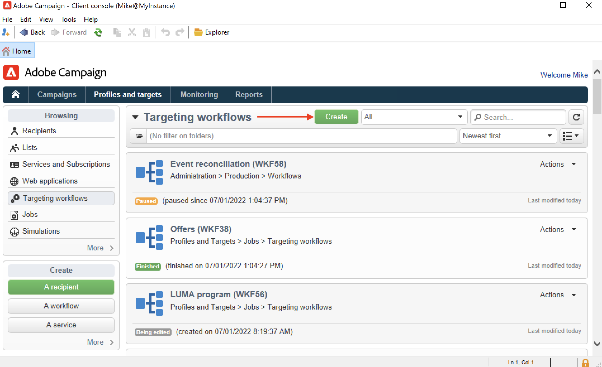

# Een workflow maken {#build-a-workflow}

## Een nieuwe workflow maken {#create-a-new-workflow}

De workflow voor het maken van werkstromen is afhankelijk van het type werkstroom. U kunt:

* Creeer [&#x200B; het richten werkschema&#39;s &#x200B;](#targeting-workflows) van **[!UICONTROL Profiles and Targets]** > **[!UICONTROL Jobs]** > **[!UICONTROL Targeting workflows]** knoop van de Ontdekkingsreiziger of van het **[!UICONTROL Profiles and Targets]** lusje van de homepage, via **[!UICONTROL Targeting workflows]** sub-tab.

  

* Creeer [&#x200B; werkschema&#39;s van de Campagne &#x200B;](#campaign-workflows) van het **[!UICONTROL Targeting and workflows]** lusje van een campagne

* Creeer [&#x200B; Technische werkstromen &#x200B;](#technical-workflows) van **[!UICONTROL Administration]** > **[!UICONTROL Production]** > **[!UICONTROL Technical workflows]** knoop van de Ontdekkingsreiziger. U kunt het beste een specifieke werkstroommap maken om uw technische workflows op te slaan.

Klik op de knop **[!UICONTROL New]** boven de lijst met workflows.

Voer een label in en klik op **[!UICONTROL Save]** .

## Activiteiten toevoegen en koppelen {#add-and-link-activities}

U moet nu de verschillende activiteiten definiëren en deze koppelen in het diagram. In dit stadium van de configuratie, kunnen wij het diagrametiket en de werkschemastatus zien (Bewerkt lopend). Het onderste gedeelte van het venster wordt alleen gebruikt voor het bewerken van het diagram. Het bevat een werkbalk, een palet met activiteiten (links) en het diagram zelf (rechts).

>[!NOTE]
>
>Als het palet niet wordt weergegeven, klikt u op de eerste knop op de werkbalk om het weer te geven.

De activiteiten worden gegroepeerd op categorie in de verschillende tabbladen van het palet. De beschikbare tabbladen en activiteiten kunnen variëren afhankelijk van het type workflow (technisch, doelgericht of campagneworkflow).

* Het eerste tabblad bevat bewerkingen voor het activeren van doelen en gegevens. Deze activiteiten zijn gedetailleerd in [&#x200B; het richten activiteiten &#x200B;](targeting-activities.md).
* Het tweede tabblad bevat de planningsactiviteiten, die hoofdzakelijk worden gebruikt voor de coördinatie van andere activiteiten. Deze activiteiten zijn gedetailleerd in [&#x200B; de controleactiviteiten van de Stroom &#x200B;](flow-control-activities.md).
* Het derde tabblad bevat gereedschappen en handelingen die in de workflow kunnen worden gebruikt. Deze activiteiten zijn gedetailleerd in [&#x200B; activiteiten van de Actie &#x200B;](action-activities.md).
* Het vierde tabblad bevat activiteiten die afhankelijk zijn van een bepaalde gebeurtenis, zoals de ontvangst van een e-mail of de aankomst van een bestand op een server. Deze activiteiten zijn gedetailleerd in [&#x200B; activiteiten van de Gebeurtenis &#x200B;](event-activities.md).

Het diagram maken

1. Voeg een activiteit toe door het in het palet te selecteren en het te bewegen aan het diagram gebruikend belemmering-en-dalingsverrichting.

   Voeg de activiteit van het a **Begin** en dan a **Levering** activiteit op het diagram toe.

   

1. Verbind de activiteiten samen door het **begin** activiteitenovergang te slepen en het neer te zetten op de **Levering** activiteit.

   

   U kunt een activiteit aan vorige automatisch verbinden door de nieuwe activiteit aan het eind van de overgang te plaatsen.

1. Voeg de activiteiten toe u nodig hebt en verbind hen samen zoals aangetoond in het hieronder diagram.

   

>[!CAUTION]
>
>U kunt activiteiten kopiëren en plakken binnen dezelfde workflow. We raden echter niet aan plakactiviteiten over verschillende workflows te kopiëren. Sommige instellingen die zijn gekoppeld aan activiteiten zoals Leveringen en Planner kunnen leiden tot conflicten en fouten tijdens het uitvoeren van de doelworkflow. In plaats daarvan, adviseerden wij u **&#x200B;**&#x200B;werkschema&#39;s dupliceren. Voor meer informatie, zie [&#x200B; werkschema&#39;s &#x200B;](#duplicate-workflows) dupliceren.

U kunt de weergave en lay-out van het diagram wijzigen met de volgende elementen:

* **Gebruik de toolbar**

  Met de werkbalk voor diagrambewerking hebt u toegang tot de functies voor lay-out en uitvoering van de workflow.

  

  Zo kunt u de lay-out van het bewerkgereedschap aanpassen: de weergave van het palet en het overzicht, de grootte en de uitlijning van grafische objecten.

  

  Pictogrammen die betrekking hebben op de voortgangsweergave en de logboekweergave worden in de volgende secties beschreven:

   * [Voortgang weergeven](monitor-workflow-execution.md#displaying-progress)
   * [Logboeken weergeven](monitor-workflow-execution.md#displaying-logs)

* **de groepering van Objecten**

  Als u pictogrammen wilt uitlijnen, selecteert u deze en klikt u op het pictogram **[!UICONTROL Align vertically]** of **[!UICONTROL Align horizontally]** .

  Gebruik **CTRL** sleutel om verscheidene verspreide activiteiten te selecteren of één of meerdere activiteiten te schrappen. Klik op de achtergrond van het diagram om alles te deselecteren.

* **het beheer van het Beeld**

  U kunt het achtergrondbeeld van het diagram evenals die aanpassen met betrekking tot de diverse activiteiten. Verwijs naar [&#x200B; de activiteitenbeelden van de Verandering &#x200B;](change-activity-images.md).

## Activiteiten configureren {#configure-activities}

Dubbelklik op een activiteit om deze te configureren of klik met de rechtermuisknop en selecteer **[!UICONTROL Open...]** .

>[!NOTE]
>
>De het werkschemaactiviteiten van de campagne zijn gedetailleerd in [&#x200B; deze sectie &#x200B;](activities.md).

Het eerste lusje bevat de basisconfiguratie. Het tabblad **[!UICONTROL Advanced]** bevat de aanvullende parameters die met name worden gebruikt voor het definiëren van gedrag wanneer een fout optreedt, het opgeven van de uitvoeringstijd voor een activiteit en het invoeren van een initialisatiescript.

Voor een beter inzicht in de activiteiten en een betere leesbaarheid van de workflow kunt u opmerkingen invoeren in de activiteiten.

Deze commentaren worden automatisch getoond wanneer de exploitanten over de activiteit scrollen.

## Workflowsjablonen {#workflow-templates}

De malplaatjes van het werkschema bevatten de algemene configuratie van eigenschappen en misschien een waaier van activiteiten die binnen een diagram worden samengevoegd. Deze configuratie kan opnieuw worden gebruikt voor het maken van nieuwe workflows die een bepaald aantal vooraf geconfigureerde elementen bevatten

U kunt nieuwe werkstroomsjablonen maken op basis van bestaande sjablonen of een workflow rechtstreeks in een sjabloon wijzigen.

Workflowsjablonen worden opgeslagen in het knooppunt **[!UICONTROL Resources > Templates > Workflow templates]** van de Explorer.

Naast de gebruikelijke workfloweigenschappen kunt u met de sjablooneigenschappen het uitvoeringsbestand opgeven voor workflows die op basis van deze sjabloon worden gemaakt.

## Workflows dupliceren {#duplicate-workflows}

U kunt verschillende typen workflows dupliceren. Als de workflow eenmaal is gedupliceerd, worden wijzigingen van de workflow niet doorgevoerd in de kopie van de workflow.

Adobe raadt aan een workflow te dupliceren in plaats van een kopie/plakbewerking uit te voeren. Wanneer een activiteit wordt gekopieerd, worden al zijn montages bewaard. Voor kanaalactiviteiten wordt het aan de activiteit gekoppelde leveringsobject ook gekopieerd, wat tot grote problemen kan leiden.

1. Klik met de rechtermuisknop op een workflow.
1. Klik **Dupliceren**.

   

1. Wijzig in het workflowvenster het workflowlabel.
1. Klik **sparen**.

