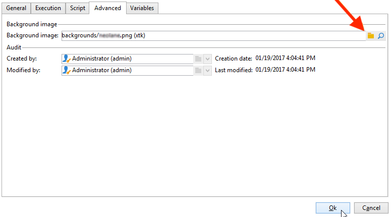

# Activiteitsafbeeldingen wijzigen{#change-activity-images}

U kunt de afbeeldingen wijzigen die worden gebruikt in de diagrammen van de verschillende workflows. Zij moeten echter wel aan bepaalde voorwaarden voldoen. Hier volgen de fasen van de implementatie:

* Als u de achtergrondafbeelding wilt wijzigen, selecteert u de gewenste doelworkflow en klikt u op de knop **[!UICONTROL Properties]** tab.

  

  Als u de afbeelding wilt selecteren, klikt u op de knop **[!UICONTROL Select link]** pictogram rechts van **[!UICONTROL Background image]** veld.

  >[!NOTE]
  >
  >De breedte in pixels van de achtergrondafbeelding moet een veelvoud van 4 zijn.

  

  De **[!UICONTROL Edit link]** kunt u de geselecteerde afbeelding bekijken.

* Als u de afbeelding wilt wijzigen die aan een activiteit is gekoppeld, dubbelklikt u op het object en klikt u vervolgens op de knop **[!UICONTROL Advanced]** tab.

  Als u de afbeelding wilt selecteren, klikt u op de knop **[!UICONTROL Select link]** pictogram rechts van **[!UICONTROL Image]** veld.

  

  De **[!UICONTROL Edit link]** kunt u de geselecteerde afbeelding bekijken.

  

>[!NOTE]
>
>De afbeeldingen die zijn opgeslagen in het dialoogvenster **[!UICONTROL Administration > Configuration > Images]** de knoop van de boom is beschikbaar voor selectie.
>  
>Afbeeldingen moeten de PNG-indeling hebben, met 48 x 48 pixels, 16 miljoen kleuren en een transparante achtergrond.
