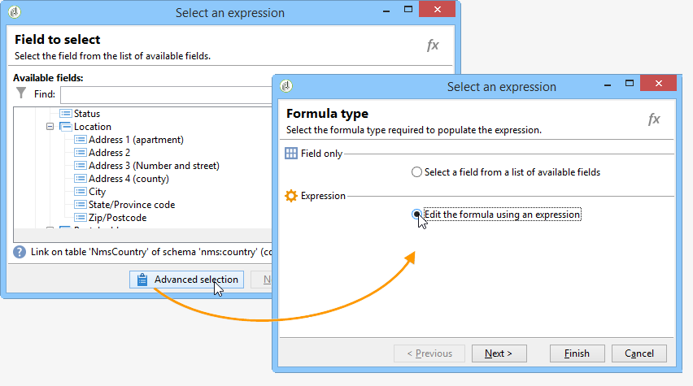

# Dimensie wijzigen{#change-dimension}

Gebruik de **[!UICONTROL Change dimension]** activiteit om de het richten dimensie te veranderen aangezien u een publiek bouwt. Deze activiteit verschuift de as afhankelijk van het gegevensmalplaatje en de inputdimensie. U schakelt bijvoorbeeld van de dimensie &#39;contracten&#39; over naar de dimensie &#39;clients&#39;.

U kunt deze activiteit ook gebruiken om de extra kolommen van het nieuwe doel te bepalen, en de criteria van de gegevensdeduplicatie te bepalen.

>[!IMPORTANT]
>
>Houd er rekening mee dat de **[!UICONTROL Change Dimension]** en **[!UICONTROL Change Data source]** activiteiten mogen niet in één rij worden toegevoegd. Als u beide activiteiten opeenvolgend moet gebruiken, zorg ervoor u omvat **[!UICONTROL Enrichement]** tussen hen. Dit zorgt voor een correcte uitvoering en voorkomt mogelijke conflicten of fouten.

Om te vormen **[!UICONTROL Change dimension]** Voer de volgende stappen uit:

1. Selecteer de nieuwe doeldimensie via de **[!UICONTROL Change dimension]** veld.

   

1. Tijdens het wijzigen van de afmetingen kunt u alle elementen behouden of selecteren die in de uitvoer moeten worden bewaard. In het volgende voorbeeld, max. Aantal duplicaten is ingesteld op 2.

   

   Wanneer u verkiest om slechts één verslag te houden, wordt een inzameling getoond in het het werkschema: Deze inzameling vertegenwoordigt alle verslagen die niet in het definitieve resultaat zullen worden gericht (aangezien slechts één verslag wordt gehouden). Net als bij alle andere verzamelingen kunt u met deze verzameling aggregaten berekenen of gegevens in kolommen herstellen.

   Als u bijvoorbeeld de opdracht **[!UICONTROL Customers]** de **[!UICONTROL Recipients]** afmeting, zal het mogelijk zijn om klanten van een specifieke opslag te richten, terwijl het toevoegen van het aantal gemaakte aankopen.

1. Als u verkiest om al deze informatie niet te houden, kunt u de dubbele beheerswijze vormen.

   

   Met de blauwe pijlen kunt u de dubbele verwerkingsprioriteit definiëren.

   In het bovenstaande voorbeeld worden ontvangers eerst gededupliceerd op hun e-mailadres en vervolgens, indien nodig, op hun accountnummer.

1. De **[!UICONTROL Result]** kunt u aanvullende informatie toevoegen.

   U kunt bijvoorbeeld het land herstellen op basis van de postcode met behulp van een **Subtekenreeks** type functie. Dit doet u als volgt:

   * Klik op de knop **[!UICONTROL Add data...]** koppelen en selecteren **[!UICONTROL Data linked to the filtering dimension]**.

     

     >[!NOTE]
     >
     >Voor informatie over het maken en beheren van extra kolommen raadpleegt u [Gegevens toevoegen](query.md#add-data).

   * Selecteer de vorige gericht afmeting (vóór asschakelaar) en selecteer **[!UICONTROL Zip Code]** in de **[!UICONTROL Location]** substructuur, en klik vervolgens op **[!UICONTROL Edit expression]**.

     

   * Klikken **[!UICONTROL Advanced selection]** en kiest u **[!UICONTROL Edit the formula using an expression]**.

     

   * Gebruik de functies in de lijst en geef de uit te voeren berekening op.

     

   * Tot slot ga het etiket van de kolom in u enkel hebt gecreeerd.

     

1. Voer het werkschema uit om het resultaat van deze configuratie te bekijken. Vergelijk de gegevens in de tabellen voor en na de activiteit voor de veranderingsdimensie en vergelijk de structuur van de workflowtabellen, zoals in de volgende voorbeelden wordt getoond:

   

   
