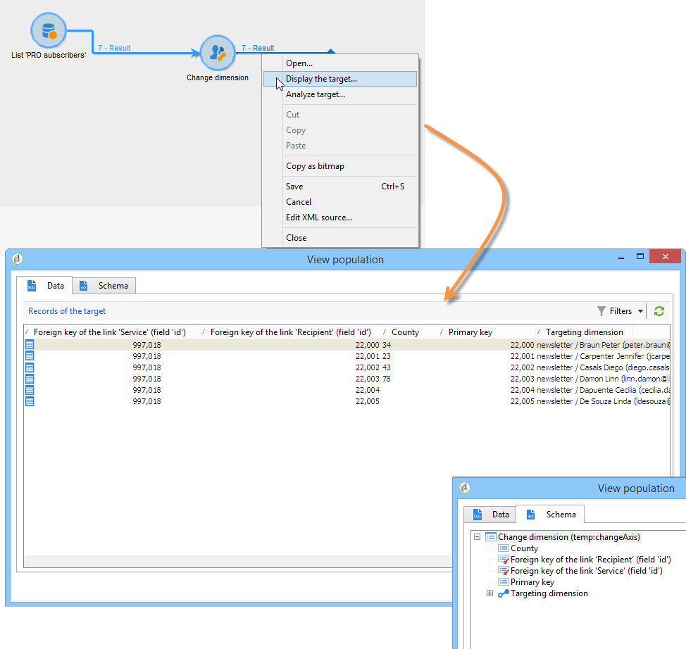

# Dimensie wijzigen{#change-dimension}

Gebruik de **[!UICONTROL Change dimension]** -activiteit om de doeldimensie te wijzigen terwijl u een publiek maakt. Deze activiteit verschuift de as afhankelijk van het gegevensmalplaatje en de inputdimensie. U schakelt bijvoorbeeld van de dimensie &#39;contracten&#39; over naar de dimensie &#39;clients&#39;.

U kunt deze activiteit ook gebruiken om de extra kolommen van het nieuwe doel te bepalen, en de criteria van de gegevensdeduplicatie te bepalen.

>[!IMPORTANT]
>
>De activiteiten **[!UICONTROL Change Dimension]** en **[!UICONTROL Change Data source]** mogen niet in één rij worden toegevoegd. Als u beide activiteiten opeenvolgend moet gebruiken, zorg ervoor u een **[!UICONTROL Enrichement]** activiteit binnen tussen hen omvat. Dit zorgt voor een correcte uitvoering en voorkomt mogelijke conflicten of fouten.

Voer de volgende stappen uit om de **[!UICONTROL Change dimension]** -activiteit te configureren:

1. Selecteer de nieuwe doeldimensie via het veld **[!UICONTROL Change dimension]** .

   

1. Tijdens het wijzigen van de afmetingen kunt u alle elementen behouden of selecteren die in de uitvoer moeten worden bewaard. In het volgende voorbeeld, max. Aantal duplicaten is ingesteld op 2.

   

   Wanneer u verkiest om slechts één verslag te houden, wordt een inzameling getoond in het het werkschema: Deze inzameling vertegenwoordigt alle verslagen die niet in het definitieve resultaat zullen worden gericht (aangezien slechts één verslag wordt gehouden). Net als bij alle andere verzamelingen kunt u met deze verzameling aggregaten berekenen of gegevens in kolommen herstellen.

   Als u bijvoorbeeld de **[!UICONTROL Customers]** -dimensie wijzigt in de **[!UICONTROL Recipients]** -dimensie, kunt u zich richten op klanten van een specifieke winkel en tegelijkertijd het aantal aanschafacties toevoegen.

1. Als u verkiest om al deze informatie niet te houden, kunt u de dubbele beheerswijze vormen.

   

   Met de blauwe pijlen kunt u de dubbele verwerkingsprioriteit definiëren.

   In het bovenstaande voorbeeld worden ontvangers eerst gededupliceerd op hun e-mailadres en vervolgens, indien nodig, op hun accountnummer.

1. Op het tabblad **[!UICONTROL Result]** kunt u aanvullende informatie toevoegen.

   Bijvoorbeeld, kunt u het graafschap terugkrijgen dat op de postcode wordt gebaseerd door a **Substring** typefunctie te gebruiken. Dit doet u als volgt:

   * Klik op de koppeling **[!UICONTROL Add data...]** en selecteer **[!UICONTROL Data linked to the filtering dimension]** .

     

     >[!NOTE]
     >
     >Voor informatie bij het creëren van en het leiden van extra kolommen, verwijs naar [&#x200B; gegevens &#x200B;](query.md#add-data) toevoegen.

   * Selecteer de vorige doeldimensie (vóór de asschakelaar) en selecteer **[!UICONTROL Zip Code]** in de **[!UICONTROL Location]** -substructuur van de ontvanger en klik vervolgens op **[!UICONTROL Edit expression]** .

     

   * Klik op **[!UICONTROL Advanced selection]** en kies **[!UICONTROL Edit the formula using an expression]** .

     

   * Gebruik de functies in de lijst en geef de uit te voeren berekening op.

     

   * Tot slot ga het etiket van de kolom in u enkel hebt gecreeerd.

     

1. Voer het werkschema uit om het resultaat van deze configuratie te bekijken. Vergelijk de gegevens in de tabellen voor en na de activiteit voor de veranderingsdimensie en vergelijk de structuur van de workflowtabellen, zoals in de volgende voorbeelden wordt getoond:

   

   
