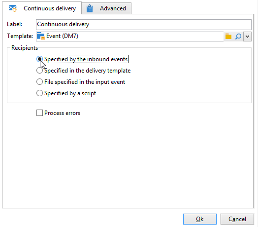

# Doorlopende levering{#continuous-delivery}

A **Doorlopende levering** Met een tekstactie kunt u nieuwe ontvangers toevoegen aan een bestaande levering. Met dit type levering hoeft u niet telkens een nieuwe levering te maken. Deze modus is vaak efficiënter, met name voor waarschuwingen met een laag volume of meldingen die worden verzonden wanneer dat nodig is.

 [Ontdek deze functie in video](#continuous-delivery-video)

Op een niveau van het leveringsmalplaatje, kunt u een manuscript specificeren om het etiket (en de campagnemap) van de bijbehorende levering te berekenen. Als in het script een levering wordt berekend die nog niet bestaat, wordt deze direct gemaakt.

De **[!UICONTROL Process errors]** geeft een bepaalde overgang weer die wordt geactiveerd wanneer een fout wordt gegenereerd. In dit geval gaat de workflow niet naar de foutmodus en gaat deze verder met de uitvoering.

Fouten waarmee rekening wordt gehouden, zijn fouten in het bestandssysteem (het bestand kan niet worden verplaatst, de map kan niet worden geopend, enz.).

Deze optie verwerkt geen fouten met betrekking tot activiteitsconfiguratie, d.w.z. ongeldige waarden.

## Invoerparameters {#input-parameters}

* tableName
* schema

Elke binnenkomende gebeurtenis moet een doel specificeren dat door deze parameters wordt bepaald.

Alleen wanneer de **[!UICONTROL Specified by the inbound event]** is geselecteerd.

## Uitvoerparameters {#output-parameters}

* tableName
* schema
* recCount

Deze reeks van drie waarden identificeert het doel dat uit de levering tijdens de vlucht voortvloeit. **[!UICONTROL tableName]** de naam van de tabel die de id&#39;s van het doel onthoudt, **[!UICONTROL schema]** is het schema van de populatie (gewoonlijk nms:ontvanger) en **[!UICONTROL recCount]** is het aantal elementen in de tabel.

De overgang verbonden aan het complement heeft de zelfde parameters.

## Een doorlopende levering instellen

Deze sectie verklaart hoe te opstelling een ononderbroken levering.

De **continue levering** Hiermee kunt u nieuwe ontvangers toevoegen aan een bestaande levering en voorkomt u dat u telkens een nieuwe levering moet maken wanneer een nieuwe ontvanger wordt toegevoegd. U kunt creatief direct in de campagnewerkschema bijwerken en het zal het malplaatje in de omslag van het Middel van het leveringsmalplaatje bijwerken.

Een ononderbroken levering zal tot één enkele levering en leveringslogboeken (wideLog) leiden en het volgen logboeken die erop wijzen dat één levering wordt toegevoegd telkens als het uitvoert.

## Video over zelfstudie {#continuous-delivery-video}

Deze video laat zien hoe u een doorlopende levering configureert met een stapsgewijze query.

>[!VIDEO](https://video.tv.adobe.com/v/25039?quality=12)

Er zijn aanvullende instructievideo&#39;s beschikbaar voor campagnes [hier](https://experienceleague.adobe.com/docs/campaign-learn/tutorials/getting-started/introduction-to-adobe-campaign.html){target="_blank"}.
