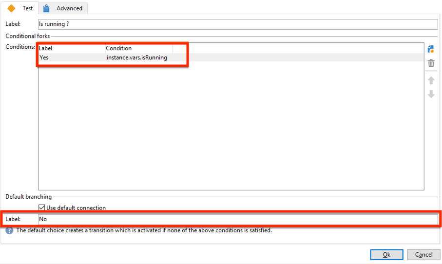

# Gegevensupdates coördineren{#coordinating-data-updates}

In dit geval wordt beschreven hoe u een workflow maakt waarmee u gelijktijdige updates kunt beheren wanneer u verschillende uitvoeringen van een workflow gebruikt.

Het doel is te controleren of het updateproces is beëindigd voordat een andere updatebewerking wordt uitgevoerd. Hiervoor wordt een instantievariabele ingesteld en wordt in de workflow getest of de instantie wordt uitgevoerd om te bepalen of de workflow moet worden voortgezet en of de update moet worden uitgevoerd.

Deze workflow bestaat uit:

* a **Planner** activiteit, die de werkstroom op een specifieke frequentie uitvoert.
* a **Testen** activiteit die controleert of de workflow al wordt uitgevoerd.
* **Query** en **Gegevens bijwerken** activiteiten voor het geval de werkstroom nog niet wordt uitgevoerd, gevolgd door een **Einde** activiteit die de werkschemainstantievariabele aan vals opnieuw initialiseert.
* An **Einde** activiteit als de workflow al wordt uitgevoerd.

Volg onderstaande stappen om de workflow te maken:

1. Voeg een **Planner** activiteit, dan vorm zijn frequentie op uw behoeften.
1. Voeg een **Testen** om te controleren of de workflow al wordt uitgevoerd en het vervolgens te configureren zoals hieronder wordt beschreven.

   >[!NOTE]
   >
   >&quot;isRunning&quot; is de naam van de instantievariabele die we voor dit voorbeeld hebben gekozen. Dit is geen ingebouwde variabele.

   

1. Een **Einde** aan de **Nee** vork. Op deze manier wordt niets uitgevoerd als de workflow al wordt uitgevoerd.
1. Voeg de gewenste activiteiten toe aan de **Ja** vork. In ons geval: **Query** en **Gegevens bijwerken** activiteiten.
1. Open de eerste activiteit en voeg vervolgens de **instance.vars.isRunning = true** in de **[!UICONTROL Advanced]** tab. Op deze manier wordt de instantievariabele ingesteld als actief.

   

1. Een **Einde** aan het einde van de **[!UICONTROL Yes]** vork, dan voeg toe **instance.vars.isRunning = false** in de **[!UICONTROL Advanced]** tab.

   Op deze manier wordt geen actie uitgevoerd zolang de workflow wordt uitgevoerd.

   

**Verwante onderwerpen:**

* [Meerdere uitvoeringen voorkomen](monitor-workflow-execution.md#preventing-simultaneous-multiple-executions)
* [Gegevensactiviteit bijwerken](update-data.md)
