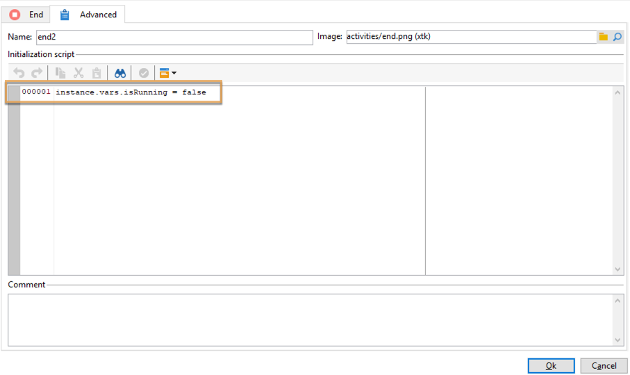

# Gegevensupdates coördineren{#coordinating-data-updates}

In dit geval wordt beschreven hoe u een workflow maakt waarmee u gelijktijdige updates kunt beheren wanneer u verschillende uitvoeringen van een workflow gebruikt.

Het doel is te controleren of het updateproces is beëindigd voordat een andere updatebewerking wordt uitgevoerd. Hiervoor wordt een instantievariabele ingesteld en wordt in de workflow getest of de instantie wordt uitgevoerd om te bepalen of de workflow moet worden voortgezet en of de update moet worden uitgevoerd.

Deze workflow bestaat uit:

* a **Planner** activiteit, die het werkschema op een specifieke frequentie uitvoert.
* a **Test** activiteit die controleert als het werkschema reeds uitvoert.
* **Vraag** en **gegevens van de Update** activiteiten in het geval dat het werkschema niet reeds uitvoert, die door een **Eind** activiteit wordt gevolgd die de variabele van de werkschemainstantie aan vals opnieuw initialiseert.
* Een **Eind** activiteit als het werkschema reeds uitvoert.

Volg onderstaande stappen om de workflow te maken:

1. Voeg de activiteit van de a **Planner** toe, dan vormen zijn frequentie volgens uw behoeften.
1. Voeg de activiteit van de a **Test** toe om te controleren als het werkschema reeds uitvoert, dan het zoals hieronder vormen.

   >[!NOTE]
   >
   >&quot;isRunning&quot; is de naam van de instantievariabele die we voor dit voorbeeld hebben gekozen. Dit is geen ingebouwde variabele.

   

1. Voeg een **Eindactiviteit** aan **toe Geen** vork. Op deze manier wordt niets uitgevoerd als de workflow al wordt uitgevoerd.
1. Voeg de gewenste activiteiten aan **toe ja** vork. In ons geval, **Vraag** en **Werk Gegevens** activiteiten bij.
1. Open de eerste activiteit, dan voeg **instance.vars.isRunning = waar** bevel in het **[!UICONTROL Advanced]** lusje toe. Op deze manier wordt de instantievariabele ingesteld als actief.

   

1. Voeg een **Eindactiviteit** aan het eind van het **[!UICONTROL Yes]** vork toe, dan voeg **instance.vars.isRunning = vals** bevel in het **[!UICONTROL Advanced]** lusje toe.

   Op deze manier wordt geen actie uitgevoerd zolang de workflow wordt uitgevoerd.

   

**Verwante onderwerpen:**

* [Meerdere uitvoeringen voorkomen](monitor-workflow-execution.md#preventing-simultaneous-multiple-executions)
* [Gegevensactiviteit bijwerken](update-data.md)
