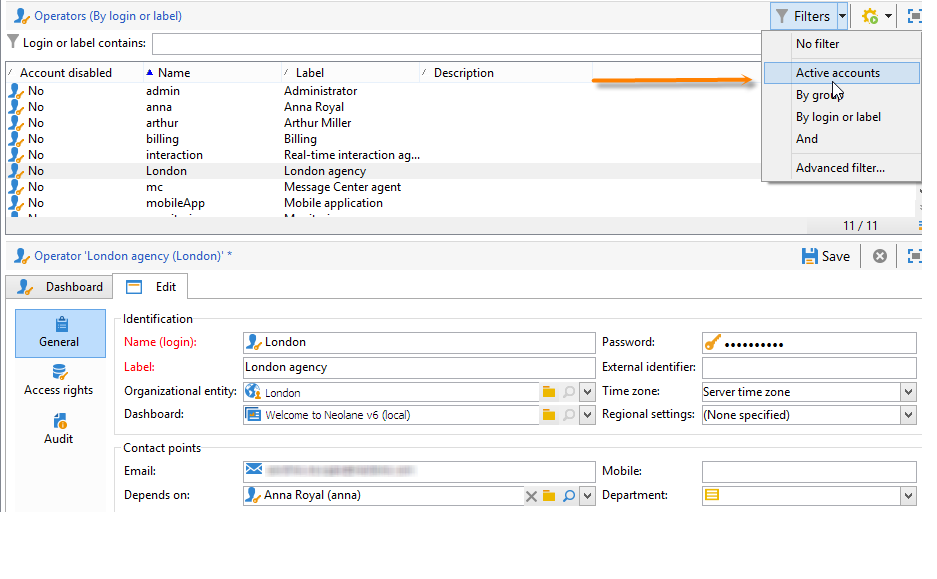

# Een filter maken {#creating-a-filter}

De filters die beschikbaar zijn in Adobe Campaign worden gedefinieerd door filtervoorwaarden die worden gemaakt in dezelfde besturingsmodus als query&#39;s.

De **[!UICONTROL Administration > Configuration > Predefined filters]** bevat alle filters die in de lijsten en overzichten worden gebruikt.

De lijst met operatoren kan bijvoorbeeld worden gefilterd door **[!UICONTROL Active accounts]**:

Het overeenkomende filter bevat de query voor het **[!UICONTROL Account disabled]** waarde van de **[!UICONTROL Operators]** schema:

Voor dezelfde lijst **[!UICONTROL By login or label]** Hiermee kunt u de gegevens in de lijst filteren op basis van de waarde die u hebt ingevoerd in het filterveld:

Het is als volgt samengesteld:

Om de filtervoorwaarden aan te passen, moet de exploitantrekening één van de volgende voorwaarden controleren:

* Het label ervan bevat de tekens die in het invoerveld zijn ingevoerd.
* De operatornaam bevat de tekens die in het invoerveld zijn ingevoerd.
* De inhoud van het beschrijvingsgebied bevat de tekens die in het invoerveld worden ingevoerd.

>[!NOTE]
>
>De **[!UICONTROL Upper]** kunt u de hoofdlettergevoelige functie deactiveren.

De **[!UICONTROL Taken into account if]** in de kolom kunt u de toepassingscriteria voor deze filtervoorwaarden definiëren. Hier, **$(/tmp/@text)** De tekens vertegenwoordigen de inhoud van het invoerveld dat aan het filter is gekoppeld:

Hier, **$(/tmp/@text)=&#39;office&#39;**

De **$(/tmp/@text)!=&#39;&#39;** expressie past elke voorwaarde toe wanneer het invoerveld niet leeg is.
