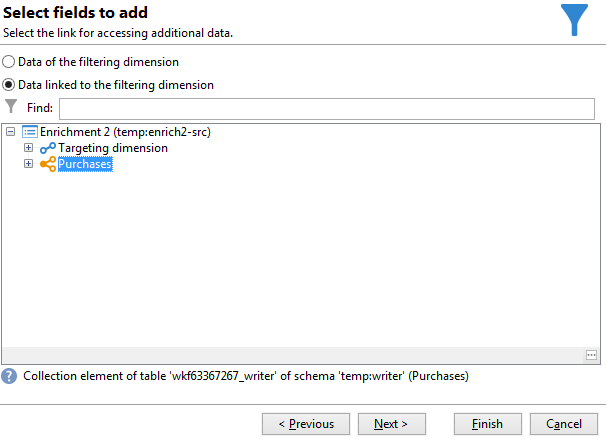

# Een overzichtslijst maken{#creating-a-summary-list}

In dit geval wordt beschreven hoe u een workflow maakt waarin u na het verzamelen van bestanden en na verschillende verbeteringen een overzichtslijst kunt maken. Het voorbeeld is gebaseerd op een lijst van contacten die aankopen in een opslag maakten.


De volgende gegevensstructuur wordt gebruikt:


Het doel van de verordening is:

* De verschillende opties van de verrijkingsactiviteit gebruiken
* De gegevens in de database bijwerken na een afstemming
* Een algemene &quot;weergave&quot; van de verrijkte gegevens maken

Voer de volgende stappen uit om een overzichtslijst te maken:

1. Een &quot;Aankopen&quot;-bestand verzamelen en laden in de tabel met werkzaamheden van de workflow
1. De geïmporteerde gegevens verrijken door een koppeling naar een referentietabel te maken
1. De tabel Aankopen bijwerken met de verrijkte gegevens
1. Verrijking van de &quot;Contactgegevens&quot; met een geaggregeerde berekening uit de tabel &quot;Aankopen&quot;
1. Een overzichtslijst maken

## Stap 1: Laad het bestand en combineer de geïmporteerde gegevens {#step-1--loading-the-file-and-reconciling-the-imported-data}

De te laden gegevens zijn &quot;Aankoop&quot; gerelateerde gegevens met de volgende indeling:

```
Product Name;Product price;Store
Computer;2000;London 3
Tablet;600;Cambridge
Computer;2000;London 5
Computer;2000;London 8
Tablet;600;Cambridge
Phone;500;London 5
```

Deze gegevens staan in het tekstbestand &quot;Purchases.txt&quot;.

1. Voeg de **inzamelaar van het Dossier** toe en **het laden van Gegevens (dossier)** activiteiten aan het werkschema.

   De **inzamelaar van het Dossier** activiteit laat u dossiers van en naar de server van Adobe Campaign verzamelen en verzenden.

   Het **laden van Gegevens (dossier)** activiteit laat u de het werklijst van het werkschema met de verzamelde gegevens verrijken. Voor meer op deze activiteit, verwijs naar [ deze pagina ](data-loading-file.md).

1. Vorm de **activiteit van de inzamelaar van het 0&rbrace; Dossier &lbrace;om tekst (&#42; te verzamelen.txt) typedossiers van de geselecteerde folder.**

   

   De **inzamelaar van het Dossier** activiteit laat u de afwezigheid van een dossier in de bronfolder beheren. Schakel de optie **[!UICONTROL Process file nonexistence]** in om dit te doen. In dit werkschema, a **wacht** activiteit is toegevoegd om een andere dossierinzameling te proberen als het van de folder op het tijdstip van inzameling mist.

1. Vorm het **laden van Gegevens (dossier)** activiteit gebruikend een steekproefdossier met het zelfde formaat zoals de te importeren gegevens.

   

   Klik op de koppeling **[!UICONTROL Click here to change the file format...]** om de naam van de kolommen te wijzigen met de interne namen en labels van de tabel &quot;Aankopen&quot;.

   

Zodra de gegevens zijn ingevoerd, wordt de verrijking uitgevoerd door een verbinding aan een verwijzingstabel te creëren die het schema &quot;van Sporen&quot;aanpast.

Voeg de verrijkingsactiviteit toe en configureer deze als volgt:

1. Selecteer de belangrijkste reeks die uit de gegevens van de **het laden van Gegevens (dossier)** activiteit wordt samengesteld.

   

1. Klik op **[!UICONTROL Add data]** en selecteer vervolgens de optie **[!UICONTROL A link]** .

   

1. Selecteer de optie **[!UICONTROL Define a collection]** .
1. Selecteer het schema &quot;Wines&quot; als doel.

   

Voor meer op de diverse types van verbindingen, verwijs naar [ het Verrijken en het wijzigen van gegevens ](targeting-workflows.md#enrich-and-modify-data).

In het volgende venster, moet u tot stand brengen zich aansluit bij voorwaarde door het brongebied (in de belangrijkste reeks) en het doelgebied (die tot het schema van &quot;Sporen&quot;behoren) te selecteren om gegevensverenigbaarheid te vormen.


Nu wordt de verbinding gecreeerd, gaan wij een kolom aan de het werklijst van het werkschema van het &quot;Schema van Opslag&quot;toevoegen: het gebied van de Verwijzing ZipCode.

1. Open de verrijkingsactiviteit.
1. Klik op **[!UICONTROL Edit additional data]**.
1. Voeg het veld &quot;ZipCode Reference&quot; toe aan **[!UICONTROL Output columns]** .


De gegevens in de werktabel na deze verrijking zijn als volgt:


## Stap 2: Verrijkte gegevens naar de tabel &#39;Aankopen&#39; schrijven {#step-2--writing-enriched-data-to-the--purchases--table}

In deze stap wordt beschreven hoe u de geïmporteerde en verrijkte gegevens naar de tabel &quot;Aankopen&quot; schrijft. Om dit te doen, moeten wij een **gegevens van de Update** activiteit gebruiken.

Een verzoening tussen de gegevens in de het werklijst van het werkschema en **Aankopen** richtend afmeting moet worden uitgevoerd alvorens de gegevens in de **3&rbrace; lijst van Aankopen wordt bijgewerkt.**

1. Klik op het tabblad **[!UICONTROL Reconciliation]** van de verrijkingsactiviteit.
1. Selecteer in dit geval de doeldimensie, het schema &quot;Aankopen&quot;.
1. Selecteer een &quot;Source-expressie&quot; voor de gegevens in de tabel met workflows (in dit geval het veld &quot;storeName&quot;).
1. Selecteer een expressie Doel voor de gegevens in de tabel &#39;Aankopen&#39; (in dit geval het veld &#39;bestandsnaam&#39;).
1. Schakel de optie **[!UICONTROL Keep unreconciled data coming from the work table]** in.


In de **gegevens van de Update** activiteit, is de volgende configuratie nodig:

1. Selecteer de optie **[!UICONTROL Insert or update]** in het veld **[!UICONTROL Operation type]** om te voorkomen dat telkens wanneer het bestand wordt verzameld, nieuwe records worden gemaakt.
1. Selecteer de **[!UICONTROL By directly using the targeting dimension]** -waarde voor de optie **[!UICONTROL Record identification]** .
1. Selecteer het schema &quot;Aankopen&quot; als een **[!UICONTROL Document type]** .
1. Geef de lijst op met velden die moeten worden bijgewerkt. In de kolom **[!UICONTROL Destination]** kunt u de velden van het schema &quot;Aankopen&quot; definiëren. Met de kolom **[!UICONTROL Expression]** kunt u de velden in de werktabel selecteren om een toewijzing uit te voeren.
1. Klik op de optie **[!UICONTROL Generate an outbound transition]** .


## Stap 3: Verrijken van contactgegevens {#step-3--enriching--contact--data-}

Het schema &quot;Contacten&quot; is fysiek gekoppeld aan het schema &quot;Aankopen&quot;. Dit betekent dat u een andere optie van de optie &quot;Verrijking&quot;kunt gebruiken: het toevoegen van gegevens verbonden aan de het filtreren afmeting.

Het doel van deze tweede verrijking is een aggregaat te maken op het aankoopschema om het totale bedrag aan aankopen voor elke geïdentificeerde contactpersoon te berekenen.

1. Voeg a **vraag** typeactiviteit toe die u alle **Opgeslagen Contacten** laat terugkrijgen.
1. Voeg een **Verrijking** activiteit dan toe selecteert de belangrijkste reeks resulterend uit de vorige vraag.
1. Klik op Toevoegen **[!UICONTROL Data]** .
1. Klik op de optie **[!UICONTROL Data linked to the targeting dimension]** .
1. Klik op de optie **[!UICONTROL Data linked to the filtering dimension]** in het **[!UICONTROL Select fields to add]** -venster.
1. Selecteer het knooppunt **[!UICONTROL Purchases]** en klik op **[!UICONTROL Next]** .

   

1. Wijzig het veld **[!UICONTROL Collected data]** door de optie **[!UICONTROL Aggregates]** te selecteren.

   

1. Klik op **[!UICONTROL Next]**.
1. Voeg de volgende expressie toe om het aankooptotaal voor elke contactpersoon te berekenen: &quot;Sum(@prodprice)&quot;.

   

Als u de overzichtslijst wilt voorbereiden, moet u velden toevoegen uit de velden Aankopen en uit de eerste verrijking: het veld ZipCode Reference.

1. Klik op de koppeling **[!UICONTROL Edit additional data...]** in de verrijkingsactiviteit.
1. Voeg de velden Winkelnaam en Aankopen / Postcodeverwijzing toe.

   

1. Klik op de tab **[!UICONTROL Properties]** .
1. Wijzig de tweede koppeling om slechts één regel te maken.

## Stap 4: Een overzichtslijst maken en toevoegen {#step-4--creating-and-adding-to-a-summary-list}

De laatste stap bestaat uit het schrijven van alle verrijkte gegevens naar een lijst.

1. Voeg de update van de a **Lijst** activiteit aan het werkschema toe. Deze activiteit moet verband houden met de uitgaande overgang van de tweede verrijkingsactiviteit.
1. Selecteer de optie **[!UICONTROL Create the list if necessary (Calculated name)]** .
1. Selecteer een waarde voor de berekende naam. Het label dat voor de lijst wordt gekozen, is de huidige datum: &lt;%= formatDate(new Date(), &quot;%2D/%2M/%2Y&quot;) %>.

Als de workflow eenmaal is uitgevoerd, bevat de lijst:

* een lijst van contacten;
* een kolom &quot;Totale aankopen&quot;,
* een kolom &quot;Winkelnaam&quot;,
* een kolom van de &quot;Verwijzing van de Code van het Postcode&quot;ingegaan voor alle opslag bevat in het schema van de archiefverwijzing.


