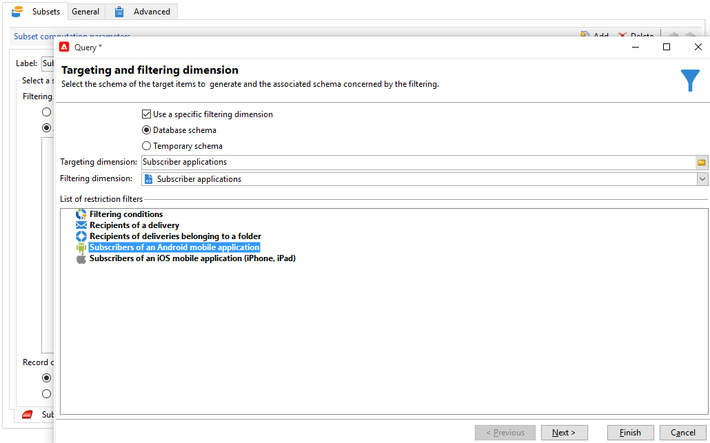

# Cross-channel leveringen{#cross-channel-deliveries}

De leveringen van het dwars-kanaal zijn beschikbaar in het **[!UICONTROL Deliveries]** lusje van [&#x200B; campagnewerkschema &#x200B;](campaign-workflows.md) activiteiten.

Selecteer de sjabloon waarop u de levering wilt baseren en definieer de inhoud ervan.

U kunt een doel voor uw levering vóór het werkschema specificeren gebruikend de verschillende het richten activiteiten.

In het onderstaande voorbeeld leert u hoe u een workflow maakt voor het verzenden van een e-mail of een SMS-bericht voor abonnees van pushberichten en een week later een pushmelding. Dit doet u als volgt:

1. Maak een campagne.
1. Voeg op het tabblad **[!UICONTROL Targeting and workflows]** van uw campagne een **[!UICONTROL Query]** activiteit toe.
1. Configureer uw query: selecteer de ontvangers die zijn geabonneerd op pushberichten als de doeldimensie.

   >[!NOTE]
   >
   >Voor de duw berichten, gebruik de **doelafmeting van de 0&rbrace; abonneetoepassingen.**

   

1. Voeg de filtervoorwaarden aan uw vraag toe. In dit geval selecteren we ontvangers met een mobiel nummer of e-mailadres.

   

1. Voeg een **[!UICONTROL Split]** activiteit aan uw werkschema toe om ontvangers te verdelen die een mobiel aantal en degenen hebben die een e-mailadres hebben.
1. Selecteer op het tabblad **[!UICONTROL Delivery]** een levering voor elk van uw doelen.

   U kunt uw levering op dezelfde manier maken als met een klassieke wizard voor levering door te dubbelklikken op de leveringsactiviteit in uw workflow.

   

1. Voeg en vorm een **[!UICONTROL Wait]** activiteit toe opdat de ontvangers niet teveel leveringen in één keer ontvangen.
1. Voeg een **[!UICONTROL Split]** -activiteit toe om abonnees van mobiele iOS- of Android-toepassingen te verdelen.

   Selecteer een service voor elk besturingssysteem.

   

1. Selecteer en configureer een levering van een mobiele toepassing voor elk besturingssysteem.

   
