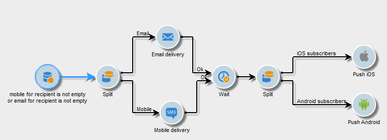

# Cross-channel leveringen{#cross-channel-deliveries}

Kanaaloverschrijdende leveringen zijn beschikbaar in het dialoogvenster **[!UICONTROL Deliveries]** tabblad van [campagneworkflow](campaign-workflows.md) activiteiten.

Selecteer de sjabloon waarop u de levering wilt baseren en definieer de inhoud ervan.

U kunt een doel voor uw levering vóór het werkschema specificeren gebruikend de verschillende het richten activiteiten.

In het onderstaande voorbeeld leert u hoe u een workflow maakt voor het verzenden van een e-mail of een SMS-bericht voor abonnees van pushberichten en een week later een pushmelding. Dit doet u als volgt:

1. Een campagne maken.
1. In de **[!UICONTROL Targeting and workflows]** tabblad van uw campagne, voegt u een **[!UICONTROL Query]** activiteit.
1. Uw query configureren: Selecteer de ontvangers die zijn geabonneerd op pushberichten als de doeldimensie.

   >[!NOTE]
   >
   >Voor de pushberichten gebruikt u de **abonneetoepassingen** doeldimensie.

   

1. Voeg de filtervoorwaarden aan uw vraag toe. In dit geval selecteren we ontvangers met een mobiel nummer of e-mailadres.

   

1. Voeg een **[!UICONTROL Split]** activiteit aan uw werkschema om ontvangers te verdelen die een mobiel aantal en degenen hebben die een e-mailadres hebben.
1. In de **[!UICONTROL Delivery]** selecteert u een levering voor elk van uw doelen.

   U kunt uw levering op dezelfde manier maken als met een klassieke wizard voor levering door te dubbelklikken op de leveringsactiviteit in uw workflow.

   

1. Een **[!UICONTROL Wait]** om ervoor te zorgen dat de ontvangers niet te veel leveringen tegelijk ontvangen.
1. Voeg een **[!UICONTROL Split]** activiteit om abonnees van mobiele iOS- of Android-toepassingen te verdelen.

   Selecteer een service voor elk besturingssysteem.

   

1. Selecteer en configureer een levering van een mobiele toepassing voor elk besturingssysteem.

   
