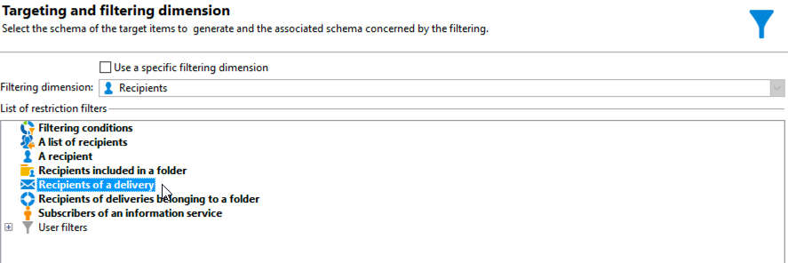

# Cross-channel leveringsworkflow{#cross-channel-delivery-workflow}

In dit geval wordt een voorbeeld weergegeven met een workflow voor levering over meerdere kanalen. Het algemene concept van de levering over meerdere kanalen wordt weergegeven in [deze sectie](cross-channel-deliveries.md).

Het doel is een publiek van de ontvangers van uw gegevensbestand in verschillende groepen te segmenteren met als doel een e-mail naar een groep en een SMS-bericht naar een andere groep te verzenden.

De belangrijkste stappen voor de implementatie van dit gebruiksgeval zijn als volgt:

1. Een **[!UICONTROL Query]** activiteit om uw publiek te richten.
1. Een **[!UICONTROL Email delivery]** activiteit die een link naar een aanbieding bevat.
1. Een **[!UICONTROL Split]** activiteit naar:

   * Stuur een andere e-mail naar de ontvangers die het eerste e-mailbericht niet hebben geopend.
   * Verzend een SMS-bericht naar de ontvangers die het e-mailbericht hebben geopend, maar klik niet op de koppeling naar het voorstel.
   * Voeg aan het gegevensbestand de ontvangers toe die e-mail opende en de verbinding klikte.

## Stap 1: Het publiek samenstellen {#step-1--build-the-audience}

Om uw doel te bepalen, creeer een vraag om de ontvangers te identificeren.

1. Een campagne maken. Raadpleeg  voor meer informatie.
1. In de **[!UICONTROL Targeting and workflows]** tabblad van uw campagne, voegt u een **Query** activiteit aan uw werkschema. Raadpleeg voor meer informatie over het gebruik van deze activiteit [deze sectie](query.md).
1. Bepaal de ontvangers die uw leveringen zullen ontvangen. Selecteer bijvoorbeeld &#39;Gold&#39;-leden als doeldimensie.
1. Voeg filtervoorwaarden aan uw vraag toe. Selecteer in dit voorbeeld ontvangers met een e-mailadres en een mobiel nummer.

   

1. Sla uw wijzigingen op.

## Stap 2: Een e-mail met een voorstel maken {#step-2--create-an-email-including-an-offer}

1. Een e-maillevering maken.
1. Ontwerp het bericht en voeg een verbinding met inbegrip van een aanbieding in de inhoud op.

   

   Voor meer over het integreren van een aanbieding in het lichaam van een bericht, verwijs naar.

1. Sla uw wijzigingen op.
1. Klik met de rechtermuisknop op de knop **[!UICONTROL Email delivery]** activiteit om het te openen.
1. Selecteer **[!UICONTROL Generate an outbound transition]** optie om de populatie en de trackinglogboeken te herstellen.

   

   Hierdoor kunt u deze informatie gebruiken om een andere levering te verzenden, afhankelijk van het gedrag van de ontvangers bij het ontvangen van de eerste e-mail.

1. Voeg een **[!UICONTROL Wait]** activiteit om de ontvangers een paar dagen te laten het e-mailbericht openen.

   

## Stap 3: Het resulterende publiek segmenteren {#step-3--segment-the-resulting-audience}

Zodra uw doel wordt geïdentificeerd en uw eerste levering gecreeerd, moet u het doel in verschillende populaties segmenteren gebruikend het filtreren voorwaarden.

1. Voeg een **Splitsen** aan de werkstroom en open het. Raadpleeg voor meer informatie over het gebruik van deze activiteit [deze sectie](split.md).
1. Creeer drie segmenten van de bevolking die stroomopwaarts in de vraag wordt berekend.

   

1. Selecteer voor de eerste subset de optie **[!UICONTROL Add a filtering condition on the inbound population]** en klik op **[!UICONTROL Edit]**.

   

1. Selecteren **[!UICONTROL Recipients of a delivery]** als het restrictiefilter en klik op **[!UICONTROL Next]**.

   

1. Selecteer in de filterinstellingen de optie **[!UICONTROL Recipients who have not opened or clicked (email)]** van de **[!UICONTROL Behavior]** en selecteer de e-mail met het aanbod dat u wilt verzenden in de leveringslijst. Klik op **[!UICONTROL Finish]**.

   

1. Ga op dezelfde manier verder voor de tweede subset en selecteer **[!UICONTROL Recipients who have not clicked (email)]** van de **[!UICONTROL Behavior]** vervolgkeuzelijst.

   

1. Voor de derde subset selecteert u de opdracht **[!UICONTROL Add a filtering condition on the inbound population]** en klikken **[!UICONTROL Edit]**, selecteert u de **[!UICONTROL Use a specific filtering dimension]** optie.
1. Selecteren **[!UICONTROL Recipient tracking log]** van de **[!UICONTROL Filtering dimension]** vervolgkeuzelijst, markeren **[!UICONTROL Filtering conditions]** van de **[!UICONTROL List of restriction filters]** en klik op **[!UICONTROL Next]**.

   

1. Selecteer de filtervoorwaarden als volgt:

   

1. Klikken **[!UICONTROL Finish]** om uw wijzigingen op te slaan.

## Stap 4: De workflow voltooien {#step-4--finalize-the-workflow}

1. Voeg relevante activiteiten toe aan uw werkstroom na de drie subsets die het resultaat zijn van de **[!UICONTROL Split]** activiteit:

   * Een **[!UICONTROL Email delivery]** activiteit om een herinnering e-mail naar de eerste subset te verzenden.
   * Voeg een **[!UICONTROL Mobile delivery]** activiteit om een bericht van SMS naar de tweede ondergroep te verzenden.
   * Voeg een **[!UICONTROL List update]** activiteit om de overeenkomstige ontvangers aan het gegevensbestand toe te voegen.

1. Dubbelklik op de leveringsactiviteiten in uw workflow om deze te bewerken. Raadpleeg voor meer informatie over het maken van een e-mail en een sms.
1. Dubbelklik op de knop **[!UICONTROL List update]** activiteit en selecteer **[!UICONTROL Generate an outbound transition]** optie.

   Vervolgens kunt u de resulterende ontvangers van Adobe Campaign naar de Adobe Experience Cloud exporteren. U kunt bijvoorbeeld het publiek in Adobe Target gebruiken door een ** toe te voegen.

1. Klik op de knop **Start** in de actiebalk om de workflow uit te voeren.

De door de **Query** de activiteit zal worden gesegmenteerd om een e-mail of een levering van SMS volgens het gedrag van de ontvangers te ontvangen. De resterende populatie wordt met behulp van de **[!UICONTROL List update]** activiteit.
