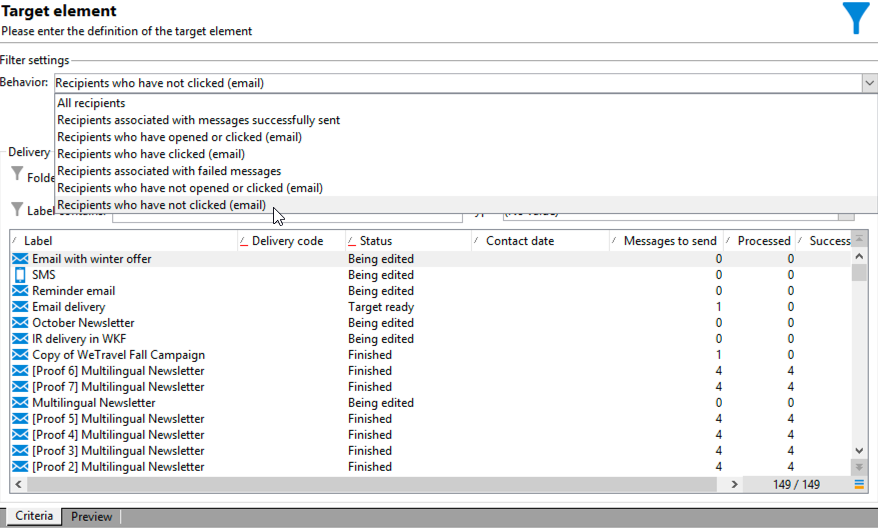

# Cross-channel leveringsworkflow{#cross-channel-delivery-workflow}

In dit geval wordt een voorbeeld weergegeven met een workflow voor levering over meerdere kanalen. Het algemene concept van dwars-kanaalleveringen wordt voorgesteld in [&#x200B; deze sectie &#x200B;](cross-channel-deliveries.md).

Het doel is een publiek van de ontvangers van uw gegevensbestand in verschillende groepen te segmenteren met als doel een e-mail naar een groep en een SMS-bericht naar een andere groep te verzenden.

De belangrijkste stappen voor de implementatie van dit gebruiksgeval zijn als volgt:

1. Een **[!UICONTROL Query]** -activiteit maken om uw doelgroep te bereiken.
1. Een **[!UICONTROL Email delivery]** -activiteit maken die een koppeling naar een aanbieding bevat.
1. Een **[!UICONTROL Split]** -activiteit gebruiken om:

   * Stuur een andere e-mail naar de ontvangers die het eerste e-mailbericht niet hebben geopend.
   * Verzend een SMS-bericht naar de ontvangers die het e-mailbericht hebben geopend, maar klik niet op de koppeling naar het voorstel.
   * Voeg aan het gegevensbestand de ontvangers toe die e-mail opende en de verbinding klikte.

## Stap 1: Bouw het publiek {#step-1--build-the-audience}

Om uw doel te bepalen, creeer een vraag om de ontvangers te identificeren.

1. Maak een campagne. Meer informatie vindt u [op deze pagina](../campaigns/marketing-campaign-create.md).
1. In het **[!UICONTROL Targeting and workflows]** lusje van uw campagne, voeg de activiteit van de a **Vraag** aan uw werkschema toe. Voor meer bij het gebruiken van deze activiteit, verwijs naar [&#x200B; deze sectie &#x200B;](query.md).
1. Bepaal de ontvangers die uw leveringen zullen ontvangen. Selecteer bijvoorbeeld &#39;Gold&#39;-leden als doeldimensie.
1. Voeg filtervoorwaarden aan uw vraag toe. Selecteer in dit voorbeeld ontvangers met een e-mailadres en een mobiel nummer.

   

1. Sla uw wijzigingen op.

## Stap 2: Maak een e-mail met een voorstel {#step-2--create-an-email-including-an-offer}

1. Maak een e-maillevering.
1. Ontwerp het bericht en voeg een verbinding met inbegrip van een aanbieding in de inhoud op.

   

   Voor meer bij het integreren van een aanbieding in het lichaam van een bericht, verwijs naar [&#x200B; deze pagina &#x200B;](../../v8/send/email.md).

1. Sla uw wijzigingen op.
1. Klik met de rechtermuisknop op de **[!UICONTROL Email delivery]** -activiteit om deze te openen.
1. Selecteer de optie **[!UICONTROL Generate an outbound transition]** om de populatie en de logbestanden voor bijhouden te herstellen.

   

   Hierdoor kunt u deze informatie gebruiken om een andere levering te verzenden, afhankelijk van het gedrag van de ontvangers bij het ontvangen van de eerste e-mail.

1. Voeg een **[!UICONTROL Wait]** -activiteit toe zodat de ontvangers het e-mailbericht enkele dagen kunnen openen.

   

## Stap 3: Segmenteer het resulterende publiek {#step-3--segment-the-resulting-audience}

Zodra uw doel wordt geïdentificeerd en uw eerste levering gecreeerd, moet u het doel in verschillende populaties segmenteren gebruikend het filtreren voorwaarden.

1. Voeg a **Gesplitste** activiteit aan het werkschema toe en open het. Voor meer bij het gebruiken van deze activiteit, verwijs naar [&#x200B; deze sectie &#x200B;](split.md).
1. Creeer drie segmenten van de bevolking die stroomopwaarts in de vraag wordt berekend.

   

1. Voor de eerste subset selecteert u de optie **[!UICONTROL Add a filtering condition on the inbound population]** en klikt u op **[!UICONTROL Edit]** .

   

1. Selecteer **[!UICONTROL Recipients of a delivery]** als het restrictiefilter en klik op **[!UICONTROL Next]** .

   

1. Selecteer in de filterinstellingen de optie **[!UICONTROL Recipients who have not opened or clicked (email)]** in de vervolgkeuzelijst **[!UICONTROL Behavior]** en selecteer de e-mail met de aanbieding die u wilt verzenden in de leveringslijst. Klik op **[!UICONTROL Finish]**.

   

1. Ga op dezelfde manier verder voor de tweede subset en selecteer **[!UICONTROL Recipients who have not clicked (email)]** in de vervolgkeuzelijst **[!UICONTROL Behavior]** .

   

1. Voor de derde subset selecteert u de optie **[!UICONTROL Add a filtering condition on the inbound population]** nadat u op **[!UICONTROL Edit]** hebt geklikt. **[!UICONTROL Use a specific filtering dimension]**
1. Selecteer **[!UICONTROL Recipient tracking log]** in de **[!UICONTROL Filtering dimension]** vervolgkeuzelijst, markeer **[!UICONTROL Filtering conditions]** in de **[!UICONTROL List of restriction filters]** en klik op **[!UICONTROL Next]** .

   

1. Selecteer de filtervoorwaarden als volgt:

   

1. Klik op **[!UICONTROL Finish]** om de wijzigingen op te slaan.

## Stap 4: De workflow voltooien {#step-4--finalize-the-workflow}

1. Voeg de relevante activiteiten toe aan uw werkstroom na de drie subsets die het resultaat zijn van de **[!UICONTROL Split]** -activiteit:

   * Voeg een **[!UICONTROL Email delivery]** -activiteit toe om een herinnering-e-mail naar de eerste subset te verzenden.
   * Voeg een **[!UICONTROL Mobile delivery]** -activiteit toe om een SMS-bericht naar de tweede subset te verzenden.
   * Voeg een **[!UICONTROL List update]** activiteit toe om de overeenkomstige ontvangers aan het gegevensbestand toe te voegen.

1. Dubbelklik op de leveringsactiviteiten in uw workflow om deze te bewerken.
1. Dubbelklik op de **[!UICONTROL List update]** -activiteit en selecteer de optie **[!UICONTROL Generate an outbound transition]** .
1. Klik de **knoop van het Begin** in de actiebar om het werkschema uit te voeren.

De bevolking die door de **vraag** activiteit wordt gericht zal worden gesegmenteerd om een e-mail of een levering van SMS volgens het gedrag van de ontvangers te ontvangen. De resterende populatie wordt met de **[!UICONTROL List update]** -activiteit toegevoegd aan de database.
