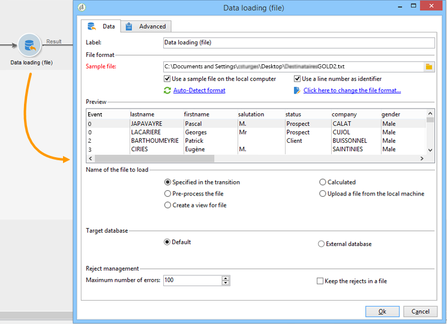

# Gegevens laden (bestand){#data-loading-file}

## Gebruiken {#use}

Met de activiteit **[!UICONTROL Data loading (File)]** hebt u rechtstreeks toegang tot een bron met externe gegevens en kunt u deze gebruiken in Adobe Campaign. Alle gegevens die vereist zijn voor bewerkingen met het doel als doel, worden niet altijd gevonden in de Adobe Campaign-database: ze kunnen beschikbaar worden gesteld in externe bestanden.

Het bestand dat moet worden geladen, kan worden opgegeven door de overgang of worden berekend tijdens de uitvoering van deze activiteit. Bijvoorbeeld, kan het de lijst van 10 favoriete producten van een cliënt zijn de waarvan aankopen in een extern gegevensbestand worden beheerd.

In het bovenste gedeelte van het configuratievenster voor deze activiteit kunt u de bestandsindeling definiëren. Hiervoor gebruikt u een voorbeeldbestand met dezelfde indeling als het bestand dat u wilt importeren. Dit bestand kan lokaal of op de server worden opgeslagen.

>[!CAUTION]
>
>Alleen &#39;platte&#39; structuurbestanden worden ondersteund (bijvoorbeeld CSV, TXT, enz.). Het gebruik van de XML-indeling wordt afgeraden. Met de clientconsole kunt u bestanden tot maximaal 150 MB laden. In de gebruikersinterface van het Web, heeft de het dossieractiviteit van de Lading een grens van 50MB. [Meer informatie](https://experienceleague.adobe.com/docs/campaign-web/v8/wf/design-workflows/load-file.html){target="_blank"}

U kunt een vooraf uitgevoerd proces definiëren tijdens het importeren van bestanden, bijvoorbeeld om het bestand niet op de server uit te pakken (en dus ruimte voor het uitgepakt bestand op te slaan) maar om het uitpakken op te nemen in de bestandsverwerking. Selecteer de optie **[!UICONTROL Pre-process the file]** en kies een van de drie opties: **[!UICONTROL None]** , **[!UICONTROL Decompression]** (zcat) of **[!UICONTROL Decrypt]** (gpg).

>[!IMPORTANT]
>
>U kunt gecomprimeerde bestanden van meer dan 4 GB niet decomprimeren.

## De bestandsindeling definiëren {#defining-the-file-format}

Wanneer u een bestand laadt, wordt de kolomindeling automatisch gedetecteerd met de standaardparameters voor elk gegevenstype. U kunt deze standaardparameters wijzigen om de specifieke processen op te geven die op uw data moeten worden toegepast, in het bijzonder wanneer er een fout of een lege waarde is.

Selecteer hiervoor **[!UICONTROL Click here to change the file format...]** in het hoofdvenster van de **[!UICONTROL Data loading (file)]** -activiteit. Het venster met de indelingsdetails wordt dan geopend.

Vervolgens kunt u de algemene opmaak van het bestand en de opmaak van elke kolom wijzigen.

Met de algemene bestandsindeling kunt u bepalen hoe de kolommen worden herkend (bestandencodering, gebruikte scheidingstekens, enz.).

Met de kolomopmaak kunt u de waardeverwerking van elke kolom definiëren:

>[!NOTE]
>
>U kunt zoveel kolommen toevoegen als u wilt. De maximumlengte van waarden in elke kolom wordt bepaald door het gekozen gegevenstype.

* **[!UICONTROL Ignore column]**: Deze kolom wordt niet verwerkt tijdens het laden van data.
* **[!UICONTROL Data type]**: Deze geeft het type data op dat voor elke kolom wordt verwacht.
* **[!UICONTROL Allow NULLs]**: geeft aan hoe lege waarden moeten worden beheerd.

   * **[!UICONTROL Adobe Campaign default]**: Dit genereert alleen een fout voor numerieke velden. Als dit niet het geval is, wordt een NULL-waarde ingevoegd.
   * **[!UICONTROL Empty value allowed]**: Dit autoriseert lege waarden. De waarde NULL wordt daarom ingevoegd.
   * **[!UICONTROL Always populated]**: Dit genereert een fout als een waarde leeg is.

* **[!UICONTROL Length]**: specificeert het maximumaantal karakters voor het **koord** gegevenstype.
* **[!UICONTROL Format]** : definieert de notatie voor tijd en datum.
* **[!UICONTROL Data transformation]**: bepaalt of een proces van het karaktergeval op a **koord** moet worden toegepast.

   * **[!UICONTROL None]** : de geïmporteerde tekenreeks wordt niet gewijzigd.
   * **[!UICONTROL First letter in upper case]** : de eerste letter van elk woord van de tekenreeks begint met een hoofdletter.
   * **[!UICONTROL Upper case]** : alle tekens in de tekenreeks worden in hoofdletters weergegeven.
   * **[!UICONTROL Lower case]** : alle tekens in de tekenreeks zijn in kleine letters.

* **[!UICONTROL White space management]**: geeft aan of bepaalde spaties in een tekenreeks moeten worden genegeerd. Met de waarde **[!UICONTROL Ignore spaces]** kunnen alleen spaties aan het begin en het einde van een tekenreeks worden genegeerd.
* **[!UICONTROL Error processings]**: Dit definieert het gedrag als een fout optreedt.

   * **[!UICONTROL Ignore the value]**: De waarde wordt genegeerd. Er wordt een waarschuwing gegenereerd in het logboek voor workflowuitvoering.
   * **[!UICONTROL Reject line]**: De volledige regel wordt niet verwerkt.
   * **[!UICONTROL Use a default value in case of error]**: Dit vervangt de waarde die de fout veroorzaakt door een standaardwaarde, die in het veld **[!UICONTROL Default value]** is gedefinieerd.
   * **[!UICONTROL Reject the line when there is no remapping value]**: de hele regel wordt alleen verwerkt als er een toewijzing voor de onjuiste waarde is gedefinieerd (zie de optie **[!UICONTROL Mapping]** hieronder).
   * **[!UICONTROL Use a default value in case the value is not remapped]** : vervangt de waarde die de fout veroorzaakt door een standaardwaarde, die in het veld **[!UICONTROL Default value]** is gedefinieerd, tenzij een toewijzing voor de onjuiste waarde is gedefinieerd (zie de optie **[!UICONTROL Mapping]** hieronder).

* **[!UICONTROL Default value]**: Hiermee geeft u de standaardwaarde op op basis van de gekozen foutverwerking.
* **[!UICONTROL Mapping]**: dit veld is alleen beschikbaar in de configuratie van de kolomdetails (toegankelijk via een dubbelklik of via de opties rechts van de kolomlijst). Hiermee worden bepaalde waarden getransformeerd wanneer ze worden geïmporteerd. U kunt bijvoorbeeld ‘three’ omzetten in ‘3’.

## Voorbeeld: Gegevens verzamelen en in de database laden {#example--collecting-data-and-loading-it-in-the-database}

In het volgende voorbeeld kunt u elke dag een bestand op de server verzamelen, de inhoud van het bestand laden en de gegevens in de database bijwerken, afhankelijk van de informatie die het bevat. Het te verzamelen bestand bevat informatie over klanten die mogelijk aankopen hebben gedaan (voor meer of minder dan 3000 euro), om terugbetaling hebben gevraagd bij een aankoop of de winkel hebben bezocht zonder iets te kopen. Afhankelijk van deze informatie worden verschillende processen toegepast op hun profiel in de database.

1. Met de bestandscollector kunt u bestanden herstellen die in een map zijn opgeslagen, afhankelijk van de opgegeven frequentie.

   Het tabblad **[!UICONTROL Directory]** bevat informatie over de bestanden die moeten worden hersteld. In ons voorbeeld worden alle bestanden in tekstopmaak waarvan de namen het woord &#39;klanten&#39; bevatten en die zijn opgeslagen in de map tmp/Adobe/Data/files van de server, hersteld.

   Het gebruiken van **[!UICONTROL File collector]** is gedetailleerd in de [ 2} sectie van de inzamelaar van het Dossier {.](file-collector.md)

   

   Op het tabblad **[!UICONTROL Schedule]** kunt u de uitvoering van de verzamelaar plannen, zodat u kunt opgeven met welke frequentie de aanwezigheid van deze bestanden wordt gecontroleerd.

   Hier, willen wij de inzamelaar elke werkdag teweegbrengen om 9PM.

   

   Klik hiertoe op de knop **[!UICONTROL Change...]** in de rechterbenedensectie van het bewerkgereedschap en configureer het schema.

   Voor meer op dit, verwijs naar [ Planner ](scheduler.md).

1. Configureer vervolgens de activiteit voor het laden van gegevens (bestand) om aan te geven hoe de verzamelde bestanden moeten worden gelezen. Selecteer hiertoe een voorbeeldbestand met dezelfde structuur als de bestanden die u wilt laden.

   

   Hier bevat het bestand vijf kolommen:

   * de eerste kolom bevat een code die samenvalt met de gebeurtenis: aankoop (meer of minder dan 3 000 euro), geen aankoop of terugbetaling voor een of meer aankopen.
   * de vier volgende kolommen bevatten de voornaam, achternaam, e-mail en het rekeningnummer van de klant.

   De indelingsconfiguratie van het te laden bestand valt samen met de configuratie die is gedefinieerd tijdens het importeren van gegevens in Adobe Campaign.

1. In de gespleten activiteit, specificeer de subsets om, volgens de **kolomwaarde van de Gebeurtenis** te creëren {.

   De activiteit Splitsen wordt gedetailleerd beschreven in de sectie.

   

   Voor elke ondergroep, specificeer één van de waarden in de **kolom van de Gebeurtenis**.

   

   De **[!UICONTROL Split]** -activiteit bevat daarom de volgende informatie:

   

1. Geef vervolgens aan welke processen voor elk type bevolking moeten worden uitgevoerd. In ons voorbeeld gaan we naar **[!UICONTROL Update the data]** in de database. Hiervoor plaatst u een **[!UICONTROL Update data]** -activiteit aan het einde van elke uitgaande overgang van de gesplitste activiteit.

   De **[!UICONTROL Update data]** activiteit is gedetailleerd in de [ gegevens van de Update ](update-data.md) sectie.
