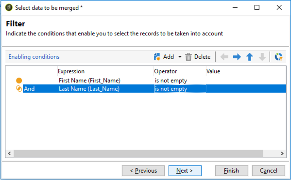

# De samenvoegfunctionaliteit van de deduplicatieactiviteit gebruiken {#deduplication-merge}

## Over dit gebruiksscenario {#about-this-use-case}

In dit geval wordt beschreven hoe u de functie **[!UICONTROL Merge]** in de **[!UICONTROL Deduplication]** -activiteit kunt gebruiken.

Voor meer informatie over deze functionaliteit, verwijs naar [&#x200B; deze sectie &#x200B;](deduplication.md#merging-fields-into-single-record).

De **[!UICONTROL Deduplication]** -activiteit wordt gebruikt voor het verwijderen van dubbele rijen uit een gegevensset. In dit geval worden de hieronder weergegeven gegevens gedupliceerd op basis van het veld E-mail.

| Laatste wijzigingsdatum | Voornaam | Achternaam | Email | Mobiele telefoon | Telefoon |
|-----|------------|-----------|-------|--------------|------|
| 19-05-2020 | Robert | Tisner | bob@mycompany.com | 444-444-444 | 777-777-7777 |
| 22-07-2020 | Bobby | Tisner | bob@mycompany.com | | 777-777-7777 |
| 03-10-2020 | Bob |  | bob@mycompany.com | | 888-888-888 |

Met de **[!UICONTROL Merge]** -fonctionaliteit van de deduplicatieactiviteit kunt u een set regels voor de deduplicatie configureren om een groep velden te definiëren die moeten worden samengevoegd in één resulterend gegevensrecord. Met een set dubbele records kunt u bijvoorbeeld het oudste telefoonnummer of de meest recente naam behouden.

## De functie Samenvoegen activeren {#activating-merge}

Als u de samenvoegfunctionaliteit wilt inschakelen, moet u eerst de **[!UICONTROL Deduplication]** -activiteit configureren. Ga als volgt te werk om dit te doen:

1. Open de activiteit, dan klik **[geef configuratie]** verbinding uit.

1. Selecteer het afstemmingsveld dat u voor de deduplicatie wilt gebruiken en klik op **[!UICONTROL Next]** . In dit voorbeeld willen we dedupliceren op basis van het e-mailveld.

   

1. Klik op de koppeling **[!UICONTROL Advanced parameters]** en activeer vervolgens de opties **[!UICONTROL Merge records]** en **[!UICONTROL Use several record merging criteria]** .

   

1. Het tabblad **[!UICONTROL Merge]** wordt toegevoegd aan het configuratiescherm van **[!UICONTROL Deduplication]** . Dit tabblad wordt gebruikt om de gegevens op te geven die moeten worden samengevoegd bij het uitvoeren van deduplicatie.

## Samenvoegen van velden configureren {#configuring-rules}

Hier volgen de regels die we willen gebruiken om de gegevens samen te voegen tot één record:

* De meest recente naam behouden (velden voor voornaam en achternaam),
* Houd de meest recente mobiele telefoon,
* Behoud het oudste telefoonaantal,
* Alle velden in een groep moeten een andere waarde hebben dan null om in aanmerking te komen voor de uiteindelijke record.

Voer de volgende stappen uit om deze regels te configureren:

1. Open het tabblad **[!UICONTROL Merge]** en klik op de knop **[!UICONTROL Add]** .

   

1. Geef de id en het label op van de groep velden die moet worden samengevoegd.

   

1. Vermeld de voorwaarden voor de keuze van de in aanmerking te nemen registers.

   

1. Sorteer op de laatste wijzigingsdatum om de meest recente naam te selecteren.

   

1. Selecteer de velden die u wilt samenvoegen. In dit voorbeeld willen we de velden voor de voornaam en achternaam behouden.

   

1. De velden worden toegevoegd aan de set gegevens die moeten worden samengevoegd en er wordt een nieuw element toegevoegd aan het workflowschema.

   Herhaal deze stappen om de mobiele telefoon en telefoongebieden te vormen.

   

   

## Resultaten {#results}

Nadat u deze regels hebt geconfigureerd, worden de volgende gegevens ontvangen aan het einde van de **[!UICONTROL Deduplication]** -activiteit.

| Wijzigingsdatum | Voornaam | Achternaam | Email | Mobiele telefoon | Telefoon |
|-----|------------|-----------|-------|--------------|------|
| 19-05-2020 | Robert | Tisner | bob@mycompany.com | 444-444-444 | 777-777-7777 |
| 22-07-2020 | Bobby | Tisner | bob@mycompany.com | | 777-777-7777 |
| 03-10-2020 | Bob |  | bob@mycompany.com | | 888-888-888 |

Het resultaat wordt samengevoegd van de drie verslagen volgens de eerder gevormde regels. Na vergelijking wordt geconcludeerd dat de meest recente naam en mobiele telefoon samen met het originele telefoonnummer worden gebruikt.

| Voornaam | Achternaam | Email | Mobiele telefoon | Telefoon |
|------------|-----------|-------|--------------|------|
| Bobby | Tisner | bob@mycompany.com | 444-444-4444 | 888-888-888 |

>[!NOTE]
>
> Merk op dat de voornaam die is samengevoegd &quot;Bobby&quot;is, omdat wij een &quot;Naam&quot;regel vormden die van zowel de voornaam als de laatste gebieden wordt gemaakt.
>
>Dientengevolge, &quot;Loodje&quot;(de meest recente voornaam) kon niet in aanmerking worden genomen omdat zijn bijbehorend familiengebied leeg was. De meest recente combinatie van voornaam en achternaam is samengevoegd in de uiteindelijke record.
