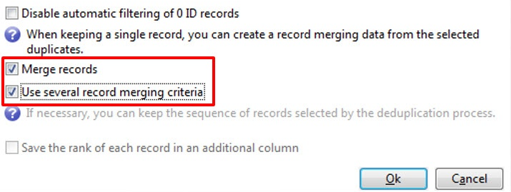

# Deduplicatie{#deduplication}

Deduplicatie verwijdert duplicaten van de resultaten van binnenkomende activiteiten. U kunt deduplicatie uitvoeren op het e-mailadres, telefoonnummer of een ander veld.

De **[!UICONTROL Deduplication]** activiteit wordt gebruikt voor het verwijderen van dubbele rijen uit een gegevensreeks. De onderstaande records kunnen bijvoorbeeld als duplicaat worden beschouwd omdat ze hetzelfde e-mailadres en hetzelfde mobiele en/of thuistelefoon hebben.

| Laatste wijzigingsdatum | Voornaam | Achternaam | Email | Mobiele telefoon | Telefoon |
-----|------------|-----------|-------|--------------|------
| 02/03/2020 | Bob | Tisner | bob@mycompany.com | 444-444-4444 | 888-888-8888 |
| 05/19/2020 | Robert | Tisner | bob@mycompany.com | 444-444-4444 | 777-777-7777 |
| 07/22/2020 | Bobby | Tisner | bob@mycompany.com | 444-444-4444 | 777-777-7777 |

De **[!UICONTROL Deduplication]** activiteit heeft de capaciteit om een volledige rij als uniek verslag te houden nadat de duplicaten werden geïdentificeerd. Bijvoorbeeld in het bovenstaande gebruiksgeval, als de activiteit wordt gevormd om slechts het verslag met het oudste te houden **[!UICONTROL Date]** Het resultaat zou zijn:

| Datum | Voornaam | Achternaam | Email | Mobiele telefoon | Telefoon |
-----|----------|------------|-------|--------------|------
| 02/03/2020 | Bob | Tisner | bob@mycompany.com | 444-444-4444 | 888-888-8888 |

De geselecteerde hoofdrecord stuurt de gegevens door zonder dat veldgegevens worden samengevoegd met andere relevante gegevens in de dubbele rijen.

Complementeren:

| Datum | Voornaam | Achternaam | Email | Mobiele telefoon | Telefoon |
-----|------------|-----------|-------|--------------|------
| 05/19/2020 | Robert | Tisner | bob@mycompany.com | 444-444-4444 | 777-777-7777 |
| 07/22/2020 | Bobby | Tisner | bob@mycompany.com | 444-444-4444 | 777-777-7777 |

## Best practices {#best-practices}

Tijdens deduplicatie worden inkomende stromen afzonderlijk verwerkt. Als bijvoorbeeld ontvanger A in het resultaat van vraag 1 evenals in het resultaat van vraag 2 wordt gevonden, zullen zij niet worden gededupliceerd.

Deze kwestie moet als volgt worden aangepakt:

* Een **Unie** activiteit om elke binnenkomende stroom te verenigen.
* Een **Deduplicatie** activiteit na de **Unie** activiteit.

## Configuratie {#configuration}

Als u een deduplicatie wilt configureren, voert u het label, de methode en de criteria voor deduplicatie in en de opties voor het resultaat.

1. Klik op de knop **[!UICONTROL Edit configuration...]** koppeling om de deduplicatiemodus te definiëren.

   

1. Selecteer het type doel voor deze activiteit (deduplicatie is standaard gekoppeld aan ontvangers) en het te gebruiken criterium, d.w.z. het veld waarvoor identieke waarden u in staat stellen duplicaten te identificeren.

   >[!NOTE]
   >
   >Als u externe gegevens als invoer gebruikt, bijvoorbeeld vanuit een extern bestand, moet u de optie **[!UICONTROL Temporary schema]** -optie.
   >
   >In de volgende stap worden de **[!UICONTROL Other]** Met deze optie kunt u het criterium of de criteria selecteren die u wilt gebruiken:

   

1. In de volgende stap worden de **[!UICONTROL Other]** Met deze optie kunt u het criterium of de criteria selecteren die moeten worden gebruikt in het geval van identieke waarden.

   

1. Selecteer in de vervolgkeuzelijst de deduplicatiemethode die u wilt gebruiken en voer het aantal duplicaten in dat u wilt behouden.

   

   De volgende methoden zijn beschikbaar:

   * **[!UICONTROL Choose for me]**: Hiermee selecteert u willekeurig de record die u uit de duplicaten wilt houden.
   * **[!UICONTROL Following a list of values]**: Hiermee kunt u een waardeprioriteit voor een of meer velden definiëren. Als u de waarden wilt definiëren, selecteert u een veld of maakt u een expressie en vervolgens voegt u de waarde(n) toe aan de desbetreffende tabel. Als u een nieuw veld wilt definiëren, klikt u op de knop **[!UICONTROL Add]** boven de lijst met waarden.

     

   * **[!UICONTROL Non-empty value]**: Hiermee kunt u records waarvoor de waarde van de geselecteerde expressie niet leeg is als prioriteit behouden.

     

   * **[!UICONTROL Using an expression]**: hiermee kunt u records met de laagste (of hoogste) waarde van de opgegeven expressie bijhouden.

     

   >[!NOTE]
   >
   >De **[!UICONTROL Merge]** functionaliteit, toegankelijk via de **[!UICONTROL Advanced parameters]** verbinding, staat u toe om een reeks regels te vormen om een gebied of een groep gebieden in één enkel resulterend gegevensverslag samen te voegen. Zie voor meer informatie [Velden samenvoegen tot één record](#merging-fields-into-single-record).

1. Klikken **[!UICONTROL Finish]** om de geselecteerde deduplicatiemethode goed te keuren.

   Het middelste gedeelte van het venster geeft een overzicht van de gedefinieerde configuratie.

   In de onderste sectie van het venster van de activiteitenredacteur, kunt u het etiket voor de uitgaande overgang van het grafische voorwerp wijzigen en een segmentcode ingaan die met het resultaat van de activiteit zal worden geassocieerd. Deze code kan later als het richten criterium worden gebruikt.

   

1. Controleer de **[!UICONTROL Generate complement]** als u de overblijvende bevolking wilt uitbuiten. Het complement bestaat uit alle duplicaten. Vervolgens wordt als volgt een aanvullende overgang aan de activiteit toegevoegd:

   

## Voorbeeld: de duplicaten identificeren vóór levering {#example--identify-the-duplicates-before-a-delivery}

In het volgende voorbeeld betreft de deduplicatie de samenvoeging van drie vragen.

Het doel van de workflow is om het doel voor een levering te bepalen door duplicaten uit te sluiten, zodat deze niet meerdere keren naar dezelfde ontvanger worden gestuurd.

De geïdentificeerde duplicaten worden ook geïntegreerd in een speciale lijst met duplicaten die indien nodig opnieuw kan worden gebruikt.

1. Voeg de verschillende activiteiten toe en koppel deze die nodig zijn om de workflow te laten werken, zoals hierboven wordt weergegeven.

   De vakbondsactiviteit wordt hier gebruikt om de drie vragen in één enkele overgang te &quot;verenigen&quot;. Op deze manier werkt deduplicatie niet voor elke query afzonderlijk, maar voor de gehele query. Raadpleeg voor meer informatie over dit onderwerp [Aanbevolen procedures](#best-practices).

1. Open de deduplicatieactiviteit en klik op de knop **[!UICONTROL Edit configuration...]** koppeling om de deduplicatiemodus te definiëren.
1. Selecteer in het nieuwe venster **[!UICONTROL Database schema]**.
1. Selecteren **Ontvangers** als doelwitten en filteren.
1. Selecteer het veld Id voor het dialoogvenster **[!UICONTROL Email]** dupliceert, om de levering slechts één keer naar elk e-mailadres te verzenden en klik vervolgens op **[!UICONTROL Next]**.

   Als u de dubbele id&#39;s wilt baseren op een specifiek veld, selecteert u **[!UICONTROL Other]** voor toegang tot de lijst met beschikbare velden.

1. Kies ervoor om slechts één item bij te houden wanneer hetzelfde e-mailadres wordt geïdentificeerd voor meerdere ontvangers.
1. Selecteer de **[!UICONTROL Choose for me]** deduplicatiemodus, zodat de records die zijn opgeslagen in het geval van geïdentificeerde duplicaten willekeurig worden gekozen en vervolgens op **[!UICONTROL Finish]**.

Bij het uitvoeren van de workflow worden alle ontvangers die als duplicaten zijn geïdentificeerd, uitgesloten van het resultaat (en dus van de levering) en toegevoegd aan de lijst met duplicaten. Deze lijst kan opnieuw worden gebruikt in plaats van de duplicaten opnieuw te moeten identificeren.

## Velden samenvoegen tot één gegevensrecord {#merging-fields-into-single-record}

De **[!UICONTROL Merge]** Met de functionaliteit kunt u een set regels configureren voor deduplicatie om een veld of groep velden te definiëren die moeten worden samengevoegd in één gegevensrecord.

Met een set dubbele records kunt u bijvoorbeeld het oudste telefoonnummer of de meest recente naam behouden.

Een gebruiksscenario waarin deze functie wordt gebruikt, is beschikbaar in [deze sectie](deduplication-merge.md).

Ga als volgt te werk om dit te doen:

1. In de **[!UICONTROL Deduplication method]** selectiestap, klikt u op de knop **[!UICONTROL Advanced Parameters]** koppeling.

   

1. Selecteer de **[!UICONTROL Merge records]** om de functionaliteit te activeren.

   Als u meerdere gegevensvelden in elke samenvoegvoorwaarde wilt groeperen, activeert u de optie **[!UICONTROL Use several record merging criteria]** -optie.

   

1. Nadat u de functionaliteit hebt geactiveerd, kunt u **[!UICONTROL Merge]** wordt toegevoegd aan de **[!UICONTROL Deduplication]** activiteit. Hiermee kunt u groepen velden definiëren die moeten worden samengevoegd en de bijbehorende regels.

   Raadpleeg voor meer informatie de speciale gebruiksaanwijzing in [deze sectie](deduplication-merge.md).

## Invoerparameters {#input-parameters}

* tableName
* schema

Elke binnenkomende gebeurtenis moet een doel specificeren dat door deze parameters wordt bepaald.

## Uitvoerparameters {#output-parameters}

* tableName
* schema
* recCount

Deze reeks van drie waarden identificeert het doel dat uit de deduplicatie voortvloeit. **[!UICONTROL tableName]** de naam van de tabel is waarin de doel-id&#39;s worden opgeslagen; **[!UICONTROL schema]** is het schema van de populatie (gewoonlijk nms:ontvanger) en **[!UICONTROL recCount]** is het aantal elementen in de tabel.

De overgang verbonden aan het complement heeft de zelfde parameters.
