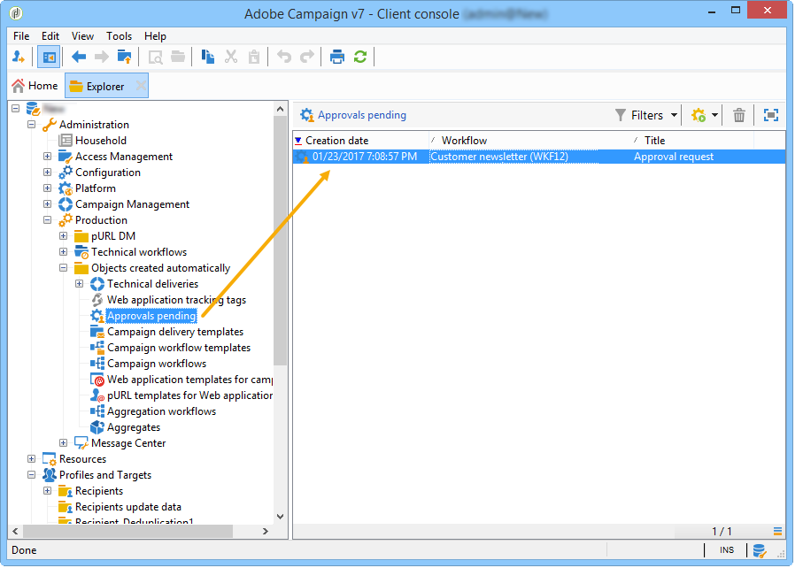

# Goedkeuringen definiëren {#defining-approvals}


Met goedkeuringen kunnen operators beslissingen nemen over een workflow of de voortzetting van de uitvoering bevestigen.

Een bericht wordt verzonden naar een groep exploitanten en het werkschema wacht op een reactie alvorens te hervatten. De workflow wordt niet gestopt en andere bewerkingen kunnen plaatsvinden. Er kunnen bijvoorbeeld meerdere gelijktijdige goedkeuringen in behandeling zijn.

Een goedkeuring kan meerdere opties bevatten die de operator kan kiezen. Het is echter mogelijk het aantal keuzen tot één te beperken om een uit te voeren taak aan een exploitant voor te leggen, zoals het uitvoeren van het richten. De exploitant kan dan antwoorden zodra de taak wordt uitgevoerd (het proces dan hervat). In het volgende voorbeeld worden deze typen goedkeuringen geïllustreerd:


Bij vluchtuitvoeringen zijn alle stadia die goedkeuring vereisen, gebaseerd op hetzelfde beginsel.


Voorbeelden van goedkeuringen vindt u in .

Een operator kan op twee manieren reageren: valideren met de webpagina die is gekoppeld in het e-mailbericht of via de console.

>[!NOTE]
>
>Zodra de reactie wordt bewaard kan het niet worden gewijzigd.

## Goedkeuring per e-mail {#sending-emails}

Het is mogelijk om een goedkeuringsbericht te ontvangen die een verbinding met een Web-pagina bevat waarmee het mogelijk is te antwoorden. Voor de beoogde exploitant om een goedkeuringse-mail te ontvangen, moet het exploitant e-mailadres volledig zijn. Als dit niet het geval is, moet de exploitant de console gebruiken om te antwoorden

Het beheer van de exploitant wordt in dit hoofdstuk nader toegelicht.

Goedkeuringse-mails worden voortdurend verzonden. De standaardleveringssjabloon is **[!UICONTROL notifyAssignee]**: Het bestand wordt opgeslagen in de **[!UICONTROL Administration > Campaign management > Technical delivery templates]** map. Dit scenario kan worden aangepast en het wordt ook aanbevolen een kopie te maken en sjablonen te wijzigen voor elke activiteit.

Leveringen die met deze sjabloon zijn gemaakt, worden opgeslagen in de **[!UICONTROL Administration > Production > Objects created automatically > Technical deliveries > Workflow notifications]** map.

## Goedkeuringen via de console {#approval-via-the-console}

Bij bewerkingen worden elementen die moeten worden goedgekeurd, weergegeven op het campagnemdashboard.

Voor technische workflows zijn de taken die de gebruiker kan goedkeuren toegankelijk vanuit de boomstructuur in de **[!UICONTROL Administration > Production > Objects created automatically > Pending approvals]** map.



## Groepen {#groups}

Een goedkeuring wordt toegekend aan een groep operatoren, één exploitant of een reeks operatoren die via een filtervoorwaarde zijn geselecteerd.

1. Voor de eenvoudigste vorm van goedkeuring, wordt de taak gebeëindigd zodra een exploitant antwoordt. Elke andere exploitant die probeert te reageren, wordt op de hoogte gebracht dat iemand het al heeft gedaan.
1. Voor meerdere goedkeuringen raadpleegt u [Meerdere goedkeuringen](#multiple-approval).

De groepen van marktdeelnemers voor goedkeuringen moeten worden aangewezen als rollen of functies in plaats van als benoemde personen. Een groep ‘Campagne budget’ verdient bijvoorbeeld de voorkeur boven &#39;Harry&#39;s group&#39;. We raden aan ten minste twee personen in een groep te hebben die een taak kunnen goedkeuren. Op deze manier, als één afwezig is, kan de andere antwoorden.

## Verlopen {#expirations}

Verlopen zijn specifieke overgangen die worden gebruikt in verschillende soorten activiteiten, en met name in goedkeuringen. U kunt een vervaldatum gebruiken om een actie na een bepaalde tijd zonder reactie teweeg te brengen. Het kan bijvoorbeeld ook worden gebruikt om de workflow voort te zetten en een goedkeuring toe te wijzen aan een andere groep.

Op het tweede tabblad in de eigenschappen voor activiteitengoedkeuring kunt u een of meer vervaldatums definiëren. In feite kunt u meerdere vervaltypen definiëren.


Als u een nieuwe vervaldatum wilt toevoegen, klikt u op **[!UICONTROL Add]**. Er wordt een overgang toegevoegd aan elk van de gemaakte vervaldatums. U kunt:

* de typische parameters rechtstreeks wijzigen door op een cel in de lijst te klikken (of door op F2 te drukken);
* of bewerk de expressie door op de knop **[!UICONTROL Detail...]** knop.

>[!NOTE]
>
>Het is niet nodig een volgorde voor de vervaldata vast te stellen, aangezien deze in chronologische volgorde worden verwerkt.

De **[!UICONTROL Do not terminate the task]** de goedkeuring actief blijft wanneer de vertraging wordt overschreden. In deze modus kunt u herinneringen beheren terwijl de goedkeuring actief blijft: operatoren kunnen nog steeds reageren. Deze optie is standaard uitgeschakeld. Dit betekent dat de taak bij het verlopen als voltooid wordt beschouwd en dat de operatoren niet langer mogen reageren.

U kunt vier typen vervaldatums maken:

* **Vertraging na taakstart**: De vervaldatum wordt berekend door een bepaalde tijdsduur toe te voegen aan de datum waarop de goedkeuring wordt geactiveerd.
* **Vertraging na een bepaalde datum**: De vervaldatum wordt berekend door een tijdsduur toe te voegen aan een datum die u opgeeft.
* **Vertraging vóór een bepaalde datum**: De vervaldatum wordt berekend door een tijdsduur af te trekken van een datum die u opgeeft.
* **Vervaldatum berekend door script**: De vervaldatum wordt berekend met behulp van JavaScript.

   In het volgende voorbeeld wordt een vervaldatum berekend 24 uur voordat de levering wordt gestart (geïdentificeerd door **vars.deliveryId**):

   ```
   var delivery = nms.delivery.get(vars.deliveryId)
   var expiration = delivery.scheduling.contactDate
   var oneDay = 1000*60*60*24
   expiration.setTime(expiration.getTime() - oneDay)
   return expiration
   ```

## Meerdere goedkeuringen {#multiple-approval}

Meervoudige goedkeuring is een mechanisme waarmee alle goedkeuringsexploitanten kunnen reageren. Voor elke respons wordt een overgang geactiveerd.

Meervoudige goedkeuring is handig voor stem- of enquêtemechanismen. U kunt antwoorden tellen en hun resultaat na een bepaalde periode verwerken door een deadline toe te voegen.

## Vereiste rechten {#required-rights}

De exploitanten in een groep moeten ten minste de volgende rechten hebben om op een goedkeuringsverzoek te kunnen reageren:

* Schrijfmachtigingen voor workflow.
* U kunt machtigingen voor lezen en schrijven voor de map met de taken die u wilt goedkeuren.

De groep Workflowuitvoering heeft deze rechten. Een exploitant die aan deze groep wordt toegevoegd heeft de rechten om op een goedkeuringsverzoek te antwoorden.
