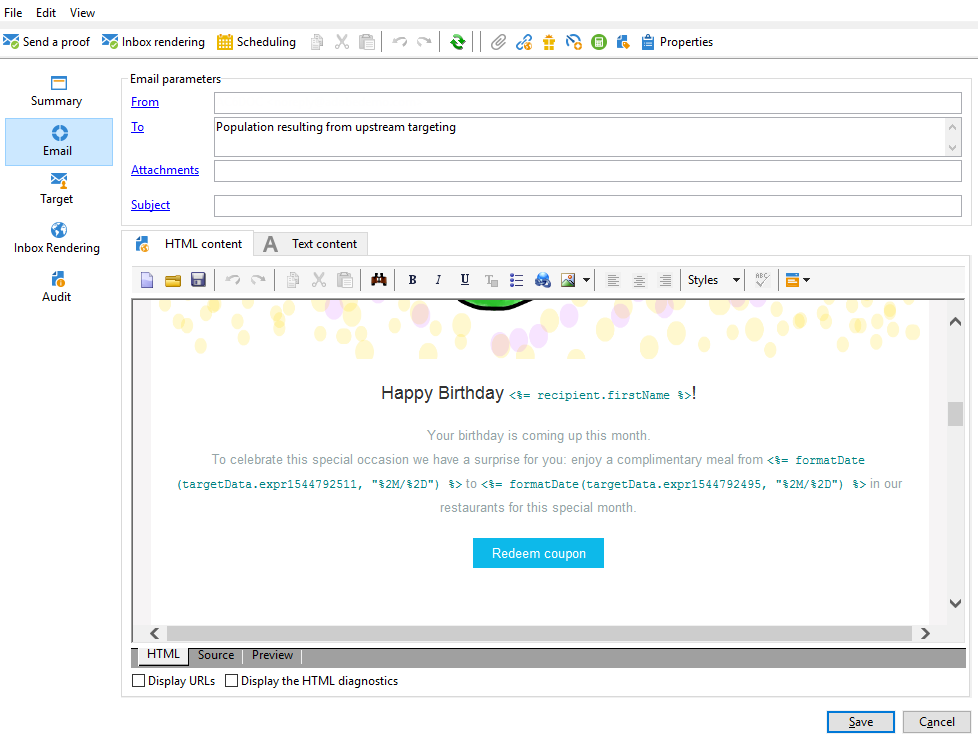

# E-mailverrijking met aangepaste datumvelden{#email-enrichment-with-custom-date-fields}


In dit voorbeeld willen we een e-mail met aangepaste gegevensvelden verzenden aan ontvangers die deze maand hun verjaardagen vieren. Het e-mailbericht bevat een coupon die een week voor en na hun verjaardagen geldig is.

We moeten ontvangers van een lijst aanspreken die hun verjaardagen deze maand vieren met een **[!UICONTROL Split]** activiteit. Gebruik vervolgens de **[!UICONTROL Enrichment]** activiteit, zal het gebied van douanegegevens als geldigheidsdata in e-mail voor de speciale aanbieding van de klant dienst doen.


U kunt dit voorbeeld maken door de volgende stappen toe te passen:

1. In de **[!UICONTROL Targeting and workflows]** tabblad van uw campagne, sleept u een **[!UICONTROL Read list]** activiteit om uw lijst van ontvangers te richten.
1. De lijst die moet worden verwerkt, kan expliciet worden opgegeven, door een script worden berekend of dynamisch worden gelokaliseerd, afhankelijk van de geselecteerde opties en de hier gedefinieerde parameters.

   

1. Voeg een **[!UICONTROL Split]** activiteit om ontvangers die deze maand hun verjaardagen vieren te onderscheiden van andere ontvangers.
1. Als u de lijst wilt splitsen, gaat u naar **[!UICONTROL Filtering of selected records]** categorie, selecteert u **[!UICONTROL Add a filtering condition on the inbound population]**. Klik vervolgens op **[!UICONTROL Edit]**.

   

1. Selecteren **[!UICONTROL Filtering conditions]** Klik vervolgens op de knop **[!UICONTROL Edit expression]** om de maand van de verjaardag van de ontvanger te filteren.

   

1. Klikken **[!UICONTROL Advanced Selection]** dan **[!UICONTROL Edit the formula using an expression]** en voeg de volgende expressie toe: Maand (@geboorteDate).
1. In de **[!UICONTROL Operator]** kolom, selecteert u de **[!UICONTROL equal to]**.
1. Filter de voorwaarde verder door de **[!UICONTROL Value]** maand van de huidige datum: Month(GetDate()).

   Hierdoor worden ontvangers gevraagd van wie de geboortemaand overeenkomt met de huidige maand.

   

1. Klik op **[!UICONTROL Finish]**. Dan, in **[!UICONTROL General]** tabblad van uw **[!UICONTROL Split]** activiteit, klik **[!UICONTROL Generate complement]** in de **[!UICONTROL Results]** categorie.

   Met de **[!UICONTROL Complement]** resulteert, kunt u een leveringsactiviteit toevoegen of een lijst bijwerken. Hier hebben we zojuist een **[!UICONTROL End]** activiteit.

   

U moet nu uw **[!UICONTROL Enrichment]** activiteit:

1. Een **[!UICONTROL Enrichment]** activiteit na de subset om aangepaste datumvelden toe te voegen.

   

1. Open uw **[!UICONTROL Enrichment]** activiteit. In de **[!UICONTROL Complementary information]** categorie, klikt u op **[!UICONTROL Add data]**.

   

1. Selecteren **[!UICONTROL Data linked to the filtering dimension]** dan **[!UICONTROL Data of the filtering dimension]**.
1. Klik op de knop **[!UICONTROL Add]**.

   

1. Voeg een **[!UICONTROL Label]**. Dan, in **[!UICONTROL Expression]** kolom, klikt u op **[!UICONTROL Edit expression]**.

   

1. Ten eerste moeten we ons richten op de week vóór de geboortedatum als **Begindatum geldigheid** met de volgende **[!UICONTROL Expression]**: `SubDays([target/@birthDate], 7)`.

   

1. Vervolgens maakt u het aangepaste datumveld **Einddatum geldigheid** die de week na de geboortedatum als doel zullen hebben, moet u de **[!UICONTROL Expression]**: `AddDays([target/@birthDate], 7)`.

   U kunt een label aan uw expressie toevoegen.

   

1. Klik op **[!UICONTROL Ok]**. Uw verrijking is nu klaar.

Na uw **[!UICONTROL Enrichment]** activiteit, kunt u een levering toevoegen. In dit geval hebben we een e-maillevering toegevoegd om ontvangers een speciaal voorstel met geldigheidsdata te sturen naar klanten die deze maand hun verjaardagen vieren.

1. Sleep een **[!UICONTROL Email delivery]** activiteit na uw **[!UICONTROL Enrichment]** activiteit.

   

1. Dubbelklik op de knop **[!UICONTROL Email delivery]** activiteiten om uw levering aan te passen.
1. Voeg een **[!UICONTROL Label]** aan uw levering en klik op **[!UICONTROL Continue]**.
1. Klikken **[!UICONTROL Save]** om uw e-maillevering te maken.
1. Inchecken in het dialoogvenster **[!UICONTROL Approval]** tabblad van de e-maillevering **[!UICONTROL Properties]** de **[!UICONTROL Confirm delivery before sending option]** is ingeschakeld.

   Start vervolgens de workflow om de uitgaande overgang te verrijken met de doelgegevens.

   

U kunt nu uw e-maillevering ontwerpen met de aangepaste datumvelden die zijn gemaakt in het dialoogvenster **[!UICONTROL Enrichment]** activiteit.

1. Dubbelklik op de knop **[!UICONTROL Email delivery]** activiteit.
1. Voeg uw doelextensies toe aan uw e-mail. Het zou binnen de volgende uitdrukking moeten zijn om het formaat van uw geldigheidsdata te vormen:

   ```
   <%=
           formatDate(targetData.alias of your expression,"%2D.%2M")  %>
   ```

1. Klik op  . Selecteren **[!UICONTROL Target extension]** de eerder gemaakte aangepaste geldigheidsdatums met de **[!UICONTROL Enrichment]** activiteit om uw uitbreiding aan de formatDate uitdrukking toe te voegen.

   

1. Configureer uw e-mailinhoud naar wens.

   

1. Geef een voorbeeld van uw e-mail weer om te controleren of uw aangepaste datumvelden correct zijn geconfigureerd

   

Uw e-mail is nu klaar. Je kunt je proefdrukken verzenden en je levering bevestigen om je geboortee-mails te verzenden.
