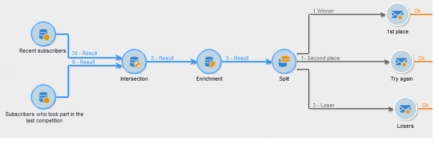
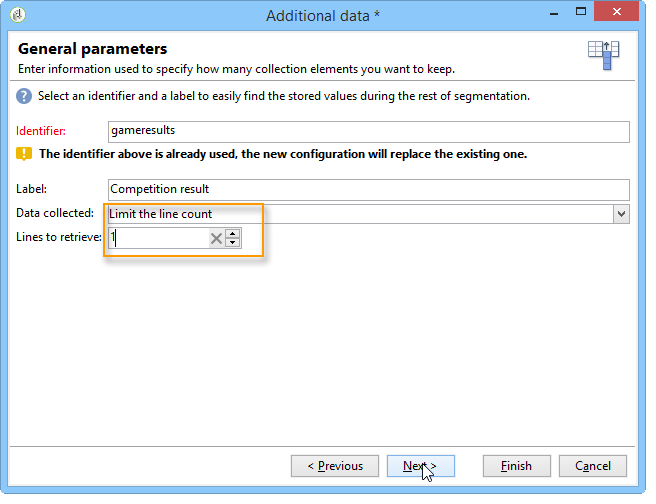

# Gegevens verrijken{#enriching-data}

## Informatie over het verrijken van gegevens {#about-enriching-data}

In dit geval worden mogelijke toepassingen van het **[!UICONTROL Enrichment]** activiteit in een doelworkflow. Voor meer informatie over het gebruik van de **[!UICONTROL Enrichment]** activiteit, verwijs naar: [Verrijking](enrichment.md).

Een gebruiksscenario voor het verrijken van een e-maillevering met aangepaste datums is ook beschikbaar in [deze sectie](email-enrichment-with-custom-date-fields.md).

De contactpersonen in de marketingdatabase worden via een webtoepassing uitgenodigd deel te nemen aan een wedstrijd. De resultaten van de mededinging worden teruggevorderd in de **[!UICONTROL Competition results]** tabel. Deze tabel is gekoppeld aan de tabel met contactpersonen (**[!UICONTROL Recipients]**). De **[!UICONTROL Competition results]** tabel bevat de volgende velden:

* Mededingingsnaam (@game)
* Testnummer (@proefversie)
* Score (@score)

Een contactpersoon gevonden in het dialoogvenster **[!UICONTROL Recipients]** tabel kan worden gekoppeld aan verschillende regels in het dialoogvenster **[!UICONTROL Competition results]** tabel. Het verband tussen deze twee lijsten is van 1-n type. Hier volgt een voorbeeld van de resultatenlogs voor een ontvanger:

Het doel van dit gebruik is om persoonlijke leveringen te sturen naar mensen die, afhankelijk van hun hoogste scores, aan de meest recente wedstrijd hebben deelgenomen. De ontvanger met de hoogste score krijgt de eerste prijs, de ontvanger met de op één na hoogste score krijgt een troostprijs en alle anderen krijgen een boodschap die hen de volgende keer meer geluk wil wensen.

Voor het instellen van dit gebruiksgeval hebben we de volgende workflow voor doelversie gemaakt:

Voer de volgende stappen uit om de workflow te maken:

1. Twee **[!UICONTROL Query]** activiteiten en één **[!UICONTROL Intersection]** de activiteit wordt toegevoegd aan de nieuwe abonnees die de laatste wedstrijd hebben gehouden .
1. De **[!UICONTROL Enrichment]** activiteit laat ons gegevens toevoegen die in worden opgeslagen **[!UICONTROL Competition results]** tabel. De **[!UICONTROL Score]** het gebied waarop onze levering zich zal verpersoonlijken wordt toegevoegd aan de werklijst van het werkschema.
1. De **[!UICONTROL Split]** type activity stelt ons in staat ontvangende subsets te maken op basis van scores .
1. Voor elke subset geldt een **[!UICONTROL Delivery]** tekstactiviteit wordt toegevoegd.

## Stap 1: Doelstelling {#step-1--targeting}

De eerste vraag laat ons toe om ontvangers te richten die aan het gegevensbestand binnen de laatste zes maanden werden toegevoegd.

De tweede vraag laat ons toe om de ontvangers te richten die aan de laatste concurrentie hebben deelgenomen.

An **[!UICONTROL Intersection]** typeactiviteit wordt dan toegevoegd aan de doelgroep van de ontvangers die binnen de laatste zes maanden aan het gegevensbestand zijn toegevoegd en die de laatste concurrentie zijn ingegaan.

## Stap 2: Verrijking {#step-2--enrichment}

In dit voorbeeld willen we leveringen personaliseren volgens de **[!UICONTROL Score]** veld opgeslagen in **[!UICONTROL Competition results]** tabel. Deze lijst heeft een 1-n typeverhouding met de lijst van ontvangers. De **[!UICONTROL Enrichment]** de activiteit laat ons toe om gegevens van een lijst toe te voegen verbonden aan de het filtreren dimensie aan de het werklijst van het werkschema.

1. Selecteer in het bewerkingsscherm van de verrijkingsactiviteit de optie **[!UICONTROL Add data]** vervolgens **[!UICONTROL Data linked to the filtering dimension]** en klik op **[!UICONTROL Next]**.

   

1. Selecteer vervolgens de **[!UICONTROL Data linked to the filtering dimension]** selecteert u de optie **[!UICONTROL Competition results]** tabel en klik op **[!UICONTROL Next]**.

   

1. Voer een id en een label in en selecteer de optie **[!UICONTROL Limit the line count]** in de **[!UICONTROL Data collected]** veld. In de **[!UICONTROL Lines to retrieve]** veld, selecteer &#39;1&#39; als waarde. Voor elke ontvanger voegt de verrijkingsactiviteit één enkele lijn van toe **[!UICONTROL Competition results]** aan de werktafel van het werkschema. Klik op **[!UICONTROL Next]**.

   

1. In dit voorbeeld willen we de hoogste score van de ontvanger terugkrijgen, maar alleen voor de laatste competitie. Hiervoor voegt u een filter toe aan de **[!UICONTROL Competition name]** veld om alle lijnen met betrekking tot eerdere vergelijkende onderzoeken uit te sluiten. Klik op **[!UICONTROL Next]**.

   

1. Ga naar de **[!UICONTROL Sort]** en klik op de knop **[!UICONTROL Add]** selecteert u de **[!UICONTROL Score]** en schakel het selectievakje in **[!UICONTROL descending]** kolom voor het sorteren van items van het dialoogvenster **[!UICONTROL Score]** velden in aflopende volgorde. Voor elke ontvanger voegt de verrijkingsactiviteit een regel toe die overeenkomt met de hoogste score voor de laatste game. Klik op **[!UICONTROL Next]**.

   

1. In de **[!UICONTROL Data to add]** venster, dubbelklikt u op de knop **[!UICONTROL Score]** veld. Voor elke ontvanger voegt de verrijkingsactiviteit alleen de **[!UICONTROL Score]** veld. Klik op **[!UICONTROL Finish]**.

   

Klik met de rechtermuisknop op de binnenkomende overgang van de verrijkingsactiviteit en selecteer **[!UICONTROL Display the target]**. De werktabel bevat de volgende gegevens:

Het gekoppelde schema is:

Verleng deze bewerking bij de uitgaande overgang van de verrijkingsactiviteit. We kunnen zien dat de gegevens met betrekking tot de scores van de ontvangers zijn toegevoegd. De hoogste score van elke ontvanger is hersteld.

Het overeenkomende schema is ook verrijkt.

## Stap 3: Splitsen en leveren {#step-3--split-and-delivery}

Als u de ontvangers wilt sorteren op basis van hun scores, voert u een **[!UICONTROL Split]** activiteit wordt toegevoegd na de verrijking.

1. Een eerste (**Winner**) is gedefinieerd om de ontvanger met de hoogste score op te nemen. Hiervoor definieert u een beperking van het aantal records, past u een aflopende sortering toe op de score en beperkt u het aantal records tot 1.

   

1. De tweede (**Tweede plaats**) bevat de ontvanger met de op één na hoogste score. De configuratie is het zelfde als voor de eerste ondergroep.

   

1. De derde (**verliezers**) bevat alle andere ontvangers. Ga naar de **[!UICONTROL General]** en controleer de **[!UICONTROL Generate complement]** gebruiken om alle ontvangers te selecteren die de twee hoogste scores niet hebben bereikt.

   

1. Voeg een **[!UICONTROL Delivery]** type activiteit voor elke ondergroep, gebruikend een verschillend leveringsmalplaatje voor elk.

   
