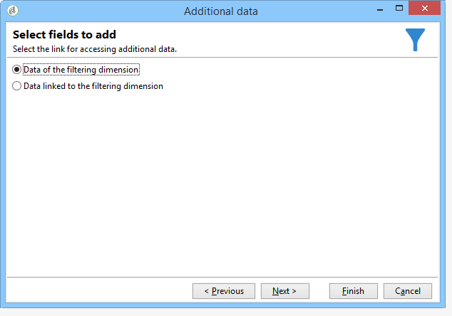
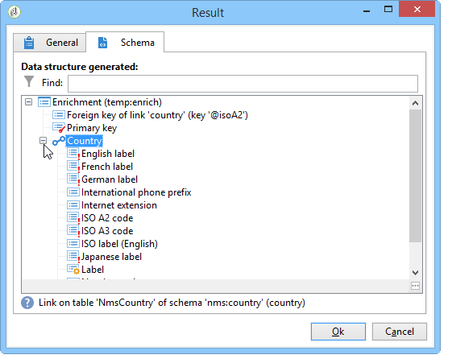
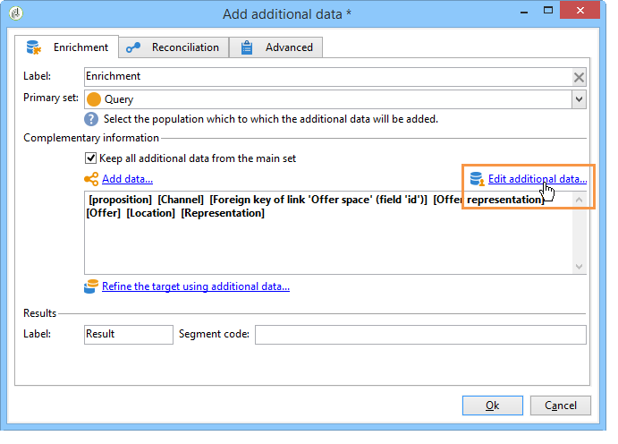

# Verrijking{#enrichment}


De **[!UICONTROL Enrichment]** Met activiteit kunt u informatie toevoegen aan een profiellijst en koppelingen maken naar een bestaande tabel (een nieuwe koppeling maken). Er kunnen ook afstemmingscriteria worden gedefinieerd met profielen in de database.


## Definities {#definitions}

Om de verrijkingsactiviteit te gebruiken, moet u met de diverse beschikbare opties vertrouwd zijn wanneer het toevoegen van gegevens.


De **[!UICONTROL Data linked to the filtering dimension]** hebt u toegang tot:

* Gegevens over de filterdimensie: toegang tot de gegevens van de werkentabel
* Gegevens in verband met de filterdimensie: toegang tot aan de werktabel gekoppelde gegevens



De **[!UICONTROL A link]** Met deze optie kunt u verbinding maken met elke tabel in de database.


Er zijn vier typen koppelingen:

* **[!UICONTROL Define a collection]**: Hiermee kunt u een koppeling definiëren met een kardinaliteit van 1 N tussen de tabellen.
* **[!UICONTROL Define a link whose target is still available]**: Hiermee kunt u een koppeling definiëren met een 1-1-cardinaliteit tussen tabellen. De verbindingsvoorwaarden moeten door één enkele verslag in de doellijst worden bepaald.
* **[!UICONTROL Define a link whose target does not necessarily exist in the base]**: Hiermee kunt u een koppeling definiëren met een 0-1-cardinaliteit tussen tabellen. De verbindingsvoorwaarde moet door 0 of 1 (max.) worden bepaald opnemen in de doeltabel.

   Deze optie is geconfigureerd in het dialoogvenster **[!UICONTROL Simple Join]** tabblad dat toegankelijk is via de **[!UICONTROL Edit additional data]** koppeling van de **[!UICONTROL Enrichment]** activiteit.

* **[!UICONTROL Define a link by searching for a reference among several options]**: dit type koppeling definieert een koppeling naar een unieke record . Adobe Campaign maakt een koppeling naar een doeltabel door een externe sleutel toe te voegen aan de doeltabel om een verwijzing naar de unieke record op te slaan.

   Deze optie is geconfigureerd in het dialoogvenster **[!UICONTROL Reconciliation and deduplication]** tabblad dat toegankelijk is via de **[!UICONTROL Edit additional data]** koppeling van de **[!UICONTROL Enrichment]** activiteit.

In de volgende secties zijn ook gebruiksgevallen te vinden waarin de activiteiten van verrijkingsactiviteiten in hun context worden beschreven:

* [E-mailverrijking met aangepaste datumvelden](email-enrichment-with-custom-date-fields.md).
* [Data verrijken](enrich-data.md)
* [Een overzichtslijst maken](create-a-summary-list.md)

## Informatie toevoegen {#adding-information}

Gebruik de **[!UICONTROL Enrichment]** activiteit om kolommen aan een het werklijst toe te voegen: deze activiteit kan als aanvulling op een vraagactiviteit worden gebruikt.

De configuratie van extra kolommen wordt gedetailleerd in [Gegevens toevoegen](query.md#adding-data).

De **[!UICONTROL Primary set]** in het veld kunt u de binnenkomende overgang selecteren: de gegevens van de werktafel van deze activiteit zullen worden verrijkt.

Klik op de knop **[!UICONTROL Add data]** en selecteer het type gegevens dat u wilt toevoegen. De lijst met aangeboden gegevenstypen is afhankelijk van de modules en opties die op uw platform zijn geïnstalleerd. In een minimale configuratie, kunt u gegevens altijd toevoegen verbonden aan de het filtreren dimensie en een verbinding.


In het onderstaande voorbeeld wordt de uitgaande overgang verrijkt met informatie over de leeftijd van de doelprofielen.


Klik met de rechtermuisknop op de inkomende overgang van de verrijkingsactiviteit om de gegevens vóór het verrijkingsstadium weer te geven.


De werktabel bevat de volgende gegevens en het bijbehorende schema:


Herhaal deze bewerking in de uitvoer van het verrijkingswerkgebied.


U ziet dat de gegevens met betrekking tot profielpagina&#39;s zijn toegevoegd:


Het overeenkomende schema is ook verrijkt.

## Aanvullende gegevens beheren {#managing-additional-data}

Schakel de optie **[!UICONTROL Keep all additional data from the main set]** als u de eerder gedefinieerde aanvullende gegevens niet wilt behouden. In dit geval worden alleen de extra kolommen die in de verrijkingsactiviteit zijn geselecteerd, toegevoegd aan de uitgaande werktabel. De aanvullende informatie die upstream aan de activiteiten wordt toegevoegd, wordt niet opgeslagen.


De gegevens en het schema in de verrijkingsfase zijn als volgt:


## Koppelingen maken {#creating-a-link}

U kunt de verrijkingsactiviteit gebruiken om een verbinding tussen de het werk gegevens en het gegevensbestand van Adobe Campaign tot stand te brengen: dit zal een lokale verbinding aan het werkschema tussen de binnenkomende gegevens zijn.

Als u bijvoorbeeld gegevens laadt van een bestand dat het accountnummer, het land en de e-mail van ontvangers bevat, moet u een koppeling naar de landentabel maken om deze gegevens in hun profielen bij te werken.

Hiervoor voert u de volgende stappen uit:

1. Verzamel en laad het volgende bestandstype:

   ```
   Account number;Country;Email
   18D65;FRANCE;agnes@gmail.com
   243PP;RUSSIA;paul@gmail.com
   55H87;CROATIA;dave@gmail.com
   56U81;USA;susan@gmail.com
   853PI;ITALY;anna@gmail.com
   890LP;FRANCE;robert@gmail.com
   83TY2;SWITZERLAND;mike@gmail.com
   ```

1. Bewerk de verrijkingsactiviteit en klik op de knop **Gegevens toevoegen...** koppeling om een samenvoeging met de tabel Land te maken.

   

1. Selecteer **[!UICONTROL Link definition]** en klik op de knop **[!UICONTROL Next]** knop. Geef het type koppeling op dat u wilt maken. In dit voorbeeld willen we het land van de ontvanger van het bestand in overeenstemming brengen met een land in de lijst met beschikbare landen in de specifieke tabel van de database. Kies de optie **[!UICONTROL Define a link by searching for a reference among several options]**. Selecteer de landentabel in het dialoogvenster **[!UICONTROL Target schema]** veld.

   

1. Selecteer ten slotte de velden waarmee u de waarden van de bronbestanden kunt koppelen aan die in de database.

   

Bij de output van deze verrijkingsactiviteit, zal het tijdelijke schema de verbinding aan de landlijst bevatten:



## Gegevensafstemming {#data-reconciliation}

De verrijkingsactiviteit kan worden gebruikt om gegevensverzoening te vormen, met inbegrip van zodra de gegevens in het gegevensbestand zijn geladen. In dit geval worden de **[!UICONTROL Reconciliation]** kunt u de koppeling definiëren tussen de gegevens in de Adobe Campaign-database en de gegevens in de werktabel.

Selecteer **[!UICONTROL Identify the targeting document based on work data]** geeft u het schema op waarnaar u een koppeling wilt maken en definieert u de voorwaarden voor het samenvoegen: daartoe selecteert u de velden die moeten worden afgestemd in de werkgegevens (**[!UICONTROL Source expression]** en in de doelgerichte dimensie (**[!UICONTROL Destination expression]**).

U kunt een of meer verzoeningscriteria gebruiken.


Als er meerdere samenvoegvoorwaarden zijn opgegeven, moeten deze ALLES worden geverifieerd zodat de gegevens kunnen worden gekoppeld.

## Een voorstel invoegen {#inserting-an-offer-proposition}

Met de verrijkingsactiviteit kunt u aanbiedingen of koppelingen naar aanbiedingen voor ontvangers van de levering toevoegen.

Raadpleeg voor meer informatie over de verrijkingsactiviteit deze [sectie](enrichment.md).

Bijvoorbeeld, kunt u de gegevens voor een ontvankelijke vraag vóór een levering verrijken.


Na het vormen van uw vraag (verwijs naar dit [sectie](query.md)):

1. Voeg een verrijkingsactiviteit toe en open deze.
1. Selecteer op het tabblad **[!UICONTROL Enrichment]** de optie **[!UICONTROL Add data]**.
1. Selecteren **[!UICONTROL An offer proposition]** in de typen gegevens die moeten worden toegevoegd.

   

1. Geef een id en een label op voor het voorstel dat wordt toegevoegd.
1. Geef de selectie van de aanbieding op. Hiervoor zijn twee mogelijkheden:

   * **[!UICONTROL Search for the best offer in a category]**: controleert deze optie en specificeert de parameters van de vraagvraag van de aanbiedingsmotor (aanbiedingsruimte, categorie of thema(s), contactdatum, aantal aan te houden aanbiedingen). De motor berekent automatisch de aanbieding(en) die volgens deze parameters moet worden toegevoegd. We raden u aan om de **[!UICONTROL Category]** of de **[!UICONTROL Theme]** in plaats van beide.

      

   * **[!UICONTROL A predefined offer]**: controleer deze optie en specificeer een aanbiedingsruimte, een specifieke aanbieding, en een contactdatum om de aanbieding direct te vormen die u, zonder de aanbiedingsmotor te roepen wilt toevoegen.

      

1. Dan vorm een leveringsactiviteit die aan uw gekozen kanaal beantwoordt. Zie [Kanaalleveringen](cross-channel-deliveries.md).

   Het aantal voorstellen dat beschikbaar is voor de voorvertoning is afhankelijk van de configuratie die wordt uitgevoerd in de verrijkingsactiviteit in plaats van een mogelijke configuratie die rechtstreeks in de levering wordt uitgevoerd.

Als je voorstellen wilt opgeven, kun je ook naar een link naar een voorstel verwijzen. Raadpleeg de volgende sectie voor meer informatie hierover [Verwijzen naar een koppeling naar een aanbieding](#referencing-a-link-to-an-offer).

## Verwijzen naar een koppeling naar een aanbieding {#referencing-a-link-to-an-offer}

U kunt ook verwijzen naar een koppeling naar een aanbieding in een verrijkingsactiviteit.

Dit doet u als volgt:

1. Selecteren **[!UICONTROL Add data]** in de activiteit **[!UICONTROL Enrichment]** tab.
1. Selecteer in het venster waarin u het type gegevens kiest dat u wilt toevoegen **[!UICONTROL A link]**.
1. Selecteer het type koppeling dat u wilt maken en het doel ervan. In dit geval is het doel het aanbiedingsschema.

   

1. Specificeer zich tussen de binnenkomende lijstgegevens in de verrijkingsactiviteit (hier de ontvankelijke lijst) en de aanbiedingstabel aan. U kunt bijvoorbeeld een aanbiedingscode koppelen aan een ontvanger.

   

1. Dan vorm een leveringsactiviteit die aan uw gekozen kanaal beantwoordt. Zie [Kanaalleveringen](cross-channel-deliveries.md).

   >[!NOTE]
   >
   >Het aantal voorvertoningen dat beschikbaar is voor de voorvertoning, is afhankelijk van de configuratie die in de levering wordt uitgevoerd.

## Opslaan van rankings- en gewichten voor aanbiedingen {#storing-offer-rankings-and-weights}

Standaard, wanneer een **verrijking** de activiteit wordt gebruikt om aanbiedingen te leveren, worden hun rangschikkingen en hun gewichten niet opgeslagen in de propositietabel.

De **[!UICONTROL Offer engine]** Deze informatie wordt standaard opgeslagen door de activiteit.

U kunt deze gegevens echter als volgt opslaan:

1. Creeer een vraag aan de aanbiedingsmotor in een verrijkingsactiviteit die na een vraag en vóór een leveringsactiviteit wordt geplaatst.
1. Selecteer in het hoofdvenster van de activiteit de optie **[!UICONTROL Edit additional data...]**.

   

1. Voeg de **[!UICONTROL @rank]** kolommen voor de rangorde en **[!UICONTROL @weight]** voor het aanbiedingsgewicht.

   

1. Bevestig uw toevoeging en sla uw workflow op.

De levering slaat automatisch de rangschikking en het gewicht van de aanbiedingen op. Deze informatie is zichtbaar in de levering **[!UICONTROL Offers]** tab.
