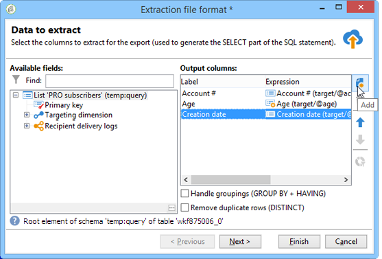

# Gegevensextractie (bestand){#extraction-file}

U kunt gegevens uit een workflowtabel in een extern bestand extraheren met de opdracht **[!UICONTROL Data extraction (file)]** activiteit.

>[!CAUTION]
>
>Deze activiteit moet altijd een binnenkomende overgang hebben die de te halen gegevens bevat.

Voer de volgende stappen uit om gegevensextractie te configureren:

1. Geef de naam van het uitvoerbestand op: deze naam kan variabelen bevatten die via de verpersoonlijkingsknoop rechts van het gebied worden opgenomen.
1. Klikken **[!UICONTROL Edit the file format...]** om de gegevens te selecteren die moeten worden geëxtraheerd.

   

   De **[!UICONTROL Handle groupings (GROUP BY + HAVING)]** voegt u een extra stap toe om het uiteindelijke resultaat van het aggregaat te filteren, bijvoorbeeld op een bepaald type inkooporder, klanten die meer dan tien keer hebben besteld, enz.

1. Indien nodig kunt u nieuwe kolommen aan het uitvoerbestand toevoegen, zoals bijvoorbeeld berekeningen of verwerkingsresultaten. Om dit te doen, klik **[!UICONTROL Add]** pictogram.

   

   Klik op de extra regel op de knop **[!UICONTROL Edit expression]** om de inhoud van de nieuwe kolom te definiëren.

   

   Vervolgens opent u het selectievenster. Klikken **[!UICONTROL Advanced selection]** om het proces te kiezen dat op de gegevens moet worden toegepast.

   

   Kies de gewenste formule in de lijst.

   

U kunt een postproces bepalen dat tijdens de gegevensextractie wordt uitgevoerd, toestaand u om de dossiers te zip of te coderen. Hiervoor moet de gewenste opdracht worden toegevoegd aan het dialoogvenster **[!UICONTROL Script]** tabblad van de activiteit.

Raadpleeg voor meer informatie deze sectie: [Een bestand zoeken of versleutelen](use-workflow-data.md#zipping-or-encrypting-a-file).

## Lijst van geaggregeerde functies {#list-of-aggregate-functions}

Hieronder volgt een lijst met beschikbare statistische functies:

* **[!UICONTROL Count]** alle niet-null-waarden van het veld te tellen, met inbegrip van dubbele waarden (van het geaggregeerde veld);

   **[!UICONTROL Distinct]** het totale aantal verschillende en niet-nulwaarden van het veld dat moet worden geaggregeerd (dubbele waarden worden vóór de berekening buiten beschouwing gelaten);

* **[!UICONTROL Sum]** de som van de waarden van een numeriek veld te berekenen;
* **[!UICONTROL Minimum value]** de minimumwaarden van een veld (numeriek of anderszins) te berekenen;
* **[!UICONTROL Maximum value]** de maximumwaarden van een veld (numeriek of anderszins) te berekenen;
* **[!UICONTROL Average]** het gemiddelde van de waarden van een numeriek veld te berekenen.
