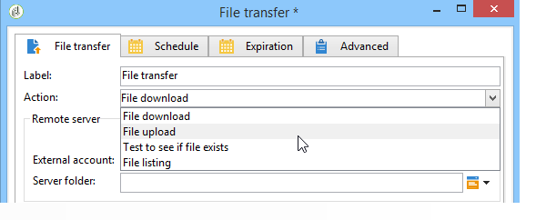
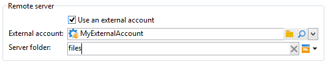

# Bestandsoverdracht{#file-transfer}

De **overdracht van het Dossier** activiteit laat u dossiers ontvangen of verzenden, test voor dossieraanwezigheid, of lijstdossiers op een server. Het gebruikte protocol is Azure Blob Storage, Amazon Simple Storage Service (S3), FTP of SFTP.
Met S3-, Azure Blob Storage- of SFTP-verbinding kunt u ook segmentgegevens importeren naar Adobe Campaign met Adobe Real-time Customer Data-platform. Voor meer op dit, verwijs naar deze [&#x200B; documentatie &#x200B;](https://experienceleague.adobe.com/docs/experience-platform/destinations/catalog/email-marketing/adobe-campaign.html?lang=nl-NL){target="_blank"}.

## Properties {#properties}

Gebruik de vervolgkeuzelijst van het veld **[!UICONTROL Action]** om de actie van de activiteit te selecteren.

De configuratie is afhankelijk van de geselecteerde actie.

1. **Ontvangend dossiers**

   Selecteer **[!UICONTROL File download]** in het veld **[!UICONTROL Action]** om bestanden te ontvangen die op een externe server zijn opgeslagen. U moet de URL van de URL opgeven in het desbetreffende veld.

   

   Schakel **[!UICONTROL Use an external account]** in om een account te selecteren in het knooppunt **[!UICONTROL Administration > Platform > External accounts]** van de boomstructuur in de opslag van Azure Blob, de S3-, FTP- of SFTP-accounts. Geef vervolgens op welke map op de server de te downloaden bestanden bevat.

   

1. **Bestandsoverdracht**

   Als u een bestand naar een server wilt verzenden, selecteert u **[!UICONTROL File upload]** in het veld **[!UICONTROL Action]** . U moet de doelserver opgeven in het gedeelte **[!UICONTROL Remote server]** van de editor. De parameters zijn hetzelfde als voor binnenkomende bestanden. Zie hierboven.

   Het bronbestand kan afkomstig zijn van de vorige activiteit. In dit geval moet de optie **[!UICONTROL Use the file generated by the previous activity]** zijn geselecteerd.

   

   Dit kan ook een of meer andere bestanden betreffen. Als u deze wilt selecteren, schakelt u de optie uit en klikt u op **[!UICONTROL Insert]** . Geef het toegangspad op van het bestand dat moet worden verzonden. Klik nogmaals op **[!UICONTROL Insert]** om een ander bestand toe te voegen. De bestanden hebben nu elk een eigen tabblad.

   

   Gebruik de pijlen om de tabvolgorde te wijzigen. Dit heeft betrekking op de volgorde waarin bestanden naar de server worden verzonden.

   Met de optie **[!UICONTROL Keep history of files sent]** kunt u de verzonden bestanden bijhouden. Deze geschiedenis is toegankelijk vanuit de map.

1. **Test om te zien of bestaat het dossier**

   Als u wilt testen of een bestand bestaat, selecteert u de optie **[!UICONTROL Test to see if file exists]** in het veld **[!UICONTROL Action]** . De configuratie van de externe server is gelijk aan die voor het downloaden van bestanden. Voor meer informatie, verwijs naar deze [&#x200B; sectie &#x200B;](#properties).

   

1. **Lijst van dossiers**

   Als u de bestanden wilt weergeven, selecteert u de optie **[!UICONTROL File listing]** in het veld **[!UICONTROL Action]** . De configuratie van de externe server is hetzelfde als voor het ontvangen van bestanden. Voor meer informatie, verwijs naar deze [&#x200B; sectie &#x200B;](#properties).

   De **[!UICONTROL List all files]** optie, beschikbaar wanneer het selecteren van de **[!UICONTROL File listing]** actie, staat u toe om alle dossiers op te slaan huidig op de server in de gebeurtenisvariabele **vars.filenames** waar de dossiernamen door `\n` karakters worden gescheiden.

Er zijn twee mogelijke opties voor alle opties voor bestandsoverdracht:

* Met de optie **[!UICONTROL Process missing file]** voegt u een overgang toe die wordt geactiveerd wanneer er geen bestand in de opgegeven map wordt gevonden.
* De **[!UICONTROL Process errors]** optie is gedetailleerd in [&#x200B; Verwerkingsfouten &#x200B;](monitor-workflow-execution.md#processing-errors).

Met de koppeling **[!UICONTROL Advanced parameters...]** hebt u toegang tot de volgende opties:

* **[!UICONTROL Delete the source files after transfer]**

  Hiermee wist u de bestanden op de externe server. Als deze optie uitgeschakeld blijft, controleert u handmatig de grootte van de gearchiveerde inhoud in de SFTP-map.

* **[!UICONTROL Use SSL]**

  Hiermee kunt u een beveiligde verbinding gebruiken via het SSL-protocol tijdens de bestandsoverdracht.

* **[!UICONTROL Display the session logs]**

  Hiermee kunt u de logs van de Azure Blob-opslag, de S3-, FTP- of SFTP-overdracht herstellen en opnemen in de workflowlogboeken.

* **[!UICONTROL Disable passive mode]**

  Hiermee kunt u de verbindingshaven opgeven die voor gegevensoverdracht moet worden gebruikt.

De **[!UICONTROL File historization settings...]** verbinding geeft toegang tot de opties die in [&#x200B; worden gedetailleerd de download van het Web &#x200B;](web-download.md) (**[!UICONTROL File historization]** stap).

## Invoerparameters {#input-parameters}

* filename

  Volledige naam van het verzonden bestand.

## Uitvoerparameters {#output-parameters}

* filename

  Volledige naam van ontvangen bestand als de optie **[!UICONTROL Use the file generated by the previous activity]** is geselecteerd.
