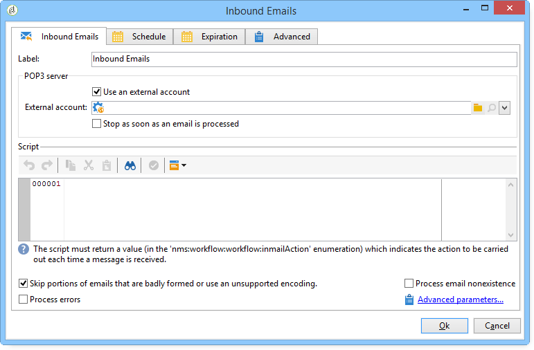

# Binnenkomende e-mails{#inbound-emails}

De **Binnenkomende e-mails** Met activiteit kunt u e-mailberichten downloaden en verwerken vanaf een POP3-mailserver.

Het eerste tabblad van het dialoogvenster **Binnenkomende e-mails** De activiteit laat u de parameters van de POP3 server ingaan en het manuscript ingaan dat bij ontvangstbewijs van elk bericht moet worden uitgevoerd. Het tweede lusje laat u een programma aan de activiteit toewijzen, en het derde lusje bepaalt de voorwaarden van de activiteitenvervaldatum.

1. **[!UICONTROL Inbound Emails]**

   * **[!UICONTROL Use an external account]**

      Wanneer deze optie is geactiveerd, kunt u een externe POP3-account selecteren in plaats van de verbindingsparameters in te voeren. De **[!UICONTROL External account]** in het veld wordt de externe POP3-account opgegeven die moet worden gebruikt om verbinding te maken met de e-mailservice. Dit veld is alleen zichtbaar als de optie Een externe account gebruiken is ingeschakeld.

      Als deze optie niet is geselecteerd, moet u de volgende parameters opgeven:

      

      * **[!UICONTROL POP3 server]**

         Naam van de POP3-server.

      * **[!UICONTROL POP3 account]**

         Naam van de gebruiker.

      * **[!UICONTROL Password]**

         Wachtwoord voor gebruikersaccount.

      * **[!UICONTROL Port]**

         POP3-poortnummer van verbinding. De standaardpoort is 110.
   * **[!UICONTROL Stop as soon as email is processed]**

      Met deze optie kunt u e-mailberichten een voor een verwerken. De activiteit activeert zijn overgang slechts eenmaal en voltooit dan verwerking, verlatend onverwerkte berichten op de server.

1. **[!UICONTROL Script]**

   Met het script kunt u het bericht verwerken en verschillende bewerkingen uitvoeren die afhankelijk zijn van de inhoud van het bericht. Het script wordt uitgevoerd voor elk bericht en kan bepalen welke bewerking op berichten moet worden uitgevoerd (het bericht verlaat of verwijdert) en hoe de uitgaande overgang moet worden geactiveerd.

   De retourcode moet een van de volgende waarden zijn:

   * 1 - Verwijdert het bericht van de server en activeert de uitgaande overgang.
   * 2 - Laat het bericht op de server achter en activeert de uitgaande overgang.
   * 3 - Hiermee verwijdert u het bericht van de server.
   * 4 - Laat het bericht op de server achter.

   De inhoud van het bericht is toegankelijk vanuit de globale **[!UICONTROL mailMessage]** variabele.

1. **[!UICONTROL Schedule]**

   Als u een schema voor de activiteit wilt definiëren, klikt u op de knop **[!UICONTROL Scheduling]** tab en check **[!UICONTROL Plan execution]**. Klik op de knop **[!UICONTROL Change]** knoop om het programma te vormen.

   De configuratie van het programma is het zelfde als voor de het plannen activiteit. Zie [Planner](scheduler.md).

1. **[!UICONTROL Expiration]**

   U kunt vervalvertragingen bepalen via **[!UICONTROL Expiration]** tab.

   

   De configuratie is het zelfde als voor de het plannen activiteit. Zie [Verlopen](define-approvals.md).
