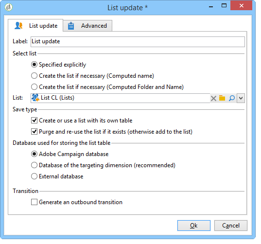

# Lijstupdate{#list-update}

A **Lijstupdate** de activiteit slaat de bevolking op die in de overgang in een lijst van ontvangers wordt gespecificeerd.

U kunt de lijst selecteren in de lijst met bestaande groepen.

Het kan ook worden gemaakt met de **[!UICONTROL Create the list if necessary (Computed name)]** en **[!UICONTROL Create the list if necessary (Computed Folder and Name)]** opties. Met deze opties kunt u het label van uw keuze selecteren om een lijst te maken en later de map waarin deze wordt opgeslagen. Het label kan ook automatisch worden gegenereerd door dynamische velden of een script in te voegen. De verschillende dynamische velden zijn beschikbaar in het pop-upmenu rechts van het label.

Als de lijst al bestaat, worden ontvangers toegevoegd aan de bestaande inhoud, tenzij u de opdracht **[!UICONTROL Purge the list if it exists (otherwise add to the list)]** -optie. In dit geval wordt de inhoud van de lijst vóór de update verwijderd.

Als u wilt dat de gemaakte of bijgewerkte lijst een andere tabel gebruikt dan de tabel voor ontvangers, controleert u de **[!UICONTROL Create or use a list with its own table]** -optie.

Als u deze optie wilt gebruiken, moeten de desbetreffende tabellen zijn geconfigureerd in uw Adobe Campaign-exemplaar.

Over het algemeen betekent het opslaan van een doel in een lijst het einde van een workflow. Standaard worden de **[!UICONTROL List update]** de activiteit heeft derhalve geen uitgaande overgang . Controleer de **[!UICONTROL Generate an outbound transition]** om er een toe te voegen.

 [Ontdek hoe u in video een lijst met ontvangers van de Explorer maakt](#video)

## Voorbeeld: List update {#example--list-update}

In het volgende voorbeeld volgt de activiteit van de lijstupdate een vraag die mannen meer dan 30 richt die in Frankrijk wonen. De lijst wordt eerst gemaakt op basis van de resultaten van de query. Het zal dan worden bijgewerkt telkens als het van het werkschema wordt gelanceerd. Het kan bijvoorbeeld regelmatig worden gebruikt voor gerichte promotieaanbiedingen voor campagnes.

1. Voeg een **[!UICONTROL list update activity]** direct na een query en open deze vervolgens om deze te bewerken.

   Voor meer informatie over het maken van een query in een workflow raadpleegt u [Query](query.md).

1. U kunt een label voor de activiteit selecteren.
1. Selecteer de **[!UICONTROL Create the list if necessary (Calculated name)]** om aan te geven dat de lijst wordt gemaakt zodra de eerste workflow is uitgevoerd en vervolgens wordt bijgewerkt met de volgende uitvoeringen.
1. Selecteer de map waarin u de lijst wilt opslaan.
1. Voer een label in voor de lijst. U kunt dynamische velden invoegen om automatisch de naam te genereren uit de lijst. In dit voorbeeld heeft de lijst dezelfde naam als de query om de inhoud ervan gemakkelijk te kunnen identificeren.
1. Laat de **[!UICONTROL Purge the list if it exists (otherwise add to the list)]** Selecteer deze optie om ontvangers te verwijderen die niet voldoen aan de criteria voor het opgeven van doelen en om de nieuwe criteria in de lijst in te voegen.
1. Laat ook de **[!UICONTROL Create or use a list with its own table]** optie ingeschakeld.
1. Laat de **[!UICONTROL Generate an outbound transition]** optie uitgeschakeld.
1. Klikken **[!UICONTROL Ok]** start vervolgens de workflow.

   

   De lijst met overeenkomende ontvangers wordt vervolgens gemaakt of bijgewerkt.

## Invoerparameters {#input-parameters}

* tableName
* schema

Hiermee wordt de populatie aangegeven die in de groep moet worden opgeslagen.

## Uitvoerparameters {#output-parameters}

* groupId: Groep-id.

## Video over zelfstudie {#video}

Deze video laat zien hoe u een lijst met ontvangers in de Verkenner kunt maken.

>[!VIDEO](https://video.tv.adobe.com/v/25602/quality=12)

Er zijn aanvullende instructievideo&#39;s beschikbaar voor campagnes [hier](https://experienceleague.adobe.com/docs/campaign-learn/tutorials/getting-started/introduction-to-adobe-campaign.html?lang=nl-NL){target="_blank"}.